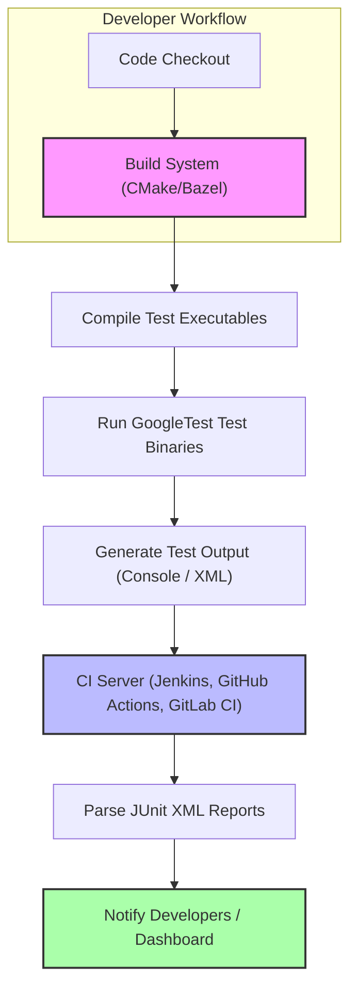

# Integrating with CI and Build Systems

## Overview

This guide provides actionable best practices and step-by-step instructions for integrating GoogleTest and GoogleMock into your continuous integration (CI) pipelines and popular build systems. It covers setting up the testing environment, leveraging established build workflows, configuring test reporting, and ensuring reliable automation to maximize developer productivity and code quality.

---

## Prerequisites

Before you begin integrating with your CI and build systems, ensure you have the following:

- GoogleTest and GoogleMock installed or added as a dependency to your project.
- A supported build system such as CMake or Bazel configured or planned for your project.
- Basic knowledge of running test binaries and interpreting test results.
- Access and permission to configure your CI pipeline (e.g., Jenkins, GitHub Actions, GitLab CI).

---

## Expected Outcome

By completing this guide, you will:

- Seamlessly integrate GoogleTest and GoogleMock into your existing build infrastructure.
- Automate test execution as part of your CI workflow.
- Enable standardized test reporting formats for easy consumption by CI tools.
- Reduce manual overhead in test setup and increase confidence in test automation.

---

## Time Estimate

30 to 60 minutes depending on your build system familiarity and CI pipeline complexity.

---

## Difficulty Level

Intermediate — familiarity with build systems and CI concepts assumed.

---

# Step-by-Step Instructions

### 1. Integrate GoogleTest into Your Build System

#### CMake Integration

GoogleTest provides CMake support including recommended usage patterns. Follow these steps to link GoogleTest in CMake:

1. **Locate or add GoogleTest to your project:**
   - Add it as a subdirectory using `add_subdirectory()` if you embed the source.
   - Or rely on system-installed libraries found via `find_package(GTest REQUIRED)`.

2. **Use the provided CMake targets (`gtest`, `gtest_main`, `gmock`, `gmock_main`) to link your test executable:**

```cmake
add_executable(my_test_executable test/test_example.cc)
target_link_libraries(my_test_executable PRIVATE gtest_main)

# Enables CTest integration
enable_testing()
add_test(NAME MyTest COMMAND my_test_executable)
```

3. **Leverage pkg-config if applicable:**
   - If your environment uses pkg-config, GoogleTest installs `.pc` files (e.g., `gtest_main.pc`).
   - Use `pkg_search_module` in CMake to acquire flags, libraries, and compile options.

Example for pkg-config usage in CMake:

```cmake
find_package(PkgConfig REQUIRED)
pkg_search_module(GTEST REQUIRED gtest_main)

add_executable(testapp samples/sample3_unittest.cc)
target_link_libraries(testapp PRIVATE ${GTEST_LDFLAGS})
target_compile_options(testapp PRIVATE ${GTEST_CFLAGS})

enable_testing()
add_test(NAME sample_test COMMAND testapp)
```

#### Bazel Integration

For Bazel, declare GoogleTest and GoogleMock as dependencies in your `BUILD` files, using Bazel's standard rules for external repositories. Link test binaries against the appropriate test targets.

### 2. Configure Your Test Executable

- Use `gtest_main` or `gmock_main` (which includes `gtest_main`) libraries if you prefer not to write a custom `main()` function.
- Initialize GoogleTest (and GoogleMock) via `testing::InitGoogleTest(&argc, argv);` or `testing::InitGoogleMock(&argc, argv);` if you manage custom `main()`.
- Ensure your test executable returns the result of `RUN_ALL_TESTS()` to communicate success/failure status to the CI.

### 3. Set Up Continuous Integration Pipeline

Integrate test execution as a CI job step:

1. **Build the test suite:** Use your build system commands (e.g., `cmake --build`, `bazel build`) to compile test executables.
2. **Run tests:** Execute your test binary, passing relevant flags for filtering or output formatting if needed.
3. **Test Reporting:** Configure output capturing and reporting.

---

### 4. Enhance Test Output for CI Tools

GoogleTest supports changing output formats to facilitate CI consumption:

- Use `--gtest_output` flag to generate XML reports compatible with Jenkins, GitLab, and other CI systems.

Example:

```bash
./my_test_executable --gtest_output=xml:report.xml
```

- Integrate these XML reports into your CI dashboard to visualize test results, track failures, and historical trends.

### 5. Troubleshoot Common Integration Issues

- **Build Failures of GoogleTest**: Verify you set necessary compiler flags such as threading (`-pthread` on Linux) or platform-dependent options.
- **Pkg-config not finding GoogleTest**:
  - Make sure the `.pc` files are in the directory referenced by the `PKG_CONFIG_PATH` environment variable.
  - If installed manually, update `PKG_CONFIG_PATH` accordingly.
- **Test Executable Fails to Run or Reports No Tests Found**:
  - Confirm tests are linked properly and that test names are correct.
  - Ensure `RUN_ALL_TESTS()` is called and returns in your `main()`.
- **CI Misinterprets Test Results**:
  - Confirm your CI is configured to read GoogleTest XML reports.
  - Use standardized file paths and outputs.

<Tip>
Always link your test executables against `gtest_main` or `gmock_main` unless you have advanced custom test entry point needs. It ensures `main()` is properly defined and test framework initialized.
</Tip>

---

# Practical Example: CMake + GoogleTest + Jenkins Pipeline

```cmake
cmake_minimum_required(VERSION 3.13)
project(MyProjectTests LANGUAGES CXX)

find_package(GTest REQUIRED)

add_executable(all_tests test/test_all.cpp)
target_link_libraries(all_tests PRIVATE GTest::gtest_main)

enable_testing()
add_test(NAME AllTests COMMAND all_tests --gtest_output=xml:test_results.xml)
```

In Jenkinsfile or pipeline script:

```jenkinsfile
stage('Build') {
    steps {
        sh 'cmake -S . -B build'
        sh 'cmake --build build'
    }
}

stage('Test') {
    steps {
        sh './build/all_tests --gtest_output=xml:test_results.xml'
        junit 'test_results.xml'
    }
}
```

This integration allows Jenkins to parse GoogleTest XML results and display them in a friendly UI.

---

# Best Practices

- **Use the bundled `gtest_main`/`gmock_main` libraries** for consistent test entry points.
- **Leverage pkg-config files** if available to simplify build system configuration.
- **Always enable testing in CMake** using `enable_testing()` and register tests via `add_test()` for CTest support.
- **Use XML output for tests in CI** for better visibility and history tracking.
- **Keep test builds hermetic** (self-contained) with explicit compiler flags to prevent environment-specific issues.
- **Automate the environment setup** (e.g., setting `PKG_CONFIG_PATH`) to avoid unexpected build breaks.

---

# Troubleshooting

<AccordionGroup title="Common Issues when integrating with CI and Build Systems">
<Accordion title="Pkg-config cannot find GoogleTest">
Ensure you have set the environment variable `PKG_CONFIG_PATH` to include the directory where GoogleTest's `.pc` files reside, for example:

```bash
export PKG_CONFIG_PATH=/usr/local/lib64/pkgconfig
```
If cross-compiling, also set `PKG_CONFIG_SYSROOT_DIR` appropriately.
</Accordion>
<Accordion title="Test executables fail to run or report no tests">
Check that:
- The test binary links against `gtest_main` or `gmock_main` so `main()` is defined.
- Your `main()` calls `testing::InitGoogleTest()` or `testing::InitGoogleMock()` before running tests.
- Tests use the appropriate `TEST()` or `TEST_F()` macros.
- CI captures and reports test return codes correctly.
</Accordion>
<Accordion title="Build failures due to missing pthread or compile flags">
Add the proper threading flags to compile and link steps. Use the pkg-config Cflags and Libs variables:

```bash
g++ $(pkg-config --cflags gtest) -o test_exec test_exec.cc $(pkg-config --libs gtest)
```

In CMake, prefer using `target_compile_options` and linking flags as they carry `-pthread` and macro definitions automatically.
</Accordion>
</AccordionGroup>

---

# Next Steps & Related Content

- **Set Up Your Project** – step-by-step guide to configuring your project for GoogleTest [Setup Your Project](/guides/getting-started-core-workflows/setup-your-project)
- **Writing Your First Tests** – writing and structuring your initial tests [Writing Your First Tests](/guides/getting-started-core-workflows/writing-your-first-tests)
- **Running Tests and Interpreting Results** – advanced techniques for running and filtering tests [Running Tests and Interpreting Results](/guides/getting-started-core-workflows/running-tests-and-interpreting-results)
- **Test Output and Reporting** – customizing test output formats for CI integration [Test Output and Reporting](/guides/performance-and-specialized-use-cases/test-output-and-reporting)
- **Troubleshooting Common Setup Issues** – handling setup and integration issues [Troubleshooting Common Setup Issues](/getting-started/first-steps-validation/troubleshooting-common-issues)

---

For full integration examples, also see the [GoogleTest README](https://github.com/google/googletest/blob/main/README.md) and pkg-config usage notes in the official documentation.

---

# Summary

This guide empowers you to integrate GoogleTest and GoogleMock with your CI pipelines and build systems, focusing on environment setup, build configuration, and test automation with actionable best practices and examples.

---

# Diagram: Typical CI and Build System Workflow for GoogleTest Integration



---

<Test>
Note: Always confirm your build system and CI support required flags and output formats for smooth integration.
</Test>
