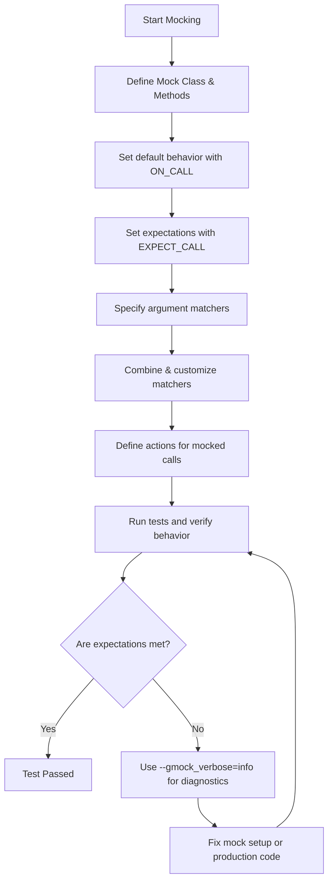

# Matchers and Actions in Mocking

Gain practical skills in defining flexible expectations with GoogleMock's matchers and actions. This guide takes a hands-on approach to using built-in and custom matchers, combining matchers, and implementing complex mock behaviors to achieve thorough test coverage.

---

## Workflow Overview

### Task Description
This guide helps you master using GoogleMock's matchers and actions to precisely specify how mock methods should behave and which calls should be expected with what arguments.

### Prerequisites
- A working GoogleMock and GoogleTest setup in your C++ environment.
- Basic understanding of mock classes and mock methods.
- Familiarity with writing tests using `EXPECT_CALL` and `ON_CALL`.

### Expected Outcome
By following this guide, you will be able to:
- Use built-in matchers to define argument expectations flexibly.
- Write and use custom matchers for complex validation.
- Combine multiple matchers to express intricate constraints.
- Use various actions to define flexible mock behaviors.
- Handle overloaded functions and defaults elegantly.

### Time Estimate
Approximately 30-45 minutes to work through examples and internalize
principles.

### Difficulty Level
Intermediate. Assumes familiarity with basic mocks and C++.

---

## Step-by-Step Instructions

### 1. Using Built-in Matchers
Matchers define the conditions mock method arguments must satisfy.

- **Exact Matching:** Use literal values or `Eq()` matcher.

  ```cpp
  EXPECT_CALL(mock_obj, Function(5));  // Matches argument == 5
  EXPECT_CALL(mock_obj, Function(Eq(10)));
  ```

- **Wildcard Matching:** Use `_` to match anything.

  ```cpp
  EXPECT_CALL(mock_obj, Function(_));  // Matches any argument
  ```

- **Predicate Matchers:** Use comparison matchers such as `Ge`, `Lt`, `Ne`.

  ```cpp
  EXPECT_CALL(mock_obj, Function(Ge(5)));  // Argument >= 5
  ```

- **Pointer Matchers:** Use `NotNull()`, `IsNull()`, or `Pointee(matcher)` to test pointer values or what they point to.

  ```cpp
  EXPECT_CALL(mock_obj, Function(NotNull()));  // Argument must be non-null pointer
  EXPECT_CALL(mock_obj, Function(Pointee(Eq(42))));  // Points to value 42
  ```

### 2. Combining Matchers
Use `AllOf()`, `AnyOf()`, and `Not()` to create composite matchers:

```cpp
using ::testing::AllOf;
using ::testing::AnyOf;
using ::testing::Not;

// Argument must be > 5 and not 10
EXPECT_CALL(mock_obj, Function(AllOf(Gt(5), Ne(10))));
// Argument must be < 3 or > 7
EXPECT_CALL(mock_obj, Function(AnyOf(Lt(3), Gt(7))));
// Argument must not contain 'foo'
EXPECT_CALL(mock_obj, Function(Not(HasSubstr("foo"))));
```

### 3. Matching Multiple Arguments as a Whole
Sometimes argument dependencies matter:

```cpp
// Expect first argument less than second
EXPECT_CALL(mock_obj, Function(_, _)).With(Lt());
```
- Use `.With()` clause to add conditions on the argument tuple.
- Use `Args<indices>(matcher)` to focus on specific arguments.

### 4. Writing Custom Matchers
When built-in matchers are insufficient, define your own.

- Use `MATCHER` macros for quick cases:
  ```cpp
  MATCHER(IsEven, "Checks if a number is even") {
    return (arg % 2) == 0;
  }
  EXPECT_CALL(mock_obj, Function(IsEven()));
  ```

- For more control, define monomorphic or polymorphic matcher classes with `MatchAndExplain()` and description methods.

### 5. Handling Overloaded Functions
Disambiguate overloaded mock methods using:

- `Const()` wrapper for const overloads.
- `Matcher<type>()` or typed matchers like `TypedEq<type>()` to clarify.

Example:
```cpp
EXPECT_CALL(mock, Func(An<int>()));          // matches int overload
EXPECT_CALL(Const(mock), Func(An<int>()));  // matches const int overload
```

### 6. Setting Expectations Properly
- Use `EXPECT_CALL` to specify which calls are expected, how often, and with which arguments.
- Use `ON_CALL` to set default mock behaviors without verifying calls.
- Use `Times()`, `WillOnce()`, and `WillRepeatedly()` to control call counts and behaviors.
- To ignore parameters, use `_` or omit the argument list for non-overloaded methods.

### 7. Using Actions
Actions define *what* happens when a mock method is called.

- Return values via `Return()`, `ReturnRef()`, `ReturnPointee()`.
- Change output arguments via `SetArgPointee<N>(value)` or `SetArrayArgument<N>(begin, end)`.
- Combine multiple actions with `DoAll()` (only last return value is used).
- Invoke functions or lambdas with `Invoke()` or `InvokeWithoutArgs()`.
- Invoke callable arguments with `InvokeArgument<N>(args...)`.
- Ignore action results using `IgnoreResult()` if needed.

Example:
```cpp
EXPECT_CALL(mock, Func(_))
    .WillOnce(DoAll(SetArgPointee<1>(42), Return(true)));
```

### 8. Changing Mock Behavior Dynamically
- Use sequences (`InSequence`) to enforce call order.
- Use `.RetiresOnSaturation()` to expire expectations after use.

### 9. Advanced: Delegating Calls
- You can delegate mock method calls to fake or real objects within your mock.
- Use lambda or `ON_CALL()` with a body that calls your fake or real method.

### 10. Tips and Best Practices
- Prefer `ON_CALL` for default behaviors unless you want to verify calls.
- Use `NiceMock` to suppress warnings for uninteresting calls.
- Use `StrictMock` to turn warnings into failures.
- Avoid over-specification to keep tests maintainable.

---

## Examples & Code Samples

### Defining a Mock Method
```cpp
class MockTurtle : public Turtle {
 public:
  MOCK_METHOD(void, PenUp, (), (override));
  MOCK_METHOD(void, GoTo, (int x, int y), (override));
  MOCK_METHOD(int, GetX, (), (const, override));
};
```

### Using Matchers in Expectations
```cpp
EXPECT_CALL(mock_turtle, GoTo(50, _));  // x=50, any y
EXPECT_CALL(mock_turtle, GetX()).WillOnce(Return(100));
EXPECT_CALL(mock_turtle, PenUp()).Times(AtLeast(1));
```

### Combining Matchers
```cpp
EXPECT_CALL(mock, Process(AllOf(Ge(10), Ne(20))));
```

### Writing a Simple Custom Matcher
```cpp
MATCHER(IsEven, "Checks if number is even") {
  return (arg % 2) == 0;
}
EXPECT_CALL(mock, Foo(IsEven()));
```

### Mock Method with Actions
```cpp
EXPECT_CALL(mock, Foo(_))
    .WillOnce(Return(42));

// Action returning a live value by reference.
int x = 0;
EXPECT_CALL(mock, Bar())
    .WillRepeatedly(ReturnRef(x));
```

### Using DoAll to Set Output Argument and Return
```cpp
EXPECT_CALL(mock, Mutate(_, _))
    .WillOnce(DoAll(SetArgPointee<1>(5), Return(true)));
```

### Invoking a Callable Argument
```cpp
EXPECT_CALL(mock, DoThis(_, _))
    .WillOnce(InvokeArgument<1>(5));
```

---

## Troubleshooting & Tips

### Common Issues
- **Uninteresting call warnings:** Use `NiceMock` or add catch-all expectations with `.Times(AnyNumber())` to suppress.
- **Over-specified expectations cause brittle tests:** Use `ON_CALL` for default behaviors, and reserve `EXPECT_CALL` for calls you intend to verify.
- **Mismatch in overloaded methods:** Use `Const()` or typed matchers to disambiguate.
- **Return values not behaving as expected:** Use `ReturnPointee()` to return live referenced values instead of copies.
- **SetArgPointee without Return():** Does not compile or causes error; always combine with `Return()` using `DoAll()`.

### Best Practices
- Keep matchers simple and specific to what you need to verify.
- Prefer sequences or partial ordering for complex call order requirements.
- Share complex matchers and actions as variables to avoid duplication.
- Remove `.RetiresOnSaturation()` carefully—understand its effect on expectation lifetime.
- Use detailed logging with `--gmock_verbose=info` to diagnose unexpected mock call matches.

### Performance Considerations
- Move mock class constructors and destructors to `.cc` files to speed up compile times.
- Simplify mock interfaces by trimming argument lists if mock methods have overly long signatures.

### Alternative Approaches
- Consider delegating to fakes or real objects inside mocks for complex behavior simulations.
- Use the Hi-perf dependency injection technique to mock non-virtual methods.

---

## Next Steps & Related Content

### What's Next
- Practice creating mock classes and writing tests with flexible expectations.
- Explore custom matchers and actions to extend gMock capabilities.
- Learn how to integrate mocks into sequences and partial order graphs for advanced verification.

### Related Guides
- [Creating and Using Mocks](guides/advanced-mocking-integrations/creating-and-using-mocks.md)
- [Matchers: Built-in and Custom](api-reference/mocking-framework-apis/using-matchers.md)
- [Actions, Cardinalities, and Advanced Mock Control](api-reference/mocking-framework-apis/actions-and-cardinalities.md)
- [gMock Cookbook](https://google.github.io/googletest/gmock_cook_book.html)
- [gMock for Dummies](https://google.github.io/googletest/gmock_for_dummies.html)

### Resources
- GoogleMock Official GitHub: https://github.com/google/googletest
- Matchers Reference: `/api-reference/mocking-framework-apis/using-matchers`
- Actions Reference: `/api-reference/mocking-framework-apis/actions-and-cardinalities`

---

## References
- GoogleMock README: https://google.github.io/googletest/gmock_for_dummies.html
- gMock Cookbook: https://google.github.io/googletest/gmock_cook_book.html
- Mocking Reference: https://google.github.io/googletest/reference/mocking.md
- Actions Reference: https://google.github.io/googletest/reference/actions.md

---

**Example: Matching multiple arguments with a custom rule**

```cpp
using ::testing::_;
using ::testing::Ne;
using ::testing::Lt;

// Expect first argument != 0 and less than second
EXPECT_CALL(foo, InRange(Ne(0), _))
    .With(Lt());
```

**Example: Custom matcher for sum of two methods**

```cpp
class BarPlusBazEqMatcher {
 public:
  using is_gtest_matcher = void;

  explicit BarPlusBazEqMatcher(int expected_sum) : expected_sum_(expected_sum) {}

  bool MatchAndExplain(const Foo& foo, std::ostream*) const {
    return (foo.bar() + foo.baz()) == expected_sum_;
  }

  void DescribeTo(std::ostream* os) const {
    *os << "bar() + baz() equals " << expected_sum_;
  }

  void DescribeNegationTo(std::ostream* os) const {
    *os << "bar() + baz() does not equal " << expected_sum_;
  }

 private:
  const int expected_sum_;
};

::testing::Matcher<const Foo&> BarPlusBazEq(int expected_sum) {
  return BarPlusBazEqMatcher(expected_sum);
}

// Usage in test:
EXPECT_THAT(foo, BarPlusBazEq(5));
```

**Example: Combining Actions**

```cpp
EXPECT_CALL(mock, Bar(_))
    .WillOnce(DoAll(SetArgPointee<1>(5), Return(true)));
```


---

<Tip>
Remember to always place `MOCK_METHOD` declarations in the public section of your mock class regardless of the base class access specifiers. This ensures proper expectation setting and invocation.
</Tip>

<Warning>
Overusing strict mocks can make your tests brittle. Prefer `NiceMock` in most cases to prevent test fragility due to uninteresting calls.
</Warning>

---

This page fits into the Advanced Mocking & Integration workflows chapter, building upon the basics of mock creation and setup, and preparing you for effective mock interaction specification through matchers and actions.

---

## Diagram: User Interaction Flow with Matchers and Actions



