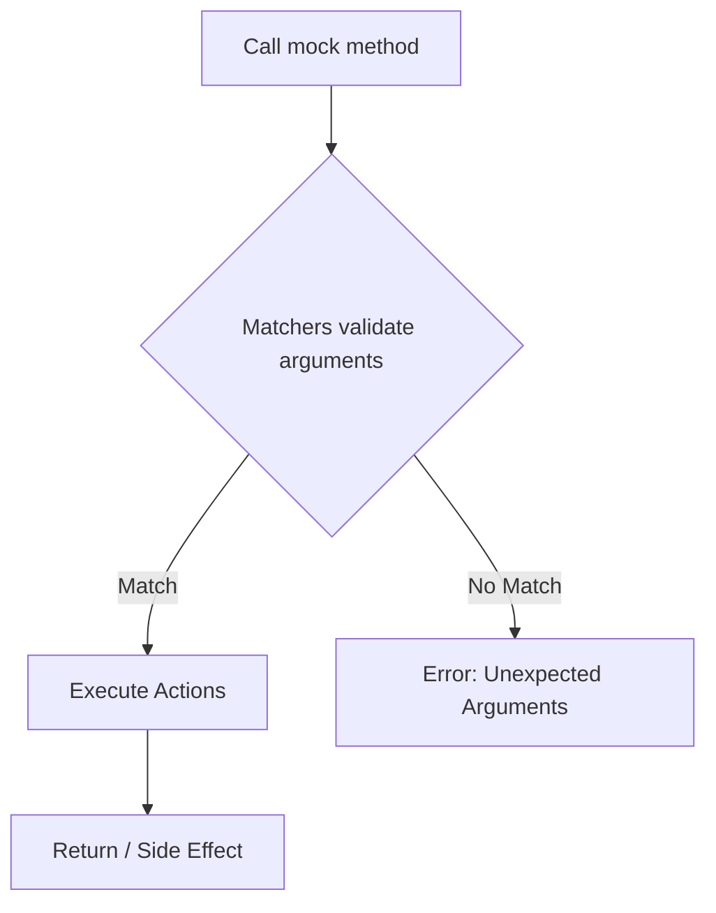

# Action and Matcher Patterns

Explore how to harness the full expressive power of GoogleMock actions and matchers to write precise, maintainable, and powerful test expectations. This guide dives deep into advanced techniques for matching arguments, executing side effects, and defining custom behavior to make mocks reflect real-world usage scenarios.

---

## Understanding Actions and Matchers

When writing tests with GoogleMock, users want to precisely specify what interactions with their mocks look like and what behaviors to simulate. Actions and matchers are the building blocks for this:

- **Matchers** validate the arguments passed to mock methods, ensuring they meet specific criteria.
- **Actions** define what mocked methods do when invoked, including return values, side effects, and custom operations.

This page helps you learn how to use and combine these constructs effectively.

---

## Prerequisites

Before diving in, ensure you have:

- A C++ project integrated with GoogleTest and GoogleMock.
- Basic knowledge of defining mock classes using `MOCK_METHOD()`.
- Familiarity with the basic usage of `EXPECT_CALL()` and argument matchers like `_`, `Eq()`, or `Gt()`.

For installation and initial setup, see the [Installing with CMake](/getting-started/prerequisites-installation/installation-cmake) and [Creating Your First Test Case](/guides/getting-started/create-first-test).

---

## Using Matchers to Specify Arguments Precisely

Matchers allow you to specify expectations on mock method arguments with great control. Use them when you need to validate arguments beyond exact equality.

### Basic Argument Matching

- Use built-in matchers like `_` (match anything), `Eq(value)`, `Ge(value)`, `Lt(value)`.
- Example: Expect a mock method `DoThis` to be called with any integer greater or equal to 5:

```cpp
EXPECT_CALL(mock_obj, DoThis(Ge(5)));  // Matches argument >= 5
```

### Combining Matchers

Matchers can be combined with logical operations:

- `AllOf(m1, m2)` — argument matches all provided matchers.
- `AnyOf(m1, m2)` — argument matches at least one matcher.
- `Not(m)` — argument does not match.

Example:

```cpp
EXPECT_CALL(mock_obj, DoThis(AllOf(Gt(5), Ne(10))));  // >5 and !=10
```

### Matching Multiple Arguments Together

For constraints involving several arguments together (e.g., first arg < second arg), use `.With()` clause in `EXPECT_CALL` or `ON_CALL`.

```cpp
EXPECT_CALL(mock_obj, SetRange(Ne(0), _)).With(Lt()); // first arg < second
```

### Using Predicates and Custom Matchers

- Use `Truly(predicate)` to match arguments that satisfy arbitrary unary predicates.
- Define custom matchers with `MATCHER` macros for reusable, descriptive, and complex matching logic.

Example of a simple custom matcher:

```cpp
MATCHER(IsEven, "checks if a number is even") { return (arg % 2) == 0; }
EXPECT_CALL(mock_obj, Foo(IsEven()));
```

### Working with Containers and Complex Types

Matchers like `ElementsAre()`, `UnorderedElementsAre()`, and `Pair()` help you match collections and key-value pairs elegantly.

Example:

```cpp
EXPECT_CALL(mock_obj, ProcessData(ElementsAre(1, Gt(0), _)));
EXPECT_CALL(mock_obj, UpdateMap(Contains(Key(42))));
```

---

## Defining Actions for Method Behaviors

Actions specify what your mock methods do when called. They help you simulate method return values, side effects, and complex behavior.

### Returning Values

- Use `Return(value)` to make a mock method return a specific value.
- Use `ReturnRef(variable)` when the return type is a reference.

Example:

```cpp
EXPECT_CALL(mock_obj, GetValue()).WillOnce(Return(42));
```

### Executing Side Effects

To mock methods with side effects instead of return values, use specialized actions:

- `SetArgPointee<N>(value)` to set the value pointed to by the N-th argument.
- `SetArrayArgument<N>(first, last)` to copy a range into an output array argument.

Example:

```cpp
EXPECT_CALL(mock_obj, Mutate(true, _)).WillOnce(SetArgPointee<1>(5));
```

### Chaining Actions

Use `DoAll()` to perform multiple actions sequentially. Only the last action's return value is used.

```cpp
EXPECT_CALL(mock_obj, Foo(_)).WillOnce(DoAll(SetArgPointee<0>(5), Return(true)));
```

### Custom Actions

- Use a lambda or callable object to implement arbitrary behavior.
- Use `Invoke(func)` to call a function or method.
- Use `InvokeWithoutArgs(func)` to call a zero-argument function regardless of mock call arguments.
- `InvokeArgument<N>(args...)` to invoke a callable argument of the mock method.

Example:

```cpp
EXPECT_CALL(mock_obj, Compute(_))
    .WillOnce([](int x) { return x * 2; });
```

### Managing Move-Only Types

gMock supports move-only types in method arguments and return values. You can mock methods returning or accepting `std::unique_ptr` as usual.

Example:

```cpp
MOCK_METHOD(std::unique_ptr<Buzz>, MakeBuzz, (StringPiece text), (override));

EXPECT_CALL(mock_buzzer, MakeBuzz(_))
    .WillRepeatedly([](StringPiece) {
      return std::make_unique<Buzz>(AccessLevel::kInternal);
    });
```

---

## Combining Actions and Matchers Effectively

- Prefer `ON_CALL()` for default behavior and `EXPECT_CALL()` only when verifying calls.
- Use `NiceMock` or `StrictMock` wrappers on mocks to manage uninteresting call warnings or failures.
- Be mindful of the order and number of expectations; the most recent matching expectation takes precedence.
- Use sequences (`InSequence`) and `After()` clauses to enforce call ordering.

Example enforcing order and multiple expectations:

```cpp
{
  InSequence s;
  EXPECT_CALL(mock, Init());
  EXPECT_CALL(mock, Process(_));
  EXPECT_CALL(mock, Cleanup());
}
```

---

## Practical Tips & Pitfalls

- **Avoid Over-specifying Matchers**: Only assert on arguments you need to; using `_` liberally maintains flexibility.
- **Retiring Expectations**: Use `.RetiresOnSaturation()` to make expectations inactive after their call count is met, aiding ordered calls.
- **Suppressing Uninteresting Call Warnings**: Instead of adding catch-all `EXPECT_CALL`s, prefer `NiceMock` to reduce noise.
- **Lambda Evaluations in Actions**: Remember `WillOnce(Return(x++))` evaluates `x++` once at `EXPECT_CALL` time; use lambdas for per-call evaluation.
- **Mock Object Lifetime**: Ensure mocks are destructed to verify expectations; else explicit verification may be needed.

---

## Troubleshooting Common Issues

<Tip>
If you encounter linker errors or unexpected mock behavior, verify that:
- Your mock class methods are properly declared with `MOCK_METHOD`.
- You use `EXPECT_CALL` before exercising mocks.
- Overloaded methods have explicit overload resolution with `using` if needed.
- Matchers used match the argument types correctly to avoid ambiguous calls.
</Tip>

<Tip>
Beware of unintentional call count violations due to sticky expectations. Use `.RetiresOnSaturation()` or sequences to fix fragile tests.
</Tip>

<Tip>
If mock methods with move-only types fail to compile, check for proper usage of lambdas or `WillOnce` instead of `Return` with move-only values.
</Tip>

---

## Further Learning

After mastering the use of actions and matchers, proceed to:

- [Designing and Using Mock Objects](/guides/advanced-mocking/designing-mock-objects) for mock class best practices.
- [Common Mocking Scenarios and Solutions](/guides/advanced-mocking/common-mocking-scenarios) for real-world techniques.
- [Matchers Reference](reference/core-apis/matchers) for comprehensive matcher listings.
- [Actions Reference](reference/advanced-mocking-features/actions) for detailed action usage.

---

## Summary

This guide empowered you to write test expectations using GoogleMock's rich set of matchers and actions. By combining expressive argument validators with smart behaviors, you can craft tests that are clear, precise, and robust, simulating complex real-world interactions.

---

## Code Sample: Match Arguments and Specify Actions

```cpp
using ::testing::_;
using ::testing::Return;
using ::testing::SetArgPointee;
using ::testing::DoAll;

class MockProcessor {
 public:
  MOCK_METHOD(bool, Process, (int id, int* result), (override));
};

TEST(ProcessorTest, ProcessBehavior) {
  MockProcessor mock;

  // Expect Process called with id >= 100,
  // sets output argument *result to 42 and returns true.
  EXPECT_CALL(mock, Process(Gt(99), _))
      .WillOnce(DoAll(SetArgPointee<1>(42), Return(true)));

  int output = 0;
  EXPECT_TRUE(mock.Process(150, &output));
  EXPECT_EQ(output, 42);
}
```

---

## Diagram: How Actions and Matchers Work Together



This simple flow captures the core process at runtime for mocked calls: arguments are matched first; if successful, the designated actions are executed.

---

## References

- [gMock Cookbook](https://google.github.io/googletest/gmock_cook_book.html)
- [gMock Cheat Sheet](https://google.github.io/googletest/gmock_cheat_sheet.html)
- [Matchers Reference](reference/core-apis/matchers)
- [Actions Reference](reference/advanced-mocking-features/actions)
- [Designing and Using Mock Objects](/guides/advanced-mocking/designing-mock-objects)
