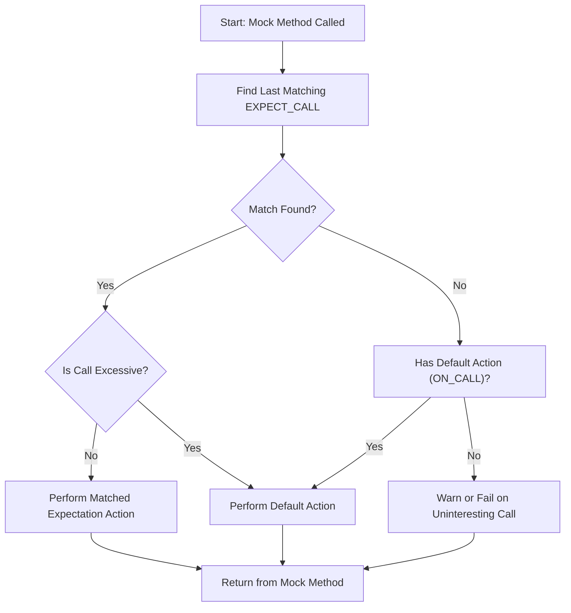

# Composing Powerful and Maintainable Mocks

## Workflow Overview

### Task Description
This guide helps you master advanced mocking patterns in GoogleMock, focusing on precise and maintainable mock configurations. You'll learn how to leverage `ON_CALL`/`EXPECT_CALL` strategies effectively, employ custom actions, handle cardinalities, and use strict or nice mock types. This knowledge is vital for engineering large-scale or complex test suites that require robust, clear, and maintainable mock setups.

### Prerequisites
- You have basic familiarity with writing mocks using `MOCK_METHOD`.
- You understand the core mocking concepts such as expectations, actions, and matchers.
- You know the syntax and basic use of `ON_CALL` and `EXPECT_CALL`.

### Expected Outcome
By following this guide, you will be able to:
- Set up flexible default mock behaviors using `ON_CALL`.
- Write clear and precise expectations with `EXPECT_CALL`, including argument pattern matching.
- Customize mock method responses using a variety of actions.
- Control the expected number of calls with cardinalities in `Times()`.
- Organize test flows with `InSequence` and `After` for ordering calls.
- Apply strictness policies for suppressing or enforcing uninteresting call warnings.
- Reduce mock test flakiness and improve maintainability with best practices.

### Time Estimate
Approximately 20-30 minutes to internalize concepts and experiment with examples.

### Difficulty Level
Intermediate to Advanced — assumes working knowledge of gMock basics.

---

## Step-by-Step Instructions

### 1. Define Default Mock Behavior Using `ON_CALL`
Use `ON_CALL(mock_object, Method(matchers))` to specify default actions your mock will take when methods matching the pattern are called, without setting call expectations.

```cpp
ON_CALL(foo, Bar(_))
    .WillByDefault(Return(42));
```

- **Outcome:** Calls to `foo.Bar()` with any argument will return 42 unless overridden by an expectation.
- **Best Practice:** Set common behaviors in your test fixture’s setup phase to avoid repetitive stubbing in tests.

### 2. Specify Precise Call Expectations with `EXPECT_CALL`
Use `EXPECT_CALL(mock_object, Method(matchers))` to set constraints on the calls expected during a test.

- Use argument matchers to specify expected inputs, e.g. `_` for any, `Eq(value)`, or custom matchers.
- Chain modifiers like `.Times()`, `.WillOnce()`, `.WillRepeatedly()`, `.InSequence()` and `.After()`.

```cpp
EXPECT_CALL(foo, Bar(Ge(10)))
    .Times(2)
    .WillOnce(Return(1))
    .WillRepeatedly(Return(2));
```

- **Outcome:** Expects exactly two calls; the first returns 1, the second and all subsequent calls return 2.

### 3. Use `With` for Multi-Argument Matching
Restrict expectations or default actions based on combined argument tuples, enabling complex predicates across multiple parameters.

```cpp
EXPECT_CALL(foo, Process(_, _))
    .With(::testing::Lt())  // Ensures first arg < second arg
    .WillOnce(Return(true));
```

- **Outcome:** Matches only calls where the first argument is less than the second.

### 4. Manage Call Cardinalities with `Times()`
Precisely control how many times a mocked method is expected to be called.

- Common cardinalities include:
  - `Times(0)` — the method must not be called.
  - `Times(AnyNumber())` — any number of calls allowed.
  - `Times(AtLeast(n))`, `Times(AtMost(n))`, `Times(Between(m, n))`, or exact count.

```cpp
EXPECT_CALL(foo, DoSomething())
    .Times(AtLeast(1))
    .WillRepeatedly(Return(true));
```

- **Tip:** If omitted, gMock infers `Times` from the presence and count of `WillOnce` and `WillRepeatedly` clauses.

### 5. Control Call Order Using `InSequence` and `After`
- Use `InSequence` to group expectations that must be matched in order.
- For finer control, `After(expectation)` ensures an expectation is only matched after others.

```cpp
Sequence seq;
EXPECT_CALL(foo, Init()).InSequence(seq);
EXPECT_CALL(foo, Process()).InSequence(seq);
```

```cpp
Expectation init_exp = EXPECT_CALL(foo, Init());
EXPECT_CALL(foo, Cleanup()).After(init_exp);
```

- **Outcome:** Call to `Process()` must follow `Init()`, and `Cleanup()` only after `Init()`.

### 6. Retire Expectations to Prevent Sticky Matches
By default, expectations remain "sticky," matching calls even after their specified count is reached. Use `.RetiresOnSaturation()` to make them inactive once saturated.

```cpp
EXPECT_CALL(foo, GetNext())
    .WillOnce(Return(1))
    .RetiresOnSaturation();
```

- **Outcome:** After the first call is fulfilled, expectation is retired preventing further matching.

### 7. Choose Strictness Levels: `NiceMock`, `NaggyMock` (default), `StrictMock`
- **`NiceMock`**: Silences warnings on uninteresting calls (calls with no expectations).
- **`NaggyMock`**: (default) Warns on uninteresting calls, but does not fail the test.
- **`StrictMock`**: Treats uninteresting calls as errors, making tests strictly verify expected calls only.

```cpp
NiceMock<MockFoo> nice_foo;
StrictMock<MockFoo> strict_foo;
```

- **Best Practice:** Use `NiceMock` in most cases to reduce noise, switch to `StrictMock` if you want to enforce strict call verification.

### 8. Compose Complex Actions Using Lambdas and Built-In Helpers
- Use `Return(value)` to return values.
- Use `ReturnRef(var)` to return references.
- Use `Invoke()`, `InvokeWithoutArgs()`, `DoAll()`, `SetArgPointee()`, `DeleteArg<N>()` for advanced behaviors.

```cpp
EXPECT_CALL(foo, Save(_))
    .WillOnce(DoAll(SetArgPointee<0>(10), Return(true)));
```

- **Result:** Sets value via pointer argument and returns true.

### 9. Debug and Troubleshoot Expectations
If expectations are not met or there are unexpected calls:
- Run tests with `--gmock_verbose=info` to see detailed call traces.
- Check the order of expectations and the specificity of argument matchers.
- Use `Mock::VerifyAndClearExpectations(&mock_obj)` to verify mocks before destruction when lifetime is unclear.

### 10. Clean Up Expectations Between Tests
To avoid side effects between tests, reset mocks using:

```cpp
Mock::VerifyAndClear(&mock_obj);
```

This clears all expectations and default actions.

---

## Examples & Code Samples

### Example: Setting Default Behavior and Expectations

```cpp
class MockFoo {
 public:
  MOCK_METHOD(int, GetValue, (), (const, override));
  MOCK_METHOD(void, SetValue, (int), (override));
};

using ::testing::Return;
using ::testing::_;
using ::testing::InSequence;
using ::testing::AtLeast;

TEST(FooTest, DefaultAndExpectedCalls) {
  MockFoo mock;

  // Default action: returns 10 whenever GetValue is called
  ON_CALL(mock, GetValue()).WillByDefault(Return(10));

  // Expect SetValue to be called with a positive integer at least twice
  EXPECT_CALL(mock, SetValue(::testing::Gt(0)))
      .Times(AtLeast(2));

  // Expect GetValue to be called exactly twice, returns specified values
  EXPECT_CALL(mock, GetValue())
      .WillOnce(Return(15))
      .WillOnce(Return(20));

  mock.SetValue(5);
  mock.SetValue(7);

  EXPECT_EQ(mock.GetValue(), 15);
  EXPECT_EQ(mock.GetValue(), 20);

  // Subsequent calls will use ON_CALL default
  EXPECT_EQ(mock.GetValue(), 10);
}
```

### Example: Using Sequences to Enforce Call Order

```cpp
Sequence s;

EXPECT_CALL(foo, Init()).InSequence(s);
EXPECT_CALL(foo, Load()).InSequence(s);
EXPECT_CALL(foo, Run()).InSequence(s);

foo.Init();
foo.Load();
foo.Run();
```

- Calling `foo.Run()` before `foo.Init()` or `foo.Load()` will cause test failures.

### Example: Using Nice and Strict Mocks

```cpp
using ::testing::NiceMock;
using ::testing::StrictMock;

NiceMock<MockFoo> nice_mock;  // Warnings suppressed for uninteresting calls
StrictMock<MockFoo> strict_mock;  // Uninteresting calls are errors

EXPECT_CALL(strict_mock, DoSomething());
strict_mock.DoSomething();  // Passes
strict_mock.DoOtherThing();  // Fails due to unexpected call

nice_mock.DoOtherThing();  // Passes, no warning
```

### Example: Complex Action with `DoAll` and `SetArgPointee`

```cpp
EXPECT_CALL(mock, Calculate(_, _))
    .WillOnce(DoAll(
        SetArgPointee<1>(42),  // Sets 2nd argument pointed-to value to 42
        Return(true)));
```

- When `Calculate()` is called, it sets the second (pointer) parameter's value to 42 and returns `true`.

---

## Troubleshooting & Tips

### Common Problems

- **Uninteresting Call Warnings:** Often caused by missing `EXPECT_CALL`s for called methods.
    - Use `NiceMock` to suppress these warnings if the calls are acceptable.
    - Or add `EXPECT_CALL(...).Times(AnyNumber())` for methods expected to be called without strict checking.

- **Too Many Calls Reported:** Occurs when the call count exceeds the `.Times()` limit.
    - Use `.RetiresOnSaturation()` to make expectations retire after use.
    - Check whether call sequences or order constraints lead to early saturation.

- **Ambiguous or Missing Overloads:** When mocking overloaded methods, always mock all overloads you want to use or use `using` declarations to lift unmocked overloads into scope.

- **Actions Run Out:** If you specify fewer `WillOnce` clauses than calls, gMock uses a default action and warns unless a `WillRepeatedly` is also set.

### Best Practices

- Prefer **`ON_CALL`** for setting default behaviors shared across many tests.
- Use **`EXPECT_CALL`** sparingly and precisely to verify *only* the interactions your test cares about.
- Use **sequences** and **`After`** to enforce meaningful call order and reduce brittle tests.
- Use **`RetiresOnSaturation`** to avoid sticky expectations causing unexpected failures.
- Use **`NiceMock`** to minimize noisy warnings, switching to **`StrictMock`** when enforcing strict interaction contracts.

### Performance Considerations

- Avoid overly complex matchers or large numbers of expectations to keep tests fast and readable.
- When mocking many methods, consider moving mock class constructor and destructor definitions out of header files to speed up compilation.

### Alternative Approaches

- When mocks get too complex, evaluate whether a **fake** or test adaptor is more appropriate than a fully mocked class.
- Delegate calls to a real object or a fake using `ON_CALL` with `Invoke()` to reduce duplication of logic.

---

## Next Steps & Related Content

- Learn about [Mocking Basics](../getting-started-testing/mocking-basics) to solidify foundational knowledge.
- Explore [Using Matchers Effectively](../core-testing-workflows/using-matchers-effectively) to improve argument matching.
- Dive into [Custom Actions and Parameterized Expectations](../advanced-patterns-integration/custom-actions-and-param-expectations) for more sophisticated mocks.
- Refer to [Troubleshooting Common Setup Issues](../getting-started/troubleshooting-help/common-errors) to resolve integration problems.

---

## Summary Diagram: Mocking Control Flow



This flowchart outlines how GoogleMock dispatches mock method calls based on expectations and default behaviors.
