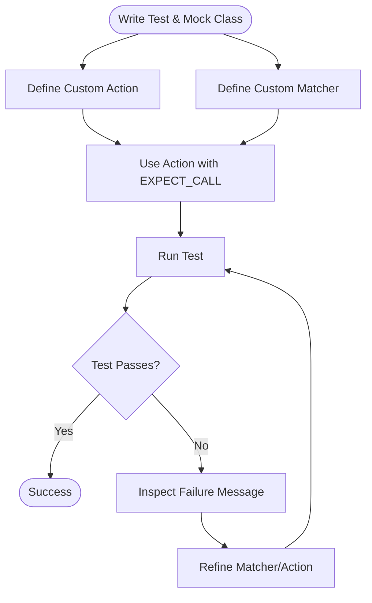

# Creating Custom Actions and Matchers

Extend GoogleTest and GoogleMock beyond the built-in capabilities by defining your own custom actions and matchers tailored to your specific testing needs. This guide leads you through clear, step-by-step instructions on how to create these user-defined components, supported by practical examples that empower you to validate complex behaviors and argument patterns.

---

## 1. Guide Overview

### What You Will Achieve
This guide helps you create:

- Custom **actions**: Define what a mock method should do when called beyond the default `Return()`, `Invoke()`, or simple built-in actions.
- Custom **matchers**: Precisely describe and verify your mock method arguments with your own logic and descriptive error messages.

These capabilities enable you to write more expressive, maintainable, and powerful tests.

### Prerequisites
- Familiarity with basic GoogleMock mocking concepts, including `MOCK_METHOD`, `EXPECT_CALL`, `ON_CALL`.
- Understanding of C++11 (or newer) lambda functions and templates.

### Expected Outcome
By completing this guide, you will be able to:
- Define custom actions using lambdas, functors, or the `ACTION` macro.
- Create parameterized and polymorphic matchers for reusable argument validation.
- Enhance test readability with descriptive failure messages.
- Integrate these custom extensions seamlessly into your GoogleMock tests.

### Estimated Time
Approximately 20-30 minutes to read and try examples.

### Difficulty Level
Intermediate to Advanced.

---

## 2. Creating Custom Actions

Actions specify how a mock method behaves when invoked. You can define simple or complex behaviors depending on the test's needs.

### 2.1. Using Lambdas or Functors
The simplest way to create custom actions is to use lambda expressions or functors with `WillOnce()` or `WillRepeatedly()`:

```cpp
EXPECT_CALL(mock_obj, Method(_))
    .WillOnce([](int arg) {
      // Custom behavior here
      return arg * 2;
    });
```

This approach provides in-line flexibility without defining separate classes.

### 2.2. Defining Actions with the `ACTION` Macros
For reusable or parameterized actions, use the `ACTION()` family of macros.

#### Basic `ACTION` Example

```cpp
ACTION(IncrementArg1) {
  return ++(*arg1);  // Increment the 1st argument and return it.
}

EXPECT_CALL(mock_obj, Foo(_))
    .WillOnce(IncrementArg1());
```

Inside `ACTION`, you can refer to mock method arguments as `arg0`, `arg1`, etc.

#### Parameterized Action (`ACTION_P`)

```cpp
ACTION_P(Add, n) {
  return arg0 + n;
}

EXPECT_CALL(mock_obj, Foo(_))
    .WillOnce(Add(5));
```

You can define up to 10 parameters using `ACTION_Pk` macros.

### 2.3. Defining New Monomorphic Actions

For more control and better compile-time errors, you can implement the
`::testing::ActionInterface<F>` interface directly.

Example:

```cpp
template <typename F>
class IncrementAction : public ::testing::ActionInterface<F> {
 public:
  using Result = typename ::testing::internal::Function<F>::Result;
  using ArgumentTuple = typename ::testing::internal::Function<F>::ArgumentTuple;

  Result Perform(const ArgumentTuple& args) override {
    // Extract arguments and define the behavior.
    // Example for a single int* argument:
    int* p = std::get<0>(args);
    return ++(*p);
  }
};

// Factory function
inline ::testing::Action<int(int*)> Increment() {
  return ::testing::MakeAction(new IncrementAction<int(int*)>);
}

EXPECT_CALL(mock_obj, Baz(_))
    .WillOnce(Increment());
```

### 2.4. Defining New Polymorphic Actions

Polymorphic actions work with multiple mock method signatures.

Example returning the second argument for any compatible signature:

```cpp
class ReturnSecondArgAction {
 public:
  template <typename Result, typename ArgumentTuple>
  Result Perform(const ArgumentTuple& args) const {
    return std::get<1>(args);
  }
};

inline ::testing::PolymorphicAction<ReturnSecondArgAction> ReturnSecondArg() {
  return ::testing::MakePolymorphicAction(ReturnSecondArgAction());
}

EXPECT_CALL(mock_obj, DoSomething)
    .WillOnce(ReturnSecondArg());
```

---

## 3. Creating Custom Matchers

Matchers control how arguments passed to mock methods are validated.

### 3.1. Writing Simple Matchers with `MATCHER` Macros

Custom matchers are most easily created using the `MATCHER` and `MATCHER_P` family of macros.

#### Basic Non-Parameterized Matcher

```cpp
MATCHER(IsDivisibleBy7, "Checks divisibility by 7") {
  return (arg % 7) == 0;
}

EXPECT_CALL(mock_obj, Foo(IsDivisibleBy7()));
```

This matcher automatically generates description and prints argument values on failures.

#### Parameterized Matcher

```cpp
MATCHER_P(IsInRange, range, "Checks if value is in range") {
  return arg >= 0 && arg < range;
}

EXPECT_CALL(mock_obj, Method(IsInRange(10)));
```

You can define multi-parameter matchers using `MATCHER_Pk` macros (e.g., `MATCHER_P2`).

### 3.2. Writing New Monomorphic Matchers

If you need more control, implement a matcher class with these methods:

- `bool MatchAndExplain(const T& value, std::ostream* os) const;`
- `void DescribeTo(std::ostream* os) const;`
- `void DescribeNegationTo(std::ostream* os) const;`

Example:

```cpp
class DivisibleBy7Matcher {
 public:
  using is_gtest_matcher = void;

  bool MatchAndExplain(int n, std::ostream* os) const {
    const int rem = n % 7;
    if (rem != 0 && os != nullptr) *os << " the remainder is " << rem;
    return rem == 0;
  }

  void DescribeTo(std::ostream* os) const { *os << "is divisible by 7"; }
  void DescribeNegationTo(std::ostream* os) const { *os << "is not divisible by 7"; }
};

::testing::Matcher<int> DivisibleBy7() {
  return ::testing::Matcher<int>(new ::testing::internal::PolymorphicMatcher<DivisibleBy7Matcher>());
}
```

### 3.3. Writing New Polymorphic Matchers

A polymorphic matcher works with multiple types and is implemented as a class template.

Example: `NotNull()` matcher

```cpp
class NotNullMatcher {
 public:
  using is_gtest_matcher = void;

  template <typename T>
  bool MatchAndExplain(T* p, std::ostream*) const {
    return p != nullptr;
  }

  void DescribeTo(std::ostream* os) const { *os << "is not NULL"; }
  void DescribeNegationTo(std::ostream* os) const { *os << "is NULL"; }
};

inline ::testing::PolymorphicMatcher<NotNullMatcher> NotNull() {
  return ::testing::MakePolymorphicMatcher(NotNullMatcher());
}

EXPECT_CALL(mock_obj, Foo(NotNull()));
```

### 3.4. Composite Matchers

Matchers can take other matchers as parameters to compose complex validation logic.

Example: Matcher on container elements or properties:

```cpp
MATCHER_P(HasFooProperty, m, "") {
  return m.Matches(arg.foo());
}

EXPECT_CALL(mock_obj, Foo(HasFooProperty(Gt(10))));
```

---

## 4. Practical Tips and Best Practices

- **Use `ON_CALL` for default behaviors**, and `EXPECT_CALL` to verify calls.
- **Keep matchers pure and side-effect free**.
- Use **parameterized matchers and actions** for reusable components.
- **Avoid overconstraining tests**; specify only necessary match details.
- Prefer **polymorphic matchers and actions** to maximize reuse and compatibility.
- **Include descriptive failure messages** in your matchers for easier debugging.

---

## 5. Examples

### 5.1. Custom Action: Logging Arguments

```cpp
ACTION(LogAndReturn42) {
  std::cout << "Function called with arg0=" << arg0 << std::endl;
  return 42;
}

EXPECT_CALL(mock, Foo(_))
    .WillOnce(LogAndReturn42());  // Logs and returns 42.
```

### 5.2. Custom Matcher: Checks if string contains a substring and length

```cpp
MATCHER_P2(ContainsSubstringOfLength, substr, len, "") {
  return arg.find(substr) != std::string::npos && arg.size() == len;
}

EXPECT_CALL(mock, Bar(ContainsSubstringOfLength("test", 10)));
```

### 5.3. Polymorphic Matcher: Pointer Not Null

```cpp
EXPECT_CALL(mock, Baz(NotNull()));
```

---

## 6. Troubleshooting

### Action or Matcher Does Not Compile
- Check that the callable's signature matches the mock method's signature.
- Ensure you correctly handle method constness and exception specifications.

### Unexpected Match Failures
- Verify that your matcher provides meaningful `DescribeTo` and `DescribeNegationTo` implementations.
- Use `MatchAndExplain` to add detailed failure outputs.

### Side Effects in Matchers
- Matchers must be **pure functions** without side effects; do not call mocked methods inside matchers.

---

## 7. Next Steps & Related Content

- Explore the [gMock Cookbook](https://google.github.io/googletest/gmock_cook_book.html) for more recipes.
- Review the [Matchers Reference](https://google.github.io/googletest/reference/matchers.html) for built-in and advanced matchers.
- Learn about [Mocking Basics](https://google.github.io/googletest/gmock_for_dummies.html) to better understand mock setup.
- Use [gMock Cheat Sheet](https://google.github.io/googletest/gmock_cheat_sheet.html) for quick syntax references.

---

## 8. Visual Overview (User Flow)



This shows a typical development and usage cycle for custom actions and matchers.

---