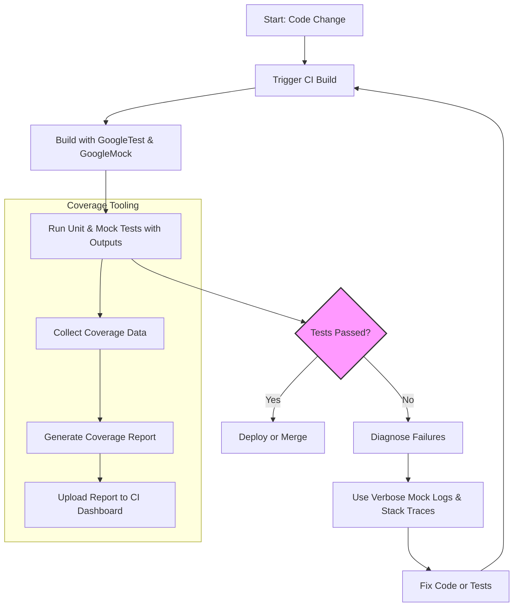

# Integration Examples and Ecosystem Usage

Explore practical scenarios for integrating GoogleTest and GoogleMock into your development ecosystem. This guide helps you leverage these frameworks alongside Continuous Integration (CI) systems, debugging tools, and coverage analysis utilities, ensuring efficient test execution and insightful diagnostics.

---

## Workflow Overview

- **Goal**: Enable developers to effectively run and analyze tests using GoogleTest and GoogleMock in various real-world environments.
- **Prerequisites**: Basic familiarity with writing tests and mocks, a functioning build system that includes GoogleTest/GoogleMock, and access to your CI or local development environment.
- **Outcome**: You'll learn how to set up tests in CI pipelines, integrate debugging aids, and generate coverage reports, improving test reliability and visibility.
- **Estimated Time**: 30-60 minutes, depending on environment complexity.
- **Skill Level**: Intermediate

---

## Step-by-Step Guidance

### 1. Running Tests in Continuous Integration (CI) Systems

Leverage your existing CI infrastructure (e.g., Jenkins, GitHub Actions, GitLab CI) to run GoogleTest and GoogleMock based tests automatically on each code change.

1. **Build Configuration**:
    - Ensure your CI build scripts include steps to compile your test binaries with GoogleTest and GoogleMock linked.
    - Use build systems such as CMake or Bazel with appropriate targets.

2. **Test Execution**:
    - Run test executables with any required flags for reporting, e.g.:

      ```bash
      ./my_tests --gtest_output=xml:report.xml
      ```

    - The XML output enables CI systems to parse and display test results.

3. **Result Integration**:
    - Configure the CI to ingest test XML reports (JUnit or similar format) for visibility.
    - If coverage tooling is included (see later sections), upload and visualize coverage metrics.

4. **Handling Failures**:
    - CI should fail on test failures to prevent regressions.
    - Enable failure notifications (email, Slack, etc.) for quick feedback.

<Tip>
Always run tests with a fixed and reproducible environment to avoid flakiness, ensuring consistent test outcomes.
</Tip>

---

### 2. Debugging Tests Locally

When tests fail locally, leverage GoogleTest and GoogleMock's detailed diagnostic capabilities.

1. **Verbose Output Flags**:
    - Use the GoogleMock verbosity flag to get detailed insights:

      ```bash
      ./my_tests --gmock_verbose=info
      ```

    - This prints detailed logs on mock call matching, helping identify expectation mismatches.

2. **Stack Traces on Failures**:
    - GoogleTest prints stack traces for failed assertions. Use `--gtest_stack_trace_depth=<N>` to control depth.

3. **Breakpoints and Debugger Use**:
    - Set breakpoints in the test or the code under test.
    - Use debugging symbols to navigate failures directly.

4. **Heap Checks**:
    - Leverage address sanitizers or Valgrind alongside tests for detecting memory issues.

<Note>
For intricate mock interactions, review the verbose mock call logs to understand which expectations succeeded, failed, or were skipped.
</Note>

---

### 3. Generating and Analyzing Code Coverage

Link your test suite with coverage tools to understand how much of your code is exercised.

1. **Compiler Support**:
    - Compile your project with coverage flags (e.g., `-fprofile-arcs -ftest-coverage` for GCC/Clang).

2. **Run Tests**:
    - Execute the full test suite to collect coverage data.

3. **Generate Reports**:
    - Use tools like `gcov`, `lcov`, or `llvm-cov` to generate HTML or XML coverage reports.

4. **Interpret Results**:
    - Review reports to identify untested code paths.
    - Complement with tests to improve coverage.

<Tip>
Integrate coverage reporting into your CI to continuously monitor test completeness over time.
</Tip>

---

### 4. Integrating with Other Testing Utilities

GoogleTest and GoogleMock work well alongside complementary tools:

- **Test Filter and Shard**:
  - Run subsets of tests with `--gtest_filter=` for targeted runs.
  - Distribute tests across machines with sharding flags.

- **Custom Event Listeners**:
  - Plug-in test reporters or custom hooks by extending GoogleTest’s listener interface.

- **Benchmarks and Profiling**:
  - Integrate Google Benchmark for performance tests alongside your functional tests.
  - Use profilers during test runs to detect hotspots.

<Note>
Keep tests independent to maximize compatibility with parallel execution and sharding.
</Note>

---

## Examples

### CI Integration Example with GitHub Actions

```yaml
name: C++ Tests

on: [push, pull_request]

jobs:
  build_and_test:
    runs-on: ubuntu-latest
    steps:
      - uses: actions/checkout@v3

      - name: Install dependencies
        run: sudo apt-get update && sudo apt-get install -y cmake g++

      - name: Build
        run: |
          mkdir build
          cd build
          cmake ..
          make

      - name: Run tests
        run: ./build/my_tests --gtest_output=xml:report.xml

      - name: Upload test report
        uses: actions/upload-artifact@v3
        with:
          name: test-report
          path: report.xml

      # Optional: Add coverage collection and upload here
```

### Verbose Mock Call Logging Example

When a test fails due to unexpected or uninteresting mock calls, run the test with:

```bash
./my_tests --gmock_verbose=info
```

This outputs detailed logs indicating:

- Which expectations matched
- Which calls were unexpected
- The arguments passed
- Stack trace showing where the call originated

This level of detail accelerates diagnosis of failing mocks.

---

## Troubleshooting & Tips

- **Uninteresting Call Warnings**:
  - By default mocks produce warnings on uninteresting calls.
  - Use `NiceMock<T>` to suppress warnings if calls are expected but not explicitly set with `EXPECT_CALL`.

- **Leaked Mocks Warning**:
  - Enable `--gmock_catch_leaked_mocks` to detect mocks that are not properly deleted.
  - Always ensure mocks are destroyed to trigger verification.

- **Verbose Levels**:
  - `info`: Most detailed output including stack traces.
  - `warning`: Default, shows warnings and errors.
  - `error`: Minimal output showing only errors.

- **Thread Safety**:
  - Use mocks only on a single thread unless you synchronize externally.

- **Ordering Constraints**:
  - Use `InSequence` or `After` clauses to enforce call order when necessary.

<Tip>
When sharding tests in CI, make sure tests have no hidden dependencies on order or state.
</Tip>

---

## Next Steps & Related Content

- Read **[Writing Your First Test](../getting-started/first-test-run/writing-first-test)** to get started with basic testing.
- Explore **[Mocking with GoogleMock: A Practical Introduction](../guides/core-workflows/mocking-basics)** for creating and using mocks.
- Learn about **[Mocking Best Practices](../guides/advanced-patterns/mocking-pitfalls-best-practices)** to avoid common pitfalls in tests.
- Check out **[Integration & Dependencies](../overview/architecture-and-concepts/integration-and-dependencies)** for build and dependency management.
- Use the **[Mocking Reference](../docs/reference/mocking.md)** for in-depth mock API details.

---

## Diagram: Typical Integration Flow



<Check>
Ensure your CI scripts include test execution and treat failures appropriately.
</Check>

---