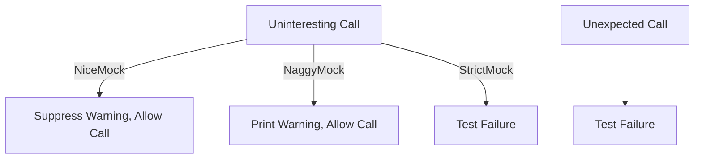

# Strict, Nice, and Naggy Mocks: Choosing the Right Mocking Style

GoogleMock provides three distinct mock strictness levels—**StrictMock**, **NiceMock**, and **NaggyMock**—to control how test doubles react to calls that aren't explicitly expected. Choosing the right mock style enables your team to enforce precise interaction contracts or relax enforcement for more maintainable and flexible tests.

---

## Workflow Overview

### What This Page Helps You Accomplish
This guide explains the behaviors and best use cases for GoogleMock's strictness wrappers. It enables you to:

- Understand the difference between strict, nice, and naggy mocks
- Decide when to fail on unexpected or uninteresting calls
- Apply the appropriate strictness level to your mocks for greater test reliability and developer productivity

### Prerequisites

- Basic familiarity with defining mock classes using `MOCK_METHOD`.
- Knowledge of setting expectations using `EXPECT_CALL` and default behaviors with `ON_CALL`.
- Understanding of what uninteresting and unexpected calls on mocks are.

### Expected Outcome

After reading this guide, you will:

- Know how to create StrictMock, NiceMock, and NaggyMock variants.
- Be equipped to select the right mocking style matching project needs.
- Avoid common pitfalls like receiving unwanted warnings or brittle failures.

### Time Estimate

~10 minutes to read and apply concepts.

### Difficulty Level

Intermediate: Requires understanding of mocking basics in GoogleMock.

---

## Choosing the Right Mock Style

GoogleMock defines three common strictness modifiers for mock objects:

| Style          | Behavior on Uninteresting Calls                                  | Best Use Case                                               |
|----------------|-----------------------------------------------------------------|-------------------------------------------------------------|
| **StrictMock** | Fails tests on uninteresting calls (calls without expectations).| When strict contract enforcement is critical.               |
| **NiceMock**   | Suppresses warnings and ignores uninteresting calls.           | For more flexible, maintainable tests where not everything must be explicitly expected. |
| **NaggyMock**  | Prints warnings on uninteresting calls but continues running.  | Helpful for debugging or during test development phases.


### What Are Uninteresting vs. Unexpected Calls?

- **Uninteresting call**: A call to a mock method with no matching `EXPECT_CALL`.
- **Unexpected call**: A call that matches an existing `EXPECT_CALL` method but has unmatched arguments or occurs more times than expected.

Uninteresting calls are handled differently by the mock styles, while unexpected calls are always treated as failures.

---

## Step-by-Step Instructions

### 1. Creating a Mock with Default Naggy Behavior

By default, a plain mock object is **naggy**. It will print warnings for uninteresting calls but allow the test to continue.

```cpp
class MockFoo {
 public:
  MOCK_METHOD(void, DoThis, (), ());
  MOCK_METHOD(int, DoThat, (bool flag), ());
};

// Usage
MockFoo foo;  // behaves like NaggyMock<MockFoo>
foo.DoThis(); // Warning if no EXPECT_CALL set
```

You may see output such as:

```
UNEXPECTED CALL: Uninteresting mock function call to DoThis()
```

### 2. Using NiceMock to Suppress Warnings on Uninteresting Calls

Wrap the mock class inside `NiceMock<>` to suppress warnings on any uninteresting calls. This style is less noisy and preferred for stable tests.

```cpp
#include <gmock/gmock.h>
using ::testing::NiceMock;

NiceMock<MockFoo> nice_foo;
// Calling methods without an EXPECT_CALL will not warn
nice_foo.DoThis();
```

This is particularly useful when: 
- The test doesn't care about all calls to the mock.
- You want less brittle tests that don't fail or warn on extra calls.

### 3. Using StrictMock to Enforce Expectations on All Calls

Wrap the mock class inside `StrictMock<>` to make uninteresting calls immediate test failures. Use this when you want to strictly enforce that all mock method calls are expected.

```cpp
#include <gmock/gmock.h>
using ::testing::StrictMock;

StrictMock<MockFoo> strict_foo;
EXPECT_CALL(strict_foo, DoThis());  // expected call

strict_foo.DoThis(); // OK
strict_foo.DoThat(true); // Fails: uninteresting call
```

### 4. Constructing Strictness-Modified Mocks with Arguments

All three mock wrappers inherit constructors from the underlying mock class, allowing you to pass constructor arguments seamlessly.

```cpp
class MockBar {
 public:
  explicit MockBar(const std::string& s) : str_(s) {}
  MOCK_METHOD(int, This, (), ());
 private:
  std::string str_;
};

NiceMock<MockBar> nice_bar("hello");
StrictMock<MockBar> strict_bar("world");
```

### 5. Verifying Strictness Behavior

- All three wrappers are subclasses of the respective mock class.
- You can check mock type traits using `Mock::IsNice()`, `IsNaggy()`, `IsStrict()`.

```cpp
NiceMock<MockFoo> nice;
EXPECT_TRUE(Mock::IsNice(&nice));
EXPECT_FALSE(Mock::IsStrict(&nice));
```

---

## Practical Tips and Best Practices

- **Prefer NiceMock for most tests**: It keeps tests maintainable without false warnings.
- **Use StrictMock sparingly**: Strict mocks are helpful for enforcing precise interface contracts but can make refactoring tests difficult.
- **NaggyMock is the default** for raw mocks but is mostly useful during test development or debugging.
- **Set explicit expectations rather than suppress warnings via extra EXPECT_CALL with `Times(AnyNumber())`.**
- **Use `Mock::AllowLeak()`** if your mock's lifetime isn't managed by your code (e.g., deliberately leaked mocks).

---

## Common Troubleshooting

### Unexpected Strict Mock Failures

- You may get failures caused by calls to methods without an `EXPECT_CALL`. Ensure all expected calls are explicitly declared.
- Avoid mixing `StrictMock` with mock methods defined in base classes, as strictness modifiers only reliably apply to methods mocked directly in the class.

### Persistent Warnings on Naggy Mocks

- If you see excessive warnings on uninteresting calls, consider switching to a `NiceMock`.
- Use the `--gmock_verbose` flag to configure verbosity:
  - `info`: Prints detailed call trace.
  - `warning`: Default, prints warnings.
  - `error`: Only errors, suppress warnings.

```cpp
GMOCK_FLAG_SET(verbose, "error"); // suppress warnings
```

### Working with Mock Methods Returning Non-Default Constructible Types

- Uninteresting calls to such methods will throw exceptions or crash.
- Always specify explicit actions or expectations for them to avoid surprises.

---

## Examples

### Basic Mock Creation and Usage

```cpp
class MockFoo {
 public:
  MOCK_METHOD(void, DoThis, (), ());
  MOCK_METHOD(int, DoThat, (bool flag), ());
};

// Simple Naggy mock
MockFoo foo;
foo.DoThis();  // Warning if no expectation

// Nice mock suppressing warnings
NiceMock<MockFoo> nice;
nice.DoThis();  // No warning

// Strict mock failing on uninteresting calls
StrictMock<MockFoo> strict;
EXPECT_CALL(strict, DoThis());
strict.DoThis();  // OK
strict.DoThat(true);  // TEST FAILURE
```

### Using Constructors with Modified Mocks

```cpp
class MockBar {
 public:
  explicit MockBar(const std::string& s) : str_(s) {}
  MOCK_METHOD(int, Foo, (), ());
 private:
  std::string str_;
};

NiceMock<MockBar> nice_bar("Hello");
EXPECT_EQ("Hello", nice_bar.str());
```

### Enforcing Strict Behavior

```cpp
StrictMock<MockFoo> strict;
EXPECT_CALL(strict, DoThis());

strict.DoThis();      // Test passes
strict.DoThat(false); // Test fails: uninteresting call
```

---

## Next Steps & Related Guides

- Read the [gMock Cheat Sheet](https://google.github.io/googletest/gmock_cheat_sheet.html) for concise usage examples of strictness modifiers.
- Explore the [gMock Cookbook](https://google.github.io/googletest/gmock_cook_book.html#NiceStrictNaggy) for advanced recipes on managing mocks and controlling their strictness.
- Use the [Mocking Reference](https://google.github.io/googletest/reference/mocking.html#strictmock) to understand mock modifiers in detail.
- See [Using Mocks for Dependency Isolation](https://google.github.io/googletest/guides/core-workflows/using-mocks.html) to learn how strictness impacts mock usage in typical test flows.

---

## References

- `googlemock/include/gmock/gmock-nice-strict.h`: Implements `NiceMock`, `NaggyMock`, and `StrictMock` wrappers.
- `docs/gmock_cheat_sheet.md`: Quick reference for mock strictness and usage.
- `docs/gmock_cook_book.md`: Detailed information on fake, strict, nice, and naggy mocks.
- `docs/reference/mocking.md`: API reference for mock-related functionalities.

<Tip>
When deciding on mock strictness, balance test maintainability with necessary enforcement. Prefer `NiceMock` unless you have a strong reason to enforce strict call contracts.
</Tip>

---

## Summary Diagram: Mock Strictness Behavior



---

## Troubleshooting Tips

<AccordionGroup title="Troubleshooting Common Issues with Mock Strictness">
<Accordion title="Unexpected failures on StrictMock">
Make sure every method call on a `StrictMock` has a matching `EXPECT_CALL`. Remember, uninteresting calls fail immediately.
</Accordion>
<Accordion title="Warnings with NaggyMock">
Use `NiceMock` if warnings become too noisy or if uninteresting calls are expected and don't indicate real issues.
</Accordion>
<Accordion title="Exceptions from uninteresting calls with non-default-constructible return types">
Explicitly specify an action for such mock methods, as GoogleMock cannot auto-generate return values.
</Accordion>
<Accordion title="Constructors not found when using mock wrappers">
Ensure the mock classes' constructors are compatible; wrappers inherit constructors transparently.
</Accordion>
</AccordionGroup>

---

## Additional Config

To allow leaked mocks (for example, when tests intentionally leak mock objects), call:

```cpp
Mock::AllowLeak(&mock_obj);
```

This tells GoogleMock not to complain about mocks that are not deleted by test code.


---

<Check>
Always set `EXPECT_CALL`s before exercising the mock to avoid undefined behavior.
</Check>

---