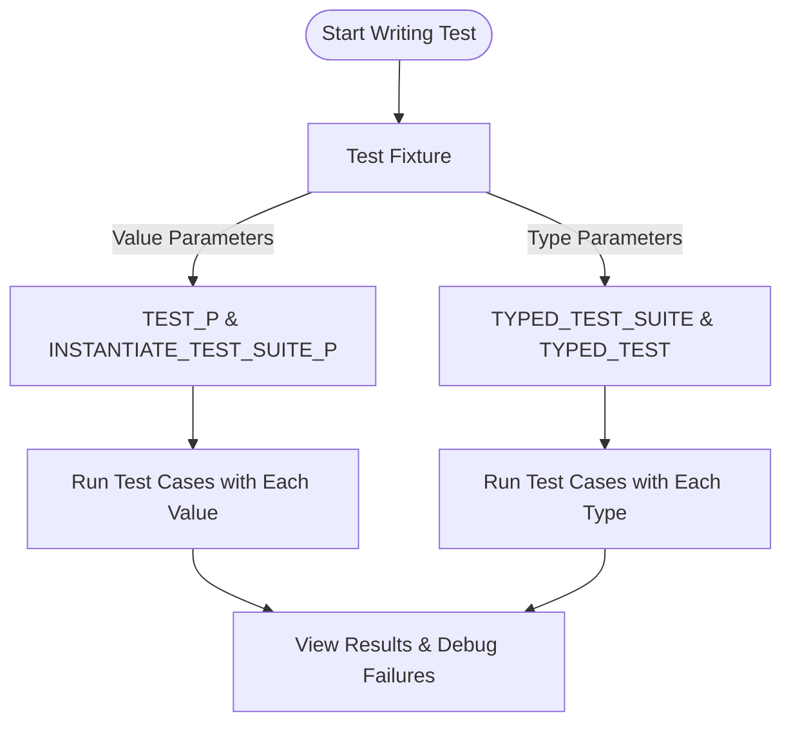

# Parameterized and Type-Parameterized Tests

Master writing tests that iterate across multiple values and types. This guide details value- and type-parameterized testing, enhancing coverage and maintainability in codebases with broad input domains.

---

## 1. Introduction to Parameterized Testing

Parameterized tests let you run the same test logic with different inputs efficiently. This practice reduces code duplication and increases test coverage by systematically varying inputs.

**Why use parameterized tests?**

- Validate your code against multiple inputs without rewriting tests
- Ensure coverage across edge cases and typical scenarios
- Maintain test clarity and conciseness

### Prerequisites

- Familiarity with GoogleTest basics and writing simple test cases ([Writing Your First Test](getting-started/first-test-run/writing-first-test.md))
- GoogleTest and GoogleMock installed and configured (see [Installation Instructions](getting-started/setup-basics/installation-instructions.md))

### Expected Outcome

You will be able to write tests that automatically iterate over several values (value-parameterized tests) or types (type-parameterized tests), making your test suite more robust and easier to maintain.

### Difficulty Level

Intermediate

---

## 2. Writing Value-Parameterized Tests

Value-parameterized tests allow you to specify a set of values, and run the same test logic for each.

### Step-by-Step Instructions

1. **Define a test fixture class**

Create a test fixture derived from `::testing::TestWithParam<T>`, where `T` is the type of the parameter you want to test with.

```cpp
#include <gtest/gtest.h>

class MyValueParamTest : public ::testing::TestWithParam<int> {
  // Optional setup/teardown
};
```

2. **Write test cases using the `TEST_P` macro**

Inside this test case, access the parameter with `GetParam()`.

```cpp
TEST_P(MyValueParamTest, HandlesVariousInts) {
  int param = GetParam();
  // Your test logic using param
  EXPECT_TRUE(param >= 0);  // Example check
}
```

3. **Define the values to test with**

Use the `INSTANTIATE_TEST_SUITE_P` macro to specify the test cases you want to run.

```cpp
INSTANTIATE_TEST_SUITE_P(
    PositiveValues,  // Instance name
    MyValueParamTest,
    ::testing::Values(1, 2, 3, 100, 1000));
```

4. **Run your tests**

GoogleTest will execute `HandlesVariousInts` once per value specified.

### Expected Results

- Test suite runs multiple times, each with a different parameter value.
- Failures or successes are reported with which parameter was used.

### Decision Points

- Use `Values()` when you have a specific fixed set
- Use `ValuesIn()` to supply a container or array of values

### Verification

- Confirm tests execute for all parameters
- Check test output includes parameter info

---

## 3. Writing Type-Parameterized Tests

Type-parameterized tests allow you to run tests with multiple types, useful for template code.

### Step-by-Step Instructions

1. **Define your test fixture template**

Derive from template `::testing::Test`.

```cpp
template <typename T>
class MyTypeParamTest : public ::testing::Test {
  // Fixture code
};
```

2. **Register the test fixture as a type-parameterized test suite**

Declare using `TYPED_TEST_SUITE` macro specifying the fixture and the types.

```cpp
using MyTypes = ::testing::Types<int, double, std::string>;  // or your types
TYPED_TEST_SUITE(MyTypeParamTest, MyTypes);
```

3. **Write test cases with `TYPED_TEST` macro**

Within the test, refer to the test type as `TypeParam`.

```cpp
TYPED_TEST(MyTypeParamTest, CanBeDefaultConstructed) {
  TypeParam value{};
  (void)value;  // Optional usage
}
```

4. **Run the tests**

GoogleTest will run each `TYPED_TEST` once for every type in `MyTypes`. Output shows type info.

### Expected Results

- Each test runs for every type specified
- Failures or successes correlate with specific types

### Decision Points

- Choose types with care based on your template code's domain.
- Include types with special semantics, e.g., move-only, pointers, or custom classes.

### Verification

- Confirm that all types have corresponding test runs
- Watch for type-related compilation or runtime issues

---

## 4. Advanced Usage and Tips

### Combining Value and Type Parameters

You can combine type-parameterized tests with value parameterization (using `TestWithParam` inside a typed test fixture), but this requires extra setup.

### Best Practices

- Keep test logic clean and free of side effects related to parameters.
- Use meaningful parameter sets covering edge and typical cases.
- Give instance and test names that clarify the meaning of parameters.

### Common Pitfalls

- Forgetting to specify `override` for mock methods in typed mocks (see [Mocking Reference](docs/reference/mocking.md#MOCK_METHOD)).
- Defining parameters that do not match the test fixture's expected parameter type.
- Overusing `EXPECT_CALL` and not `ON_CALL` for setting default mock behaviors affecting test flexibility (see [gMock Cheat Sheet](docs/gmock_cheat_sheet.md#setting-default-actions-on_call)).

### Troubleshooting

- If tests don’t run for all parameters, verify the `INSTANTIATE_TEST_SUITE_P` macro syntax.
- Compilation errors in typed tests often stem from lacking type compatibility; verify all types fulfill interface requirements.
- For verbose output on parameter runs, use `--gtest_output=...` or increase verbosity settings.

---

## 5. Example: Value-Parameterized Test

```cpp
#include <gtest/gtest.h>

// Function to test
int IsEven(int n) { return n % 2 == 0; }

class EvenTest : public ::testing::TestWithParam<int> {};

TEST_P(EvenTest, DetectsEvenNumbers) {
  int n = GetParam();
  EXPECT_EQ(IsEven(n), n % 2 == 0);
}

INSTANTIATE_TEST_SUITE_P(
    Numbers,
    EvenTest,
    ::testing::Values(0, 1, 2, 3, 10, 15));
```

## 6. Example: Type-Parameterized Test

```cpp
#include <gtest/gtest.h>

template <typename T>
class DefaultConstructibleTest : public ::testing::Test {};

TYPED_TEST_SUITE(DefaultConstructibleTest, ::testing::Types<int, double, std::string>);

TYPED_TEST(DefaultConstructibleTest, CanBeDefaultConstructed) {
  TypeParam value{};
  (void)value;
}
```

---

## 7. Next Steps & Related Guides

- Explore [Writing Your First Test](getting-started/first-test-run/writing-first-test.md) to get familiar with basic test writing.
- Advance to [Mocking with GoogleMock: A Practical Introduction](guides/core-workflows/mocking-basics.md) for applying mocks alongside parameterized tests.
- Review [gMock Cheat Sheet](docs/gmock_cheat_sheet.md) for quick references on mocks, matchers, and actions.

---

<Tip>
Remember to always define virtual destructors in interfaces and mock classes to ensure proper cleanup. This is critical when combining parameterized tests with mocks.
</Tip>

<Tip>
Use `GetParam()` carefully inside `TEST_P` tests and the special type alias `TypeParam` inside `TYPED_TEST` tests to access the current parameter or type respectively.
</Tip>

<Note>
If your test fixture uses setup or teardown, ensure you correctly handle parameters across those phases to maintain test integrity.
</Note>

<Warning>
Avoid mixing typed and value parameterizations without proper understanding, as this can complicate test maintenance.
</Warning>

---

## 8. Summary Diagram of Test Flow



---

## References

- [GoogleTest for Dummies - Mocking Basics](docs/gmock_for_dummies.md)
- [GoogleMock Cheat Sheet](docs/gmock_cheat_sheet.md)
- [Mocking Reference](docs/reference/mocking.md)
- [Writing Your First Test](getting-started/first-test-run/writing-first-test.md)

---

This page focuses specifically on parameterized and type-parameterized testing, complementing other guides on mocking and test writing within GoogleTest and GoogleMock.