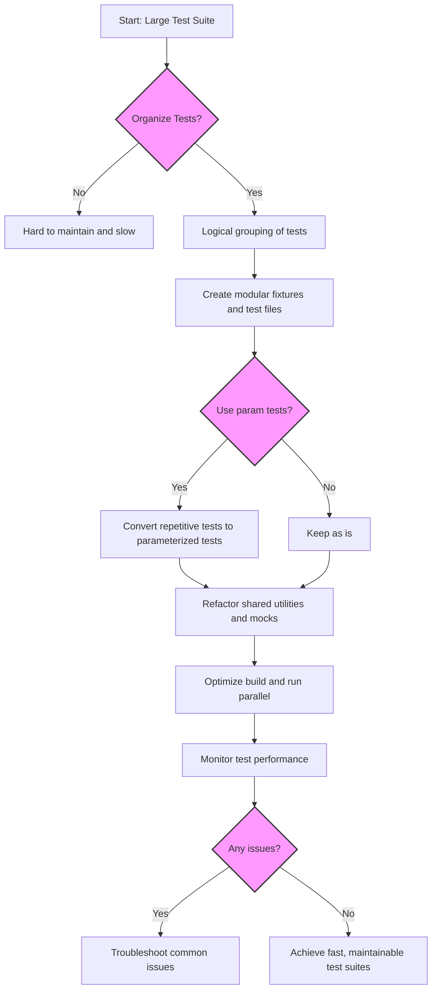

# Best Practices for Large and Scalable Test Suites

## Workflow Overview

### Task Description
This guide helps you organize, maintain, and optimize large GoogleTest and GoogleMock codebases. It focuses on techniques to improve test discovery, modularization, fixture management, and test execution performance for fast feedback.

### Prerequisites
- Basic familiarity with GoogleTest and GoogleMock APIs, including writing tests and using mocks.
- Your project should already have GoogleTest and GoogleMock properly installed and configured.
- Understanding of core testing concepts such as test fixtures, assertions, and mocking.

### Expected Outcome
After completing this guide, you will be able to structure large test suites more effectively, reducing complexity and improving maintainability and runtime efficiency.

### Time Estimate
Approximately 30–60 minutes depending on familiarity with GoogleTest.

### Difficulty Level
Intermediate

---

## Organizing Large Test Suites

As your test suite grows, keeping tests discoverable and maintainable becomes critical. GoogleTest provides mechanisms and best practices to help you scale your test suites effectively.

### 1. File and Directory Layout
- Group related tests into logical directories mirroring your production code structure.
- Avoid monolithic test files; instead, split tests across multiple files to improve build times and readability.
- Use meaningful, descriptive test file names (e.g., `foo_component_test.cc`) to ease navigation.

### 2. Modularization
- Define multiple test cases and test fixtures for logically grouped functionality.
- Factor out common setup/teardown into fixtures and helper classes.
- Use test suite naming conventions to keep tests discoverable by intent.
- Share common test utilities and mocks in dedicated files or libraries.

### 3. Test Discovery
- GoogleTest uses naming conventions (`TEST`, `TEST_F`, etc.) to discover tests automatically.
- Organize tests with meaningful test suite and test names to avoid ambiguous matches.
- Avoid excessively large test fixtures to keep discovery and diagnostics swift.

<Check>
Avoid defining multiple unrelated tests inside a single test suite.
</Check>

## Managing Shared Fixtures

### Shared Fixtures Best Practices
- Use `TEST_F` to share fixtures among tests that require common state.
- If fixtures get large, consider splitting into smaller, more focused fixtures.
- Use parameterized tests (`TEST_P`) to reduce duplication for tests that vary only by inputs.

### Handling Expensive Setup/Teardown
- Keep expensive setup/teardown operations outside the test fixture if possible.
- Use `SetUpTestSuite` and `TearDownTestSuite` static methods for one-time setup/cleanup.
- Avoid global or static state that can cause flakiness between tests.

## Performance Optimization for Fast Feedback

### Test Execution
- Run tests in parallel using GoogleTest’s built-in support (e.g., `--jobs=N` with some wrappers).
- Run subsets of tests during development for faster feedback; focus on changed modules.

### Minimizing Test Dependencies
- Mock all external dependencies that slow down tests (databases, networks, files).
- For mocks, use `NiceMock` to suppress uninteresting call warnings to reduce noise and overhead.

### Avoiding Over-Specification
- Use `ON_CALL` to define default mock behaviors and minimize unnecessary expectations.
- Use `EXPECT_CALL` sparingly to verify only critical interactions.

### Keeping Tests Deterministic
- Avoid randomization in tests unless absolutely necessary and supported by repeatable seeds.
- When using sequences (`InSequence`), keep ordering clear only where it matters.

### Compilation Time Reduction
- Move mock class constructors and destructors to source files instead of headers.
- Reduce the number of mock methods in a single class if they cause slow compilation.

<Note>
Compilation performance is vital for large test projects. See the "Compiling Mock Classes"
section of the [gMock Cookbook](gmock_cook_book.md#MakingCompilationFaster) for details.
</Note>

## Practical Tips and Common Pitfalls

- **Avoid Over-Constraining:** Excessive use of strict mock expectations causes brittle tests.
- **Use Sequences Judiciously:** Only enforce call order when it matters to behavior.
- **Retire Expectations:** Use `.RetiresOnSaturation()` on expectations that should become inactive after usage.
- **Control Mock Strictness:** Apply `NiceMock` to reduce uninteresting call warnings; reserve `StrictMock` for critical strictness.
- **Centralize Mock Definitions:** Put mock classes near the code they mock to ease maintenance.
- **Parameterize Tests:** Use parameterized tests to cover input variations efficiently.

## Step-by-Step Instructions for Modularizing a Large Test Suite

### Step 1: Identify Logical Boundaries

- Review your existing tests.
- Group tests by components, features, or layers.

### Step 2: Create Separate Test Files and Fixtures

- Extract related tests into dedicated files.
- Define focused fixtures with shared setup.

### Step 3: Use Parameterized Tests

- Convert repetitive tests differing only by parameters into `TEST_P`.

### Step 4: Refactor Common Utilities

- Move common code, mocks, and test helpers into shared headers/source.

### Step 5: Configure Build System

- Organize tests into test-only libraries or targets for incremental builds.
- Ensure dependencies are minimal to speed up build times.

### Step 6: Enable Parallel Execution

- Use test runners or scripts supporting parallel test execution.

### Step 7: Monitor and Adjust

- Profile test runtimes.
- Refine mock strictness levels and fixtures to optimize.

## Example: Modularizing Foo Component Tests

Suppose you have a large `foo_test.cc` file:

```cpp
class FooTest : public ::testing::Test {
 protected:
  void SetUp() override {
    // common setup
  }
  // common members
};

TEST_F(FooTest, TestFeatureA) { ... }
TEST_F(FooTest, TestFeatureB) { ... }
...
```

You can split into:

- `foo_feature_a_test.cc` with a fixture and tests focused on FeatureA
- `foo_feature_b_test.cc` similarly focused on FeatureB

Each file can define its own fixture with customized setup relevant to the feature.

## Troubleshooting Common Issues

<AccordionGroup title="Common Problems and Solutions">
<Accordion title="Test Discovery Fails to Find Tests">
Check that your test functions use the correct GoogleTest macros (`TEST`, `TEST_F`, `TEST_P`).
Verify test naming conventions and that test binaries are built and run correctly.
</Accordion>
<Accordion title="Mock Warning: Uninteresting Function Call">
Use `NiceMock` to suppress warnings if you deliberately ignore certain mock calls.
Alternatively, add `EXPECT_CALL(mock, Method(_)).Times(AnyNumber())` to indicate tolerance.
</Accordion>
<Accordion title="Slow Test Runs and Builds">
Split large test files, avoid large fixtures, enable parallel test execution.
Refactor mocks to reduce compilation complexity (see gMock Cookbook).
</Accordion>
</AccordionGroup>

## Next Steps & Related Content

- **What’s Next:** Learn to write efficient parameterized tests and use advanced mock techniques.
- **Related Guides:**
  - [Using Mocks for Dependency Isolation](/guides/core-workflows/using-mocks)
  - [Writing and Running Unit Tests](/guides/core-workflows/writing-tests)
  - [Mock Strictness Styles](/guides/advanced-patterns/mock-strictness)
- **Advanced Topics:** Custom actions and matchers for specialized mocking.
- **Resources:**
  - [gMock Cookbook](gmock_cook_book.md)
  - [gMock Cheat Sheet](gmock_cheat_sheet.md)
  - [Best Practices for Writing Tests](/guides/core-workflows/assertions-matchers)

---

## References
- [GoogleTest User’s Guide](index.md)
- [gMock Cookbook](gmock_cook_book.md)
- [Mocking Reference](reference/mocking.md)
- [gMock Cheat Sheet](gmock_cheat_sheet.md)

---

## Summary Diagram


