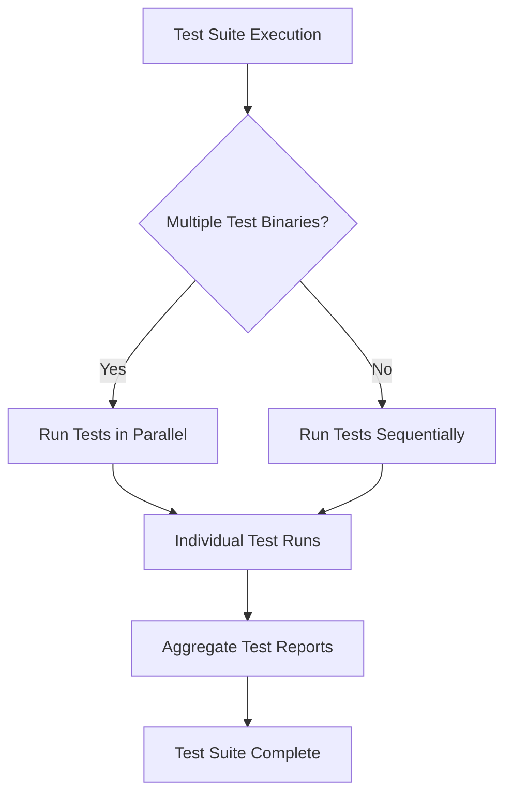

# Performance, Scaling, and Best Practices

## Overview

This guide focuses on practical tips to enhance your GoogleTest test suite’s performance, reliability, and scalability. As your C++ projects grow, ensuring fast test execution, minimizing test flakiness, and adopting optimal organizational patterns becomes essential for sustainable development and continuous integration.

By following this guide, you will learn actionable techniques including test parallelization, flakiness reduction strategies, and design patterns suited for large codebases that keep your tests maintainable and efficient.

---

## Prerequisites

Before applying the advice in this guide, ensure that:

- You have a working GoogleTest setup compiling and running your tests correctly. (See [Basic Configuration & Project Setup](/getting-started/core-setup/configuration-basics))
- You understand test fixtures, assertions, and the basics of test organization. (See [Organizing and Structuring Tests](/guides/core-workflows/organizing-tests))
- Your development environment supports typical build and test tooling compatible with GoogleTest.

---

## Expected Outcome

After completing the practices described here, you will:

- Execute tests faster by leveraging test parallelization.
- Reduce intermittent test failures caused by timing or resource contention.
- Structure large test suites in a scalable and maintainable manner.
- Understand common pitfalls and how to avoid them during test scaling.

---

## Time Estimate

Implementing these recommendations may take from a few minutes for introducing parallelization to several hours or days when reorganizing tests in very large projects.

---

## Difficulty Level

Intermediate to Advanced: This guide assumes proficiency in C++ testing and familiarity with GoogleTest’s core features.

---

## 1. Running Tests Faster

### 1.1 Parallel Test Execution

GoogleTest supports running tests in parallel to utilize multi-core CPUs efficiently.

**Steps:**

1. Use test runners or build systems with parallel execution capabilities such as `ctest` with parallel jobs, `bazel test`, or CI pipelines that distribute tests across workers.
2. For simple setups, invoke `--gtest_parallel` or use wrappers that distribute tests to multiple processes.
3. Split your test binaries granularly to maximize parallelism. Finer partitions allow better load balancing.

**Expected Result:** Reduced wall-clock time of the test suite with near-linear scaling on available cores.

<Tip>
Keep test binaries small and focused to improve parallel speedup. Large monolithic test executables may serialize test cases internally and limit concurrency.
</Tip>

### 1.2 Selective Test Runs

Use GoogleTest filtering using `--gtest_filter` to only run subsets of tests during development, saving time.

**Example:**

```bash
./my_tests --gtest_filter=MyTestSuite.*
```

---

## 2. Minimizing Test Flakiness

### 2.1 Avoid Shared State

Shared global or static state between tests leads to flaky and non-deterministic runs.

**Best Practices:**

- Initialize state within test fixtures.
- Avoid static mutable variables unless carefully reset.
- Keep tests independent and repeatable in any order.

<Tip>
Always reset or isolate mocks and data between tests. GoogleTest fixtures (`TEST_F`) provide setup/teardown mechanisms for this.
</Tip>

### 2.2 Manage Time and Resource Dependencies

Tests relying on timers, network, or hardware are prone to flakiness.

**Recommendations:**

- Mock out time-sensitive or asynchronous dependencies.
- Use GoogleMock to control and verify interactions with such components (see [Using Mocks Correctly](/guides/core-workflows/using-mocks-correctly)).
- Avoid tight time constraints or polling loops in tests.

### 2.3 Use `RetiresOnSaturation()` for Expectations

Expectations that should only apply to a limited number of calls must use `.RetiresOnSaturation()` to avoid unexpected call mismatches.

**Example:**

```cpp
EXPECT_CALL(mock, Foo(7))
    .Times(2)
    .RetiresOnSaturation();
```

This ensures that after two calls, the expectation is retired, preventing sticky failures.

---

## 3. Patterns for Large Codebases

### 3.1 Logical Test Grouping

Organize tests into suites and use test fixtures to share setup code efficiently.

- Group logically related test cases together.
- Use parameterized tests to reduce duplication (see [Parameterized Tests](/guides/core-workflows/parameterized-tests)).

### 3.2 Modular Mock Classes

- Define mocks close to the interfaces they replace.
- Prefer interface-based design with pure virtual classes for cleaner mocking.

### 3.3 Avoid Overly Strict Mocking

- Use `NiceMock` to suppress warnings on uninteresting calls where appropriate.
- Reserve `StrictMock` for critical interactions to avoid brittle tests.

### 3.4 Use Sequences and Ordering Constraints Wisely

- Use `InSequence` and `.After()` clauses to impose partial or full order only when necessary.
- Over-ordering can cause fragile tests.

### 3.5 Managing Test Data

- Keep test data minimal and focused.
- Use data generators or helpers to simplify data setup.

---

## 4. Troubleshooting Common Issues

### 4.1 Tests Hangs or Deadlocks in Parallel Runs

- Inspect for shared resources (files, ports).
- Use test fixtures to isolate test resources.
- Ensure thread-safety in mocks.

### 4.2 Unexpected or Excessive Calls Reported

- Verify expectations’ cardinality and usage of `.RetiresOnSaturation()`.
- Check that `EXPECT_CALL` precedes code exercising the mocks.

### 4.3 Flaky Failures on Tests Using Mocks

- Use `ON_CALL` to provide default behaviors.
- Avoid mixing `EXPECT_CALL` unnecessarily.
- Run tests with `--gmock_verbose=info` to trace mock interactions.

---

## 5. Best Practices Summary

- Design independent, atomic tests.
- Use GoogleMock judiciously; prefer `ON_CALL` for default actions and minimal `EXPECT_CALL`s.
- Employ parallel test execution with careful resource management.
- Organize tests and mock classes modularly.
- Use appropriate cardinalities and sequencing to express expectations.
- Continuously monitor and manage flaky tests.

---

## Additional Resources

- [Organizing and Structuring Tests](/guides/core-workflows/organizing-tests)
- [Parameterized Tests](/guides/core-workflows/parameterized-tests)
- [Using Mocks Correctly](/guides/core-workflows/using-mocks-correctly)
- [gMock Cookbook](https://google.github.io/googletest/gmock_cook_book.html)
- [Mocking Reference](/docs/reference/mocking)

---

# Practical Example: Parallelizing Tests with CTest

If you are using CMake, you can speed up test execution by running tests in parallel with `ctest`:

```bash
ctest -j <number_of_cores>
```

This launches multiple test jobs concurrently, drastically reducing total run time.

Make sure to design tests as described above to prevent race conditions.

# Glossary of Key Terms

- **EXPECT_CALL:** Declares an expected call on a mock, optionally with cardinality.
- **ON_CALL:** Declares behavior for calls matching given arguments, does not set expectation.
- **Cardinality:** Defines how many times a call is expected.
- **RetiresOnSaturation():** Indicates an expectation is no longer active once the expected calls are made.
- **InSequence:** Ensures expectations are met in a strict order.

---

## Callouts

<Tip>
Use `.RetiresOnSaturation()` on expectations in sequences or multiple `WillOnce()` chains to prevent confusing call matching failures.
</Tip>

<Warning>
Neglecting independent test design can lead to fragile, flaky tests especially when running tests concurrently.
</Warning>

<Info>
Run your test suite with `--gmock_verbose=info` to trace mock calls and debug unexpected behaviors.
</Info>

---

## Mermaid Diagram: Test Execution Flow with Parallelization



---

## Summary

Optimizing your GoogleTest test suite through parallel execution, managing flakiness, and applying scalable test organization patterns is critical for reliable, maintainable, and fast testing in large C++ projects.

By applying the best practices outlined here, you create a robust foundation for continuous integration and accelerate development velocity while ensuring high quality.


