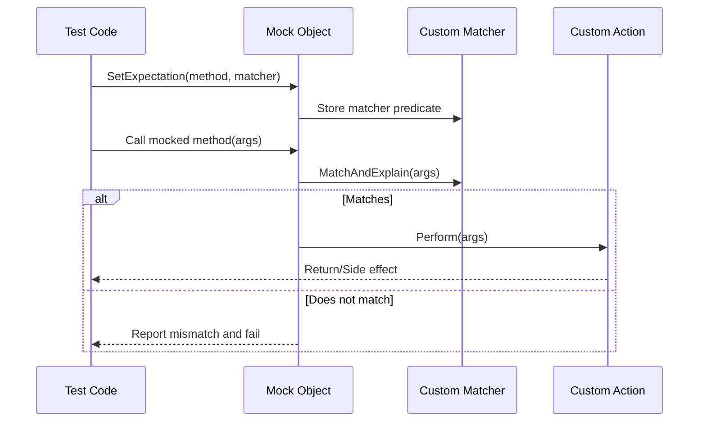

# Creating Custom Matchers and Actions

This guide shows you how to extend GoogleTest and Google Mock by creating your own custom matchers and actions. Custom matchers allow you to specify domain-specific checks on function arguments, while custom actions enable you to define flexible behaviors for mock methods beyond the built-in capabilities. Through practical, step-by-step examples, you will learn how to build matchers and actions that integrate smoothly with gMock's framework.

---

## 1. Understanding Custom Matchers

### What Are Matchers?
Matchers are predicates that test whether a mock function's argument satisfies a condition. While gMock provides many built-in matchers (like `_`, `Eq()`, `Lt()`, etc.), sometimes your testing needs require more specialized checks that match your domain logic.

### When to Write a Custom Matcher
- When you want readable and reusable checks encapsulating complex conditions.
- When argument validation goes beyond simple value matches.
- When you want detailed failure messages explaining why an argument failed to match.

### Basic Structure of a Custom Matcher
A matcher class should implement the following interface:
- `bool MatchAndExplain(const T& value, std::ostream* os) const` — evaluates the argument.
- `void DescribeTo(std::ostream* os) const` — describes the matcher.
- `void DescribeNegationTo(std::ostream* os) const` — describes the negation.

`T` is the argument type you want to match.

---

## 2. Creating a Simple Custom Matcher Class

Let's define `BarPlusBazEqMatcher`, which matches objects where the sum of two members equals a given value.

```cpp
class BarPlusBazEqMatcher {
 public:
  using is_gtest_matcher = void;  // Marks this as a matcher.

  explicit BarPlusBazEqMatcher(int expected_sum) : expected_sum_(expected_sum) {}

  bool MatchAndExplain(const Foo& foo, std::ostream* /*listener*/) const {
    return (foo.bar() + foo.baz()) == expected_sum_;
  }

  void DescribeTo(std::ostream* os) const {
    *os << "bar() + baz() equals " << expected_sum_;
  }

  void DescribeNegationTo(std::ostream* os) const {
    *os << "bar() + baz() does not equal " << expected_sum_;
  }

 private:
  const int expected_sum_;
};

::testing::Matcher<const Foo&> BarPlusBazEq(int expected_sum) {
  return ::testing::MakeMatcher(new ::testing::internal::MatcherInterfaceAdapter<
      BarPlusBazEqMatcher>(BarPlusBazEqMatcher(expected_sum)));
}
```

### How to Use
```cpp
EXPECT_CALL(mock_foo, SomeMethod(BarPlusBazEq(5)));
```

This matcher checks `foo.bar() + foo.baz() == 5`. If the test fails, it provides a user-friendly message.

---

## 3. Using the `MATCHER` Macro for Quick Matcher Definitions

Google Mock provides convenient macros to write matchers with less boilerplate:

```cpp
MATCHER(IsDivisibleBy7, "") {
  return (arg % 7) == 0;
}
```

You can then use:

```cpp
EXPECT_CALL(mock, SomeMethod(IsDivisibleBy7()));
```

Add custom messages by streaming additional info:

```cpp
MATCHER(IsDivisibleBy7, "") {
  if ((arg % 7) != 0) {
    *result_listener << "the remainder is " << (arg % 7);
    return false;
  }
  return true;
}
```

---

## 4. Creating Custom Actions

### What Are Actions?
Actions define what a mock method does when called: return a value, change an out parameter, throw exceptions, call a callback, or any custom behavior.

### When to Write a Custom Action
- You need behavior not covered by built-in actions like `Return()` or `Invoke()`.
- You want to encapsulate common side effects across multiple tests.
- You want more control over invocation timing and effects.

---

## 5. Writing a Simple Custom Action

Implement the `ActionInterface<F>` where `F` is the function type of the mock method:

```cpp
template <typename F>
class ActionInterface {
 public:
  virtual ~ActionInterface() {}

  // Perform the action.
  virtual typename ::testing::internal::Function<F>::Result
  Perform(const typename ::testing::internal::Function<F>::ArgumentTuple& args) = 0;
};
```

### Example: IncrementArgument Action

```cpp
class IncrementArgumentAction : public ::testing::ActionInterface<int(int*)> {
 public:
  int Perform(const std::tuple<int*>& args) override {
    int* p = std::get<0>(args);
    (*p)++;
    return *p;
  }
};

::testing::Action<int(int*)> IncrementArgument() {
  return ::testing::MakeAction(new IncrementArgumentAction);
}
```

Use in test:

```cpp
EXPECT_CALL(mock, Baz(_)).WillOnce(IncrementArgument());
int n = 5;
mock.Baz(&n);  // n becomes 6
```

---

## 6. Defining Polymorphic Actions

A polymorphic action can be used across multiple mock function types. Use `MakePolymorphicAction()` to define them.

Example: Return the second argument action:

```cpp
class ReturnSecondArgumentAction {
 public:
  template <typename R, typename Args>
  R Perform(const Args& args) const {
    return std::get<1>(args);
  }
};

::testing::PolymorphicAction<ReturnSecondArgumentAction> ReturnSecondArgument() {
  return ::testing::MakePolymorphicAction(ReturnSecondArgumentAction());
}
```

Use anywhere:

```cpp
EXPECT_CALL(mock, DoThis).WillOnce(ReturnSecondArgument());
```

---

## 7. Using Functions, Lambdas, and Functors as Actions

Most of the time, you don't need to write an explicit action class. You can use lambdas or any callable:

```cpp
EXPECT_CALL(mock, Sum(_, _))
    .WillOnce([](int x, int y) { return x + y; });
```

Or use `Invoke()`:

```cpp
int CalculateSum(int x, int y) { return x + y; }
EXPECT_CALL(mock, Sum(_, _))
    .WillOnce(::testing::Invoke(CalculateSum));
```

---

## 8. Advanced Action Utilities

- Use `WithArgs<N1, ..., Nk>(action)` to select and reorder arguments passed to an inner action.
- Use `InvokeArgument<N>(args...)` to invoke the mock method's N-th argument if it is a callable.
- Use `DoAll(a1, a2, ..., an)` to perform multiple actions sequentially, returning the result of the last.

---

## 9. Practical Tips and Best Practices

- Use `ON_CALL` to set default behaviors without expectations, reserving `EXPECT_CALL` for actual expectations.
- Avoid over-specifying behavior to keep tests maintainable.
- Use `NiceMock`, `NaggyMock`, or `StrictMock` to control warnings and failures for uninteresting calls.
- When matchers become complex, create reusable custom matchers to improve readability.
- When returning values that change over time, use actions like `ReturnPointee` or lambdas to return live values.

---

## 10. Troubleshooting Common Issues

- **Action Side Effects Not Occurring:** Ensure your action class's `Perform` method correctly modifies state.
- **Matcher Not Matching:** Implement detailed explanations in `MatchAndExplain` to aid debugging.
- **Overloading Ambiguity:** Use `Const()` to disambiguate const overloads; specify matcher types explicitly if needed.
- **Uninteresting Calls Warnings:** Use `NiceMock` or add catch-all `EXPECT_CALL` with `Times(AnyNumber())`.

---

## 11. Next Steps & Related Content

- Explore the [gMock Cookbook](https://google.github.io/googletest/gmock_cook_book.html) for more recipes.
- Learn about [Writing New Matchers Quickly](https://google.github.io/googletest/gmock_cook_book.html#newmatchers).
- Read the [Matchers Reference](https://google.github.io/googletest/reference/matchers.html) to deepen matcher usage.
- Review the [Actions Reference](https://google.github.io/googletest/reference/actions.html) for built-in actions.
- Practice creating mocks with diverse complexity in tests.

---

## References

- [gMock Cookbook](https://google.github.io/googletest/gmock_cook_book.html)
- [gMock for Dummies](https://google.github.io/googletest/gmock_for_dummies.html)
- [Mocking Reference](https://google.github.io/googletest/reference/mocking.html)
- [Actions Reference](https://google.github.io/googletest/reference/actions.html)
- [Matchers Reference](https://google.github.io/googletest/reference/matchers.html)


---

# Mermaid Diagram: Custom Matcher and Action Workflow



