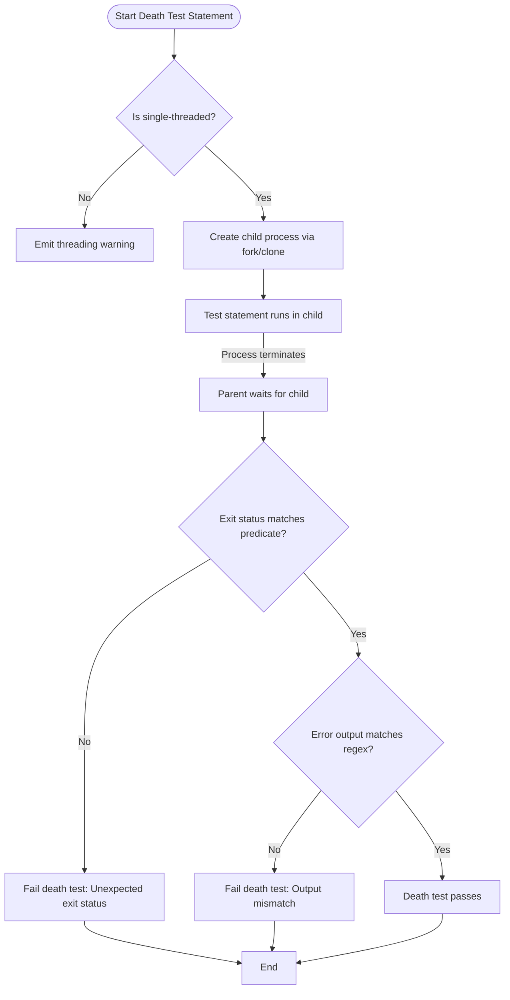

# Using Death Tests for Error Handling

## Overview

This guide helps C++ developers leverage GoogleTest's death test features to verify that code correctly handles fatal error conditions by terminating as expected. It focuses on writing reliable death tests that assert process termination, matching exit codes and error output patterns. You will learn how to use death test macros, configure death test styles for thread safety and performance, and avoid common pitfalls when testing error scenarios.

---

## 1. Understanding Death Tests

Death tests detect whether your program aborts or exits under certain conditions, such as failed assertions or fatal errors, ensuring your error handling paths work as intended.

- **What Death Tests Verify:**
  - The program terminates during execution of a statement.
  - The process exit status matches the expected exit code or signal.
  - The program outputs an expected error message to stderr.

> Death tests run the code in a child process to isolate the main test flow.

---

## 2. Prerequisites

Before writing death tests, ensure:

- GoogleTest is properly installed and integrated with your C++ project.
- You have a working knowledge of writing basic unit tests with GoogleTest.
- Your test environment supports death tests (POSIX systems with fork/clone or Windows with CreateProcess).
- You understand that death tests spawn child processes and observe process termination.

For environment setup, see the [Prerequisites & System Requirements](https://github.com/google/googletest/blob/main/docs/getting-started/setup-installation/system-requirements.md).

---

## 3. Death Test Macros

GoogleTest provides macros for death testing, each verified to cause process termination:

| Macro                  | Description                               | Continues On Failure? |
|------------------------|-------------------------------------------|----------------------|
| `ASSERT_DEATH(STATEMENT, MATCHER)`   | Verifies `STATEMENT` causes death matching `MATCHER`. | No (fatal)          |
| `EXPECT_DEATH(STATEMENT, MATCHER)`   | Same as ASSERT_DEATH but doesn't abort test.           | Yes                 |
| `ASSERT_EXIT(STATEMENT, PREDICATE, MATCHER)` | Verifies `STATEMENT` causes exit satisfying `PREDICATE` and outputs matching `MATCHER`. | No (fatal)          |
| `EXPECT_EXIT(STATEMENT, PREDICATE, MATCHER)` | Same as ASSERT_EXIT but continues test on failure.     | Yes                 |
| `EXPECT_DEBUG_DEATH(STATEMENT, MATCHER)` | Acts like EXPECT_DEATH in debug mode, executes `STATEMENT` only in optimized builds. Primarily used for code that triggers debug-only death like `LOG(DFATAL)`. | Yes (if matches) |

Examples:

```cpp
ASSERT_DEATH(Foo(), "error.*invalid input");
EXPECT_DEATH({ Bar(42); }, "failure message");

EXPECT_EXIT(CleanExit(), testing::ExitedWithCode(0), "Success");
ASSERT_EXIT(KillWithSignal(), testing::KilledBySignal(SIGKILL), "kill signal");
```

---

## 4. Writing Effective Death Tests

Follow this practical workflow to write robust death tests:

### Step 1: Choose the Macro Appropriate for Your Scenario

- Use `ASSERT_` macros when subsequent test code depends on the death test passing.
- Use `EXPECT_` macros to allow tests to continue despite death test failures.
- Use `ASSERT_EXIT`/`EXPECT_EXIT` if you want to test specific exit codes or signals.
- Use `EXPECT_DEBUG_DEATH` for code that dies only in debug builds.

### Step 2: Write the Statement to Cause Death

- The statement can be a single call or a compound statement wrapped in braces `{}`.
- Avoid using `return` or `throw` inside death test statements as this will fail the test.
- Remember that side effects in the death test statement are *not* visible outside the death test process.

### Step 3: Specify the Expected stderr Output Pattern

- Can be a regular expression string or a matcher for `const std::string&`.
- On POSIX, POSIX extended regular expression syntax is supported.
- On Windows/macOS, a simplified regex syntax is used (no unions or grouping).
- A bare string argument is interpreted as a substring regex match.

### Step 4: (For ASSERT/EXPECT_EXIT) Define the Exit Predicate

GoogleTest provides predicates such as:

- `testing::ExitedWithCode(int exit_code)` — verifies normal exit status.
- `testing::KilledBySignal(int signal_number)` — verifies termination by a signal (POSIX only).

Example:

```cpp
EXPECT_EXIT(myFunction(), testing::ExitedWithCode(0), "Success");
EXPECT_EXIT(myFunction(), testing::KilledBySignal(SIGSEGV), "segfault");
```

### Step 5: Add Optional Failure Messages

You can stream additional information for failure diagnostics:

```cpp
EXPECT_DEATH(foo(x), "fail regex") << "value of x: " << x;
```

---

## 5. Configuring Death Test Style

GoogleTest supports two primary death test styles, affecting stability and speed:

- **Fast Style (`"fast"`)**
  - Child process is created by fork/clone and runs death test statement immediately.
  - Faster but unsafe in multithreaded environments.

- **Threadsafe Style (`"threadsafe"`)**
  - Child process re-executes the test binary with flags to run one death test.
  - Safer with multiple threads but slower due to process reinitialization.

By default, GoogleTest uses the `fast` style.

### Changing Style Programmatically

You can switch styles by setting the death test style flag:

```cpp
GTEST_FLAG_SET(death_test_style, "threadsafe");
```

Place this in your test's `main()` or at the start of tests that require thread safety.

---

## 6. Practical Examples

### Example 1: Basic Death Test

```cpp
TEST(MyDeathTest, FailsOnNull) {
  ASSERT_DEATH(
    Foo(nullptr),
    "invalid argument: null pointer"
  );
}
```

### Example 2: Death Test Verifying Specific Exit Code

```cpp
TEST(MyDeathTest, ExitsWithZeroOnSuccess) {
  EXPECT_EXIT(
    CleanUpAndExit(),
    testing::ExitedWithCode(0),
    "All done"
  );
}
```

### Example 3: Using Member Function in Death Test

```cpp
class MyClass {
 public:
  void Crash() { abort(); }
};

TEST(MyDeathTest, MemberFunctionDies) {
  MyClass obj;
  EXPECT_DEATH(obj.Crash(), "aborted");
}
```

### Example 4: Multiple Death Tests in Loop

```cpp
for (int i = 0; i < 5; ++i) {
  EXPECT_DEATH(Process(i), "invalid input") << "Failed at input " << i;
}
```

---

## 7. Best Practices and Tips

- **Name your death test suites with the suffix `DeathTest`.**
  This ensures they run before other tests and avoid threading hazards.

- **Avoid running death tests in multithreaded contexts** unless using `threadsafe` style.

- **Do not place multiple death test assertions on the same source line.**
  This causes compilation errors.

- **Remember the child process owns the `statement` side effects only inside the test.**
  In-memory effects do not propagate back to the parent test process.

- **Use `Mock::AllowLeak()` for mock objects used in death tests** to avoid false leak detections.

- **Stream useful failure messages to help diagnose test failures.**

- **Match the error message loosely with a regex** to avoid fragile tests.

- **Use `EXPECT_DEATH_IF_SUPPORTED` and `ASSERT_DEATH_IF_SUPPORTED` for portability**, especially when death tests may not be supported on all platforms.

---

## 8. Common Pitfalls & Troubleshooting

### Pitfall: Death Test Fails Because Statement Returned or Threw Exception

- Death test statements must cause process termination. If your statement executes a `return` or throws an exception, GoogleTest considers the death test failed.
- Avoid using `return` or statements that throw inside death test macros.

### Pitfall: Output Doesn't Match Regex

- Make sure that the regex syntax matches your platform (POSIX or GoogleTest simplified regex).
- Adjust the regex to avoid overly strict patterns that cause match failures.

### Pitfall: Multithread Warning or Test Hanging

- Death tests are unsafe to run when multiple threads are active.
- Prefer `threadsafe` style or ensure single-threaded test environment.
- See [death tests and threads](https://github.com/google/googletest/blob/main/docs/advanced.md#death-tests-and-threads).

### Pitfall: Death Test Not Supported on Platform

- Use `EXPECT_DEATH_IF_SUPPORTED` and `ASSERT_DEATH_IF_SUPPORTED` macros for safe fallback.
- These macros compile everywhere but only run death tests when supported.

### Debugging Death Tests

- Use `GTEST_FLAG_SET(death_test_style, "threadsafe")` for safer debugging.
- Call your death test statement in isolation to isolate issues.
- Check the last death test message with `DeathTest::LastMessage()` in test code if needed.

---

## 9. Additional Resources

- [Death Tests in Assertions Reference](https://github.com/google/googletest/blob/main/docs/reference/assertions.md#death)
- [Advanced Topics: Death Tests](https://github.com/google/googletest/blob/main/docs/advanced.md#death-tests)
- [System Requirements](https://github.com/google/googletest/blob/main/docs/getting-started/setup-installation/system-requirements.md)
- [Troubleshooting Setup](https://github.com/google/googletest/blob/main/docs/getting-started/first-steps-validation/troubleshooting-setup.md)
- [Test Macros & Assertions](https://github.com/google/googletest/blob/main/docs/api-reference/core-testing-api/test-macros-assertions.md)

---

## 10. Summary

GoogleTest death tests allow you to verify that your application fails safely and predictably on fatal error conditions. This guide walked through the usage of death test macros, configuring death test styles for thread safety or speed, matching error outputs, and handling common issues.

Harness death tests to increase confidence in your error handling, catching crashes and exits early in your test suite.

---

<Callout type="tip">
Remember to name your test suites containing death tests with the `DeathTest` suffix to ensure proper ordering and thread safety.
</Callout>

<Callout type="warning">
Avoid running death test macros inside functions that return non-void or that may return/throw inside the death test statement.
</Callout>

---

# Diagram: Death Test Execution Flow



---

# Reference: Death Test Macros

| Macro                   | Description                                                  |
|-------------------------|--------------------------------------------------------------|
| `ASSERT_DEATH(statement, matcher)` | Assert statement causes death, with matching error output. Fatal: aborts test on failure.
| `EXPECT_DEATH(statement, matcher)` | Like ASSERT_DEATH but non-fatal failure.
| `ASSERT_EXIT(statement, predicate, matcher)` | Assert statement exits with status matching predicate and error output.
| `EXPECT_EXIT(statement, predicate, matcher)` | Like ASSERT_EXIT but non-fatal failure.
| `EXPECT_DEBUG_DEATH(statement, matcher)` | Death statement only enabled in debug mode.

# Reference: Exit Status Predicates

| Predicate                           | Description                                      |
|-----------------------------------|--------------------------------------------------|
| `testing::ExitedWithCode(int code)` | Checks for normal process exit with exit code `code`. |
| `testing::KilledBySignal(int sig)`   | Checks for termination by signal `sig` (POSIX only). |

---

# Troubleshooting Quick Tips

- **Death test fails unexpectedly?** Check that your statement truly causes process termination and that no `return` or `throw` occurs prematurely.
- **Regex mismatch?** Simplify your regex or use substring matching (`EXPECT_DEATH(foo(), "some message")`).
- **Threads warning or hangs?** Switch to `threadsafe` style or isolate tests in single-threaded context.
- **Tests not running on your platform?** Use `EXPECT_DEATH_IF_SUPPORTED` macros.

---

# Next Steps

- Use this guide alongside the [Assertions Reference](https://github.com/google/googletest/blob/main/docs/reference/assertions.md#death) for detailed macro syntax.
- Explore [Advanced Testing Patterns](https://github.com/google/googletest/blob/main/docs/guides/advanced-testing-patterns/custom-assertions-matchers.md) to build custom assertions complementing death tests.
- Incorporate death tests into automated CI workflows for robust error path coverage.

---

# External Links
- GoogleTest Repository: https://github.com/google/googletest
- Death Test Source Code: [gtest-death-test.h](https://github.com/google/googletest/blob/main/googletest/include/gtest/gtest-death-test.h)  
- Death Test Implementation: [gtest-death-test.cc](https://github.com/google/googletest/blob/main/googletest/src/gtest-death-test.cc)

---

# Glossary

- **Death Test:** Test verifying that code terminates the process as expected.
- **Child Process:** Process spawned during death testing to run code that must terminate.
- **Match/Matcher:** Condition on stderr output to ensure error messages are correct.
- **Exit Predicate:** Function verifying if the exit code or signal is as expected.

---

# Final Notes

Death tests are vital for verifying that fatal conditions cause program termination and produce expected diagnostic information. They ensure your software fails loudly and predictably, helping maintain robustness and correctness.

Use the tools and guidelines in this documentation to write maintainable, safe, and effective death tests.
