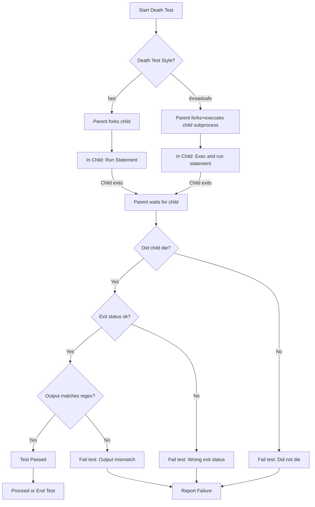

# Writing and Interpreting Death Tests

GoogleTest provides special support for *death tests*—tests that verify your code correctly responds to fatal failures by terminating the program as expected. This guide will walk you through how to write death tests safely and correctly, how they operate behind the scenes, platform-specific considerations, and how to interpret common failure scenarios.

---

## 1. Understanding Death Tests

### What Is a Death Test?
A *death test* verifies that a piece of code causes the program to terminate (crash, `abort()`, or call `_Exit()`) under specified faulty conditions. This is crucial for validating defensive checks such as `assert()` or fatal error handling paths that prevent undefined behavior or security vulnerabilities.

GoogleTest provides macros like `ASSERT_DEATH()` and `EXPECT_DEATH()` for writing these tests.

### Why and When Should You Use Death Tests?
- To ensure consistency checks and APIs that terminate the process when preconditions are violated behave as designed.
- To guard against silent failures that could otherwise corrupt program state.
- To test that your program outputs expected diagnostic messages on fatal errors.

### How Death Test Assertions Differ
- `ASSERT_DEATH(statement, regex)` causes fatal failure on mismatch and aborts the current test.
- `EXPECT_DEATH(statement, regex)` reports failure but continues the test.

Both check that:
1. The `statement` causes the program to terminate.
2. The termination matches expected criteria (exit code or signal).
3. The program outputs an error message matching the regex.

---

## 2. Writing Death Tests: Step-by-Step

<Steps>
<Step title="Write a Test That Causes Termination">
Use `ASSERT_DEATH` or `EXPECT_DEATH` to wrap the statement that should cause the program to terminate.

```cpp
ASSERT_DEATH(MyFunctionThatShouldAbort(), "fatal error message regex");
```

The regex can be a string, a compiled regex matcher, or any matcher that works against `stderr`. The match is performed on the error output from the program during termination.
</Step>

<Step title="Use Compound Statements If Needed">
Wrap multiple statements in braces `{ ... }` if the death test requires multiple lines of logic.

```cpp
ASSERT_DEATH({
  InitializeSystem();
  TriggerFatalCondition();
}, "expected error");
```
</Step>

<Step title="Ensure Assertions Are Used Inside Void Functions">
Remember that

- Fatal assertions (`ASSERT_*`) can only be used inside functions returning `void` because GoogleTest does not use exceptions.
- Using fatal assertions in constructors or destructors is not allowed and will cause compile errors.

Use helper void functions or test body functions for death tests.
</Step>

<Step title="Choose the Right Matcher for Output">
You can pass:

- A string interpreted as a regex
- A `::testing::Matcher<const std::string&>`

Example using gMock matchers:

```cpp
EXPECT_DEATH(DoSomething(), ::testing::HasSubstr("error"));
```
</Step>

<Step title="Name Death Test Suites Appropriately">
Name test suites that contain death tests with the `*DeathTest` suffix to ensure they run before non-death tests.

```cpp
TEST(FooDeathTest, TriggersAbort) {
  ASSERT_DEATH(Foo(), "expected error message");
}
```
</Step>

<Step title="Run Tests under Death-Test Safe Conditions">
- Avoid running death tests in multi-threaded environments that could interfere with forking or process spawning.
- If your environment does spawn threads early, consider using the "threadsafe" death test style.
</Step>

<Step title="Use Messages to Clarify Failures">
You can append streamed messages to death assertions for clarity:

```cpp
ASSERT_DEATH(DoSomethingBad(), "error regex") << "Failed on input X";
```
</Step>
</Steps>

---

## 3. How Death Tests Work Under the Hood

### Dual Processes: Parent and Child
When a death test runs, GoogleTest forks or clones the test process:

- The *child process* executes the statement expected to die.
- The *parent process* waits for the child and verifies:
  - The child terminated.
  - The exit code or signal satisfies expectations.
  - The child output matches the expected regex.

### Death Test Styles
GoogleTest supports two styles:

- **Fast:** The child runs the death test logic immediately after forking.
- **Threadsafe:** The child re-executes the test binary, running only the targeted death test.

The death test style can be configured via the flag `--gtest_death_test_style`.

### Communication via Pipes
The child process sends status back to the parent through pipes. The parent uses this to decide success or failure and report descriptive messages.

### Handling Return Statements and Exceptions
If the death test statement returns or throws an exception instead of terminating, the test fails with a helpful message.

---

## 4. Platform-Specific Considerations

### POSIX (Linux, macOS)
- Uses `fork()` (or `clone()` where applicable) and `_Exit()` in child.
- Supports both "fast" and "threadsafe" death tests.

### Windows
- Death tests use `CreateProcess()` to spawn child processes instead of forking.
- Always use threadsafe style.
- The child process inherits handles for communication.

### Fuchsia
- Uses `fdio_spawn_etc()` to create child processes.
- Manages special channels and sockets for communication.

---

## 5. Common Pitfalls and Best Practices

### Pitfalls
- **Non-void Functions:** Using `ASSERT_DEATH()` in non-void functions causes compiler errors.
- **Multiple Threads Running Outside Death Test:** May cause hangs or warnings.
- **Not Using Matchers Properly:** Passing invalid or unsupported regex leads to unexpected failures.
- **Side Effects in Death Tests:** Memory changes or state changes in a death test are local to the child process and not visible to the parent.

### Best Practices
- Write death tests in dedicated `*DeathTest` test suites.
- Prefer `ASSERT_DEATH()` for fatal conditions that should stop the current test, otherwise `EXPECT_DEATH()`.
- Keep death test statements simple or carefully manage side effects.
- Use gMock matchers with `EXPECT_DEATH()` for improved clarity.
- Avoid multiple death test assertions on the same line.
- Handle complicated predicates with predicate matchers rather than raw regex if possible.

---

## 6. Troubleshooting Death Tests

| Issue                                    | Diagnosis / Solution                                                    |
|------------------------------------------|-----------------------------------------------------------------------|
| Death test hangs or times out            | Check for multiple threads running in parent; use "threadsafe" death test style or move code inside death test statement.
| Death test fails even though expected message appears | Verify regex accurately matches output; simple regex subset is supported.
| Death tests do not capture log output    | Log output in the child appears only if the test fails; workaround: break test temporarily.
| Compiler errors on ASSERT_DEATH in non-void function | Refactor code to use a void-returning helper function or switch to EXPECT_DEATH.
| Side effects in death test not visible later | Remember death test runs in a separate process with separate memory.

---

## 7. Examples

### Basic Death Test Example

```cpp
TEST(FooDeathTest, ShouldAbortOnInvalidInput) {
  ASSERT_DEATH(Foo(-1), "Invalid input");
}
```

### Death Test with Compound Statement

```cpp
TEST(FooDeathTest, DiesWhenConditionMet) {
  ASSERT_DEATH({
    InitializeFoo();
    Foo(-1);
  }, "Invalid input");
}
```

### Using gMock Matcher with Death Test

```cpp
#include <gmock/gmock.h>
using ::testing::HasSubstr;

TEST(FooDeathTest, PrintsSpecificError) {
  EXPECT_DEATH(Bar(0), HasSubstr("must be > 0"));
}
```

---

## 8. Advanced Topics and References

- **Death Test Styles:** Set via `GTEST_FLAG_SET(death_test_style, "threadsafe")` for thread safety or `"fast"` for speed.
- **Testing Exception Throwing Code:** Use [Exception Assertions](../reference/assertions.md#exceptions) instead.
- **Combining Death Tests with Mocks:** Allow leaks in mocks if expecting exit codes, see [Advanced Testing Topics](advanced.md#death-tests).
- **Debugging Failures:** Check the detailed failure messages from the child process; use `ASSERT_DEATH()` with streamed messages for context.

---

## 9. Additional Resources

- [Assertions Reference](reference/assertions.md#death) — Detailed syntax and usage of death assertions.
- [Advanced GoogleTest Topics](advanced.md#death-tests) — Explains death tests in context of advanced features.
- [Matchers Reference](reference/matchers.md) — For powerful matching capabilities in ASSERT/EXPECT statements.
- [FAQ on Death Tests](faq.md#My-death-test-hangs-or-seg-faults-How-do-I-fix-it) — Common questions and solutions.

---

## Mermaid Diagram: Death Test Execution Flow



---