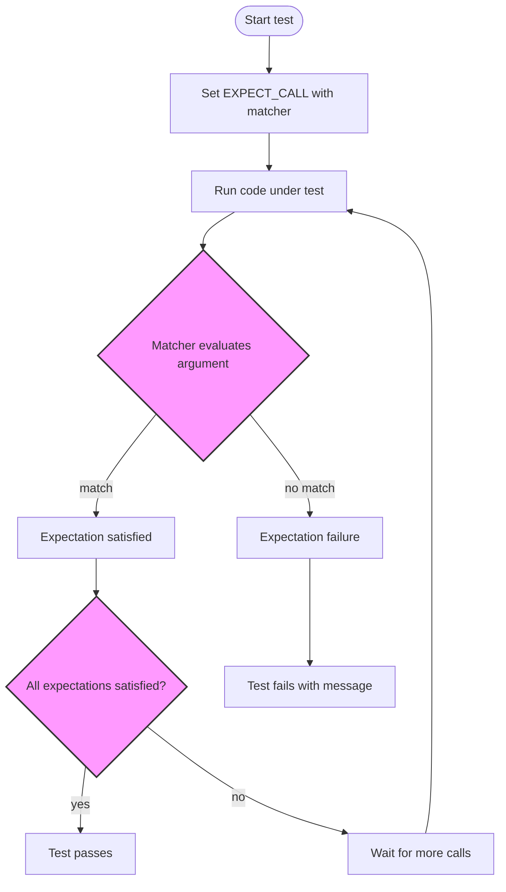

# Writing Custom Assertions and Matchers

Explore how to extend GoogleTest and GoogleMock with custom assertions and matchers tailored to your domain. This guide empowers you to create expressive, reusable test predicates for clearer and more maintainable validation of your C++ code.

---

## Workflow Overview

### What This Guide Helps You Accomplish
This guide shows you how to write custom assertions and matchers in GoogleTest and GoogleMock. You'll learn how to define matchers that can check complex conditions on your test data, recursively inspect objects, and tailor failure messages to be more informative. This enhances your tests’ expressiveness and clarity.

### Prerequisites
- Familiarity with GoogleTest and GoogleMock basics, including writing standard assertions and using built-in matchers.
- Understanding of C++11 or higher features (lambdas, templates).
- Basic knowledge of your tested objects’ interfaces and requirements for validation.

### Expected Outcome
- Master the creation of custom matchers and assertions using gMock macro utilities and manual interfaces.
- Write reusable, composable, and parameterized matchers that integrate seamlessly into `EXPECT_THAT` and `EXPECT_CALL`.
- Improve test readability and failure diagnostics by providing meaningful descriptions.

### Estimated Time Commitment
Completing this guide will take approximately 30–60 minutes, depending on familiarity.

### Difficulty Level
Intermediate: Requires existing experience with GoogleTest/GoogleMock and C++ templating.

---

## Step-by-Step Instructions

### 1. Understand the Role of Matchers and Assertions
Matchers are predicates used to verify values or arguments in tests. They help write expressive conditions beyond simple equality. For example, checking if a number is within a range or an object has specific properties.

### 2. Writing Simple Custom Matchers with `MATCHER` Macro
Use the `MATCHER` macro to define a concise matcher that takes one parameter named `arg`.

```cpp
MATCHER(IsDivisibleBy7, "") {
  return (arg % 7) == 0;
}
```

This matcher can be used to assert a value is divisible by 7:

```cpp
EXPECT_THAT(value, IsDivisibleBy7());
```

Tip: You can add more helpful failure messages by streaming to `result_listener`:

```cpp
MATCHER(IsDivisibleBy7, "") {
  if ((arg % 7) == 0) return true;

  *result_listener << "the remainder is " << (arg % 7);
  return false;
}
```

### 3. Writing Parameterized Matchers with `MATCHER_P` Macro
If you want your matcher to accept parameters, use `MATCHER_P`.

```cpp
MATCHER_P(HasAbsoluteValue, value, "") {
  return abs(arg) == value;
}
```

Used as:

```cpp
EXPECT_THAT(x, HasAbsoluteValue(10));
```

Customize failure descriptions by using the parameter in the description string, e.g.: 

```cpp
MATCHER_P(InClosedRange, low, hi, 
          absl::StrFormat("%s in range [%s, %s]", negation ? "isn't" : "is", low, hi)) {
  return low <= arg && arg <= hi;
}
```

### 4. Writing More Complex Custom Matchers
For advanced use cases, write matcher classes implementing:

- `MatchAndExplain(const T& arg, std::ostream* os)` – core matching logic and explanation
- `DescribeTo(std::ostream* os)` – positive expectation description
- `DescribeNegationTo(std::ostream* os)` – negative expectation description

Example:

```cpp
class BarPlusBazEqMatcher {
 public:
  using is_gtest_matcher = void;

  explicit BarPlusBazEqMatcher(int expected_sum)
      : expected_sum_(expected_sum) {}

  bool MatchAndExplain(const Foo& foo, std::ostream* os) const {
    return (foo.bar() + foo.baz()) == expected_sum_;
  }

  void DescribeTo(std::ostream* os) const {
    *os << "bar() + baz() equals " << expected_sum_;
  }

  void DescribeNegationTo(std::ostream* os) const {
    *os << "bar() + baz() does not equal " << expected_sum_;
  }

 private:
  const int expected_sum_;
};

::testing::Matcher<const Foo&> BarPlusBazEq(int expected_sum) {
  return BarPlusBazEqMatcher(expected_sum);
}
```

### 5. Writing Polymorphic Matchers
When a matcher should work with multiple related types (e.g., pointers of various types), make `MatchAndExplain` a template function.

Example:

```cpp
class NotNullMatcher {
 public:
  using is_gtest_matcher = void;

  template <typename T>
  bool MatchAndExplain(T* p, std::ostream*) const {
    return p != nullptr;
  }

  void DescribeTo(std::ostream* os) const { *os << "is not NULL"; }
  void DescribeNegationTo(std::ostream* os) const { *os << "is NULL"; }
};

PolymorphicMatcher<NotNullMatcher> NotNull() {
  return MakePolymorphicMatcher(NotNullMatcher());
}
```

### 6. Use Custom Assertions with `EXPECT_THAT`
Leverage your custom matcher in tests as follows:

```cpp
EXPECT_THAT(my_object, BarPlusBazEq(10));
```

### 7. Combining Matchers
Compose matchers with logical combinators like `AllOf()`, `AnyOf()`, `Not()`, etc., to validate objects on multiple predicates:

```cpp
EXPECT_THAT(value, AllOf(Ge(5), Le(10), Ne(7)));
```

### 8. Best Practices
- Keep matchers pure: avoid side effects.
- Provide descriptive failure messages to aid diagnostics.
- Use parameterized matchers to maximize reusability.
- When matching objects, prefer matching meaningful subfields or properties instead of entire objects.
- Use existing combinators to avoid reinventing logic.

---

## Examples & Code Samples

### Simple Matcher Example
```cpp
MATCHER(IsEven, "") {
  return arg % 2 == 0;
}

TEST(MyTest, UsesIsEvenMatcher) {
  int val = 4;
  EXPECT_THAT(val, IsEven());
}
```

### Parameterized Matcher Example
```cpp
MATCHER_P(IsWithinRange, range, "") {
  return (arg >= -range) && (arg <= range);
}

TEST(MyTest, UsesIsWithinRangeMatcher) {
  int val = 5;
  EXPECT_THAT(val, IsWithinRange(10));
}
```

### Composite Matcher Example
```cpp
using ::testing::AllOf;
using ::testing::Ge;
using ::testing::Le;

EXPECT_THAT(val, AllOf(Ge(10), Le(20)));
```

### Polymorphic Matcher Example
```cpp
class IsNullMatcher {
 public:
  using is_gtest_matcher = void;

  template <typename T>
  bool MatchAndExplain(T* p, std::ostream*) const {
    return p == nullptr;
  }
  void DescribeTo(std::ostream* os) const { *os << "is NULL"; }
  void DescribeNegationTo(std::ostream* os) const { *os << "is not NULL"; }
};

PolymorphicMatcher<IsNullMatcher> IsNull() {
  return MakePolymorphicMatcher(IsNullMatcher());
}

TEST(MyTest, UsesIsNull) {
  int* p = nullptr;
  EXPECT_THAT(p, IsNull());
}
```

### Using a Custom Matcher in `EXPECT_CALL`
```cpp
class MockFoo {
 public:
  MOCK_METHOD(bool, Bar, (int), ());
};

MATCHER_P(IsGreaterThan, val, "") {
  return arg > val;
}

TEST(MockTest, UsesCustomMatcher) {
  MockFoo mock;

  EXPECT_CALL(mock, Bar(IsGreaterThan(10)))
      .WillOnce(Return(true));

  EXPECT_TRUE(mock.Bar(15));  // Matches the custom matcher.
}
```

---

## Troubleshooting & Tips

### Common Issues
- **Custom matcher not being called:** Ensure your matcher is valid and that the tested value type matches expected.
- **Silent failures:** Provide additional diagnostic output in `MatchAndExplain`.
- **Overly strict matchers:** Simplify by using combinators or wildcard matchers `_`.
- **Compilation errors:** Check correct macro usage; ensure return and argument types are correctly specified.

### Best Practices
- Use `MATCHER` and `MATCHER_P` macros for fast prototyping.
- For complex logic, implement matcher classes with detailed explanations.
- Compose small matchers rather than monolithic ones.
- Provide user-friendly messages—even in negative expectations.

### Performance Considerations
- Keep matchers efficient and avoid heavy computations.
- Avoid side effects that might slow matcher evaluations.

### Alternative Approaches
- Use `Truly()` to wrap arbitrary predicates quickly:

```cpp
EXPECT_CALL(mock, Foo(Truly([](int n) { return n % 2 == 0; })));
```

- Use built-in matchers whenever possible.

---

## Next Steps & Related Content

### What's Next
- Explore setting expectations with custom matchers in `EXPECT_CALL` for mocks.
- Learn advanced mocking behaviors and actions with [gMock Cookbook](gmock_cook_book.md).
- Practice writing parameterized tests using [Parameterized and Typed Test Techniques](guides/advanced-testing/parameterized-tests).

### Related Guides
- [Mocking Dependencies with GoogleMock](guides/core-testing-workflows/using-mocks-in-tests)
- [Matchers: Verifying Arguments](api-reference/matchers-and-actions/argument-matchers)
- [Writing Your First Unit Test](guides/core-testing-workflows/writing-basic-tests)

### Resources
- [gMock for Dummies](docs/gmock_for_dummies.md): Beginner-friendly introduction
- [Matchers Reference](reference/matchers.md): Extensive list of built-in matchers
- [Mocking Reference](docs/reference/mocking.md): Full detail of mock features
- [GoogleTest Assertions Reference](docs/reference/assertions.md): For assertion macros

---

## Summary Diagram: Matcher Workflow



---

<Tip>
Creating custom assertions and matchers significantly improves the readability and maintainability of your tests. Always strive to write clear failure messages and to encapsulate complex validation logic into reusable components.
</Tip>

<Note>
Use the `MATCHER` macros for quick and simple matchers, and implement matcher classes when you need fine-grained control or polymorphic matching capabilities.
</Note>

<Warning>
Avoid side effects in matchers and assertions; nondeterministic behavior may lead to flaky tests.
</Warning>

