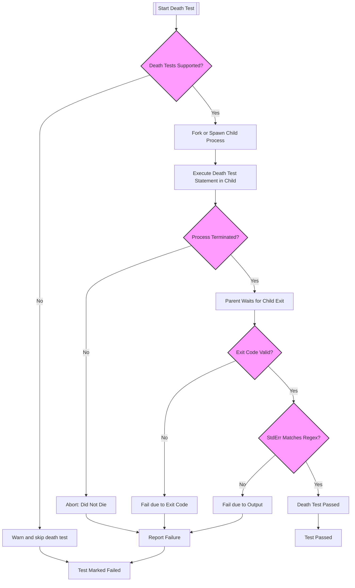

# Death and Exception Testing

Master the specialized approaches for verifying that your code exits, aborts, or throws exceptions under critical conditions. Walk through practical examples and recommended usage patterns to ensure your code's safety mechanisms work as intended.

---

## 1. Understanding Death and Exception Tests

### What Are Death Tests?
Death tests are designed to verify that your code correctly terminates the program (exits or aborts) in response to critical failures or assertion violations. These tests ensure that safety checks and precondition verifications within your codework as expected to prevent undefined or unsafe behavior.

> Note: Throwing an exception is not considered "death" in this context since exceptions can be caught and handled.

### When to Use Exception Testing
Use exception tests to verify that your code properly throws, or does not throw, exceptions under appropriate conditions. This guarantees your code’s error propagation and exceptional workflows are reliable.

---

## 2. Prerequisites and Setup

Before diving into death and exception testing, ensure the following:

- GoogleTest is installed and integrated into your build environment.
- Your project has exception support enabled if you plan to use exception assertions.
- Basic knowledge of writing tests using GoogleTest macros such as `TEST()`, `ASSERT_*()`, and `EXPECT_*()`.

Refer to [Installation & Build Integration](/getting_started/essentials_setup/installation) and [Your First Test Case](/getting_started/first_steps_usage/your_first_test) for setup instructions.

---

## 3. Writing Death Tests

### Using Death Test Macros
GoogleTest provides specific macros to write death tests, which check if a statement kills the process with expected output and exit code.

- `ASSERT_DEATH(statement, matcher)`
- `EXPECT_DEATH(statement, matcher)`

These macros run the `statement` in a separate process and verify:

1. The process terminates (not by throwing an exception).
2. The exit status satisfies the expected condition.
3. The stderr output matches a regex or matcher.

#### Example
```cpp
TEST(MyDeathTest, CrashOnInvalidInput) {
  ASSERT_DEATH({ Foo(-1); }, "Invalid input.*");
}

TEST(MyDeathTest, ExitWithSuccessCode) {
  EXPECT_EXIT(NormalExit(), ::testing::ExitedWithCode(0), "Success");
}

TEST(MyDeathTest, KilledBySignalKill) {
  EXPECT_EXIT(KillProcess(), ::testing::KilledBySignal(SIGKILL), "signal");
}
```

### Best Practices for Death Tests

- **Name your test suites ending with `DeathTest`** to indicate their special nature and ensure they run early to avoid multithreading issues.

- Avoid having multiple death tests on the same line to prevent compilation errors.

- Use **fast** death tests for quicker execution and **threadsafe** style for safer multithreaded environments.

```cpp
// Set death test style globally
GTEST_FLAG_SET(death_test_style, "threadsafe");
```

- Use `Mock::AllowLeak` for mock objects in death tests expecting specific exit codes to suppress leak detection errors.

### Death Tests and Threads

Death tests rely on forking or process spawning. Forking with multiple threads is unsafe and can cause hanging tests. GoogleTest detects multiple threads and warns you. To minimize issues:

- Run death tests in suites named `*DeathTest` to run them first.
- Use the `threadsafe` death test style flag.
- Ensure your test environment is as single-threaded as possible when running death tests.

---

## 4. Using Exception Assertions

If your build supports exceptions, GoogleTest provides macros to test exception throwing behavior in your code.

| Assertion Macro        | Verifies                                                       |
|-----------------------|----------------------------------------------------------------|
| `EXPECT_THROW(stmt, ex_type)` | The statement `stmt` throws an exception of type `ex_type`          |
| `EXPECT_ANY_THROW(stmt)`       | The statement `stmt` throws any exception                          |
| `EXPECT_NO_THROW(stmt)`        | The statement `stmt` does not throw any exception                  |

#### Example
```cpp
EXPECT_THROW({ Foo(0); }, std::runtime_error);
EXPECT_ANY_THROW({ Bar(); });
EXPECT_NO_THROW({ Baz(); });
```

### Exception Testing Caveats

- Exception support must be enabled in your compiler and build system.
- Use compound statements `{ ... }` when multiple lines need to be tested.

---

## 5. Practical Usage Patterns

### Combining Death and Exception Tests

Typically, your safety-critical code either aborts (death) or throws an exception in failure states. Test both behaviors where appropriate.

```cpp
TEST(MyTest, AbortsOnInvalidPointer) {
  ASSERT_DEATH(DoSomething(nullptr), "null pointer");
}

TEST(MyTest, ThrowsOnInvalidArgument) {
  EXPECT_THROW(DoSomething(-1), std::invalid_argument);
}
```

### Testing Exception Messages

You can verify that exception messages contain specific text by catching exceptions and applying assertions.

```cpp
try {
  Foo(-1);
  FAIL() << "Expected std::invalid_argument";
} catch (const std::invalid_argument& e) {
  EXPECT_THAT(std::string(e.what()), HasSubstr("negative value"));
} catch (...) {
  FAIL() << "Expected std::invalid_argument";
}
```

### Using Death Tests in Loops or Complex Conditions

You can use death tests inside loops or with compound statements by grouping them properly.

```cpp
for (int i = 0; i < 5; ++i) {
  EXPECT_DEATH({ ProcessRequest(i); }, "Invalid request");
}
```

---

## 6. Advanced Tips and Exception Handling in Death Tests

### Catching Exceptions in Death Tests

GoogleTest ensures exceptions thrown inside death tests are caught and reported as failures, never escaping to the parent test process.

Example:
```cpp
EXPECT_NONFATAL_FAILURE(EXPECT_DEATH(throw 1, ""), "threw an exception");
```

### Enable Exception-Throwing on Fatal Failures

If you want your fatal assertions (`ASSERT_*()`) to throw exceptions for better control flow during tests, install a listener:

```cpp
class ThrowListener : public testing::EmptyTestEventListener {
  void OnTestPartResult(const testing::TestPartResult& result) override {
    if (result.type() == testing::TestPartResult::kFatalFailure) {
      throw testing::AssertionException(result);
    }
  }
};

int main(int argc, char** argv) {
  testing::InitGoogleTest(&argc, argv);
  testing::UnitTest::GetInstance()->listeners().Append(new ThrowListener);
  return RUN_ALL_TESTS();
}
```

---

## 7. Common Pitfalls and Troubleshooting

### Death Test Fails to Detect Process Termination
- Ensure the death test statement actually terminates (calls abort/exit or triggers fatal signal).
- Check if the regex matcher correctly matches the stderr output.
- Avoid returning from the death test statement; `return` inside the statement causes failure.

### Multiple Threads Warning
- Death test fork() is unsafe with multiple threads, causing weird behavior.
- Use the `threadsafe` style or refactor the test to run without active threads.

### Mock Leak Detection in Death Tests
- Use `Mock::AllowLeak()` to suppress leak warnings for mocks in death tests expecting abnormal exit.

### Death Test Style Configuration
- The default style is "fast".
- Use `GTEST_FLAG_SET(death_test_style, "threadsafe")` to switch.

### Unsupported Platforms
- If death tests are not supported, GoogleTest issues warnings but attempts to compile.
- Use `EXPECT_DEATH_IF_SUPPORTED()` which runs only if death tests are available.

---

## 8. Verification and Validation

### Confirming Death Test Success
A death test passes if:

- The test statement kills or exits the child process.
- The exit code matches the given predicate (e.g., `ExitedWithCode(0)`).
- The stderr output matches the matcher (regex). 

If a death test fails, GoogleTest outputs detailed diagnostics about the failure mode:

- Failed to die
- Threw unexpected exception
- Illegal return
- Exit code mismatch
- Error message mismatch

### Example Failure Output
```none
Death test: Foo(-1)
    Result: failed to die.
 Error msg:
[  DEATH   ] 
```

---

## 9. Further Reading and Related Topics

- [Assertions Reference - Death Assertions](reference/assertions.md#death)
- [Exception Assertions](reference/assertions.md#exceptions)
- [Writing Your First Test](guides/getting-started/writing-your-first-test)
- [Mocking with GoogleMock](guides/advanced-testing/mocking-with-googlemock)
- [Common Issues and Troubleshooting](getting_started/first_steps_usage/common_issues)

---

## Summary Diagram



---

<Note>
This page covers only death and exception testing with GoogleTest. For foundational knowledge, please refer to Getting Started guides and the assertions reference.
</Note>

---

### Callouts
<Tip>
When working with death tests, always prefer the "threadsafe" style in multi-threaded programs to avoid hangs or nondeterministic failures.
</Tip>
<Warning>
Avoid putting multiple death test macros on the same line — it will cause compilation errors.
</Warning>
<Note>
If you're testing code that throws exceptions, ensure your build environment supports exceptions and use the provided exception assertions macros.
</Note>

---

### Practical Example: Writing a Death Test

```cpp
TEST(MyClassDeathTest, AbortsOnNullInput) {
  // Verify that this function aborts when passed a null pointer,
  // with an error message containing "null pointer".
  ASSERT_DEATH({ my_object.DoWork(nullptr); }, "null pointer");
}
```

### Practical Example: Verifying Exception Throwing

```cpp
TEST(MyClassExceptionTest, ThrowsInvalidArgument) {
  EXPECT_THROW({ my_object.SetValue(-42); }, std::invalid_argument);
}
```

---

## 10. Summary
The Death and Exception Testing page guides you through writing tests that confirm your application correctly aborts or throws exceptions under erroneous conditions. It covers the use of GoogleTest's death test macros (`ASSERT_DEATH`, `EXPECT_DEATH`, `EXPECT_EXIT`) to validate process termination alongside exception assertions (`EXPECT_THROW`, etc.) for exception handling verification.

This documentation includes practical patterns, troubleshooting advice, and warnings about death tests interacting with multi-threaded environments to help you write reliable and maintainable tests.

By mastering these techniques, you ensure your code fails fast and loudly when invariants are violated, increasing safety and robustness.

---