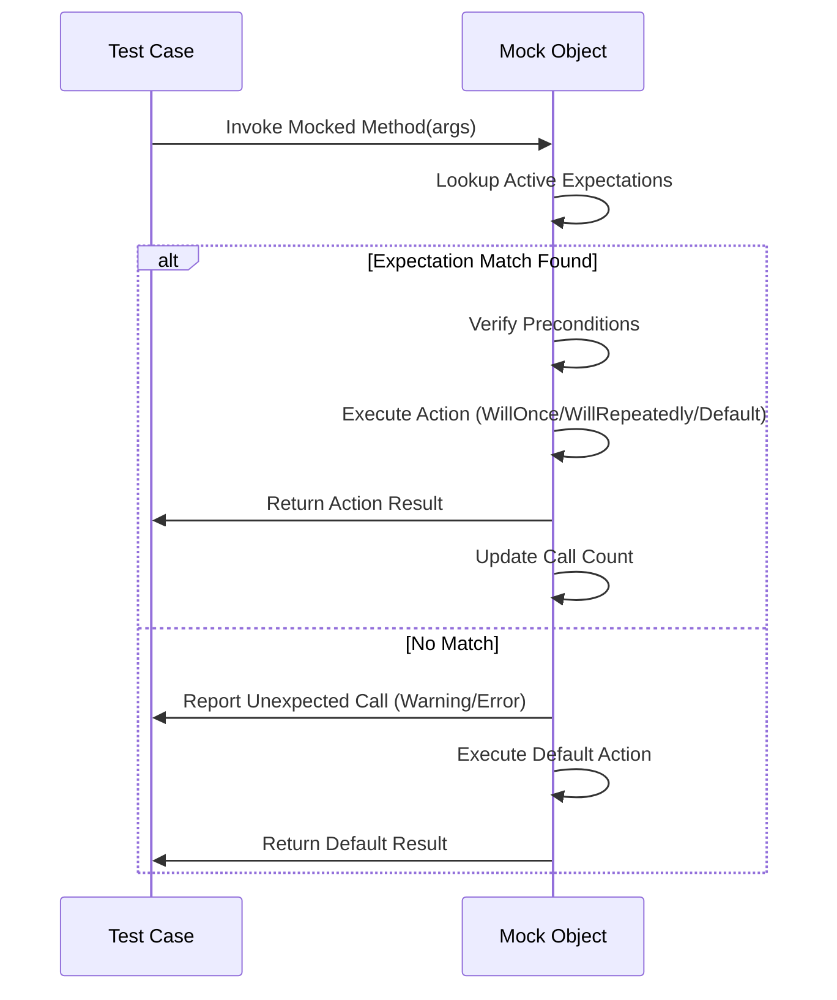

# Mocking with GoogleMock

A hands-on guide to creating, configuring, and using mock objects in your tests. Learn to simulate dependencies, set expectations, specify behaviors, and make your tests more robust and isolated.

---

## Workflow Overview

### What You Will Do
This guide helps you master the use of GoogleMock (`gMock`) to create mock objects for your C++ tests. You'll learn how to define mock classes, set up expectations, specify default behaviors, and handle mock interactions to isolate units and test their behavior comprehensively.

### Prerequisites
- Familiarity with C++ and basic unit testing concepts.
- GoogleTest and GoogleMock installed and configured in your project.
- Basic knowledge of mocking principles.

### Expected Outcome
By following this guide, you will be able to:
- Define mock classes with mocked methods using the `MOCK_METHOD` macro.
- Understand and use `EXPECT_CALL` and `ON_CALL` to set expectations and default actions.
- Customize mock behavior including argument matchers, actions, call order, and call count.
- Interpret gMock’s test output regarding expected, unexpected, and uninteresting calls.

### Time Estimate
Approximately 30-45 minutes to become proficient with mock definition and basic usage.

### Difficulty Level
Intermediate: Requires basic knowledge of unit testing and C++.

---

## Step-by-Step Instructions

### 1. Define Your Mock Class
Start by creating a mock class derived from the interface or class to be mocked. Use the `MOCK_METHOD` macro to mock virtual methods.

Example:
```cpp
#include <gmock/gmock.h>

class Turtle {
 public:
  virtual ~Turtle() {}
  virtual void PenUp() = 0;
  virtual void PenDown() = 0;
  virtual void Forward(int distance) = 0;
  virtual int GetX() const = 0;
};

class MockTurtle : public Turtle {
 public:
  MOCK_METHOD(void, PenUp, (), (override));
  MOCK_METHOD(void, PenDown, (), (override));
  MOCK_METHOD(void, Forward, (int distance), (override));
  MOCK_METHOD(int, GetX, (), (const, override));
};
```

> **Tip:** Always place `MOCK_METHOD` calls in the `public:` section regardless of the base class method's access specifier.

---

### 2. Set Default Actions with `ON_CALL`
Use `ON_CALL` to specify how the mock should behave by default when methods are called. This does not assert that the call *must* occur but allows controlling the return values or side effects.

Example:
```cpp
MockTurtle turtle;
ON_CALL(turtle, GetX()).WillByDefault(testing::Return(0));
```

> **Best Practice:** Define common default behaviors in your test fixture's setup phase.

---

### 3. Specify Expectations with `EXPECT_CALL`
Use `EXPECT_CALL` to declare that specific calls are required, including the number of calls, argument values, and expected call order.

Example:
```cpp
EXPECT_CALL(turtle, PenDown()).Times(1);
EXPECT_CALL(turtle, Forward(testing::Ge(100))).WillOnce(testing::Return());
```

---

### 4. Use Matchers for Argument Checks
Matchers define which arguments you expect in calls. Use `_` to match anything, or specific matchers like `Eq()`, `Ge()`, `NotNull()`, `Pointee()`, etc.

Example:
```cpp
EXPECT_CALL(turtle, Forward(testing::Ge(10)));  // At least 10 units forward
EXPECT_CALL(turtle, GoTo(50, _));              // Exactly 50 on x, any y
```

---

### 5. Control Call Counts with `Times`
The `.Times()` clause controls how many times a call is expected.

Common cardinalities:
- `Times(1)` or omit `.Times()` to expect exactly once.
- `Times(testing::AnyNumber())` to allow any number of calls.
- `Times(testing::AtLeast(n))` to expect at least n calls.

Example:
```cpp
EXPECT_CALL(turtle, PenUp()).Times(testing::AnyNumber());
```

---

### 6. Sequence Calls with `InSequence` and `After`
To ensure calls happen in a specific order, use
- An `InSequence` scope for strict linear order.
- The `.After()` clause for partial order constraints.

Example:
```cpp
{
  testing::InSequence seq;
  EXPECT_CALL(turtle, PenDown());
  EXPECT_CALL(turtle, Forward(10));
  EXPECT_CALL(turtle, PenUp());
}
```

Or with `After`:
```cpp
testing::Expectation exp1 = EXPECT_CALL(turtle, PenDown());
EXPECT_CALL(turtle, Forward(10)).After(exp1);
```

---

### 7. Define Return Values and Behaviors with Actions
Attach actions to expectations to specify what happens when the method is called.

- Use `Return(value)` to return a specific value.
- Use `ReturnRef(obj)` for returning references.
- Use lambdas or `Invoke` for custom behavior.

Example:
```cpp
EXPECT_CALL(turtle, GetX()).WillOnce(testing::Return(100));
EXPECT_CALL(turtle, Forward(testing::_))
    .WillRepeatedly([](int distance) { /* custom logic */ });
```

---

### 8. Handle Uninteresting Calls
By default, calls to mock methods without expectations emit warnings:
- Use `NiceMock<T>` to suppress warnings on uninteresting calls.
- Use `StrictMock<T>` to treat uninteresting calls as errors.

Example:
```cpp
NiceMock<MockTurtle> nice_turtle;
StrictMock<MockTurtle> strict_turtle;
```

---

## Practical Examples

### Creating a Simple Mock and Expecting Calls
```cpp
class MockFoo {
 public:
  MOCK_METHOD(bool, Bar, (int x), ());
};

TEST(FooTest, SimpleExpect) {
  MockFoo mock;
  EXPECT_CALL(mock, Bar(5)).WillOnce(testing::Return(true));

  bool result = mock.Bar(5);
  EXPECT_TRUE(result);
}
```

### Using Default Actions
```cpp
MockFoo mock;
ON_CALL(mock, Bar(testing::_)).WillByDefault(testing::Return(false));
EXPECT_CALL(mock, Bar(10))
    .Times(2)
    .WillRepeatedly(testing::Return(true));
```

### Sequencing Calls
```cpp
{
  testing::InSequence s;

  EXPECT_CALL(mock, Bar(1));
  EXPECT_CALL(mock, Bar(2));
}

mock.Bar(1);  // OK
mock.Bar(2);  // OK
```

### Advanced Matching with `.With()`
```cpp
EXPECT_CALL(mock, Foo(testing::_, testing::_))
    .With(testing::Lt())  // Checks if first arg < second arg
    .WillOnce(testing::Return("valid"));
```

---

## Troubleshooting & Tips

### Common Issues
- **Unexpected calls:** Occur when calls do not match any `EXPECT_CALL`. Solve by adjusting your expectations or adding more general ones.
- **Warnings on uninteresting calls:** Use `NiceMock` to suppress if intentional.
- **Excessive calls:** If calls exceed `.Times()` count, test will fail.

### Best Practices
- Use `ON_CALL` for default mock behavior; use `EXPECT_CALL` to assert calls.
- Avoid over-specifying expectations to reduce brittle tests.
- For methods with complex argument lists, wrap argument types with parentheses, or create type aliases.

### Verbosity Control
- Use `--gmock_verbose=info` to log detailed call traces.
- Use `--gmock_verbose=warning` to see warnings about uninteresting calls.
- Use `--gmock_verbose=error` to suppress everything except errors.

### Tips for Robust Tests
- Use sequences or `.After()` to define call order explicitly.
- Apply `.RetiresOnSaturation()` for sticky expectations when appropriate.
- Use `Mock::VerifyAndClearExpectations(&mock_obj)` to enforce early verification.
- Use `Mock::AllowLeak(&mock_obj)` if mock lifetime is managed outside and leaks occur.

---

## Next Steps & Related Content

- Dive into [gMock Cookbook](https://google.github.io/googletest/gmock_cook_book.html) for recipes on delegation, actions, side effects, and more.
- Read the [gMock Cheat Sheet](https://google.github.io/googletest/gmock_cheat_sheet.html) for quick syntax reference.
- Explore [Matchers Reference](https://google.github.io/googletest/reference/matchers.html) to customize argument matching.
- Learn about [Custom Matchers and Assertions](guides/advanced-testing/custom-matchers-and-assertions) for fine-grained test control.
- Review [Using Mocks in Tests](guides/getting-started/writing-your-first-test#using-mocks-in-tests) for integrating mocks in your unit tests.

---

## Summary Diagram of Mock Call Workflow


---

# Additional References

- [GoogleMock Core Concepts](https://google.github.io/googletest/reference/mocking.html)
- [gMock for Dummies](https://google.github.io/googletest/gmock_for_dummies.html)
- [Legacy gMock FAQ](https://google.github.io/googletest/gmock_faq.html)
- [Source on GitHub](https://github.com/google/googletest/tree/main/googlemock)

---

This guide focuses specifically on Mocking with GoogleMock, equipping you with actionable knowledge to create effective mocks, specify their behavior, and interpret test outcomes confidently.