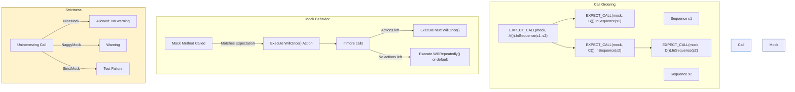

# Advanced Mocking Techniques

Master complex mocking scenarios with GoogleMock (gMock) to write precise, expressive, and maintainable tests. This guide deep-dives into advanced topics such as sequencing, custom actions, timeout handling, argument matching, and controlling mock behavior effectively.

---

## 1. Controlling Call Order and Sequence

### Understanding Sequences and Partial Ordering

mocks often require specifying the order in which methods are expected to be called.

- **`Sequence` Objects:** A `Sequence` represents a linear order of calls. Expectations added to the same `Sequence` are expected in the order declared.

- **Using `InSequence`:** The `InSequence` RAII object automatically adds all expectations within its scope into an anonymous sequence, enforcing strict call order.

- **Multiple Sequences for Partial Ordering:** You can assign expectations to multiple `Sequence` objects to specify partial orders, where some calls can interleave.

```cpp
Sequence s1, s2;
EXPECT_CALL(mock, A()).InSequence(s1, s2);
EXPECT_CALL(mock, B()).InSequence(s1);
EXPECT_CALL(mock, C()).InSequence(s2);
EXPECT_CALL(mock, D()).InSequence(s2);
```

This means:
- `A()` must happen before `B()` and `C()`.
- `C()` must happen before `D()`.
- Calls are otherwise unordered.

### Using the `.After()` Clause

For more fine-grained control, use `.After()` to specify explicit call dependencies on individual expectations or expectation sets.

```cpp
Expectation e1 = EXPECT_CALL(mock, A());
EXPECT_CALL(mock, B()).After(e1);
```

This states that `B()` must be called only after `A()`.

---

## 2. Customizing Mock Behavior with Actions

### Specifying Multiple Actions Sequentially

You can specify a sequence of actions for successive calls using `WillOnce()` multiple times, followed by an optional `WillRepeatedly()` for all later calls.

```cpp
EXPECT_CALL(mock, Foo())
    .WillOnce(Return(1))
    .WillOnce(Return(2))
    .WillRepeatedly(Return(3));
```

- The first call returns `1`.
- The second returns `2`.
- All subsequent calls return `3`.

### Combining Actions Using `DoAll`

To perform multiple operations for a single call, chain actions with `DoAll`. The last action's return value is used.

```cpp
EXPECT_CALL(mock, Bar(_, _))
    .WillOnce(DoAll(SetArgPointee<1>(42), Return(true)));
```

Here, the second argument (index 1) is set to 42, and the call returns `true`.

### Using Lambdas and Functors

Actions can be lambdas or callable objects with signatures compatible with the mock method.

```cpp
EXPECT_CALL(mock, DoSomething())
    .WillOnce([] { DoCleanup(); });
EXPECT_CALL(mock, Compute(_))
    .WillRepeatedly([](int x) { return x * 2; });
```

### Ignoring Action Return Values

`IgnoreResult()` lets you convert an action's return type to `void`, useful for chaining or use with void-return functions.

```cpp
EXPECT_CALL(mock, Log(_))
    .WillOnce(IgnoreResult(Invoke(&Logger::Log)));  // Can ignore string return
```

---

## 3. Handling Move-Only Types

Support was added to mock methods that accept or return move-only types such as `std::unique_ptr<T>`.

```cpp
MOCK_METHOD(std::unique_ptr<Foo>, MakeFoo, (int), (override));
```

- Use lambdas or callable objects if you need to create fresh move-only objects each call.

- Beware: `Return(std::move(obj))` can only be used once, as the object is moved-from after first call.

Legacy workaround:

- Delegate to mock methods taking raw pointers.

---

## 4. Specialized Argument Matching

### Matching Multiple Arguments as a Whole with `.With()`

Use `.With()` to supply a matcher over all arguments as a tuple.

```cpp
EXPECT_CALL(mock, SetPosition(_, _))
    .With(Lt());  // First argument < second argument
```

The matcher must be of type `Matcher<std::tuple<A1, ..., An>>`.

### Using `Args<>` and `AllArgs`

- `Args<0,1>(m)` matches the first two arguments combined as a tuple to matcher `m`.

- `AllArgs(m)` is equivalent to `With(m)`.

### Using Pointer and Reference Matchers

- `Pointee(m)` matches pointer arguments whose pointee value matches matcher `m`.

- `Field(&Class::member, m)` matches objects whose member satisfies matcher `m`.

Example:

```cpp
EXPECT_CALL(mock, Foo(Pointee(Ge(3))));
EXPECT_CALL(mock, Bar(Field(&MyClass::value, Eq(5))));
```

---

## 5. Controlling Uninteresting Calls: Nice, Naggy, and Strict Mocks

### Understanding Uninteresting Calls

An uninteresting call is a call to a mock method for which no `EXPECT_CALL` is set. By default, GoogleMock treats mocks as **naggy**, which means:

- It allows the call to go through.
- Prints a warning.

### Using `NiceMock` to Suppress Warnings

`NiceMock<T>` is a wrapper around your mock class which suppresses warnings on uninteresting calls.

```cpp
NiceMock<MockFoo> nice_mock;
EXPECT_CALL(nice_mock, DoSomething());
```

`NiceMock`:
- Allows uninteresting calls silently.
- Inherits constructors of original mock class.

### Using `StrictMock` to Fail on Uninteresting Calls

`StrictMock<T>` makes uninteresting calls **fail the test**.

```cpp
StrictMock<MockFoo> strict_mock;
EXPECT_CALL(strict_mock, DoSomething());

strict_mock.SomeOtherMethod();  // Fails: uninteresting call
```

### Important Notes

- These wrappers only affect **uninteresting** calls, not unexpected calls that do not match any expectation.
- `NiceMock`, `NaggyMock`, and `StrictMock` cannot be nested.
- They work only for mock methods defined by `MOCK_METHOD` directly in the mock class.

---

## 6. Using `Mock::VerifyAndClearExpectations`

Sometimes it is important to verify expectations earlier than mock destruction.

```cpp
ASSERT_TRUE(Mock::VerifyAndClearExpectations(&mock_obj));
```

- Explicitly verifies and clears expectations.
- Returns `false` if any expectations are unsatisfied.
- Avoid setting new expectations on the mock after this call.

### Also Using `Mock::AllowLeak`

Suppose a mock object is deliberately leaked (e.g., test infrastructure owns it), you can suppress warnings:

```cpp
Mock::AllowLeak(mock_ptr);
```

---

## 7. Timeout and Asynchronous Testing Support

Although not built-in, you can coordinate asynchronous behavior using actions along with synchronization primitives like condition variables or `Notification` objects.

Example to wait for async call completion:

```cpp
absl::Notification done;
EXPECT_CALL(mock, AsyncMethod())
    .WillOnce([&done] { done.Notify(); });

// Trigger async call
// Wait until the async method is called
done.WaitForNotification();
```

---

## 8. Debugging and Verbosity

### Using `--gmock_verbose`

Control how much gMock prints:

- `info` - prints all info and warnings with stack traces.
- `warning` - prints warnings and errors without stack traces (default).
- `error` - only prints errors.

You can set this via command line or inside tests (`::testing::FLAGS_gmock_verbose = "error";`).

### Interpreting Mock Call Failure Messages

- Failure messages include expected vs actual calls, argument mismatches, and call counts.
- Use `--gmock_verbose=info` to trace function calls and matched expectations.

---

## 9. Practical Tips and Common Pitfalls

- Always set expectations (`EXPECT_CALL`) before exercising mocks.
- Avoid mixing calls to expectations and mock methods; undefined behavior results.
- Use `RetiresOnSaturation()` to retire an expectation once it is saturated -- useful for sequences or ordered calls.
- For overloaded methods, use `Const()` and explicit matcher type casts to disambiguate.
- To mock a destructor, add a mock method (e.g., `Die()`) that's invoked in the destructor, and set expectations on it.


---

## 10. References and Related Topics

- [Mocking Reference](../reference/mocking.md) for detailed API.
- [gMock for Dummies](../gmock_for_dummies.md) for getting started.
- [gMock Cookbook](../gmock_cook_book.md) for recipes.
- [Using Matchers](../guides/core-test-workflows/using-matchers.mdx) for flexible arguments.
- [Basic Mocking with GoogleMock](../getting-started/configuration-and-first-use/using-googlemock-basics.mdx) for foundational usage.

---

# Diagrams



---

<Tip>
Use `NiceMock` to suppress noisy warnings on uninteresting calls during test development. Switch to `StrictMock` only when you want to enforce strict interaction contracts.
</Tip>

<Note>
Wrap multiple ordered expectations within an `InSequence` scope or assign them to `Sequence` objects for precise call ordering control.
</Note>

<Warning>
Do not set expectations after mock methods have been called - behavior is undefined and can cause silent test failures.
</Warning>
