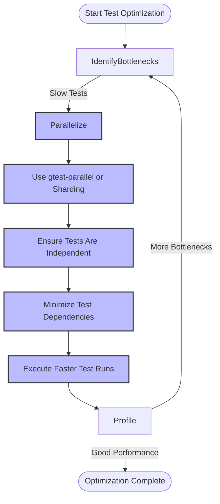

# Optimizing Test Performance

## Overview

This guide teaches you practical techniques to speed up your test suites in GoogleTest and GoogleMock. You'll learn how to leverage parallel test execution, minimize test dependencies, and adopt best practices tailored to large C++ projects. Additionally, it introduces integration with external tools like `gtest-parallel` to further accelerate test runs.

## Prerequisites
- Familiarity with writing and running tests using GoogleTest and GoogleMock.
- A working test suite ready for optimization.
- Basic knowledge of your build system (CMake, Bazel, or others).

## Expected Outcome
By following this guide, your tests will run faster and scale efficiently, making your developer workflow more productive and continuous integration pipelines snappier.

## Estimated Time
About 30 to 60 minutes depending on your current test suite complexity and integration setup.

## Difficulty Level
Intermediate

---

## 1. Understanding Test Performance Bottlenecks

Before applying optimizations, understand the common causes of slow tests:
- Sequential test execution despite independent tests.
- Heavy or unnecessary dependencies causing test setup overhead.
- Bloated test fixtures that delay initialization.

Optimizing test performance typically involves reducing test run time by increasing parallelism and minimizing shared state or expensive setup.

---

## 2. Running Tests in Parallel

GoogleTest supports running tests in parallel processes or threads but does not internally provide this feature. External tools like `gtest-parallel` are popular for this.

### Using `gtest-parallel`

`gtest-parallel` is a Python script that runs GoogleTest tests concurrently:

- It discovers tests automatically, runs them in parallel processes, and aggregates the results.
- It is compatible with most GoogleTest test executables without modification.

### Steps to Use `gtest-parallel`

1. **Install Python 3** (if not installed).
2. **Download `gtest-parallel`** from its official repository or your organization’s trusted source.
3. **Run your test executable via `gtest-parallel`**:
   ```bash
   ./gtest-parallel path/to/your_test_binary --other_test_flags
   ```
4. **Configure concurrency**:
   - Use the `-j N` flag to specify the number of parallel jobs (default is the number of CPU cores).
   - Adjust based on your machine's CPU and I/O capabilities.

5. **Review output**:
   - `gtest-parallel` shows aggregated test results as if tests ran sequentially.

### Best Practices for Parallel Tests

- Make sure tests do not rely on shared mutable state or external resources that are not thread-safe.
- Tests should be independent and reproducible in any order.
- Isolate environment and temp files used by tests.
- Use GoogleTest's `--gtest_repeat` and sharding flags (`GTEST_TOTAL_SHARDS`, `GTEST_SHARD_INDEX`) when appropriate.

<Tip>
Parallelism greatly speeds up test runs but requires careful test isolation. Invest time in making your tests independent and side-effect free to maximize gains.
</Tip>

---

## 3. Minimizing Test Dependencies

Tests frequently slow down due to expensive setup or heavy dependencies.

### Strategies

- **Trim test fixtures**: Use lightweight setups by initializing only what is necessary per test.
- **Prefer value types over pointers when possible** to avoid complex lifecycles.
- **Use mocks** for dependencies instead of the real implementations when overhead is high.
- **Isolate tests by module**: Group tests by functionality to separate slow tests and run them less frequently.

Example:
```cpp
class MyTest : public ::testing::Test {
 protected:
  void SetUp() override {
    // Only set up resources needed by most tests
  }
};

TEST_F(MyTest, LightweightTest) {
  // This test runs fast
}

TEST_F(MyTest, HeavyTest) {
  // Potentially expensive setup customized here
}
```

### Test Setup Best Practices

- Share expensive setup across tests using `SetUpTestSuite()` and `TearDownTestSuite()`.
- Use `ON_CALL` wisely to set default mock behaviors to avoid redundant setup in each test.

---

## 4. Optimizing Large Projects and Test Suites

When projects grow large, consider:

- **Test Sharding**: Split test execution into subsets (shards) to distribute across multiple machines or processes.
- **Incremental Testing**: Run only affected tests based on changed modules or code.
- **Selective Test Execution**: Use filtering flags like `--gtest_filter` to run targetted tests.

Configure test sharding by setting environment variables:
```bash
export GTEST_TOTAL_SHARDS=4
export GTEST_SHARD_INDEX=1  # Run for shard 1 (0-based)
./your_test_binary
```

Note: Each shard runs a unique subset of tests; all shards combined run the entire suite.

---

## 5. Best Practices Summary

- Write tests to be independent and side-effect free.
- Mock expensive or non-deterministic dependencies.
- Use sequences and `RetiresOnSaturation()` in EXPECT_CALL to avoid sticky expectations that slow tests.
- Prefer `ON_CALL` for default mock behaviors and `EXPECT_CALL` for actual expectations.
- Profile tests to identify bottlenecks.
- Run slow tests less frequently or isolate them.

---

## 6. Additional Tips and Common Pitfalls

### Tips
- Enable GoogleTest's XML or JSON output reporting for CI tools to measure test durations.
- Use `--gtest_shuffle` to detect ordering dependencies.
- Combine parallel execution tools with well-structured test suites to maximize speed.

### Common Pitfalls
- Tests failing intermittently due to shared state in parallel runs.
- Increasing parallelism beyond hardware limits causing resource contention.
- Forgetting to ensure mocks and stubs are thread-safe when tests run concurrently.

<Warning>
If your tests share resources without proper synchronization, parallel runs can cause flaky failures and data corruption.
</Warning>

---

## 7. Related Tools and Integrations

- [gtest-parallel](https://github.com/google/gtest-parallel): Python tool for running tests in parallel across processes.
- Integration with CI systems (e.g., Jenkins, GitLab CI) using GoogleTest test reports.
- Use with external build tools (Bazel, CMake) that support test parallelism.

---

## 8. Summary Flow



---

## 9. Troubleshooting & FAQ

### Q: My tests fail intermittently when run in parallel. What should I do?
A: Check for shared state or external resource contention. Make sure tests clean up properly and avoid dependencies on external mutable state.

### Q: How do I suppress warnings about uninteresting mock calls?
A: Use `NiceMock` to suppress warnings or explicitly add catch-all `EXPECT_CALL` with `.Times(AnyNumber())` where appropriate.

### Q: Can I run parameterized tests in parallel?
A: Yes. Make sure tests have no side effects. Use test sharding environment variables or external parallel runners.

### Q: How can I measure which tests are slow?
A: Enable XML or JSON output and analyze the durations. Test runner integrations and CI dashboards can visualize this.

---

## 10. Next Steps

- Review the [Test Runner Integration & CI guide](https://github.com/google/googletest/tree/main/docs/guides/advanced-usage-and-integration/test-runner-integration-and-ci.md) to automate optimized tests.
- Learn advanced mocking techniques to reduce dependencies using [Test Doubles with GoogleMock](https://github.com/google/googletest/tree/main/docs/guides/core-testing-workflows/test-doubles-with-googlemock.md).
- Explore [Writing Custom Matchers and Actions](https://github.com/google/googletest/tree/main/docs/guides/advanced-usage-and-integration/writing-custom-matchers-and-actions.md) to fine-tune tests.

---