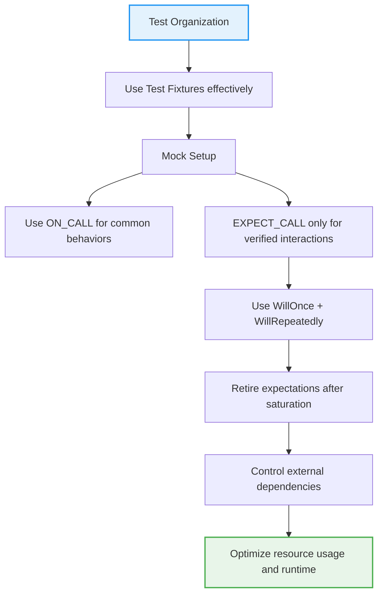

# Test Performance and Best Practices

## Overview

This guide provides concrete recommendations for writing tests that are fast, reliable, and maintainable. It focuses specifically on improving test performance through thoughtful test organization, avoiding flaky tests, and optimizing test runtime and resource usage in larger C++ codebases using GoogleMock (gMock).

By following these best practices, you ensure your test suite grows sustainably, remains a trusted safety net, and accelerates your development workflow.

## Prerequisites

- Familiarity with writing tests using GoogleTest and GoogleMock.
- Understanding of basic mocking concepts, including `MOCK_METHOD`, `EXPECT_CALL`, and `ON_CALL`.
- A working C++ test environment set up with GoogleTest and GoogleMock.

## Outcomes

After applying the recommendations in this guide, you will be able to:

- Organize your tests and mocks to minimize test execution time.
- Avoid common causes of flaky tests, enhancing reliability.
- Optimize resource usage, supporting efficient testing in large codebases.
- Write tests that are easier to maintain and less prone to brittle failures.

## Time Estimate

Implementation of these practices will vary in effort depending on the size of your codebase and existing test suite but expect to invest initial focused sessions followed by incremental adherence as your project evolves.

## Difficulty Level

Intermediate to Advanced

---

## Best Practices for Test Performance

### 1. Organizing Tests to Reduce Redundancy

- **Group Related Tests:** Structure test fixtures and test suites logically to share setup and teardown overhead.
- **Use Test Fixtures Effectively:** Initialize expensive resources only once per fixture when possible.
- **Limit Scope of Mock Objects:** Create mocks only in necessary tests to avoid unnecessary mocking overhead.

### 2. Avoiding Flaky Tests

- **Minimize Dependence on External Resources:** Prefer mocks or fakes instead of actual I/O, network, or database during unit testing.
- **Control Non-determinism:** Use fixed seeds for random number generators and control time-dependent behavior.
- **Use `NiceMock` and `StrictMock` Appropriately:** Use `NiceMock` to suppress warnings about uninteresting calls and `StrictMock` sparingly, to catch unexpected interactions without making tests brittle.
- **Set Expectations Carefully:** Use `ON_CALL` versus `EXPECT_CALL` appropriately to avoid over-constraining tests.

### 3. Optimizing Test Runtime

- **Prefer `WillOnce` Then `WillRepeatedly`:** For mock behaviors, specify a sequence of actions to cover typical cases and then a repeated default.
- **Retire Saturated Expectations:** Use `.RetiresOnSaturation()` on expectations that should not remain active once fulfilled to speed up matching.
- **Avoid Excessive Mock Methods:** Only mock functions needed for test validation.
- **Reuse Mocks and Test Data When Possible:** Avoid repetitive constructions and destructions in tight test loops.

### 4. Resource Usage Considerations

- **Avoid Heavy Initialization:** Defer or mock out costly startup routines.
- **Limit Threads in Tests:** Run tests in a controlled single-threaded context unless explicitly testing concurrency.
- **Use Smart Pointers and RAII:** Manage lifetime efficiently to reduce leaks and unnecessary memory use.

---

## Common Pitfalls and How to Avoid Them

### Over-Specifying Expectations

Write expectations that verify contracts, not implementation details, to reduce brittle failures when refactoring.

### Ignoring Default Actions

Use `ON_CALL` to specify expected behaviors without forcing strict verification when calls are incidental.

### Not Using Sequences for Ordered Calls

Use `InSequence` or `.After()` clauses only when call order matters; otherwise, avoid to retain test flexibility.

### Returning Move-Only Types

Set mock expectations for methods that return move-only types like `std::unique_ptr` using lambdas to correctly return new instances.

Example:

```cpp
EXPECT_CALL(mock_buzzer, MakeBuzz(_))
    .WillRepeatedly([](StringPiece) {
        return std::make_unique<Buzz>(AccessLevel::kInternal);
    });
```

---

## Practical Step-By-Step Recommendations

<Steps>
<Step title="Step 1: Identify and Group Related Tests">
Organize tests into logical groupings and use test fixtures to share setup and teardown costs. This reduces redundant resource allocation and speeds execution.
</Step>
<Step title="Step 2: Use ON_CALL for Default Mock Behavior">
Define the common behavior of mocks with `ON_CALL` to avoid excessive use of strict expectations, which can slow tests and make them brittle.
</Step>
<Step title="Step 3: Set Precise EXPECT_CALL only when Verifying Interactions">
Use `EXPECT_CALL` sparingly, focusing on interactions your test must verify. Use matchers like `_` (wildcards) to avoid over-specifying arguments.
</Step>
<Step title="Step 4: Use WillOnce and WillRepeatedly Correctly">
For actions, specify the sequence of `WillOnce()` behaviors followed by a `WillRepeatedly()` as fallback. This improves clarity and performance.
</Step>
<Step title="Step 5: Retire Expectations After Saturation">
Use `.RetiresOnSaturation()` on expectations to optimize matching speed by removing expectations once fulfilled.
</Step>
<Step title="Step 6: Avoid Excessive Test Data and Mock Objects">
Limit the use of mocks and test data to only what is necessary for validating test logic.
</Step>
<Step title="Step 7: Control Non-Determinism and External Dependencies">
Mock dependencies that involve external/unreliable resources to avoid flaky tests and speed up execution.
</Step>
<Step title="Step 8: Profile and Optimize
untime in Large Test Suites">
Use profiling tools to identify slow tests and optimize setup, mocking, and teardown accordingly.
</Step>
</Steps>

---

## Examples

```cpp
#include <gmock/gmock.h>
using ::testing::_;
using ::testing::Return;

class MockUserRepository {
 public:
  MOCK_METHOD(bool, Authenticate, (const std::string& username, const std::string& password), ());
};

// Typical test using performance best-practice:
TEST(UserAuthTest, ValidCredentials) {
  MockUserRepository mock_repo;

  // Setup default behavior.
  ON_CALL(mock_repo, Authenticate(_, _)).WillByDefault(Return(false));

  // Only expect Authenticate() to be called with specific args once.
  EXPECT_CALL(mock_repo, Authenticate("user", "pass"))
      .Times(1)
      .WillOnce(Return(true));

  // Exercise code using mock_repo...
  EXPECT_TRUE(LoginUser(&mock_repo, "user", "pass"));
}
```

This demonstrates using `ON_CALL` to establish standard behavior while restricting strict expectations (`EXPECT_CALL`) only where necessary.

---

## Troubleshooting & Tips

### Common Issue: Flaky Tests

- Flakiness often arises from timing, external dependencies, or non-deterministic data.
  - Use mocks and control timing to mitigate this.
  - Do not rely on real databases or services for unit tests.

### Best Practice: Use NiceMock for Relaxed Expectations

- Use `NiceMock<MockType>` to suppress warnings from uninteresting calls.
- Avoid over-use of `StrictMock` to reduce brittle, hard-to-maintain tests.

### Best Practice: Limit Overhead by Moving Mock Class Implementation

- To reduce compile time impact, define mock classes' constructors and destructors in separate implementation files.

### Optimizing Expectations

- Retire expectations with `.RetiresOnSaturation()` to disable them once done.

### Debugging Unexpected Calls

- Run tests with flag `--gmock_verbose=info` to trace mock function calls and matched expectations.

---

## Next Steps & Related Content

- Explore [Mocking in Practice: Isolating Dependencies](../core-test-workflows/mocking-intro) for foundational mocking techniques.
- Deepen understanding with [Advanced Mocking Techniques](../advanced-usage-and-integration/advanced-mocking).
- Use [Mocking Reference](../reference/mocking) for API details.
- See [gMock Cookbook](https://google.github.io/googletest/gmock_cook_book.html) for additional mocking recipes.

---

## References

- GoogleMock Official Docs: [https://google.github.io/googletest/gmock_cook_book.html](https://google.github.io/googletest/gmock_cook_book.html)
- GoogleTest User's Guide: [Guides Overview](https://google.github.io/googletest/overview/intro-concepts/product-value-proposition.html)

---

## Test Performance Workflow Diagram

