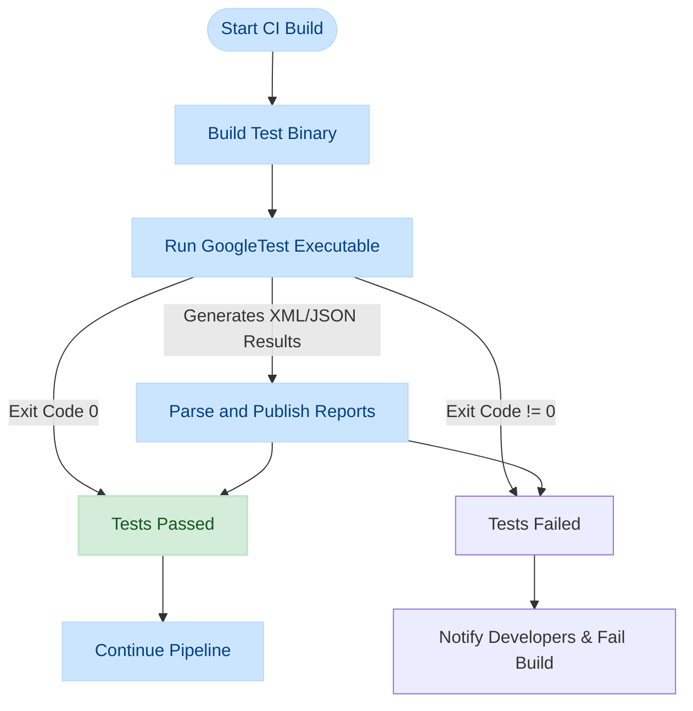

# Test Runner Integration & CI

Integrate your GoogleTest suites smoothly into continuous integration (CI) pipelines and popular test runners. This guide empowers you to automate your testing workflow, configure test output formats for reporting, and utilize actionable feedback from your test runs.

---

## 1. Workflow Overview

### What This Guide Helps You Accomplish
This guide focuses on helping you integrate GoogleTest suites into automated build and test environments using CI tools and test runners. You'll learn to automate test execution, customize test outputs for parsers and dashboards, and generate actionable reports for your team.

### Prerequisites
- GoogleTest and GoogleMock set up and your tests compiling successfully.
- Basic familiarity with command-line build and test execution.
- Access and permissions to configure your CI system (e.g., Jenkins, GitHub Actions, GitLab CI).
- Understanding of your test runner or CI tool’s configuration basics.

### Expected Outcome
By the end, you'll be able to:
- Automate GoogleTest runs within your CI pipeline.
- Generate test results in machine-parsable formats (XML, JSON).
- Integrate GoogleTest outputs with popular test runners and reporting tools.
- Implement best practices for continuous, reliable test automation.

### Time Estimate
Setting up basic integration: 30–60 minutes
Enhancing output formats and reporting: Additional 30 minutes

### Difficulty Level
Intermediate — assumes familiarity with CI concepts and GoogleTest basics.

---

## 2. Step-by-Step Instructions

### Step 1: Prepare Your Test Binary for CI

Many CI systems expect a test executable that runs all tests automatically and returns a status code. GoogleTest’s test binaries fit this model out of the box.

1. **Use the provided main() function from `gtest_main` or `gmock_main`**.
   - Link your test executable with the `gtest_main` or `gmock_main` libraries to get a ready-made `main()` that initializes and runs all tests.
   - This ensures `RUN_ALL_TESTS()` is invoked automatically and the process exit code reflects test success or failure.

2. **Confirm your test binary returns proper exit codes.**
   - The test executable returns 0 if all tests pass, and non-zero on failure, which CI can interpret to mark builds appropriately.

---

### Step 2: Automate Test Execution in Your CI System

Integrate the test executable into your CI workflow.

- **Example: Jenkins Pipeline Snippet**

```groovy
stage('Run Unit Tests') {
  steps {
    sh './build/tests/my_test_binary'
  }
  post {
    always {
      junit 'test-results/*.xml'
    }
  }
}
```

- Replace `'./build/tests/my_test_binary'` with your test executable path.

- The `post` step collects JUnit-style XML reports (see next step).


- **Example: GitHub Actions Workflow**

```yaml
jobs:
  build-and-test:
    runs-on: ubuntu-latest
    steps:
    - uses: actions/checkout@v2
    - name: Build
      run: cmake --build build
    - name: Run Tests
      run: ./build/tests/my_test_binary --gtest_output=xml:test-results/results.xml
    - name: Publish Test Results
      uses: actions/upload-artifact@v3
      with:
        name: test-results
        path: test-results/
```

Here, tests run, produce XML results, then upload them as artifacts.

---

### Step 3: Configure Test Output Formats for Parsers and Reporting

GoogleTest supports several output formats suitable for CI integration:

- **JUnit XML format** (commonly used by Jenkins, Bamboo, GitLab, etc.)
- **JSON format** (supported in newer GoogleTest versions for custom tooling)

Use the `--gtest_output` flag to configure this.

1. **Enable JUnit XML output:**

```bash
./my_test_binary --gtest_output=xml:output/results.xml
```

- This saves test results in an XML file under `output/results.xml`.

2. **(Optional) Enable JSON output:**

```bash
./my_test_binary --gtest_output=json:output/results.json
```

- GoogleTest's JSON output is compatible with various custom reporting tools.

3. **Aggregate results in your CI server**
   - Configure your CI server’s test report publisher to read these files, allowing it to:
     - Show test summaries and trends.
     - Highlight flaky or failing tests.
     - Send notifications based on failures.

---

### Step 4: Implement Actionable Reporting

Good CI integration does more than just run tests — it provides actionable feedback.

1. **Fail the Build on Test Failures**
   - Thanks to GoogleTest’s exit codes, the CI build will fail if any test fails.

2. **Display Test Trends and History**
   - Configure your CI to retain test result history and visualize pass/fail trends.

3. **Leverage Test Output Details**
   - GoogleTest’s XML and JSON reports contain test names, suite names, timing, and failure messages.
   - Use these to diagnose failures quickly.

4. **Integrate with Code Review & Notifications**
   - Configure alerts when tests fail.
   - Post summaries in code review comments or team chat.

---

### Step 5: Advanced Automation Tips

- **Parallel Test Execution**
  - GoogleTest supports running tests in parallel by launching multiple test binaries or using test sharding.
  - Customize your CI pipeline to distribute test workloads across agents.

- **Filter Which Tests to Run**
  - Use `--gtest_filter=` command line option to run specific tests selectively.

- **Customizing Test Output**
  - Use GoogleTest flags like `--gtest_repeat=` for repeated test runs.
  - Use `--gtest_break_on_failure` to halt on first failed test.


---

## 3. Examples & Configuration Snippets

### Example: Main Function Using GoogleMock’s `gmock_main` Integration

```cpp
#include "gmock/gmock.h"

int main(int argc, char** argv) {
  testing::InitGoogleMock(&argc, argv);
  return RUN_ALL_TESTS();
}
```

- This ensures your mock tests run correctly and integrate well within CI.

---

### Example: Running Tests with XML Output from Command Line

```bash
./my_test_binary --gtest_output=xml:build/test-results/results.xml
```

- This generates an XML report for CI test parsers.

---

### Example: Shell Script Snippet for CI (Bash)

```bash
#!/bin/bash
set -e

# Build your tests
cmake --build build

# Run tests, output results to XML
./build/my_test_binary --gtest_output=xml:test-results/results.xml

# Exit with the test result code to notify CI
exit $?
```

---

## 4. Troubleshooting & Tips

### Common Issues

- **Test Executable Does Not Run or Return Proper Exit Code**
  - Ensure you link with *gtest_main* or *gmock_main* to include a suitable `main()`.
  - Do *not* override `main()` without calling `RUN_ALL_TESTS()`.

- **CI Does Not Detect Test Failures**
  - Confirm your test runner executes the test binary and observes its exit code.
  - Make sure the XML report path matches what the CI parser expects.

- **XML Output Is Missing or Malformed**
  - Verify the `--gtest_output=xml:path` is well-formed and that the output directory exists.
  - Check GoogleTest version compatibility and flag support.

- **Tests Run Locally but Fail in CI**
  - Check environment differences such as OS, threading support, or dependencies.
  - GoogleTest requires C++17 compliant compiler on CI.

### Best Practices

- Always use *gtest_main* or *gmock_main* for easier integration.
- Use the XML output in CI for test result visualization.
- Keep test run time reasonable: leverage parallelism if needed.
- Use CI caching wisely to avoid rebuilding GoogleTest repeatedly.

### Performance Considerations

- For large test suites, split tests into multiple binaries.
- Use `--gtest_shuffle` to randomize test order and catch inter-test dependencies.

### Alternative Approaches

- Some test runners accept `--gtest_list_tests` to discover tests without running.
- Incorporate test result parsing logic into custom CI scripts if needed.

---

## 5. Next Steps & Related Content

- After integrating your tests into CI, explore:
  - [Using Assertions and Matchers](guides/core-testing-workflows/using-assertions-and-matchers) for writing expressive tests
  - [Test Doubles with GoogleMock](guides/core-testing-workflows/test-doubles-with-googlemock) for mocking practices
  - [Optimizing Test Performance](guides/advanced-usage-and-integration/optimizing-test-performance) for scaling your testing infrastructure

- Check out documentation for popular CI tools integration and test runners:
  - Jenkins, GitHub Actions, GitLab CI, CircleCI
  - Test runners supporting JUnit XML (e.g. Visual Studio Test Explorer)

---

## Reference Links

- GoogleTest main integration code: [gmock_main.cc](https://github.com/google/googletest/blob/main/googlemock/src/gmock_main.cc)
- GoogleMock main integration README: [googlemock README](https://github.com/google/googletest/blob/main/googlemock/README.md)
- GoogleTest Primer: [docs/primer.md](https://github.com/google/googletest/blob/main/docs/primer.md)
- GoogleTest Advanced Guide: [docs/advanced.md](https://github.com/google/googletest/blob/main/docs/advanced.md)
- GoogleTest Command Line Flags and Output Formats: [docs/primer.md#invoking-the-tests](https://github.com/google/googletest/blob/main/docs/primer.md#invoking-the-tests)


---

<Tip>
Ensure consistent exit codes from your test binaries to let your CI correctly detect test failures and success.
</Tip>

<Note>
Link test executables with `gtest_main` or `gmock_main` libraries to avoid writing your own `main()`.
</Note>

<Warning>
Do not omit the return value of `RUN_ALL_TESTS()` in your main function; it controls test pass/fail signaling.
</Warning>


---

### Diagram: GoogleTest CI Integration Workflow



This workflow illustrates the CI process:
- Build test binary,
- Run tests,
- Interpret exit codes,
- Generate and publish test reports,
- Determine build pass/fail results,
- Notify stakeholders if failures occur.

---

You are now equipped to effectively integrate GoogleTest suites into your continuous integration ecosystem, ensuring reliable automated testing, clear actionable reports, and improved development velocity.


