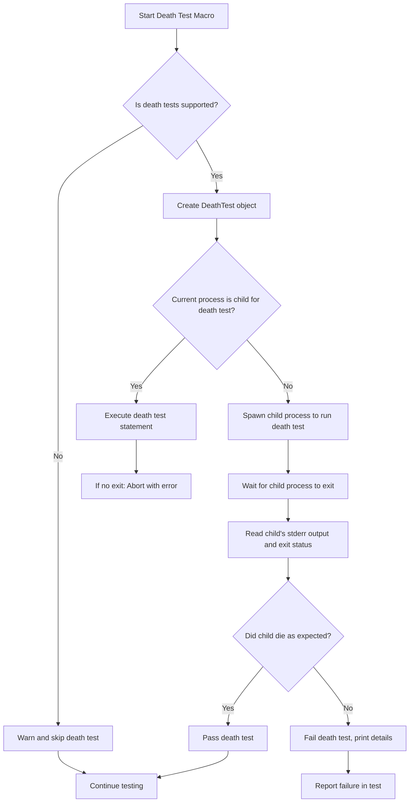

# Writing and Managing Death Tests

This guide explains how to leverage death tests in GoogleTest to verify error handling scenarios where code is expected to terminate abnormally. It covers setup, best practices, platform-specific considerations, and common pitfalls when testing code that must exit or abort.

---

## 1. Understanding Death Tests

**What is a Death Test?**

Death tests check that specific code terminates a process as expected. These tests verify that an operation that should cause a program to abort, exit, or crash does so correctly, and that the terminating output (typically to `stderr`) matches expected patterns.

**Why Use Death Tests?**

Ensuring that your precondition assertions and critical error handling paths fail loudly and early protects program correctness and security. Death tests validate these failure modes are triggered properly.

**Who Should Use Death Tests?**

Developers testing state-checking code, safety-critical paths, and fault-inducing behaviors where the process must exit are the main users.

---

## 2. Prerequisites

To work effectively with death tests:

- Have a functional GoogleTest environment with C++17 support.
- Understand basic GoogleTest test writing and assertions.
- Familiarity with regular expressions, as death test matchers chiefly use regex matching on `stderr`.

Refer to the [`Prerequisites & System Requirements`](../getting-started/setup-basics/prerequisites-requirements.md) and [`Writing and Running Your First Test`](../getting-started/running-first-test/your-first-test.md) for setup details.

---

## 3. Death Test Basics

### Writing a Simple Death Test

Use the macros `EXPECT_DEATH` or `ASSERT_DEATH` to assert a statement causes program termination:

```cpp
TEST(MyDeathTest, FailsPrecondition) {
  ASSERT_DEATH({
    // Code expected to cause death
    AbortIfInvalid(-1);
  }, "Invalid argument");
}
```

Details:
- The first argument is the statement expected to cause termination. It can be a simple function call, expression, or compound statement.
- The second argument is a matcher or regular expression applied to the `stderr` output produced during the death.

### Checking Exit Conditions More Precisely

For fine-grained control on process exit status, use `EXPECT_EXIT` or `ASSERT_EXIT`, supplying a predicate matching the exit code:

```cpp
EXPECT_EXIT(DoSomethingFatal(), ::testing::ExitedWithCode(1), "fatal error");
```

GoogleTest includes predicates like `ExitedWithCode` and on POSIX systems `KilledBySignal`.

---

## 4. Choosing Death Test Styles

GoogleTest supports two death test execution styles, tuned for platform and threading:

| Style       | Description |
|-------------|-------------|
| *fast*     | Child process runs the tested code immediately after being forked. Faster but less safe with multi-threading. |
| *threadsafe* | Child process re-executes the whole test binary, running only the individual death test. Slower but safer in threaded environments. |

### Setting Style

Set the style globally or per test:

```cpp
GTEST_FLAG_SET(death_test_style, "threadsafe");
```

Use "threadsafe" for multi-threaded or complicated environments; "fast" for simpler cases.

### Platform Notes

- On Windows and Fuchsia, death tests are always threadsafe.
- On Linux, the default style is usually "threadsafe".
- The `--gtest_death_test_style` flag controls behavior.

---

## 5. Writing Robust Death Tests

### Test Naming

Name test suites containing death tests ending with *DeathTest* to ensure proper test ordering and to receive thread safety warnings. For example:

```cpp
class FooDeathTest : public ::testing::Test {};

TEST_F(FooDeathTest, FatalPath) {
  ASSERT_DEATH(FooThatDies(), "expected error");
}
```

If you want to mix normal and death tests with the same fixture, create an alias fixture class.

### Avoid Multiple Death Macros on Same Line

Placing multiple `EXPECT_DEATH` or `ASSERT_DEATH` on the same source line causes compilation failures. Separate them by lines.

### Single Evaluation of Arguments

Death test statements are evaluated exactly once to avoid side effects and to ensure correct testing.

### Compound Statements

You can place complex code blocks inside `{}` in death tests.

### Streaming Additional Messages

You may stream custom messages to death tests for additional context:

```cpp
EXPECT_DEATH(Foo(), "error") << "Additional info";
```

---

## 6. Platform-Specific Considerations

### POSIX (Linux, macOS, etc.)

- Uses `fork()` or `clone()` (Linux) to spawn child processes.
- "threadsafe" style re-executes tests with flags to isolate the death test.
- Be aware of multi-thread warnings; death tests should ideally run in single-threaded contexts.

### Windows

- Death tests spawn child processes via `CreateProcess()`.
- Always use threadsafe style.
- Pipe and event handles coordinate parent-child communication.

### Fuchsia

- Uses specific zx APIs and handles for spawning and managing death test child processes.

---

## 7. Best Practices and Pitfalls

### Cleaning Up State

Because death tests run code in child processes, any in-memory side effects or state changes will not be reflected in the parent process (test runner).

- Avoid relying on side effects caused by death test statements.
- Free heap memory cautiously; consider disabling heap checks during death tests.

### Avoiding Return and Exceptions in Death Test Statements

- Use of `return` inside death test statement causes the test to fail.
- Throwing exceptions inside death test statements is considered a failure.

Use assertions carefully and avoid those that might cause function returns inside death test code blocks.

### Dealing with Multi-Threading

- Death tests generate warnings when multiple threads exist at the time of test fork.
- For robust results on multi-threaded code, consider "threadsafe" style.
- Minimize thread creation outside of death test statements.

---

## 8. Death Test Macros Quick Reference

| Macro                     | Functionality                                                                |
|---------------------------|-----------------------------------------------------------------------------|
| `EXPECT_DEATH(stmt, regex)`  | Expect `stmt` terminates with nonzero exit and `stderr` matching `regex`     |
| `ASSERT_DEATH(stmt, regex)`  | Same as `EXPECT_DEATH` but fatal on failure                                  |
| `EXPECT_EXIT(stmt, pred, regex)` | Expect `stmt` terminates, exit satisfies `pred` and `stderr` matches `regex`|
| `ASSERT_EXIT(stmt, pred, regex)` | Same as `EXPECT_EXIT` but fatal on failure                                |
| `EXPECT_DEATH_IF_SUPPORTED`, `ASSERT_DEATH_IF_SUPPORTED` | Same as above but skip if death tests not available  |
| `EXPECT_DEBUG_DEATH`, `ASSERT_DEBUG_DEATH` | Death tests only in debug builds                                         |


---

## 9. Detailed Example

```cpp
#include <gtest/gtest.h>

void DieIfInvalid(int x) {
  if (x < 0) {
    fprintf(stderr, "Error: invalid input %d\n", x);
    _Exit(1);
  }
}

TEST(MyDeathTest, DetectsNegativeInput) {
  ASSERT_DEATH(DieIfInvalid(-42), "invalid input -42");
}

TEST(MyDeathTest, DoesNotDieOnValidInput) {
  // This will fail because no death occurs.
  EXPECT_NONFATAL_FAILURE(EXPECT_DEATH(DieIfInvalid(5), ""), "failed to die");
}

TEST(MyDeathTest, ExitsWithSpecificCode) {
  EXPECT_EXIT(_Exit(42), testing::ExitedWithCode(42), "");
}

int main(int argc, char** argv) {
  ::testing::InitGoogleTest(&argc, argv);
  GTEST_FLAG_SET(death_test_style, "threadsafe");
  return RUN_ALL_TESTS();
}
```

---

## 10. Troubleshooting

### Death Test Fails Because It Does Not Die

- Verify that the code executed inside `ASSERT_DEATH` or `EXPECT_DEATH` actually terminates the process.
- Check that no exceptions or early returns prevent termination.
- Confirm regex matcher exactly matches the error output; use broader patterns for debugging.

### Intermittent Deadlocks or Hang

- Potentially caused by multithreading.
- Switch to "threadsafe" death test style.
- Reduce number of threads before death test runs.

### Compilation Errors

- Multiple death test macros on the same line can cause syntax errors.
- Fix by only one death test macro per line.

### Death Test Skipped or Not Supported

- Check if platform supports death tests with `GTEST_HAS_DEATH_TEST`.
- Use `EXPECT_DEATH_IF_SUPPORTED` macros for conditional death tests.

### Race Conditions and Side Effects

Remember, side effects inside death tests are not observed by the parent process.

---

## 11. Additional Resources

- [Assertions Reference: Death Assertions](../docs/reference/assertions.md#death)
- [Advanced Guide: Death Tests](../docs/advanced.md#death-tests)
- [GoogleTest Primer](../guides/getting-started/primer.md)
- [Mocking Best Practices](../guides/real-world-patterns/mocking-best-practices.md)

---

## 12. Summary

Death tests let you systematically verify that your code terminates as expected under error conditions. Using GoogleTest's death test macros (`EXPECT_DEATH`, `ASSERT_DEATH`, `EXPECT_EXIT`, etc.) you can assert that your program's fatal behaviors emit correct error messages and exit codes. Choosing the right style and accounting for threading and platform restrictions ensures reliable results.

Follow the best practices here to write clear, maintainable death tests that integrate well with your test suite.

---

<AccordionGroup title="Common Death Test Pitfalls & Tips">
<Accordion title="Avoid Illegal Return or Exception in Death Test">
Returning from or throwing exceptions inside a death test statement causes test failures. Use simple statements or compound blocks without return or throw.
</Accordion>
<Accordion title="One Death Test Macro per Line">
Having multiple death test statements on the same source line causes compilation errors.
Ensure each death test macro is on its own line.
</Accordion>
<Accordion title="Handling Multi-Thread Warnings">
Prefer "threadsafe" style death tests to avoid hangs in multi-threaded code or pre-existing threads.
Minimize thread creation outside death test statements.
</Accordion>
</AccordionGroup>

---

## 13. Illustrative Mermaid Diagram: Death Test Workflow



---