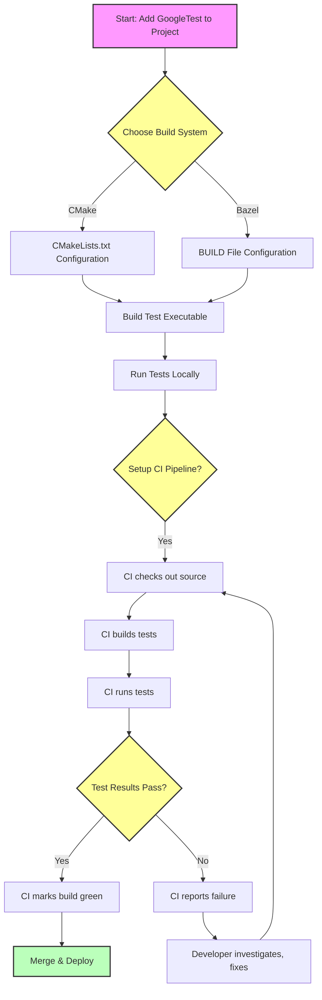

# Integrating with Build Systems and CI Workflows

## Workflow Overview

Integrating GoogleTest and GoogleMock into your build system and Continuous Integration (CI) workflows is a critical step towards automated, reliable testing. This guide walks you through setting up GoogleTest in **CMake** and **Bazel** environments—two of the most common C++ build systems—and configuring your CI pipelines to run tests automatically and report their results.

### Prerequisites

- You already have a C++ project structured with either CMake or Bazel.
- GoogleTest and GoogleMock source code are available either as vendor packages or via submodules.
- Basic familiarity with your build system files (`CMakeLists.txt` for CMake, `BUILD` files for Bazel).

### Expected Outcome

- You will have GoogleTest and GoogleMock properly linked into your project.
- Your project will build test binaries linked against GoogleTest/GoogleMock.
- Your CI setup will automatically execute tests on every code check-in and capture the results.

### Time Estimate

Setting up integration typically takes between 30 minutes to one hour depending on project complexity.

### Difficulty Level

Intermediate: requires understanding of C++ build systems and CI concepts.

---

## Step-by-Step Instructions

### 1. Integrate GoogleTest with CMake

#### Step 1: Add GoogleTest as a Subdirectory or Find Package

- Option A: Use Add Subdirectory

  Include GoogleTest source (downloaded or as a submodule) in your project and add:

  ```cmake
  add_subdirectory(path/to/googletest)
  ```

- Option B: Use `find_package`

  If GoogleTest is installed system-wide or via package managers, locate it with:

  ```cmake
  find_package(GTest REQUIRED)
  include_directories(${GTEST_INCLUDE_DIRS})
  ```

#### Step 2: Link Your Test Targets

Add your test executable:

```cmake
add_executable(my_tests test_main.cpp ...)
```

Link GoogleTest and GoogleMock libraries, along with pthreads if required:

```cmake
target_link_libraries(my_tests gtest gmock pthread)
```

*Note:* Some platforms may require linking `gtest_main` or `gmock_main` for main() support.

#### Step 3: Enable Test Execution

Enable CTest in your project:

```cmake
enable_testing()
add_test(NAME MyTests COMMAND my_tests)
```

This allows integration with CI runners supporting CTest.

#### Step 4: Build and Run Tests Locally

From your build folder, invoke:

```bash
cmake --build . --target my_tests
ctest
```

Verify tests run and results output to console.

---

### 2. Integrate GoogleTest with Bazel

#### Step 1: Declare Dependencies

In your `BUILD` file, add `gtest` and/or `gmock` dependencies:

```python
cc_test(
    name = "my_tests",
    srcs = ["test_main.cc"],
    deps = [
        "@com_google_googletest//:gtest_main",
        "@com_google_googletest//:gmock",
    ],
)
```

Make sure the `googletest` external repository is properly declared in your WORKSPACE.

#### Step 2: Build and Run Tests Locally

Run:

```bash
bazel test //path/to:my_tests
```

The output includes pass/fail report.


---

### 3. Automate Tests in Continuous Integration Pipelines

Most popular CI systems (e.g., Jenkins, GitHub Actions, GitLab CI, Azure Pipelines) support running shell commands and interpreting test results.

#### Step 1: Add Build and Test Commands

In your CI job configuration:

- For CMake:

  ```bash
  mkdir build
  cd build
  cmake ..
  cmake --build . --target my_tests
  ctest --output-on-failure
  ```

- For Bazel:

  ```bash
  bazel test --test_output=errors //path/to:my_tests
  ```

#### Step 2: Capture and Report Test Results

- Use CI plugins or features that parse CTest or Bazel test outcomes.
- For XML reporting, configure CTest to provide JUnit-style output:

  ```bash
  ctest --output-on-failure -T Test --no-compress-output -D Experimental
  ```

- For Bazel, use `--test_output=all` or `--test_summary=short` flags.

#### Step 3: Configure Failures to Block Merges

- Enforce CI pipelines to block merging or deploying on test failure.

---

## Practical Tips and Best Practices

- **Use `gmock_main` / `gtest_main`** targets if you want GoogleTest to provide the `main()` function automatically.
- **Always link to `pthread` or relevant threading libraries**, especially on Linux.
- **Separate your test binaries** from production build targets to speed up builds.
- **Cache dependencies** (like googletest source or build artifacts) in CI to speed up test execution.
- **Run tests in a clean environment** to catch environment-dependent bugs.
- **Review verbose and XML output** to diagnose test failures in CI.

---

## Troubleshooting & Common Issues

| Issue | Resolution |
|---|---|
| Tests fail to link against pthread on Linux | Explicitly add `pthread` to `target_link_libraries` in CMake |
| Tests do not run / no output in CI | Ensure CI runs `ctest` or Bazel test commands correctly; increase verbosity to debug |
| `main()` symbol redefinition errors | Link only one of `gtest_main` or provide your own `main()`; do not mix |
| GoogleTest submodule not found in Bazel | Ensure external `googletest` repository is declared and synced correctly |

<Tip>
Refer to the official [GoogleTest Installation Methods](../getting-started/prerequisites-installation/installation-methods.md) for platform-specific build nuances.
</Tip>

---

## Next Steps & Related Content

- **Writing & Running Your First Test:** Begin test development once setup completes.
- **Configuring Your Project:** Dive deeper into build system configuration specifics.
- **Running and Configuring Tests:** Learn advanced options to run and filter tests.
- **Mocking Best Practices Guides:** Combine mock usage with your integrated tests.
- **Troubleshooting Common Issues:** For resolving errors during setup or test runs.

---

## Diagram: GoogleTest Integration Flow with CI

