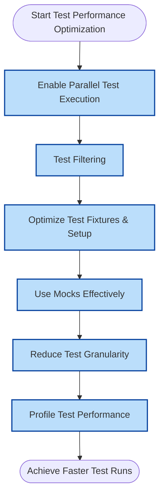

# Optimizing Test Performance for Large Codebases

## Overview

As projects grow and their test suites expand, maintaining fast and reliable test execution becomes critical for developer productivity and continuous integration efficiency. This guide presents practical techniques and actionable best practices to optimize the performance of your GoogleTest test suites in large codebases.

Whether you're running thousands of tests locally or integrating tests into CI pipelines, these strategies help keep your tests lean, parallelized, and focused.


---

## 1. Workflow Overview

### Purpose
This guide helps you improve test execution speed and reliability by applying targeted optimization strategies without sacrificing test quality.

### Prerequisites
- Familiarity with GoogleTest and GoogleMock basics
- A functioning test suite with working tests
- Basic C++ build and test environment familiarity

### Expected Outcomes
- Faster test run times with minimal overhead
- More precise control over which tests execute
- Strategies for reducing flaky and brittle tests

### Time Estimate
Implementing some strategies can be quick (~30 mins), while architectural test changes may take longer.

### Difficulty Level
Intermediate to Advanced


---

## 2. Step-by-Step Optimization Techniques

### Step 1: Enable Parallel Test Execution

Running tests sequentially in large suites slows feedback loops unnecessarily.

1. Use the `--jobs` or `-j` flag provided by your build system to build tests in parallel.
2. Run test binaries with parallel workers:
   - GoogleTest supports running tests concurrently with test sharding or tools like `ctest`.
   - For example, using `ctest -jN` runs tests in parallel where N is the number of parallel jobs.
3. Split tests into multiple binaries if feasible to take advantage of parallelism.

#### Expected Result
Tests execute faster by leveraging available CPU cores.


### Step 2: Use Test Filtering

Run only relevant tests to avoid unnecessary execution of the full suite.

1. Use GoogleTest’s `--gtest_filter` flag to specify test patterns. Examples:
   - Run tests in a specific suite: `--gtest_filter=MyTestSuite.*`
   - Exclude flaky or long tests: `--gtest_filter=-FlakyTest`.
2. Combine filters with tags or naming conventions to organize tests by priority or feature.
3. Integrate test filtering in CI pipelines to run faster tests on each commit and full tests on nightly builds.

#### Expected Result
Shorter test runs focused on changed areas or critical paths.


### Step 3: Optimize Test Fixtures and Setup

Reduce overhead before actual test logic executes.

1. Minimize expensive setup in `SetUp()` and `TearDown()` when not necessary.
2. Use shared test fixtures (`TEST_F`) wisely to avoid redundant setup across many tests.
3. Cache or mock heavy external resources (databases, file systems) where possible.
4. Use `static` or `thread_local` variables to reuse expensive creations safely across tests.

#### Expected Result
Lower setup cost leads to shorter per-test execution times.


### Step 4: Use Mocks Effectively

Avoid testing external dependencies by mocking collaborators.

1. Use GoogleMock to replace slow or unreliable dependencies with mocks.
2. Set up default behaviors with `ON_CALL()` and use `EXPECT_CALL()` only for expected interactions.
3. Choose mock strictness levels (`NiceMock`, `NaggyMock`, `StrictMock`) according to your test needs to balance noise and strictness.
4. Delegate to fakes or real implementations selectively if needed for realistic behavior.

#### Expected Result
Tests become faster and more deterministic by avoiding heavy dependencies.


### Step 5: Reduce Test Granularity When Appropriate

1. Group related tests logically to reduce the number of individual test cases.
2. Combine tests that verify the same functionality to reduce overhead.
3. Remove redundant or obsolete tests.
4. Use parameterized tests (`TEST_P`) to cover multiple scenarios with minimal code and execution cost.

#### Expected Result
Fewer test cases reduce execution and compilation overhead.


### Step 6: Profile and Analyze Test Performance

1. Use profiling tools or GoogleTest built-in timing outputs (`--gtest_print_time`) to identify slow tests.
2. Investigate and optimize or disable flaky and slow tests.
3. Use test logs to monitor test duration distributions and improve CI pipeline planning.

#### Expected Result
Data-driven decisions optimize tests where they matter most.


---

## 3. Examples & Usage Notes

### Running Tests in Parallel

```bash
# Run all tests using 8 parallel jobs (Unix-based systems).
ctest -j8

# Running a GoogleTest binary directly with filter and repeat options.
./my_test_binary --gtest_filter=FastSuite.* --gtest_repeat=10
```

### Filtering Tests

```bash
# Run all tests except those tagged as Slow or Flaky.
./my_test_binary --gtest_filter=-*SlowTest*:-*FlakyTest*
```

### Using a NiceMock Example

```cpp
using ::testing::NiceMock;

class MockDatabase : public Database {
 public:
  MOCK_METHOD(void, Connect, (), (override));
  MOCK_METHOD(bool, Query, (const std::string& sql), (override));
};

TEST(MyServiceTest, TestQuery) {
  NiceMock<MockDatabase> db;

  ON_CALL(db, Query).WillByDefault(Return(true));

  EXPECT_CALL(db, Connect()).Times(1);

  MyService service(&db);
  EXPECT_TRUE(service.PerformQuery());
}
```

---

## 4. Troubleshooting & Best Practices

### Common Issues

- **Test runs too slow**: Check for expensive setup or blocking I/O. Use profiling.
- **Tests flaky due to external dependencies**: Mock unstable components.
- **Unexpected test failures when parallelized**: Ensure tests are thread-safe and independent.

### Best Practices

- Always isolate tests from each other to enable parallel execution.
- Use test names and filters to organize large test suites.
- Prefer less strict mocks during development; use strict mocks selectively.
- Regularly profile and optimize long-running tests.

### Performance Considerations

- Keep tests as lightweight as possible.
- Dispose of resources promptly.
- Avoid sleep or wait where possible; use synchronization primitives and notifications.
- Use `RetiresOnSaturation()` in mocks to avoid sticky expectations that slow matching.

### Alternative Approaches

- Use parameterized tests to reduce duplication.
- Utilize test shards in CI to distribute heavy workloads.
- Use `MockFunction` for mocking function callbacks easily.

---

## 5. Next Steps & Related Content

### What's Next
After applying performance optimization, consider:

- Integrating test execution with CI pipelines optimally.
- Reviewing the [Parameterized and Typed Tests for Code Coverage](../guides/advanced-usage-integration/parameterized-typed-tests) guide.
- Leveraging advanced mocking techniques in [Mocking Techniques and Best Practices](../guides/mocking-best-practices/creating-mocks).

### Related Guides

- [Organizing and Grouping Your Tests](../guides/writing-tests/test-organization-suites)
- [Running and Configuring Tests in Different Environments](../guides/writing-tests/running-and-configuring-tests)
- [Using Mock Strictness Controls](../guides/mocking-best-practices/mock-strictness-modes)

### Resources

- [GoogleTest Primer](overview/getting-started-with-googletest/what-is-googletest)
- [Mocking Reference](docs/reference/mocking.md)
- [gMock Cookbook](docs/gmock_cook_book.md)


---

## Quick Tips

- Use `--gtest_print_time` to identify slow tests.
- Avoid using `EXPECT_CALL` for all mock methods; use `ON_CALL` where applicable.
- Use `NiceMock` to reduce noise from uninteresting calls.
- Structure tests to be independent to maximize parallelism.

<Callout type="tip">
Use continuous monitoring to identify regressions in test performance as your suite evolves.
</Callout>

---

## Diagram: Test Run Optimization Flow


