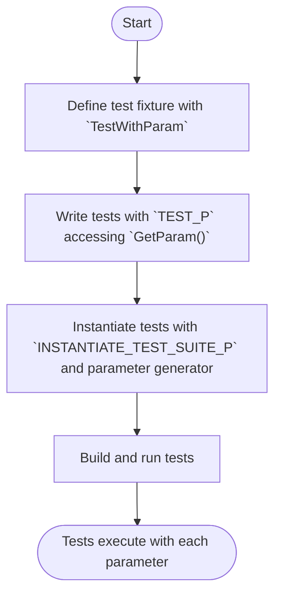

# Parameterized and Type-Parameterized Tests

This guide helps you set up and use GoogleTest's **value-parameterized** and **type-parameterized** test suites to write compact, reusable tests that cover multiple input values and types efficiently. By employing these features, you maximize test coverage while minimizing duplicated code.

---

## 1. When to Use Parameterized and Type-Parameterized Tests

- Use **value-parameterized tests** when you want the *same test logic* to run against *different values* (inputs).
- Use **type-parameterized tests** when you want the *same test logic* to run against *different types*.

These features help you avoid writing repetitive tests and keep your test code maintainable and scalable.

---

## 2. Prerequisites

- **Basic familiarity with GoogleTest** test writing, including `TEST()` and `TEST_F()` macros.
- Project fully set up with GoogleTest including build integration.

---

## 3. How Value-Parameterized Tests Work

Value-parameterized tests repeatedly run the same test logic with varying parameter values supplied during instantiation.

### 3.1 Define a Test Fixture with a Parameter Type

You define a test fixture class that inherits from both `testing::Test` and `testing::WithParamInterface<T>`, where `T` is the parameter type.

```cpp
class MyValueParamTest : public ::testing::TestWithParam<int> {
  // Test data and setup
};
```

### 3.2 Write Parameterized Test Cases Using `TEST_P`

Within the test fixture, write your test cases using `TEST_P` macro which allows access to the parameter value via `GetParam()`.

```cpp
TEST_P(MyValueParamTest, IsPositive) {
  int value = GetParam();
  EXPECT_GT(value, 0);
}
```

### 3.3 Instantiate the Test Suite

Use the `INSTANTIATE_TEST_SUITE_P` macro to instantiate the parameterized test suite with specific parameter values or generators.

```cpp
INSTANTIATE_TEST_SUITE_P(
    PositiveValues,
    MyValueParamTest,
    ::testing::Values(1, 2, 3, 4, 5));
```

**Parameter Generators include:**
- `Values`: explicit list of values
- `Range(begin, end[, step])`: generates a sequence
- `ValuesIn(container or begin,end)`: from containers or iterator ranges
- `Bool()`: generates `false` and `true`
- `Combine()`: Cartesian product of multiple generators

### 3.4 Accessing Parameters

Inside your test, get the current test parameter via `GetParam()`:

```cpp
int param = GetParam();
```

### 3.5 Naming Instantiations

You can optionally provide a custom name generator to produce human-readable test names:

```cpp
INSTANTIATE_TEST_SUITE_P(
    MyInst,
    MyValueParamTest,
    ::testing::Values(1, 2, 3),
    [](const testing::TestParamInfo<MyValueParamTest::ParamType>& info) {
      return "Value_" + std::to_string(info.param);
    }
);
```

---

## 4. How Type-Parameterized Tests Work

Type-parameterized tests run the same logic against multiple types, useful to verify template or generic code correctness.

### 4.1 Define a Template Test Fixture Class

Create a test fixture class template parameterized on the type.

```cpp
template <typename T>
class MyTypeParamTest : public ::testing::Test {
public:
  // Members and helpers using T
};
```

### 4.2 Declare the Test Suite Using `TYPED_TEST_SUITE`

Associate the list of types your tests will run against:

```cpp
using MyTypes = ::testing::Types<int, double, char>;
TYPED_TEST_SUITE(MyTypeParamTest, MyTypes);
```

### 4.3 Write Test Cases Using `TYPED_TEST`

Inside the test case, refer to the type parameter as `TypeParam`:

```cpp
TYPED_TEST(MyTypeParamTest, CanDefaultConstruct) {
  TypeParam value{};  // Default construct
  EXPECT_TRUE(true);  // Use value meaningfully
}
```

### 4.4 Optionally Provide Custom Names

You can provide a `NameGenerator` class with a templated `static std::string GetName(int)` method to generate friendly type names.

### 4.5 Using Type-Parameterized Tests Across Translation Units

Alternatively, define the tests in one place using `TYPED_TEST_SUITE_P`, `TYPED_TEST_P`, and register them with `REGISTER_TYPED_TEST_SUITE_P`, then instantiate in your desired `.cc` files with `INSTANTIATE_TYPED_TEST_SUITE_P`. This is useful for reusable test patterns (see main docs for details).

---

## 5. Best Practices and Tips

- **Use only necessary parameter values and types**: avoid overloading tests with unnecessary cases.
- **Use descriptive instantiation names** to make test output easy to understand.
- **Group related parameters** using `Combine()` for multi-dimensional test coverage.
- **Retain readable test logic by accessing `GetParam()` or using `TypeParam` smartly.**
- **Avoid duplication** by using parameterized tests instead of many similar individual tests.

---

## 6. Example: Value-Parameterized Test for Even Numbers

```cpp
#include <gtest/gtest.h>

class EvenNumberTest : public ::testing::TestWithParam<int> {};

TEST_P(EvenNumberTest, IsEven) {
  int n = GetParam();
  EXPECT_EQ(n % 2, 0);
}

INSTANTIATE_TEST_SUITE_P(
    EvenNumbers,
    EvenNumberTest,
    ::testing::Values(2, 4, 6, 8, 10));
```

---

## 7. Example: Type-Parameterized Test for Container Size

```cpp
#include <gtest/gtest.h>
#include <vector>
#include <list>

template <typename T>
class ContainerSizeTest : public ::testing::Test {
public:
  T container_;
};

using ContainerTypes = ::testing::Types<std::vector<int>, std::list<int>>;
TYPED_TEST_SUITE(ContainerSizeTest, ContainerTypes);

TYPED_TEST(ContainerSizeTest, IsInitiallyEmpty) {
  EXPECT_EQ(this->container_.size(), 0);
}
```

---

## 8. Troubleshooting

### 8.1 Tests Not Running?
- Make sure you have instantiated value-parameterized tests with `INSTANTIATE_TEST_SUITE_P`.
- For type-parameterized tests, ensure correct use of `TYPED_TEST_SUITE` or `INSTANTIATE_TYPED_TEST_SUITE_P` and registration macros.

### 8.2 Compilation Errors in Macros
- Enclose return types or argument types with commas inside additional parentheses or use `using` type aliases.
- Ensure parentheses around argument lists and specifiers in `MOCK_METHOD`.

### 8.3 Parameter Type Mismatches
- Use `ConvertGenerator` or provide a lambda converter to ensure parameter type matches the fixture.

### 8.4 Ambiguous Overloads
- For overloaded methods, provide complete signatures or use disambiguation techniques as described in the [Typed Tests](../advanced.md#typed-tests) docs.

---

## 9. Next Steps & Related Guides

- [Writing and Structuring Effective Tests](../core-workflows/writing-effective-tests.md) — for broader testing best practices.
- [Using Mocks in C++ Tests](../core-workflows/using-mocks-in-tests.md) — complement parameterized tests with mocking.
- [GoogleTest Primer](../overview/product-intro-and-value/what-is-googletest.md) — foundational knowledge if you are new.

---

For detailed technical reference and extended examples, see the API docs:
- [`TEST_P` and `INSTANTIATE_TEST_SUITE_P`](https://google.github.io/googletest/reference/testing.html#TEST_P)
- [`TYPED_TEST_SUITE` and `TYPED_TEST`](https://google.github.io/googletest/reference/testing.html#TYPED_TEST)

---

## Summary Diagram of Value-Parameterized Test Workflow



---

Happy Testing!

---

# References

- GoogleTest Value-Parameterized Tests: https://google.github.io/googletest/advanced.html#value-parameterized-tests
- GoogleTest Type-Parameterized Tests: https://google.github.io/googletest/advanced.html#typed-tests
- GoogleTest Primer: /overview/product-intro-and-value/what-is-googletest
- Writing Effective Tests: /guides/core-workflows/writing-effective-tests
- Using Mocks: /guides/core-workflows/using-mocks-in-tests

---