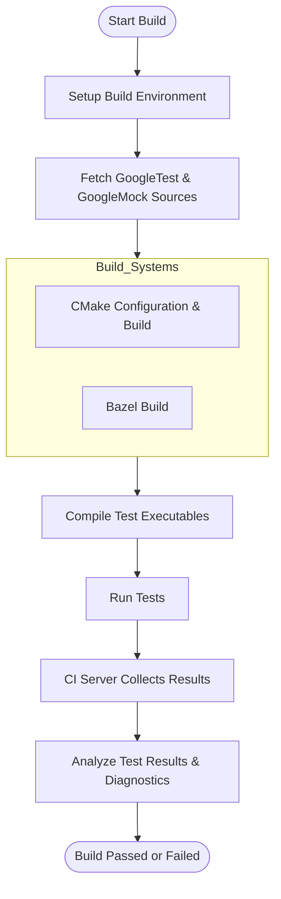

# Integration with Build & CI Systems

## Overview

This guide provides practical best practices for integrating GoogleTest and GoogleMock into popular build systems, particularly focusing on CMake and Bazel, as well as Continuous Integration (CI) workflows. By following these recommendations, you will ensure smooth test automation, consistent reporting, and effective diagnostics to maintain high-quality C++ codebases.

---

## Prerequisites

Before integrating GoogleTest and GoogleMock into your build and CI pipelines, ensure the following:

- **GoogleTest & GoogleMock sources** are cloned and available in your project or accessible as dependencies.
- Your build environment supports **C++17** or later.
- The build tools relevant to your project (e.g., **CMake >= 3.10**, **Bazel 5.x+**) are installed and configured.
- Basic familiarity with your project's build system and CI platform (e.g., Jenkins, GitHub Actions).

---

## Integration with Build Systems

### CMake Integration

CMake is widely used for building C++ projects and offers straightforward mechanisms to add GoogleTest and GoogleMock.

#### Workflow:

1. **Add GoogleTest and GoogleMock as Submodules or FetchContent**
   - Option A: Clone directly as a Git submodule.
   - Option B: Use CMake's `FetchContent` module to download on demand.

2. **Enable Testing in Your CMake Project**
   ```cmake
   enable_testing()
   ```

3. **Add GoogleTest & GoogleMock Directories**
   ```cmake
   # If using submodule
   add_subdirectory(third_party/googletest)

   # If using FetchContent
   include(FetchContent)
   FetchContent_Declare(
     googletest
     URL https://github.com/google/googletest/archive/release-1.13.0.zip
   )
   FetchContent_MakeAvailable(googletest)
   ```

4. **Define Your Test Executable and Link**
   ```cmake
   add_executable(my_test test_main.cpp other_tests.cpp)
   target_link_libraries(my_test gtest_main gmock)
   ```

5. **Register the Test to CTest**
   ```cmake
   include(GoogleTest)
   gtest_discover_tests(my_test)
   ```

6. **Configure Compiler and Link Settings**
   - Ensure your compiler supports C++17.
   - Add necessary flags for warnings and sanitizers as needed.

#### Expected Outcome
- Test executables are built with GoogleTest and GoogleMock properly linked.
- Tests discovered automatically and runnable via `ctest`.

#### Tips
- Use `gtest_discover_tests()` to automatically detect test cases without manual enumeration.
- Consider isolating tests in separate targets to reduce build dependencies.

---

### Bazel Integration

Bazel users benefit from GoogleTest and GoogleMock integration with well-supported `cc_test` targets.

#### Workflow:

1. **Declare GoogleTest and GoogleMock Dependencies**
   - Add `@com_google_googletest//:gtest_main` and `@com_google_googletest//:gmock` to the `deps` of your test targets.

2. **Define Your Test Using `cc_test` Rule**
   ```starlark
   cc_test(
       name = "my_test",
       srcs = ["test_main.cc", "other_tests.cc"],
       deps = [
           "@com_google_googletest//:gtest_main",
           "@com_google_googletest//:gmock",
       ],
   )
   ```

3. **Configure Build and Run Flags**
   - Pass test flags such as `--test_arg=--gtest_filter=*` within your CI environment or using `bazel test` options.

4. **Run Tests with Bazel**
   ```shell
   bazel test //path/to:my_test
   ```

#### Expected Outcome
- Tests built and run correctly with GoogleTest and GoogleMock features.
- Bazel's caching and parallelism optimize test runs.

#### Tips
- Use `--test_summary=short` or `--test_output=errors` for succinct CI logs.
- Isolate flaky tests or use `sharding` features for large test suites.

---

## Best Practices for CI Workflows

Integrating tests into Continuous Integration environments demands reliability and clear reporting.

1. **Automate Test Execution**
   - Trigger build and test runs on pull requests, merges, and scheduled intervals.
   - Use `ctest`, Bazel test commands, or equivalent CI plugins.

2. **Report Results Clearly**
   - Ensure test output is captured, especially failures and warnings.
   - Configure CI to parse GoogleTest XML results (`--gtest_output=xml:filename.xml`) and display in dashboards.

3. **Parallelize Tests**
   - Enable parallel test execution when supported to reduce cycle time.
   - Use test sharding or filtering (`--gtest_filter`) to selectively run subsets.

4. **Enable Verbose Diagnostics When Needed**
   - For flaky or failing tests, temporarily enable verbose logging with `--gtest_verbose=info` or `--gmock_verbose=info`.

5. **Maintain Test Isolation**
   - Ensure tests do not depend on shared global state or environment.
   - Use `SetUp` and `TearDown` methods judiciously to prepare test preconditions.

6. **Avoid Overly Strict Mock Expectations**
   - Don’t over-constrain mocks in tests to reduce brittleness (see [Mocking Best Practices](https://google.github.io/googletest/gmock_cook_book.html#KnowingWhenToExpectUseOnCall)).

7. **Handle Test Failures Proactively**
   - Configure CI to fail builds upon test failures to maintain quality.
   - Provide quick access to logs and stack traces for debugging.

---

## Common Integration Pitfalls and Troubleshooting

| Issue                                      | Cause                                        | Resolution                                                         |
|--------------------------------------------|----------------------------------------------|-------------------------------------------------------------------|
| Tests fail to build or link GoogleMock     | Missing GoogleMock in build dependencies      | Verify linking against `gmock` and `gmock_main` or `gtest_main`. |
| Unexpected warnings about "uninteresting" calls | No `EXPECT_CALL()` set for a mock method       | Add `ON_CALL()` for default behavior or use `NiceMock` to suppress warnings.
| Tests hang or time out in CI                | Asynchronous calls or deadlocks in mocks      | Use synchronization primitives or test-specific hooks to control timing (see [Testing Asynchronous Behavior Recipe](https://google.github.io/googletest/gmock_cook_book.html#TestingAsynchronousBehavior)).|
| Slow test builds                            | Large mock classes or many mocks compiled in headers | Precompile mock classes or move mock definitions to source files.
|

For more detailed troubleshooting, consult the [Common Setup Issues guide](https://google.github.io/googletest/getting-started/troubleshooting-learn/common-setup-issues).

---

## Additional Resources

- [GoogleTest Primer](https://google.github.io/googletest/primer.html) — foundational testing concepts.
- [gMock Cookbook](https://google.github.io/googletest/gmock_cook_book.html) — practical mocking recipes.
- [Getting Started: Project Setup & Integration](https://google.github.io/googletest/guides/getting-started/project-setup.html) — detailed integration with CMake.
- [Integration and Platform Support](https://google.github.io/googletest/overview/integration-and-getting-started/integration-points.html) — high level overview.

---

## Next Steps

- Once integrated, advance to writing your tests with [Writing Your First Unit Test](https://google.github.io/googletest/guides/getting-started/first-unit-test.html) and [Creating Your First Mock Object](https://google.github.io/googletest/guides/getting-started/first-mock.html).
- Explore [Test Discovery & Execution Techniques](https://google.github.io/googletest/guides/essential-testing-patterns/test-discovery-execution.html) to optimize your runs.
- Learn about [Mocking Best Practices](https://google.github.io/googletest/guides/essential-testing-patterns/mocking-best-practices.html) to write robust tests.

---

## Summary Diagram: Typical Integration Flow


---

<Tip>
To optimize your workflow, integrate automated test runs directly into your CI pipeline using test result reports and advanced test filtering features supported by GoogleTest.
</Tip>

<Note>
GoogleMock integration requires virtual destructors on interfaces and proper build system linking to avoid runtime failures.
</Note>

<Warning>
Avoid overly strict mock expectations and unhandled uninteresting calls to reduce test brittleness and maintenance overhead.
</Warning>