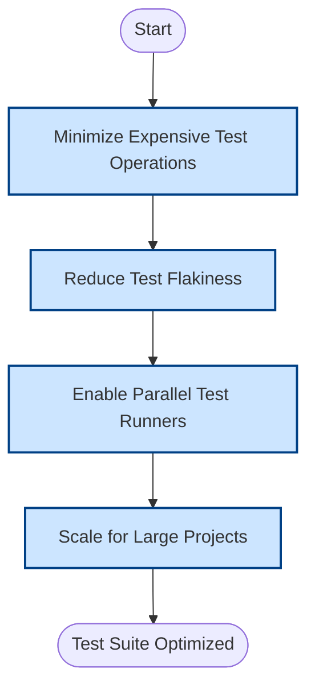

# Performance and Scalability Tips

Optimizing the speed, reliability, and scalability of your test suite is critical as your project grows. This guide provides practical techniques to reduce test runtime, minimize flakiness, leverage parallel test runners, and efficiently scale GoogleTest for large, complex codebases.

---

## 1. Workflow Overview

### Task Description
This guide helps you optimize GoogleTest test execution for improved performance and stability, especially in large projects with extensive test suites.

### Prerequisites
- A working GoogleTest environment with your tests already running locally.
- Familiarity with basic GoogleTest usage, test fixtures, and assertions.
- Build system configured to run tests (e.g., CMake or Bazel).

### Expected Outcome
By following this guide, you will:
- Understand how to minimize test execution times.
- Reduce intermittent (flaky) test failures.
- Configure parallel test execution effectively.
- Scale testing infrastructure to handle large codebases.

### Time Estimate
Approximately 30 to 60 minutes to implement foundational techniques and verify improvements.

### Difficulty Level
Intermediate to Advanced

---

## 2. Step-by-Step Instructions

### Step 1: Minimize Test Execution Time

- **Reduce expensive test operations:** Identify tests with heavy setup or teardown. Refactor or isolate costly operations into shared fixtures or external integration tests.
- **Use test fixtures wisely:** Share common setup code via test fixtures to avoid redundant computations.
- **Limit test data size:** Use the smallest data samples sufficient for coverage.
- **Avoid unnecessary global or static initialization:** Delay or lazy-initialize resources only when needed.

**Verify:** Test binary runs faster with no test failures.

---

### Step 2: Decrease Test Flakiness

- **Avoid dependencies on external state:** Network, filesystem, or timing-sensitive tests can introduce flakiness.
- **Use mocks and stubs:** Employ GoogleMock to isolate tests from unreliable external components.
- **Manage randomness:** Seed any random generators consistently or mock randomness.
- **Carefully order tests:** Ensure tests do not depend on the side effects of others.

**Verify:** Repeated runs yield consistent test results.

---

### Step 3: Utilize Parallel Test Runners

- **Leverage `--jobs` or parallel execution support:** Build systems like Bazel and CTest support parallel test execution. Configure them to use multiple CPU cores.
- **Divide tests into independent suites:** Organize tests so they can run simultaneously without interference.
- **Use sharding or partitioning:** Split large test suites into smaller shards for parallel execution.
- **Manage shared resources:** Avoid conflicts in shared databases, files, or network ports.

**Verify:** Tests run faster without deadlocks or race conditions.

---

### Step 4: Scale Testing in Large Projects

- **Cache test artifacts:** Use build system caching to avoid redundant compilation.
- **Use incremental builds:** Ensure only changed tests and dependencies are rebuilt.
- **Integrate with CI/CD:** Automate test runs with parallel execution and test reporting.
- **Monitor resource usage:** Profile memory and CPU consumption to detect bottlenecks.

**Verify:** Large-scale test runs complete efficiently and reliably in your CI environment.

---

## 3. Examples & Scenario

### Example: Using GoogleTest's Parallel Test Execution

If you use Bazel as your build system, add `--test_output=errors --jobs=N` where `N` is the number of cores you want to use.

```bash
bazel test //my_project/tests/... --test_output=errors --jobs=8
```

This command runs tests in parallel while showing only failures.

### Example: Marking Tests as `DISABLED_` to Improve Runtime

Temporarily disable long-running or flaky tests:

```cpp
TEST(MySuite, DISABLED_HeavyTest) {
  // Implementation
}
```

Disabled tests won't run, reducing your test suite runtime.

---

## 4. Troubleshooting & Tips

### Common Issues

- **Flaky tests in parallel runs:** These often arise due to shared state or resource conflicts. Use mocks or refactor to remove dependencies.
  
- **Slow tests due to external dependencies:** Isolate external calls via mocks or run integration tests separately.

- **Compilation slowdowns with many mocks:** Move mock class constructors and destructors to separate implementation files to improve compile times.

### Best Practices

- Use `ON_CALL` to set default mock behaviors, avoiding over-constraining with excessive `EXPECT_CALL`s.
- Prefer `NiceMock` when you want to suppress uninteresting call warnings in long-running tests.
- Keep expectations focused and local to individual tests to ease maintenance.

### Performance Considerations

- Profile your test runs to find bottlenecks.
- Combine incremental build features of your build system with GoogleTest's features.

### Alternative Approaches

- Adopt test sharding on CI systems to run different shards on separate agents.
- Consider integrating GoogleTest with modern CI pipelines that support scalable parallelism.

---

## 5. Next Steps & Related Content

### What's Next

- Apply best practices to test organization covered in [Testing Best Practices](/guides/advanced-usage/best-practices).
- Learn about Continuous Integration optimization in [Continuous Integration and Automation](/guides/advanced-usage/ci-integration).

### Related Guides

- [Using Assertions Effectively](/guides/core-workflows/using-assertions) to write robust checks.
- [Effective Mocking Techniques](/guides/core-workflows/mocking-techniques) to isolate dependencies.

### Advanced Topics

- Explore advanced sequencing and expectations in mocks for fine-grained control.

### Resources

- Official [gMock Cookbook](https://google.github.io/googletest/gmock_cook_book.html) for advanced mocking patterns.
- Mocking Reference: Extensive GoogleTest mocking API details (/docs/reference/mocking.md).

---

<Tip>
Always start performance optimizations by identifying the real bottlenecks using profiling tools before applying complex fixes. Over-optimization without data can lead to wasted efforts.
</Tip>

<Check>
Ensure tests remain reliable and maintainable while optimizing for performance.
</Check>

---

## Summary Diagram


