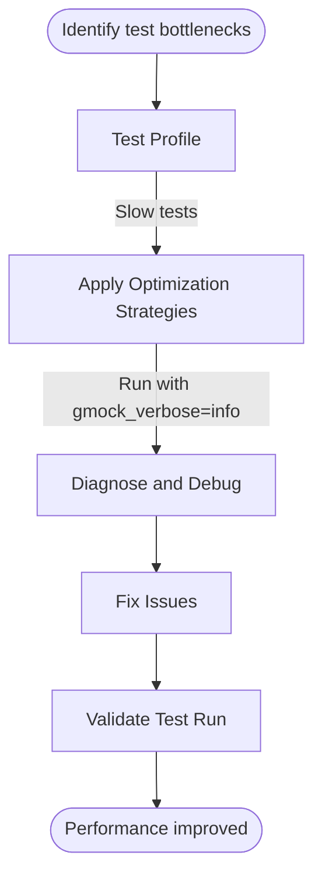

# Performance Optimization and Troubleshooting

Optimize your GoogleTest and GoogleMock test suites for faster execution, diagnose slow or flaky tests, and handle complex environmental dependencies. This guide provides practical tips and advanced patterns to help you improve test reliability and speed while effectively managing edge cases such as leaks, stress testing, and output validation.

---

## 1. Introduction

### Purpose
This guide helps C++ developers and test engineers refine their test suites by:

- Improving test performance and reducing test execution time.
- Diagnosing and fixing causes of slow or flaky tests.
- Managing tricky edge cases like memory leaks, stress testing, and environment-dependent behaviors.

### Audience
Designed for intermediate to advanced GoogleTest and GoogleMock users familiar with basic mocking, expectations, and assertions concepts.

---

## 2. Performance Optimization Strategies

### 2.1 Identify Costly Tests

- Use timing utilities (e.g., `<chrono>`) or your build system’s profiling tools to detect slow tests.
- Focus optimization efforts on the slowest and most frequently run tests.

### 2.2 Minimize Setup and Teardown Overhead

- Prefer lightweight fixtures. Use constructor/destructor or `SetUp()/TearDown()` efficiently.
- Share expensive resources across tests by utilizing shared fixtures or static members if safe.

### 2.3 Use NiceMock to Reduce Noise

- Replace default mocks with `NiceMock` to suppress warnings on uninteresting calls and reduce test output overhead.

### 2.4 Limit Over-Specification of Expectations

- Avoid excessive `EXPECT_CALL`s that verify every possible interaction, which can slow down tests.
- Use `ON_CALL()` to set default behaviors without constraining call counts unless necessary.

### 2.5 Organize Expectations Sequentially

- For ordered calls, use `InSequence` to align expectations and enable early retirement with `.RetiresOnSaturation()`, reducing matcher evaluations.

### 2.6 Avoid Heavy Custom Actions

- Complex actions or those invoking expensive operations each call can degrade performance. Use lightweight lambdas or simple return actions (like `Return()`) when possible.

### 2.7 Optimize Compilation

- Move mock class constructors and destructors out of header files into `.cc` files to speed up compilation and reduce incremental build time.

---

## 3. Diagnosing Slow or Flaky Tests

### 3.1 Common Causes

- **Excessive Mock Calls:** Too many mock calls with complex matchers slow execution.
- **Unnecessary Ordering Constraints:** Overly strict `InSequence` or `After` clauses.
- **Resource Contention:** Shared resources across tests leading to blocking or deadlocks.
- **External Dependencies:** Tests that rely on IO, network, or shared environment.

### 3.2 Diagnostic Tips

- Run tests with `--gmock_verbose=info` to log mock calls and matched expectations.
- Use `time` or benchmarking frameworks to identify which tests or setups consume most time.
- Disable or isolate flaky tests to verify if external factors affect stability.

### 3.3 Handling Flakiness

- Prefer interaction-based verification over state-based verification to catch unexpected behaviors early.
- Use sequences and partial ordering (`InSequence`, `Sequence`) carefully to avoid brittle order dependencies.
- Mark tests as `flaky` or disable temporarily if external conditions cause instability.

---

## 4. Managing Memory Leaks and Stress Testing

### 4.1 Leaks in Mocks

- Ensure mocks have virtual destructors to avoid leak detection failures.
- Use `Mock::VerifyAndClearExpectations()` explicitly when mocks have complex lifetimes or are heap-allocated.
- Use heap checkers or sanitizers to detect leaks.

### 4.2 Stress and Output Tests

- Stress tests may involve repeated invocation of mocks with varied arguments.
- Use `.WillRepeatedly()` combined with efficient expectations to reduce overhead.
- For output tests that validate logs or trace streams, use mock callbacks or `ScopedMockLog` with flexible matchers.

---

## 5. Troubleshooting Common Issues

<AccordionGroup title="Common Troubleshooting Scenarios">

<Accordion title="Uninteresting Call Warnings">

GoogleMock prints warnings when a mock method is called without an associated `EXPECT_CALL`. To avoid noisy warnings:

- Use `NiceMock<T>` to suppress warnings for uninteresting calls.
- Explicitly add `EXPECT_CALL(mock, Method(_)).Times(AnyNumber());` if calls are expected but do not need verification.
- Avoid adding unnecessary `EXPECT_CALL` statements as that might make tests brittle.

</Accordion>

<Accordion title="Mock Object Never Verified Due to Leak">

If your test passes but you suspect mock expectations are never verified:

- Confirm the mock object is destructed properly.
- For heap-allocated mocks managed outside the test, call `Mock::VerifyAndClearExpectations(&mock)` before the test ends.
- Use `Mock::AllowLeak(&mock)` sparingly only when intentional.

</Accordion>

<Accordion title="Multiple EXPECT_CALLs Shadowing">

Later `EXPECT_CALL`s override earlier ones. Ensure:

- More general catch-all expectations (like `.Times(AnyNumber())`) are specified before specific ones.
- Use sequences (`InSequence`) to manage call order where necessary.

</Accordion>

<Accordion title="Slow Compilation Due to Large Mock Classes">

If your mock class compiles slowly or exhausts compiler memory:

- Move constructors and destructors to `.cc` files.
- Reduce the number of mock methods if possible.
- Aggregate related mock classes to reduce template instantiations.

</Accordion>

</AccordionGroup>

---

## 6. Advanced Patterns

### 6.1 Delegating to Fake or Real Objects

Combine mocks with existing implementations to reduce test complexity and avoid maintenance issues:

- Implement `DelegateToFake()` to forward calls to a fake class.
- Delegate calls to real objects for similar behavior.
- Forward calls to parent class methods to reuse default implementations.

### 6.2 Custom Matchers for Performance

Use simpler matchers or pre-built parameterized matchers to optimize matcher evaluation.

### 6.3 Controlling Verbosity

- Adjust `--gmock_verbose=info|warning|error` to control mock output verbosity.
- Use the `--gtest_stack_trace_depth` flag to manage stack trace verbosity.

### 6.4 Thread-Safe Mock Usage

- Set expectations on mocks only from one thread to avoid data races.
- Perform mock calls from multiple threads as needed; gMock locks internally.

---

## 7. Practical Example: Improving a Slow Test

```cpp
using ::testing::InSequence;
using ::testing::Return;

TEST(FooTest, OptimizeMockUsage) {
  MockFoo mock_foo;

  // Use NiceMock to suppress unnecessary warnings.
  NiceMock<MockFoo> nice_mock_foo;

  {
    InSequence seq;  // Enforce call order.
    EXPECT_CALL(mock_foo, Initialize())
        .WillOnce(Return(true))
        .RetiresOnSaturation();  // Retire once used, reduce matcher overhead.
    EXPECT_CALL(mock_foo, ProcessData(_))
        .Times(3)
        .WillRepeatedly(Return(true));
  }

  // Exercise code...
}
```

---

## 8. References and Next Steps

- [gMock Cookbook](https://google.github.io/googletest/gmock_cook_book.html) — Recipes for advanced mocking patterns
- [Setting Expectations and Actions](../guides/mocking-patterns/setting-expectations-actions) — Deep dive into mock behaviors
- [Mock Strictness and Lifecycle](../guides/mocking-patterns/mock-strictness-lifecycle) — Handling warnings and errors
- [Test Organization and Integration](../guides/advanced-usage/test-organization-integration) — Managing large test suites
- Command line flags reference: `--gmock_verbose`, `--gtest_stack_trace_depth`

---

For detailed API usage and examples, see the [GoogleTest Primer](../docs/primer.md) and [gMock Cheat Sheet](../docs/gmock_cheat_sheet.md).

### Summary Diagram of Performance Workflow



---

<Tip>
Remember to balance between test performance and test coverage/rigor. Over-optimization can reduce test effectiveness.
</Tip>

<Note>
Suppressing warnings on uninteresting calls with `NiceMock` is recommended, but be cautious about hiding real test issues.
</Note>

<Warning>
Never set expectations after using mocks in production code; this causes undefined behavior.
</Warning>
