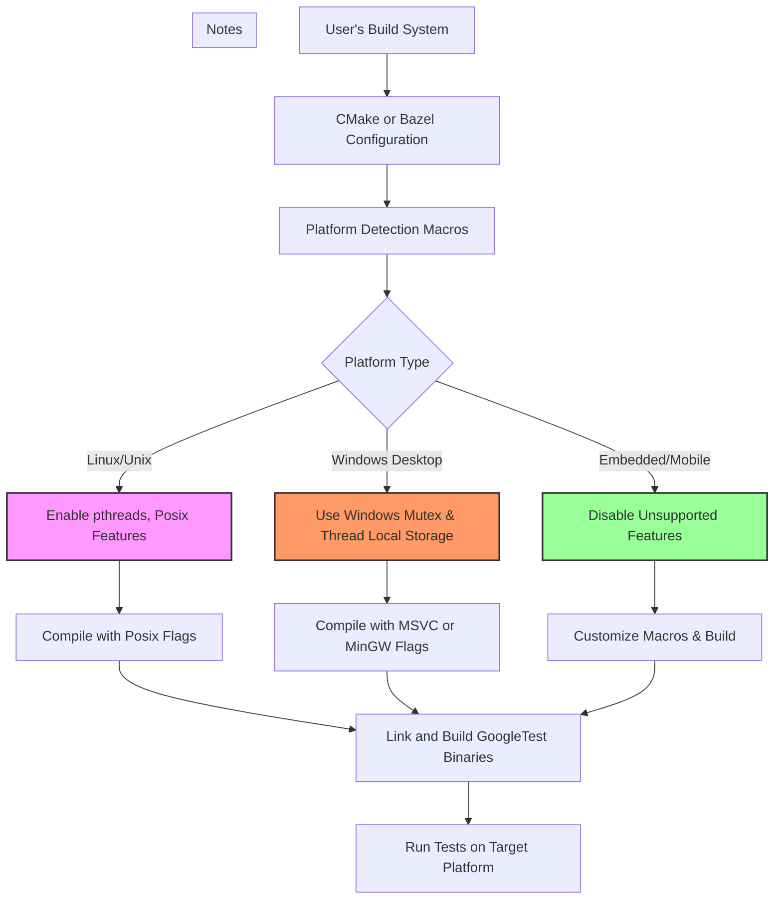

# Platform-Specific Integration and Maintenance

GoogleTest is designed to be a portable, extensible C++ testing framework that works across diverse platforms, compilers, and environments. This page provides tailored advice to help you build and run GoogleTest smoothly on your specific platform, handle edge cases, and leverage platform abstractions for robust and portable tests.

---

## 1. Workflow Overview

### Task Description
This guide helps you successfully integrate, build, and maintain GoogleTest in varied platform environments, including Windows, Linux, Mac, embedded systems, and mobile platforms. It covers platform detection, build system tips, environment tuning, and platform-specific workarounds to ensure robust test execution.

### Prerequisites
- Your development environment is set up with a C++17-capable compiler.
- Familiarity with basic GoogleTest usage, as covered in the Getting Started guides.
- A build system configured to compile and link GoogleTest, preferably using CMake or Bazel.

### Expected Outcome
By following this guide, you will be able to build GoogleTest correctly on your platform, avoid common platform-related pitfalls, and tailor GoogleTest’s features and macros to work optimally in your environment.

### Time Estimate
30 minutes to 1 hour, depending on your platform complexity and customizations needed.

### Difficulty Level
Intermediate

---

## 2. Platform Detection and Macros

GoogleTest internally detects your platform to activate platform-specific features. Many feature macros are auto-detected but can be overridden to accommodate peculiar environments.

### Automatic Platform Identification
- GoogleTest uses platform macros (e.g., `GTEST_OS_WINDOWS`, `GTEST_OS_LINUX`, `GTEST_OS_MAC`) to specialize behavior.
- It identifies subvariants like Windows Desktop, Windows Mobile, Android, and embedded platforms.

### User Overrides
You can manually override these detection macros via compiler flags for better control:

| Macro                         | Description                                 | Example Usage                   |
|-------------------------------|---------------------------------------------|--------------------------------|
| `GTEST_HAS_PTHREAD`            | Enable/disable pthread support              | `-DGTEST_HAS_PTHREAD=1`         |
| `GTEST_HAS_EXCEPTIONS`         | Enable/disable exception support            | `-DGTEST_HAS_EXCEPTIONS=0`      |
| `GTEST_CREATE_SHARED_LIBRARY`  | Compile GoogleTest as shared library (DLL) | `-DGTEST_CREATE_SHARED_LIBRARY=1` |
| `GTEST_LINKED_AS_SHARED_LIBRARY` | Use GoogleTest DLL in tests                | `-DGTEST_LINKED_AS_SHARED_LIBRARY=1` |

<Tip>
Override macros only if the automatic detection fails or if your build environment requires non-standard settings to avoid build or runtime errors.
</Tip>

---

## 3. Building GoogleTest on Different Platforms

### Using CMake
GoogleTest provides a comprehensive CMake build system supporting diverse platforms:

#### Standalone Build

1. Clone the repository, checkout the desired tag or branch:
   ```bash
   git clone https://github.com/google/googletest.git -b main
   cd googletest
   mkdir build
   cd build
   ```
2. Generate platform-specific build files.
   - To build both GoogleTest and GoogleMock (default):
     ```bash
     cmake ..
     ```
   - To build only GoogleTest:
     ```bash
     cmake .. -DBUILD_GMOCK=OFF
     ```
3. Build:
   - On Linux/macOS:
     ```bash
     make
     ```
   - On Windows with Visual Studio, open the generated solution and build.
4. (Optional) Install to system folders:
   ```bash
   sudo make install
   ```

#### Integration Into Existing CMake Projects
- Use `find_package(GTest CONFIG REQUIRED)` when installed.
- Or include GoogleTest source as a subdirectory using `add_subdirectory()` for consistent compiler/linker settings.

<constext>
CMake 3.14 or later is required for FetchContent and modern CMake features.
</constext>

<Tip>
Building GoogleTest as part of your project ensures consistency across your application and tests, especially useful on Windows.
</Tip>

### Compiler and Linker Flags
- C++17 support **is mandatory**.
- Visual Studio users may need to synchronize dynamic vs static runtime libraries using the `gtest_force_shared_crt` option.
- You can define control macros as compiler flags to tweak GoogleTest behavior (e.g., thread safety).

---

## 4. Platform-Specific Runtime Considerations

### Threading
- GoogleTest’s thread safety depends on your platform’s threading support.
- When pthreads are detected/enabled (`GTEST_HAS_PTHREAD`), GoogleTest will use pthread primitives.
- On Windows, a native mutex and thread-local storage implementation is used.
- On embedded or limited platforms, threading may be disabled.

### Capture of Standard Output and Error Streams
- Stream capturing features require that your platform supports stream redirection (`GTEST_HAS_STREAM_REDIRECTION`).
- On some embedded/mobilized platforms stream redirection might be disabled due to OS constraints.

### File System Access
- GoogleTest expects some file system support where required (for death tests, temp directories, etc.)
- Platforms without a file system support may disable these features.

### Exception and RTTI Support
- GoogleTest auto-detects exception and RTTI availability.
- You can override these if your compiler/platform disables these features.

---

## 5. Customization Points

For advanced platform-specific requirements, GoogleTest supports customization:

### Custom Macros and Injection Points
- `GTEST_OS_STACK_TRACE_GETTER_` - Customize stack trace capturing implementation.
- `GTEST_CUSTOM_TEMPDIR_FUNCTION_` - Override `testing::TempDir()` behavior.
- `GTEST_LOG_` and `GTEST_CHECK_` - Custom logging and checks.
- Threading macros to provide your own mutex and thread local storage.

<Tip>
Place custom macros in a header file named `custom/gtest-port.h` in the `internal` directory or specify them on the compiler command line.
</Tip>

---

## 6. Common Pitfalls & Troubleshooting

### Linker Errors on Windows
- Mismatched runtime libraries between your project and GoogleTest can cause linker errors.
- Use the CMake option `gtest_force_shared_crt` to align runtime linkage.

### Thread Safety Issues
- Confirm if `GTEST_IS_THREADSAFE` is defined to 1 for your platform.
- For platforms lacking pthreads or Windows threading primitives, GoogleTest might not be thread-safe.

### Stream Capture Failures
- Some platforms/modes disable stdout/stderr capture.
- If tests relying on output capture fail or behave unexpectedly, check if `GTEST_HAS_STREAM_REDIRECTION` is set to 1.

### Customizing Macros
- Conflicts with macros from other libraries (e.g., ASSERT_EQ) can be resolved with `-DGTEST_DONT_DEFINE_*` flags.

<Tip>
If tests fail unexpectedly, verify that platform-specific macros are set correctly and consider rebuilding GoogleTest cleanly after changing build flags.
</Tip>

---

## 7. Best Practices for Robust Portability

- Always build GoogleTest with the same compiler flags and runtime as your application code.
- Keep GoogleTest updated to get the latest platform compatibility fixes.
- Use GoogleTest’s flags and macros to explicitly control feature activation on niche platforms.
- When deploying on embedded or stripped-down platforms, disable unsupported features via macros.

---

## 8. Summary Diagram of Platform Integration



---

## 9. Next Steps & Related Documentation

- Review the [System Requirements](/getting-started/prerequisites-installation/system-requirements) page to verify your platform support.
- Follow platform-specific [Installation Guides](/getting-started/prerequisites-installation/install-cmake) to build.
- For advanced build integration, see [Integrating Tests into Your Build System](/guides/practical-examples/project-integration-patterns).
- Consult [Troubleshooting Common Issues](/getting-started/troubleshooting-validation/common-issues) if you encounter problems.
- Explore advanced configuration options in the [Customization and Internals](/api-reference/advanced-capabilities/customization-and-internals) documentation.

---

This page ensures you leverage GoogleTest’s powerful features while maintaining portability and robustness across the full spectrum of supported environments.
