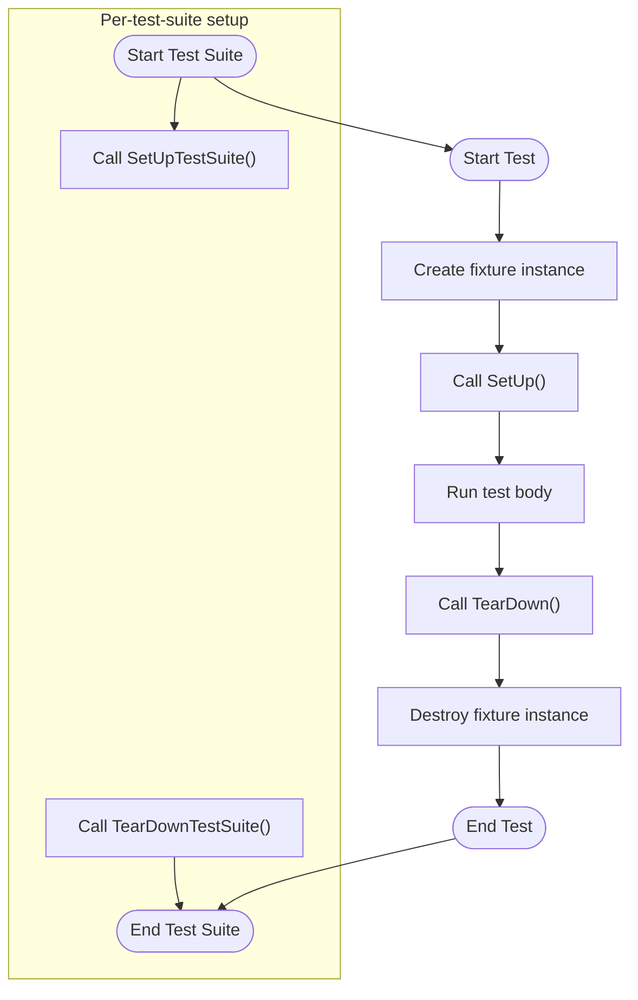

# Test Fixtures and Reusable Setups

Best practices for leveraging test fixtures in both GoogleTest and GoogleMock to manage complex and repeatable test setups. Learn how to write maintainable, DRY test code and ensure tests are reliable, isolated, and organized.

---

## 1. Understanding Test Fixtures

### What Are Test Fixtures?

Test fixtures are a foundational feature in GoogleTest that let you define a common environment for multiple tests. They allow you to share the setup and teardown logic, as well as reusable objects, between related tests. This ensures consistency, reduces code duplication, and makes tests easier to maintain.

> Imagine testing different functionalities of a class that requires the same initialization. Instead of repeating setup code in every test, use a test fixture to set it up once, automatically for each test.

### Why Use Test Fixtures?

- **Reusability:** Share common setup code across multiple tests
- **Isolation:** Each test starts with a fresh fixture, ensuring tests do not affect each other
- **Organization:** Group logically related tests together
- **Maintainability:** Update shared setup in one place

---

## 2. Basic Structure of a Test Fixture in GoogleTest

To create a test fixture:

1. Define a class derived from `testing::Test`.
2. Declare member variables for objects shared by tests.
3. Override `SetUp()` for per-test initialization.
4. Override `TearDown()` for per-test cleanup if needed.
5. Optionally define static `SetUpTestSuite()` and `TearDownTestSuite()` for per-test-suite setup and teardown.

```cpp
class MyFixture : public testing::Test {
 protected:
  // Members shared by tests
  SomeClass obj_;

  // Called before each test
  void SetUp() override {
    obj_.Initialize();
  }

  // Called after each test
  void TearDown() override {
    obj_.Cleanup();
  }

  // Optional: shared setup for all tests in this suite
  static void SetUpTestSuite() {
    // Expensive initialization here
  }

  // Optional: shared teardown for the suite
  static void TearDownTestSuite() {
    // Cleanup shared resources
  }
};

// Use TEST_F to write tests with this fixture
TEST_F(MyFixture, DoesSomething) {
  EXPECT_TRUE(obj_.DoWork());
}
```

---

## 3. Using TEST_F to Write Tests with Fixtures

- `TEST_F(FixtureName, TestName)` associates a test with the fixture.
- GoogleTest creates a new instance of the fixture class for each test.
- For each test:
  - The fixture constructor runs.
  - `SetUp()` is called.
  - The test body is executed.
  - `TearDown()` is called.
  - The fixture destructor is called.

This ensures tests do not share mutable state accidentally.

### Example:

```cpp
class StackTest : public testing::Test {
 protected:
  std::stack<int> s_;

  void SetUp() override {
    s_.push(1);
    s_.push(2);
  }
};

TEST_F(StackTest, SizeIsTwoInitially) {
  EXPECT_EQ(s_.size(), 2);
}

TEST_F(StackTest, PopReducesSize) {
  s_.pop();
  EXPECT_EQ(s_.size(), 1);
}
```

Each test runs independently, with a fresh `s_` stack.

---

## 4. Per-Test-Suite Setup and Teardown: SetUpTestSuite / TearDownTestSuite

When tests share expensive resources, initializing and cleaning them up for every test slows down testing. Use static
member functions in the fixture:

- `static void SetUpTestSuite();` — called once before the first test in the suite
- `static void TearDownTestSuite();` — called once after the last test in the suite

These functions manage resources shared by *all* tests in the fixture.

### Best Practices

- Declare shared resources as `static` members.
- Be cautious: test order is undefined, so tests must not depend on execution order.
- Ensure shared resources are cleaned up properly to avoid leaks.
- You may want to guard your initialization in `SetUpTestSuite()` if it can be called multiple times due to inheritance.

### Example:

```cpp
class DatabaseTest : public testing::Test {
 protected:
  static Database* db_;

  static void SetUpTestSuite() {
    db_ = new Database("TestDB");
  }

  static void TearDownTestSuite() {
    delete db_;
    db_ = nullptr;
  }

  void SetUp() override {
    db_->Connect();
  }

  void TearDown() override {
    db_->Disconnect();
  }
};

Database* DatabaseTest::db_ = nullptr;

TEST_F(DatabaseTest, InsertTest) {
  EXPECT_TRUE(db_->Insert("key", "value"));
}

TEST_F(DatabaseTest, LookupTest) {
  EXPECT_EQ(db_->Lookup("key"), "value");
}
```

Here, the `Database` instance is created once per suite but connected/disconnected per test.

---

## 5. Advanced: Derived Fixtures and Fixture Aliases

### Fixture Inheritance

You can inherit test fixtures and extend/reuse setup logic:

```cpp
class BaseFixture : public testing::Test {
 protected:
  void SetUp() override {
    // base setup
  }

  void TearDown() override {
    // base cleanup
  }
};

class DerivedFixture : public BaseFixture {
 protected:
  void SetUp() override {
    BaseFixture::SetUp();  // Call base setup first
    // additional setup
  }

  void TearDown() override {
    // additional cleanup
    BaseFixture::TearDown();  // Call base cleanup last
  }
};

TEST_F(DerivedFixture, DerivedTest) {
  // Test with extended fixture
}
```

### Aliasing Fixtures

If you want multiple test suite names to share a fixture, you can use a typedef or `using`:

```cpp
using MyFixtureAlias = OriginalFixture;

TEST_F(MyFixtureAlias, SomeTest) {
  // uses OriginalFixture logic
}
```

---

## 6. Tips and Best Practices

- Always spell `SetUp()`, `TearDown()`, `SetUpTestSuite()`, and `TearDownTestSuite()` *exactly*.
- Prefer constructor/destructor for simple object initialization, use `SetUp()`/`TearDown()` when assertions or virtual dispatch are needed.
- Avoid mutable shared state that is altered by tests; if tests modify shared resources, restore original state after each test.
- Use `SCOPED_TRACE` to add contextual information for easier debugging.

<Tip>
Remember, GoogleTest creates a fresh fixture instance per test ensuring isolation. Never rely on state retained between tests unless explicitly managed through static members and suite setup/teardown.
</Tip>

<Note>
Declaring `SetUpTestSuite()` and `TearDownTestSuite()` as `public` is sometimes necessary (especially for parameterized tests).
</Note>

---

## 7. Troubleshooting Common Fixture Issues

### `SetUp()` Not Called?

**Problem:** Setup code in `SetUp()` is not executed.

**Solution:** Check spelling (must be `SetUp()`, not `Setup()`) and ensure it is declared `override` if in C++11 or newer.

### Default Constructor Missing

**Problem:** GoogleTest errors like "no matching function for call to `FooTest::FooTest()`".

**Solution:** Ensure your fixture class has a public default constructor (no-argument). If you declare any constructor, also declare a default one.

### Mixing TEST and TEST_F in Same Suite

**Problem:** GoogleTest complains about mixing `TEST()` and `TEST_F()` in same test suite.

**Solution:** Use `TEST_F()` consistently for test suites that use fixtures.

### Static Member Initialization

**Problem:** Linking errors for static members used in fixtures.

**Solution:** Define static members outside the class in a `.cc` file.

### Shared Resource Leaks

**Problem:** Shared resources allocated in `SetUpTestSuite()` cause memory leaks.

**Solution:** Always pair allocations in `SetUpTestSuite()` with corresponding deletions in `TearDownTestSuite()`.

---

## 8. Using Test Fixtures with GoogleMock

GoogleMock integrates seamlessly with GoogleTest fixtures:

- Derive your fixture class from `testing::Test` or `testing::TestWithParam<>` as usual.
- Declare mock objects as members in the fixture.
- Set expectations in `SetUp()` or each test.

Example:

```cpp
class WidgetTest : public testing::Test {
 protected:
  MockDatabase mock_db_;

  void SetUp() override {
    // Common mock setups
    EXPECT_CALL(mock_db_, Connect())
        .Times(testing::AtLeast(1));
  }
};

TEST_F(WidgetTest, WorksWithDB) {
  // Additional expectations
  EXPECT_CALL(mock_db_, Query(testing::_))
      .WillOnce(testing::Return("result"));

  Widget w(&mock_db_);
  EXPECT_TRUE(w.DoWork());
}
```

<Tip>
Arrange mock method expectations either in `SetUp()` if shared or per test to clarify intent.
</Tip>

---

## 9. Summary

Test fixtures empower you to write clean, maintainable, and efficient tests by reusing setup logic, organizing tests, and isolating state. By following the structure and best practices described above, you can write robust GoogleTest and GoogleMock suites that are easy to understand and maintain.

---

## 10. Next Steps & Further Reading

- Explore [Value-Parameterized Tests](../guides/advanced-usage/parameterized-tests.md) to combine fixtures with parameterized inputs.
- Learn about [Typed Tests](../guides/advanced-usage/parameterized-tests.md#typed-tests) for testing multiple type instantiations with a single fixture template.
- Review [Creating Custom Assertions](../guides/advanced-usage/custom-assertions.md) to enhance test expressiveness.
- Practice writing mocks with [Mocking with GoogleMock](../guides/core-workflow/writing-mocks.md).
- Understand [Global Set-Up and Tear-Down](../advanced.md#global-set-up-and-tear-down) for program-wide fixtures.

---

# References

- [Getting Started with GoogleTest](https://github.com/google/googletest/blob/main/docs/primer.md)
- [GoogleTest Macro Reference](../docs/reference/testing.md)
- [GoogleTest Advanced Topics](../docs/advanced.md#sharing-resources-between-tests-in-the-same-test-suite)
- [Using GoogleMock - Mocking Guide](../guides/core-workflow/writing-mocks.md)
- [GoogleTest FAQ](../docs/faq.md#should-i-use-the-constructor-destructor-of-the-test-fixture-or-setup-teardown)

---

# Additional Resources

- Sample Fixture Test Code: https://github.com/google/googletest/blob/main/googletest/samples/sample3_unittest.cc
- GoogleTest Samples Overview: ../docs/samples.md

---

# Diagram: Fixture Lifecycle Overview



---