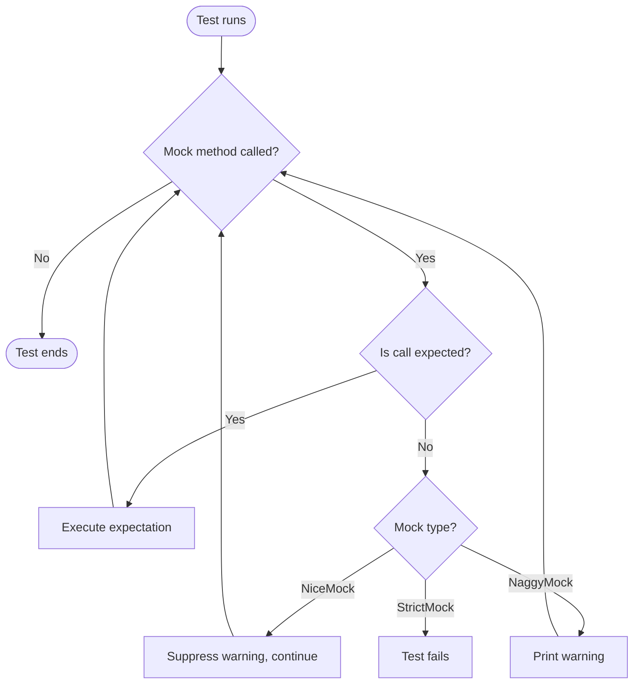

# Diagnostics, Debugging, and Performance Tips

## Overview
This guide delivers expert advice to help you debug failing or flaky tests, interpret test output effectively, optimize the performance of your test suite, and leverage GoogleTest and GoogleMock's built-in diagnostic tools. By following this guide, you will be able to make test maintenance easier, gain better insights into test behaviors, and keep your test suites fast and reliable.

---

## 1. Understanding Test Failures and Flaky Tests

### What This Section Helps You Accomplish
- Identify common causes of test failures and flaky tests.
- Understand how to interpret diagnostic output.
- Apply strategies to isolate and fix flaky behaviors.

### Key Concepts
- **Uninteresting calls:** Invocations on mock methods without associated expectations.
- **Unexpected calls:** Calls that occur but don’t match any expectations.
- **Naggy, Nice, and Strict Mocks:** Different levels of strictness controlling how uninteresting calls are handled.

### Practical Tips
- Use **NiceMock** to suppress warnings on uninteresting calls during debugging. This helps reduce noise and focus on real issues.

  ```cpp
  using ::testing::NiceMock;
  NiceMock<MockFoo> mock_foo;
  EXPECT_CALL(mock_foo, DoThis());
  // Other calls won't spam warnings.
  ```

- Use **StrictMock** to catch any uninteresting method calls as failures, ensuring thorough verification.

  ```cpp
  using ::testing::StrictMock;
  StrictMock<MockFoo> mock_foo;
  EXPECT_CALL(mock_foo, DoThis());
  // Any call other than DoThis() will fail the test.
  ```

- Distinguish between **uninteresting** and **unexpected** calls using the [`EXPECT_CALL`](../reference/mocking.md#EXPECT_CALL) and run tests with `--gmock_verbose=info` for detailed matching logs.

### Common Pitfalls
- Overusing **NaggyMock** or default mocks can cause test brittleness via noisy warnings.
- Overuse of **StrictMock** can lead to fragile tests that break with implementation changes unrelated to visible behavior.

### Verification
- Confirm by running tests that using a `NiceMock` reduces uninteresting call warnings.
- For flaky tests, capture detailed call traces via `--gmock_verbose=info` and analyze which calls violate expectations.

---

## 2. Interpreting Diagnostic Output

### What You See When Tests Fail
- **Expected Calls:** Logs that indicate which expectations are currently active.
- **Actual Calls:** Real invocations that may or may not match expectations.
- **Mismatch Details:** Highlighted differences in argument values or failed predicates.
- **Stack Traces:** Where each expectation and call occurred to aid debugging.

### How to Enable Detailed Logs
- Run your test executable with:

  ```shell
  --gmock_verbose=info
  --gtest_stack_trace_depth=10
  ```

  This combination produces verbose diagnostic information including stack traces at call sites.

### Decoding Output
- Expected calls are matched in **reverse order** (more recent expectations take precedence).
- When a failure occurs, look for mismatched argument values and which `EXPECT_CALL` was not satisfied.
- '[Uninteresting mock function call](#uninteresting-vs-unexpected)' warnings help identify calls without expectations.

### Example Output

```shell
foo_test.cc:14: Mock function call matches EXPECT_CALL(mock, F(_, _))...
    Function call: F("a", "good")
Stack trace: ...
foo_test.cc:15: Failure
Actual function call count doesn't match EXPECT_CALL(mock, F("c", HasSubstr("d")))...
         Expected: to be called once
           Actual: never called - unsatisfied and active
```

This shows where the calls matched or did not, guiding you to the root cause.

---

## 3. Using GoogleTest / GoogleMock Diagnostic Tools

### Controlling Diagnostic Verbosity
- Control how verbose GoogleMock's output is via the `--gmock_verbose` flag:
  - `info`: Logs all info, warnings, errors, and detailed mock call traces.
  - `warning`: Logs warnings and errors (default).
  - `error`: Only logs errors.

### Forcing Early Verification
- Use `Mock::VerifyAndClearExpectations(&mock_obj);` to verify expectations on a mock object explicitly before destruction, useful when mocks are owned by production code and may not be destroyed immediately.

  ```cpp
  using ::testing::Mock;
  Mock::VerifyAndClearExpectations(&mock_foo);
  ```

### Allowing Leaks for Long-Lived Mocks
- Use `Mock::AllowLeak(&mock_obj);` if your test is purposely leaking mocks that aren't destructed within the test scope to avoid false positives related to leaked mocks.

### Capturing Log Output
- For tests that involve certain logging mock objects (e.g., `ScopedMockLog`), be aware that failures or crashes can produce numerous log entries. Adjust expectations accordingly to suppress noisy logs if needed.

---

## 4. Optimizing Test Suite Performance

### What This Section Helps You Accomplish
- Identify strategies to speed up test execution.
- Tune mocks and expectations for minimal overhead.
- Reduce compilation time of mocks.

### Best Practices
- **Minimize Overstrict Expectations:** Avoid using `StrictMock` when not necessary to reduce excessive checks and failures.

- **Use `NiceMock` During Development:** Suppresses uninteresting call warnings and reduces debug noise which helps faster iteration.

- **Move Mock Constructor & Destructor Implementations to `.cc` Files:**

  Compile time improves when mock constructor/destructors are declared in header but defined in a separate source file.

  ```cpp
  // In mock_foo.h
  class MockFoo : public Foo {
   public:
    MockFoo();
    ~MockFoo();
    MOCK_METHOD(void, DoThis, (), (override));
    ...
  };

  // In mock_foo.cc
  MockFoo::MockFoo() {}
  MockFoo::~MockFoo() {}
  ```

- **Reuse Matchers and Actions:** Assign complex matchers/actions to variables and reuse, preventing repeated computation.

- **Selective Use of Sequences:** Use [`InSequence`](../reference/mocking.md#InSequence) judiciously; unnecessary ordering leads to more overhead and brittle tests.

- **Use `ON_CALL` for Default Behaviors:** Set default behaviors to allow relaxed constraints, reducing unnecessary expectation checks.

- **Avoid Overusing `EXPECT_CALL` for Uninteresting Calls:** Overextensive expectations cause the framework to do more work and break maintainability.

---

## 5. Handling Complex Errors and Edge Cases

### Common Scenarios
- Unexpected call count (too many or too few calls).
- Argument mismatches causing expectation failures.
- Uninteresting calls leading to warnings or errors depending on mock strictness.
- Tests failing due to unexpected method overload resolution.

### Troubleshooting Steps
- Ensure all expectations are set before the tested code exercises the mocks.
- Use `--gmock_verbose=info` to see the call matching logic in detail.
- Check mocked method signatures and `MOCK_METHOD` declarations for correctness.
- Use `RetiresOnSaturation()` on expectations that are no longer needed when saturated to prevent “sticky” expectation errors.
- Verify mocks have virtual destructors to avoid undefined behaviors related to destruction.

### Special Notes
- `NiceMock`, `NaggyMock`, and `StrictMock` only affect methods defined with `MOCK_METHOD` directly in the mock class, not those from base classes.

- Nesting `NiceMock`, `NaggyMock`, or `StrictMock` is unsupported.

- Uninteresting calls can throw exceptions if the mock method returns types that cannot be default constructed or have no default action.

- Deleting mock objects inside mock method invocations should be handled carefully to avoid premature destruction errors.

---

## 6. Tips for Better Debugging Practice

- Name mocks and expectations clearly to correlate failures to test intent.
- Structure tests to verify one behavior at a time.
- Use `InSequence` and `After` clauses for ordering constraints when order matters.
- Use `SaveArg` actions to capture arguments for more detailed post-call validation.
- Use `ON_CALL` to provide default behaviors, avoiding noisy uninteresting call warnings.

---

## 7. Summary

| Task                     | Approach                                 |
| ------------------------ | ----------------------------------------|
| Suppress uninteresting call warnings | Wrap mocks in `NiceMock<T>`           |
| Enforce strict call checking           | Wrap mocks in `StrictMock<T>`          |
| Get detailed diagnostic logs           | Run tests with `--gmock_verbose=info`  |
| Reduce compilation overhead             | Define constructor/destructor in `.cc` |
| Verify mocks early                      | Use `Mock::VerifyAndClearExpectations()` |

---

## Additional Resources
- [gMock Cookbook](https://google.github.io/googletest/gmock_cook_book.html)
- [Mocking Reference](../reference/mocking.md)
- [Legacy gMock FAQ](https://google.github.io/googletest/gmock_faq.html)
- [gMock Cheat Sheet](https://google.github.io/googletest/gmock_cheat_sheet.html)
- [Guides: Creating Mocks](../guides/core_workflows/creating-mocks.md)

---

# Appendix: Quick Reference for NiceMock, NaggyMock, StrictMock

| Mock Type    | Behavior with Uninteresting Calls | Effect on Unexpected Calls  | Use Case                                  |
| ------------| ---------------------------------|-----------------------------| -----------------------------------------|
| `NiceMock`  | Suppress warnings                 | Errors (failures)            | Reduce test output spam during debugging |
| `NaggyMock` | Default (warning)                 | Errors (failures)            | Development & debugging (default behavior)|
| `StrictMock`| Treat as errors (fail test)       | Errors (failures)            | Maximum strictness to catch unintended calls|


<Tip>
Choose the appropriate mock strictness level based on your test maintenance needs. Use `NiceMock` by default to keep tests clean and only switch to `StrictMock` when you need to enforce call strictness.
</Tip>

---

# Troubleshooting Checklist

<AccordionGroup title="Common Issues and Solutions">
<Accordion title="1. Uninteresting Call Warnings Are Too Noisy">
- Use `NiceMock` to suppress warnings around uninteresting calls.
- Alternatively, add `EXPECT_CALL(mock, Method).Times(AnyNumber())` for specific methods.
- Adjust verbosity with `--gmock_verbose=error` to reduce output.
</Accordion>
<Accordion title="2. Unexpected Call Failures">
- Check that all necessary `EXPECT_CALL`s are set before exercise.
- Confirm argument matchers are correct.
- Use `--gmock_verbose=info` to trace matching logic.
- Add catch-all expectations if some calls are legitimate but uninteresting.
</Accordion>
<Accordion title="3. Test Fails Due to Lack of Virtual Destructor">
- Ensure all base classes in the mock hierarchy have virtual destructors.
- Confirm destruction paths do not cause undefined behavior.
</Accordion>
<Accordion title="4. Compilation Time is Excessive for Large Mocks">
- Move constructor and destructor definitions out of headers.
- Reuse matchers and actions to prevent repeated instantiations.
</Accordion>
<Accordion title="5. Inconsistent Behavior with Method Overloads">
- Use explicit overload resolution techniques (e.g., `Const()` wrapper).
- Use fully qualified matcher types for disambiguation.
</Accordion>
</AccordionGroup>

---

# Summary Diagram of Mock Strictness Levels



This flowchart helps visualize how different mock strictness levels handle unexpected calls.


---

# Practical Example: Using NiceMock and StrictMock

```cpp
#include <gmock/gmock.h>
using ::testing::NiceMock;
using ::testing::StrictMock;

class MockFoo {
 public:
  MOCK_METHOD(void, DoThis, (), ());
  MOCK_METHOD(int, GetCount, (), ());
};

TEST(SampleTest, NiceMockSuppressesWarnings) {
  NiceMock<MockFoo> mock;
  EXPECT_CALL(mock, DoThis());
  mock.DoThis();  // Matches expectation
  mock.GetCount(); // No EXPECT_CALL, but no warning either
}

TEST(SampleTest, StrictMockFailsOnUnexpectedCalls) {
  StrictMock<MockFoo> mock;
  EXPECT_CALL(mock, DoThis());
  mock.DoThis();  // OK
  mock.GetCount(); // Fails test: uninteresting call
}
```


# Conclusion
By following these diagnostic, debugging, and performance tips, you ensure your use of GoogleTest and GoogleMock is both robust and efficient. You can identify flaky or failing tests quickly, understand errors precisely, and maintain test performance as your codebase grows.


---

# References
- [GoogleMock Cookbook](https://google.github.io/googletest/gmock_cook_book.html) for practical mocking recipes.
- [Mocking Reference](../reference/mocking.md) for API details.
- [Legacy gMock FAQ](https://google.github.io/googletest/gmock_faq.html) for frequent troubleshooting questions.
- [gMock Cheat Sheet](https://google.github.io/googletest/gmock_cheat_sheet.html) for concise syntax summary.


---

This page fits under the "Advanced Techniques and Best Practices" grouping within the Guides tab, following foundational mocking and test organization topics. Readers looking for setup, basic mocking, or assertion techniques should refer to introductory guides and core concepts documentation.