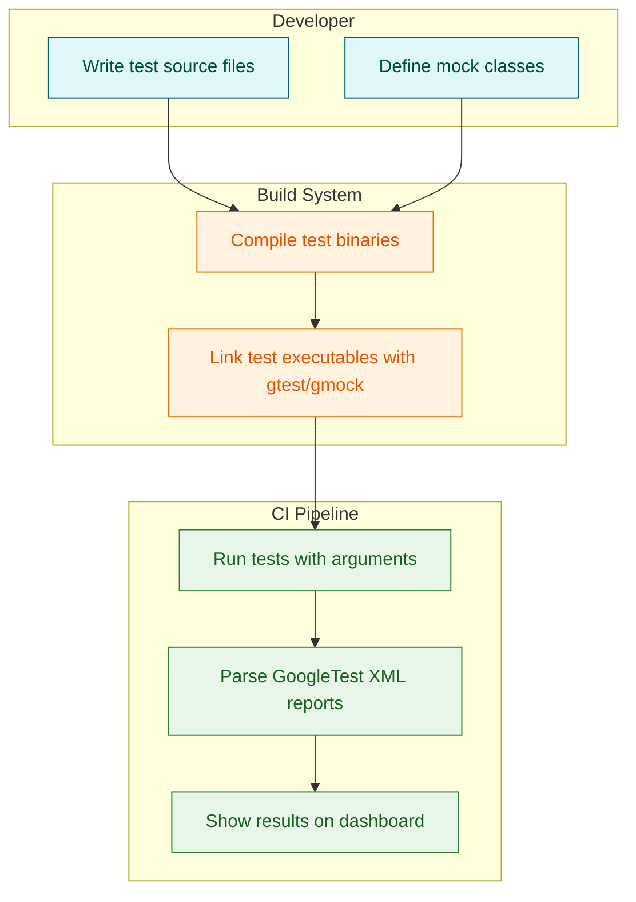

# Integrating with Build Systems and CI

Seamless integration of GoogleTest and GoogleMock into your build systems and continuous integration (CI) pipelines is essential for automated, reliable C++ testing. This guide provides practical strategies, supported platform considerations, and troubleshooting tips to help you embed these frameworks smoothly into your automation workflow.

---

## 1. Overview of Integration Strategies

Integrating GoogleTest and GoogleMock involves configuring your build system to compile and link the testing libraries with your test code, and ensuring your CI environment runs the tests effectively.

- **Build Systems Covered:** CMake, Bazel, and manual build setups
- **CI Pipelines:** Support for common CI environments (Jenkins, GitHub Actions, GitLab CI, etc.)

### Key Goals

- Simplify adding GoogleTest and GoogleMock dependencies
- Automate running tests and collecting results
- Handle platform-specific nuances
- Enable clean test reporting and failure diagnostics

---

## 2. Build System Integration

### 2.1 CMake

CMake is one of the most popular cross-platform build systems and supports GoogleTest through standard `find_package` mechanisms or direct source inclusion.

#### Steps to Integrate GoogleTest and GoogleMock with CMake

1. **Add GoogleTest as a dependency:**

   You can either:   
   - Use pre-installed GoogleTest (often available on Linux systems), or  
   - Add GoogleTest as a subdirectory using [GoogleTest's recommended approach](https://github.com/google/googletest/tree/main).

2. **Include GoogleTest and GoogleMock packages:**

```cmake
find_package(GTest REQUIRED)
include_directories(${GTEST_INCLUDE_DIRS})
```

3. **Link test targets with gtest and gmock libraries:**

```cmake
add_executable(my_test test.cpp)
target_link_libraries(my_test ${GTEST_LIBRARIES} pthread)
```

4. **Add tests to CTest to enable `ctest` or CI integration:**

```cmake
enable_testing()
add_test(NAME MyTest COMMAND my_test)
```

#### Example Minimal `CMakeLists.txt`

```cmake
cmake_minimum_required(VERSION 3.10)
project(MyProjectTests)

# Download and add GoogleTest
include(FetchContent)
FetchContent_Declare(
  googletest
  URL https://github.com/google/googletest/archive/refs/heads/main.zip
)
FetchContent_MakeAvailable(googletest)

# Create the test executable
add_executable(my_test test.cpp)

# Link with GoogleTest and GoogleMock
target_link_libraries(my_test gtest_main gmock_main)

# Enable testing and register the test
enable_testing()
add_test(NAME MyTest COMMAND my_test)
```

##### Tips and Best Practices

- Use `gtest_main` and `gmock_main` libraries where possible to avoid writing a custom `main()` function.
- Ensure proper ordering of linking, especially if using additional threads (`pthread` may be required).
- Use CTest to run tests locally and integrate with CI.

---

### 2.2 Bazel

Bazel is Google's build and test tool optimized for scalable codebases.

#### Steps to Use GoogleTest and GoogleMock with Bazel

1. **Declare GoogleTest as an external dependency** in your `WORKSPACE` file if not included:

```python
http_archive(
    name = "com_google_googletest",
    urls = ["https://github.com/google/googletest/archive/refs/tags/release-1.12.1.tar.gz"],
    strip_prefix = "googletest-release-1.12.1",
)
```

2. **Add `cc_test` targets** pointing to your test source and dependencies.

3. **Link against `@com_google_googletest//:gmock_main` or `:gtest_main`** for testing.

#### Example BUILD file

```starlark
cc_test(
    name = "my_test",
    srcs = ["test.cpp"],
    deps = [
        "@com_google_googletest//:gmock_main",
        # Your code libraries
    ],
)
```

##### Tips

- Use Bazel's sandboxing and caching to speed up test runs.
- Take advantage of Bazel's ability to parallelize tests.

---

### 2.3 Manual & Other Build Systems

If you are using other build systems (Makefiles, Ninja, MSVC solutions),

- Add the include path to GoogleTest and GoogleMock header files.
- Link against the appropriate static or shared GoogleTest and GoogleMock libraries.
- Follow platform-specific guidelines especially on Windows (e.g., use `Calltype(STDMETHODCALLTYPE)` for specific calling conventions).

Refer to [GoogleTest installation guides](getting-started/setup-basics/installation-methods) for detailed instructions.

---

## 3. Continuous Integration (CI) Pipelines

### 3.1 Running Tests Automatically

Configure your CI to run GoogleTest suites after your build step. Common patterns include:

- Use CTest to run CMake-enabled test executables.
- Run Bazel `bazel test //...` to execute all tests.
- Run test executables directly and capture output.

### 3.2 Collecting Test Results

- Use GoogleTest’s XML output support to generate test reports for integration with CI dashboards.

```bash
your_test_binary --gtest_output=xml:report.xml
```

- Configure your CI server to parse these reports and display results.

### 3.3 Handling Failures and Diagnostics

- Integrate with CI to fail builds if there are test failures.
- Use flags like `--gmock_verbose=info` to increase output detail during debugging.
- Use stack trace flags (`--gtest_stack_trace_depth`) to get deeper diagnostic information.

### 3.4 Parallel and Distributed Test Runs

- GoogleTest supports paraellization via test sharding and process parallelism.
- Combine with your CI’s parallel execution features to improve speed.

---

## 4. Supported Platforms and Common Considerations

- GoogleTest and GoogleMock support Linux, Windows, and macOS.
- They require a C++17 compatible compiler (e.g., GCC ≥ 7, Clang ≥ 5, MSVC 2017+).
- Keep in mind dynamic vs static linking preferences depending on your platform and project architecture.
- For Windows, ensure proper calling conventions especially when interfacing with COM or Windows APIs.

---

## 5. Troubleshooting Integration Issues

| Issue                                      | Solution                                                         |
|--------------------------------------------|------------------------------------------------------------------|
| Tests not discovered or run                 | Ensure tests are registered via `enable_testing()` and `add_test` (CMake), or correctly declared `cc_test` in Bazel. |
| Linker errors related to gmock/gtest        | Verify libraries are linked in order and include pthread if needed. Also confirm correct GoogleTest versions are used. |
| Unrecognized command line options at runtime| Ensure you are not invoking tests incorrectly; `--gtest_*` flags are used to control output and behavior. |
| Excessive warnings about uninteresting calls | Consider using `NiceMock<T>` wrappers to suppress warnings or carefully add `EXPECT_CALL` with `Times(AnyNumber())` on methods you do not verify. |
| Slow compilation or link times             | Move mock class constructor and destructor definitions to `.cc` files, or reduce the number of unique mock methods. |

---

## 6. Summary

Seamless integration of GoogleTest and GoogleMock into your build system and CI pipeline streamlines automated testing, improves test reliability, and aids early bug detection. By following supported build system instructions and leveraging CI test reporting features, you can embed comprehensive test automation in your software lifecycle.

---

## 7. Additional Resources

- [GoogleTest Primer](docs/gmock_for_dummies.md) — for fundamentals of testing and mocking
- [gMock Cookbook](docs/gmock_cook_book.md) — practical recipes on mocking
- [Mocking Reference](docs/reference/mocking.md) — detailed API and macros
- [CMake Integration Guide](getting-started/setup-basics/configuration-setup.md)
- [Bazel Build and Test Guide](https://docs.bazel.build)
- [CI Integration Tips](overview/architecture-integration/ecosystem-and-extensions.mdx)

---

## 8. Sample Diagram: Build and Test Workflow



---