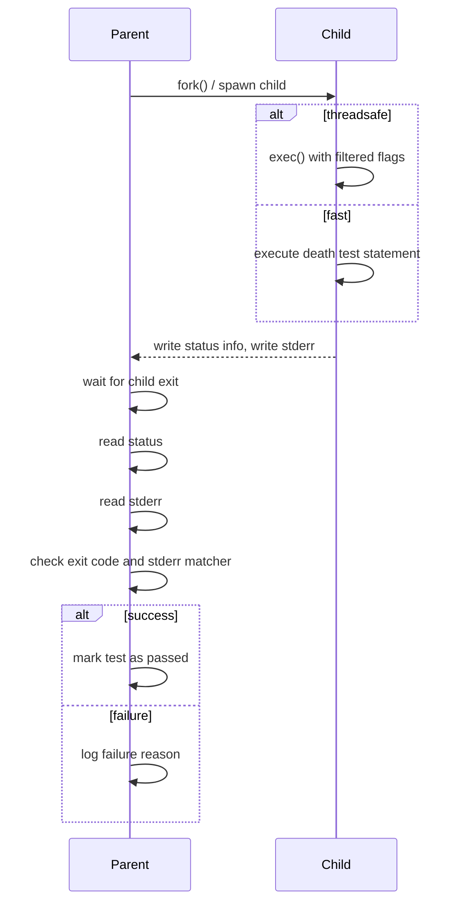

# Death Tests: Verifying Program Termination

### 1. Overview: Why Use Death Tests?
When you write robust applications, especially in defensive programming and error handling, it's vital to verify that your code fails exactly when and how it should. Death tests provide a way to assert that a piece of code causes the program to terminate — such as through assertions, aborts, or fatal errors — and not just silently continue.

This page guides you through using death tests in GoogleTest, explaining when they’re needed, how to write them, how death tests work internally, and practical tips to avoid pitfalls.

### 2. Prerequisites
- Basic familiarity with GoogleTest and writing tests using `TEST` or `TEST_F` macros.
- Your test executable should be built with death test support enabled (usually the default on supported platforms).
- Understanding of your platform’s constraints around forking and process termination.

### 3. What You Will Achieve
- Learn how to write death tests that verify program termination in expected ways.
- Understand different death test styles and how to select them.
- Gain practical tips to debug death test failures and avoid common threading pitfalls.
- Recognize the limits and best practices around writing stable death tests.

### 4. Time Estimate & Difficulty
- Estimated setup and first test: 15-30 minutes
- Intermediate knowledge of C++ and GoogleTest is recommended

---

## How to Write a Death Test

Death tests use GoogleTest macros designed specifically for verifying that code terminates with expected exit conditions and error messages.

### Key Macros

| Macro | Purpose |
|---|---|
| `ASSERT_DEATH(statement, matcher)` | Assert that `statement` causes process death, matching `stderr` against `matcher`. Fails fatally on failure. |
| `EXPECT_DEATH(statement, matcher)` | Like `ASSERT_DEATH`, but is non-fatal on failure, allowing the test to continue. |
| `ASSERT_EXIT(statement, predicate, matcher)` | Assert process exit status satisfies `predicate` and output matches `matcher`.
| `EXPECT_EXIT(statement, predicate, matcher)` | Non-fatal variant of `ASSERT_EXIT`.
| `EXPECT_DEATH_IF_SUPPORTED(statement, matcher)` | Like `EXPECT_DEATH`, but only runs on supported platforms (avoids failure if unsupported).
| `ASSERT_DEATH_IF_SUPPORTED(statement, matcher)` | As above, fatal variant.
| `EXPECT_DEBUG_DEATH(statement, matcher)` | In debug mode, acts like `EXPECT_DEATH`; otherwise just executes the statement.
| `ASSERT_DEBUG_DEATH(statement, matcher)` | As above, fatal variant.

### Example Usage
```cpp
TEST(FooDeathTest, DiesOnInvalidArgument) {
  ASSERT_DEATH(MyFunction(-1), "invalid argument");
}

TEST(FooDeathTest, ExitsCleanlyOnQuit) {
  EXPECT_EXIT(MyQuitFunction(), ::testing::ExitedWithCode(0), "shutting down");
}
```

### Matcher Parameter
- The `matcher` or regular expression string verifies the error output to `stderr` from the terminated child process.
- If a simple string is passed, it's treated as a regular expression using `ContainsRegex` semantics — meaning anywhere in the output is matched.
- You can also supply custom matchers from GoogleMock to be more expressive.

### Predicate Parameter (for `EXPECT_EXIT`/`ASSERT_EXIT`)
- The predicate is a callable that takes the int exit code and returns `true` if it's acceptable.
- GoogleTest provides built-in predicates:
  - `::testing::ExitedWithCode(0)` - exited normally with code 0
  - `::testing::KilledBySignal(signal_number)` - terminated by signal

---

## Step-by-Step: Adding a Death Test

<Steps>
<Step title="Write the Test Function">
Use `TEST` or `TEST_F` to define a test suite name ending with `DeathTest` (highly recommended) and a test name.
</Step>

<Step title="Add Death Test Assertion">
Use `ASSERT_DEATH` or `EXPECT_DEATH` inside the test body, providing the statement expected to cause termination and a regex matching the expected `stderr` output.
For exit code-specific tests, use `ASSERT_EXIT` or `EXPECT_EXIT` with suitable predicates.
</Step>

<Step title="Build and Run Tests">
Compile the test executable normally and run it. The GoogleTest framework will internally spawn a child process to run the death test.
</Step>

<Step title="Interpret the Results">
- If the death test passes, no additional output appears.
- If it fails, GoogleTest reports the cause (test did not die, exit code mismatch, or stderr mismatch), including the actual error output.
</Step>
</Steps>

---

## Detailed Guidance & Best Practices

### Naming Conventions
- Name your tests that include death tests with the suffix `DeathTest` on the test suite to prioritize their execution and track thread safety considerations.
-
### Choosing Death Test Style
- GoogleTest supports two death test styles:
  - **fast** (default on many platforms): forks and immediately runs the death statement in the child.
  - **threadsafe**: forks and re-executes the test binary with specific flags so the death test runs isolated, improving safety for concurrent threads.

Example to set style programmatically:
```cpp
GTEST_FLAG_SET(death_test_style, "threadsafe");
```

If you are running under tools like Valgrind or in environments with threads, prefer `threadsafe`.

### Writing Robust Death Tests
- Avoid side effects in death test statements, as memory leaks are not visible (child process terminates).
- Avoid multiple death tests on the same line (compilation error).
- Make sure the `matcher` regex accurately matches the intended error output.
- Don't use GoogleTest assertions that might return from the death test statement.
- Be wary of multithreading issues: death tests fork processes and some platforms' `fork()` is unsafe with multiple threads.

### Debugging Death Test Failures
- If a death test fails with “failed to die”:
  - Confirm the statement triggers termination.
  - Check your `matcher` regex; maybe stderr output differs.
- If failure is “died but not with expected exit code”:
  - Use `ASSERT_EXIT` with an explicit predicate checking the exit code.
- If failure is due to throwing an exception instead of dying:
  - Note exceptions aren't considered death; make sure your code truly aborts.
- Increase `--gtest_death_test_style=fast` vs `threadsafe` to isolate.

### Special Considerations
- Death tests spawn a child process; no memory modifications in that child affect the parent.
- GoogleTest warns if multiple threads are running at the start of a death test because forking then can cause deadlocks or hanging.

---

## How Death Tests Work Internally (Conceptual)
GoogleTest implements death tests by spawning a child process to run the death statement and observing its exit status and stderr output.

### Platform Differences
- **POSIX (Linux/macOS/Unix):** uses `fork()` or `clone()`.
- **Windows:** uses `CreateProcess()` with command-line flags to run only the specific death test.
- Styles supported:
  - **fast:** child process runs the statement immediately after `fork()`.
  - **threadsafe:** child process `exec`s the test binary with filtering flags.

### Process Flow


---

## Common Pitfalls and Troubleshooting

<AccordionGroup title="Common Issues and Solutions">
<Accordion title="Death Test Fails Because It Did Not Die">
Double-check your statement: does it really call `abort()`, `exit()`, or crash?
Make sure no mock leak detector prevents death.
</Accordion>

<Accordion title="Regex Matching Fails">
The error output differs from expectation. Simplify the regex or view actual stderr output as printed in failure message.
</Accordion>

<Accordion title="Interference from Multiple Threads">
Forking in a multithreaded program can cause deadlocks. Use `threadsafe` style or restructure your program to minimize threads during death tests.
</Accordion>

<Accordion title="Multiple Death Tests on Same Line Cause Compile Errors">
Separate death tests onto separate lines.
</Accordion>

<Accordion title="Death Test with Exceptions Fails Unexpectedly">
Throwing exceptions is not considered termination for death tests. Use death tests for `abort()`-style termination instead.
</Accordion>
</AccordionGroup>

---

## Practical Examples

```cpp
// Simple death test - expects any stderr containing "check failed".
TEST(MyDeathTest, CrashesOnInvalidInput) {
  ASSERT_DEATH(MyFunction(-1), "check failed");
}

// Exit code check.
TEST(MyDeathTest, ExitsWithCodeZero) {
  EXPECT_EXIT(CleanExit(), testing::ExitedWithCode(0), "shutting down");
}

// Using a custom matcher from gMock.
#include <gmock/gmock.h>
using ::testing::HasSubstr;

TEST(MyDeathTest, ContainsSpecificText) {
  EXPECT_DEATH(FailingFunction(), HasSubstr("Fatal error"));
}

// Death test inside a loop with context.
TEST(MyDeathTest, FailsMultipleCases) {
  for (int i = 0; i < 3; ++i) {
    EXPECT_DEATH(FuncThatDies(i), "error.*") << "i = " << i;
  }
}
```

---

## Next Steps & Related Content

- Explore [Advanced GoogleTest Patterns: Parameterized Tests](../advanced_testing_patterns/parameterized_tests.md) to efficiently test multiple conditions.
- Learn about [GoogleMock Basics](../getting_started/mocking_basics.md) when combining mocks and death tests.
- Consult the [Assertions Reference](../reference/assertions.md#death) for in-depth coverage of death assertions.
- Review [Troubleshooting & Common Issues](../first-tests-and-troubleshooting/troubleshooting-setup-issues.md) for setup problems impacting death tests.

---

<Tip>
Always name your test suites containing death tests with a `DeathTest` suffix. This helps GoogleTest prioritize their execution and correctly handle threading concerns.
</Tip>

<Note>
Death tests spawn a child process; side effects within death tests will not affect the parent process.
</Note>

<Warning>
Avoid running multiple death test assertions on the same source line, as this causes compile errors.
</Warning>
