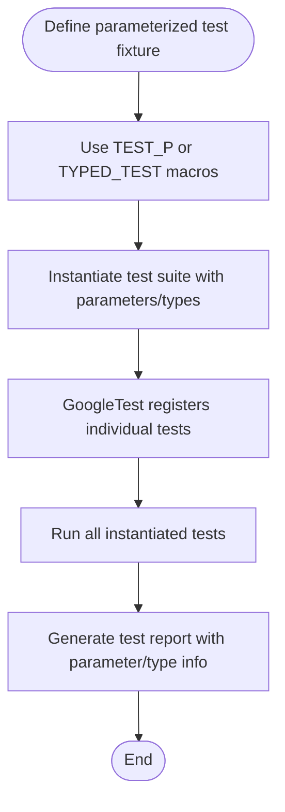

# Parameterization: Value- and Type-Parameterized Tests

## Overview

This guide walks you through effectively setting up and running tests against multiple input values and types without duplicating your code. You will learn how to define, instantiate, and leverage both **value-parameterized** and **type-parameterized** test patterns provided by GoogleTest to build reusable, maintainable, and scalable test suites.

### Prerequisites

- Basic familiarity with writing GoogleTest tests using `TEST` and `TEST_F` macros.
- Access to GoogleTest and ability to include `<gtest/gtest.h>` in your source files.
- Understanding of C++ templates and some familiarity with test fixtures.

### What You Will Achieve

- Write tests that run for multiple values or types without duplicating test code.
- Create parameterized test fixtures for value inputs.
- Instantiate these tests with flexible parameter generators.
- Define typed tests to verify behavior over sets of types.
- Use type-parameterized tests to declare abstract test patterns reusable with various type lists.

### Estimated Time

Approximately 20-30 minutes to read through and apply the patterns in your tests.

### Difficulty Level
Intermediate (requires understanding of test fixtures and templates)

---

## 1. Value-Parameterized Tests

### What Are They?
Value-parameterized tests allow you to run the same test logic repeatedly over a series of input values. This avoids code duplication and keeps tests concise and maintainable.

### How to Write Value-Parameterized Tests

#### Step 1: Define a Test Fixture

Create a test fixture class derived from `testing::TestWithParam<T>`, where `T` is the type of your test parameter (any copyable C++ type).

```cpp
class FooTest : public testing::TestWithParam<int> {
  // Usual fixture members
};
```

You can also inherit separately from your base fixture `Test` and `WithParamInterface` if you need a more complex hierarchy:

```cpp
class BaseTest : public testing::Test { ... };
class DerivedTest : public BaseTest, public testing::WithParamInterface<int> { ... };
```

#### Step 2: Define Parameterized Tests

Use the `TEST_P` macro instead of `TEST` or `TEST_F` to define your tests inside the fixture:

```cpp
TEST_P(FooTest, DoesSomething) {
  int param = GetParam();  // Access the parameter
  EXPECT_TRUE(Process(param));
}

TEST_P(FooTest, HandlesEdgeCase) {
  // Another test using the same parameter
}
```

> Inside the test body, call `GetParam()` to get the current test parameter value.

#### Step 3: Instantiate the Test Suite

Use the `INSTANTIATE_TEST_SUITE_P` macro to supply values for the tests. This macro associates the fixture with one or more parameter values.

```cpp
INSTANTIATE_TEST_SUITE_P(MyInts, FooTest, testing::Values(1, 2, 3));
```

The first argument `MyInts` is a unique prefix name for this instantiation.

You can use various parameter generators to flexibly supply parameters:

- `Values(v1, v2, ..., vN)` – explicit values
- `ValuesIn(container)` – values from STL containers or arrays
- `Range(begin, end [, step])` – generates a sequence from `begin` up to but not including `end`
- `Bool()` – generates `{false, true}`
- `Combine(g1, g2, ..., gN)` – generates all tuples from Cartesian products of generators

For example, to run a test with numbers 0-4:

```cpp
INSTANTIATE_TEST_SUITE_P(ZeroToFour, FooTest, testing::Range(0, 5));
```

Or combine two parameters:

```cpp
INSTANTIATE_TEST_SUITE_P(
    ComboTest, FooTest,
    testing::Combine(testing::Values(0, 1), testing::Bool()));
```

#### Step 4: (Optional) Customize Parameterized Test Names

You can provide a custom function to generate meaningful test name suffixes based on the parameter. This helps identify failing tests in output.

```cpp
INSTANTIATE_TEST_SUITE_P(
  NamedTests, FooTest, testing::Values(1, 2, 3),
  [](const testing::TestParamInfo<FooTest::ParamType>& info) {
    return "Value" + std::to_string(info.param);
  });
```

Each instantiated test will then have suffixes like `Value1`, `Value2`, etc.

### Best Practices & Tips

- Parameters can be any **copyable** C++ type. If you use pointers, manage their lifecycle carefully.
- `INSTANTIATE_TEST_SUITE_P` statements must be at global or namespace scope, not inside functions.
- Use `GTEST_ALLOW_UNINSTANTIATED_PARAMETERIZED_TEST` to suppress errors if you define but do not instantiate a parameterized test suite.
- Use detailed parameter names in instantiations for better test reports.

### Common Pitfalls

- Forgetting to instantiate your parameterized test suite leads to empty test runs.
- Supplying parameters that do not convert properly to the parameterized fixture's type causes compilation or runtime errors.
- Using underscores `_` in test or suite names is discouraged (see FAQ).

---

## 2. Typed Tests

### What Are They?
Typed tests let you run the same test logic repetitively over a fixed set of types known at compile time. *They are used when behavior depends on the type being tested.*

### How to Write Typed Tests

#### Step 1: Define a Fixture Class Template

Define a template fixture class parameterized over a type and derive it from `testing::Test`:

```cpp
template <typename T>
class MyTypedTest : public testing::Test {
 public:
  // Optionally define static or instance members useful for tests
  using List = std::list<T>;
  static T shared_value;
  T value_;
};

// Define static member outside
template <typename T>
T MyTypedTest<T>::shared_value = T();
```

#### Step 2: Specify a List of Types

Create a type list using `::testing::Types<...>`

```cpp
using MyTypes = ::testing::Types<char, int, unsigned int>;
```

#### Step 3: Associate the Fixture with the Type List

Use the `TYPED_TEST_SUITE` macro:

```cpp
TYPED_TEST_SUITE(MyTypedTest, MyTypes);
```

#### Step 4: Write Typed Tests

Use the `TYPED_TEST` macro to define tests that will run per type in the list:

```cpp
TYPED_TEST(MyTypedTest, DoesBasicOperations) {
  TypeParam val = this->value_;
  val += TestFixture::shared_value;
  EXPECT_TRUE(DoSomething(val));
}

TYPED_TEST(MyTypedTest, SupportsList) {
  typename TestFixture::List values;
  values.push_back(this->value_);
  EXPECT_FALSE(values.empty());
}
```

- Use `TypeParam` inside tests to refer to the current type.
- Access fixture members via `this->` or `TestFixture::`.

### Notes

- `TYPED_TEST_SUITE` must be declared before test definitions.
- For a single-type list, you can use `TYPED_TEST_SUITE(Fixture, int);` without `Types<>`.

### Use Cases

- Verifying multiple template instantiations.
- Ensuring consistent behavior across similar container types.

---

## 3. Type-Parameterized Tests

### What Are They?
Type-parameterized tests are similar to typed tests, but the list of types does not need to be known up front. This allows you to define abstract test patterns and instantiate them with different type lists across multiple translation units. This is ideal for verifying interface compliance or reusable test patterns.

### How to Write Type-Parameterized Tests

#### Step 1: Define a Fixture Class Template

Same as for typed tests, define your test fixture template:

```cpp
template <typename T>
class MyTypeParamTest : public testing::Test {
  // ...
};
```

#### Step 2: Declare a Type-Parameterized Test Suite

Use the `TYPED_TEST_SUITE_P` macro to declare the test suite template:

```cpp
TYPED_TEST_SUITE_P(MyTypeParamTest);
```

#### Step 3: Define Tests Using `TYPED_TEST_P`

Write the test cases:

```cpp
TYPED_TEST_P(MyTypeParamTest, DoesSomething) {
  TypeParam val = 0;
  // test implementation
}

TYPED_TEST_P(MyTypeParamTest, HasProperty) { ... }
```

#### Step 4: Register the Tests

Register the defined tests' names:

```cpp
REGISTER_TYPED_TEST_SUITE_P(MyTypeParamTest, DoesSomething, HasProperty);
```

#### Step 5: Instantiate the Test Suite with Types

Define the type list and instantiate the tests:

```cpp
using MyTypes = ::testing::Types<char, int, unsigned int>;
INSTANTIATE_TYPED_TEST_SUITE_P(MyInstantiation, MyTypeParamTest, MyTypes);
```

> Instantiations can be repeated in multiple files, supporting reusable unit tests.

---

## 4. Putting It All Together

### Example: Value-Parameterized Test

```cpp
#include <gtest/gtest.h>

class IsEvenTest : public testing::TestWithParam<int> {};

TEST_P(IsEvenTest, CheckEvenness) {
  int value = GetParam();
  EXPECT_EQ(value % 2, 0) << value << " is not even";
}

INSTANTIATE_TEST_SUITE_P(EvenNumbers, IsEvenTest, testing::Values(2, 4, 6, 8));
```

### Example: Typed Test

```cpp
#include <gtest/gtest.h>

template <typename T>
class ContainerTest : public testing::Test {
 public:
  using ValueType = T;
};

using MyTypes = testing::Types<std::vector<int>, std::list<int>>;
TYPED_TEST_SUITE(ContainerTest, MyTypes);

TYPED_TEST(ContainerTest, DefaultConstructorCreatesEmptyContainer) {
  TypeParam container;
  EXPECT_EQ(container.size(), 0);
}
```

### Example: Type-Parameterized Test

```cpp
#include <gtest/gtest.h>

template <typename T>
class NumericTest : public testing::Test {};

TYPED_TEST_SUITE_P(NumericTest);

TYPED_TEST_P(NumericTest, IsZeroOnDefaultConstruction) {
  TypeParam n{};
  EXPECT_EQ(n, 0);
}

REGISTER_TYPED_TEST_SUITE_P(NumericTest, IsZeroOnDefaultConstruction);

using NumericTypes = ::testing::Types<int, long, short>;
INSTANTIATE_TYPED_TEST_SUITE_P(MyNumericTests, NumericTest, NumericTypes);
```

---

## 5. Troubleshooting and Tips

### Common Issues

- **No tests run:** Make sure your parameterized tests are properly instantiated.
- **Duplicate test names:** When using `INSTANTIATE_TEST_SUITE_P`, the first argument must be unique per test suite to avoid naming collisions.
- **Parameters not convertible:** Ensure parameters in generators are compatible with your fixture's `ParamType`.
- **Test names contain illegal characters:** Custom test name generators must only produce alphanumeric or underscore characters.

### Best Practices

- Use `testing::ValuesIn()` to avoid duplication when your parameters already exist in a container.
- Use `Combine()` to test multiple parameter combinations systematically.
- Use `ConvertGenerator()` if you need to convert generated parameter types explicitly to your fixture parameter type.
- Use `GTEST_ALLOW_UNINSTANTIATED_PARAMETERIZED_TEST` if a parameterized test suite will be instantiated dynamically or in other translation units.
- Mark `SetUpTestSuite()` and `TearDownTestSuite()` as public if your fixture uses `TEST_P`.
- Prefer to keep your parameterized test fixture simple; complex inheritance can lead to maintenance challenges.

---

## 6. Next Steps & Resources

- Explore [Value-Parameterized Tests](../advanced.md#value-parameterized-tests) for in-depth guidance.
- Read about [Typed Tests](../advanced.md#typed-tests) and [Type-Parameterized Tests](../advanced.md#type-parameterized-tests) for variations in type-driven testing.
- Check out sample test files like [`sample7_unittest.cc`](https://github.com/google/googletest/blob/main/googletest/samples/sample7_unittest.cc) and [`sample8_unittest.cc`](https://github.com/google/googletest/blob/main/googletest/samples/sample8_unittest.cc) for working examples.
- Use the [Testing Reference](reference/testing.md) for API details on macros and helper functions.
- Consider customizing test names with lambdas or functors to improve test output readability.

---

## Diagram: Test Instantiation Workflow



---

<Info>
For more concrete guidance on parameterized test naming conventions and writing tests, review the [GoogleTest FAQ on test names](../faq.md#why-should-test-suite-names-and-test-names-not-contain-underscore).
</Info>

<Note>
The parameter generator expressions are evaluated during test initialization (`InitGoogleTest()`), permitting dynamic determination of test parameters based on runtime state.
</Note>