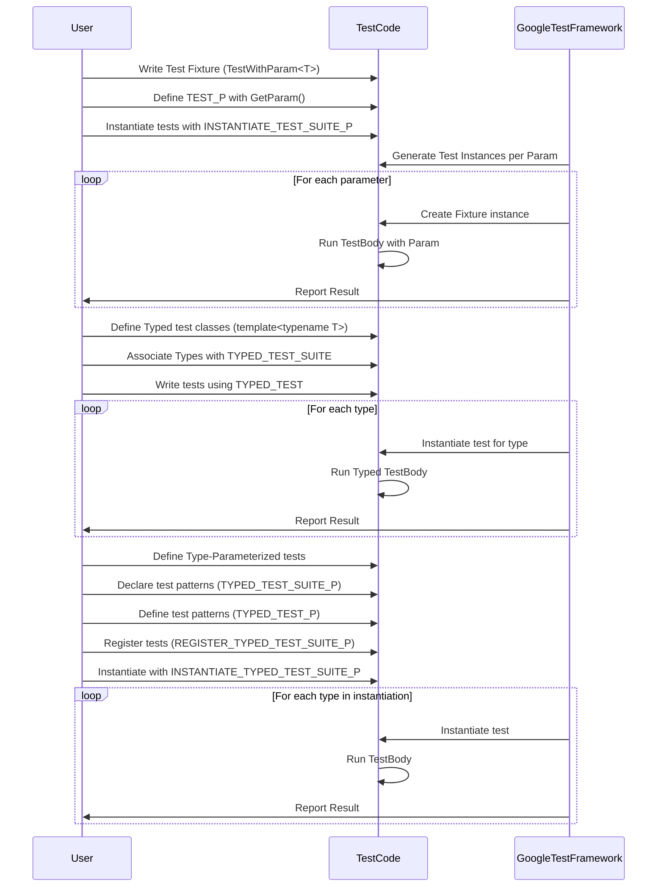

# Parameterized and Type-Parameterized Tests

GoogleTest provides powerful mechanisms to write tests that run over multiple data values or types, enabling you to maximize test coverage with minimal code duplication. This page guides you through writing value-parameterized tests and type-parameterized tests, showing practical examples and design principles for reusable, data-driven test cases.

---

## 1. Workflow Overview

### Purpose
This guide helps you write tests that are executed multiple times using different data input values or type parameters, enabling broad and efficient coverage of different scenarios without redundant code.

### Prerequisites
- Familiarity with writing basic GoogleTest tests using `TEST` and `TEST_F`.
- Your test project is configured with GoogleTest and includes `<gtest/gtest.h>`.
- Understanding of C++ templates and basic class inheritance.

### Expected Outcome
You will be able to:
- Define value-parameterized tests that run the same test logic with varying input data.
- Use type-parameterized tests to run the same tests across various C++ types.
- Instantiate these tests with parameter generators and type lists.
- Design new test fixtures reusable across multiple parameter sets.

### Estimated Time
15-30 minutes to read and apply with examples.

### Difficulty Level
Intermediate (basic C++ and testing knowledge needed).

---

## 2. Value-Parameterized Tests

Value-parameterized tests let you run the same test logic repeatedly with different data values, maximizing coverage without duplicating test definitions.

### 2.1 Defining a Value-Parameterized Test Fixture

1. Define a test fixture class inheriting from `testing::TestWithParam<T>`, where `T` is the type of test parameter.
2. Implement your tests using the `TEST_P` macro with this fixture.
3. Access the current parameter value inside your test body using `GetParam()`.

```cpp
class FooTest : public testing::TestWithParam<int> { };  // Parameter type: int

TEST_P(FooTest, HandlesPositiveValues) {
  int param = GetParam();
  EXPECT_GT(param, 0);
}
```

### 2.2 Instantiating Parameterized Tests

Use `INSTANTIATE_TEST_SUITE_P` to supply the parameter values that will drive your tests:

```cpp
INSTANTIATE_TEST_SUITE_P(
    PositiveInts,
    FooTest,
    testing::Values(1, 2, 10));
```

This generates and runs tests `PositiveInts/FooTest.HandlesPositiveValues/0` (param=1), `/1` (param=2), and `/2` (param=10).

### 2.3 Parameter Generators

GoogleTest offers generators to create test parameters:

| Generator          | Description                                                   | Example                                 |
|--------------------|---------------------------------------------------------------|-----------------------------------------|
| `Values(...)`      | Explicit list of values.                                      | `Values(1, 2, 3)`                       |
| `ValuesIn(container)` | Use values from containers or arrays.                      | `ValuesIn(arr)`                         |
| `Range(start, end, step)` | Numeric range excluding `end`. Defaults to step=1.   | `Range(0, 5, 2)` produces 0, 2, 4      |
| `Bool()`            | Produces `false` and `true`.                                  | `Bool()`                               |
| `Combine(g1, g2, ...)` | Cartesian product of generators `g1`, `g2`,...           | `Combine(Bool(), Values(0,1))`         |

Example with container:

```cpp
const char* kAnimals[] = {"cat", "dog"};
INSTANTIATE_TEST_SUITE_P(Animals, FooTest, testing::ValuesIn(kAnimals));
```

### 2.4 Naming Parameterized Tests

You can customize test names by providing a name generator function:

```cpp
INSTANTIATE_TEST_SUITE_P(
    NamedTests,
    FooTest,
    testing::Values(10, 20),
    [](const testing::TestParamInfo<int>& info) {
        return "Param" + std::to_string(info.param);
    });
```

### 2.5 Important Tips for Value-Parameterized Tests

- The fixture’s `SetUpTestSuite` and `TearDownTestSuite` methods must be **public** for use with `TEST_P`.
- Define parameterized tests at namespace or global scope, not inside functions.
- Use `GTEST_ALLOW_UNINSTANTIATED_PARAMETERIZED_TEST(<FixtureName>)` to suppress errors if you define a parameterized test without an instantiation.

---

## 3. Typed Tests

Typed tests allow you to repeat the same test logic across a fixed list of C++ types, useful when testing multiple implementations or type variants.

### 3.1 Defining a Typed Test Fixture

1. Define a class template fixture derived from `testing::Test`:

```cpp
template <typename T>
class MyTypedTest : public testing::Test {
 public:
  T value_ {};
};
```

2. Specify the list of types that will be tested:

```cpp
using MyTypes = testing::Types<int, double, char>;
TYPED_TEST_SUITE(MyTypedTest, MyTypes);
```

### 3.2 Writing Typed Tests

Use `TYPED_TEST` to write tests that run for each type:

```cpp
TYPED_TEST(MyTypedTest, DefaultValueIsZero) {
  TypeParam val = this->value_;
  EXPECT_EQ(val, TypeParam{});
}
```

Inside the test, `TypeParam` represents the current type being instantiated.

### 3.3 Instantiating Typed Tests

Typed tests are automatically instantiated for all types listed in `TYPED_TEST_SUITE`.

### 3.4 Custom Type Names

You may supply a type name generator class to customize test suite names:

```cpp
class MyTypeNames {
 public:
  template <typename T>
  static std::string GetName(int) {
    if constexpr (std::is_same_v<T, int>) return "Int";
    if constexpr (std::is_same_v<T, double>) return "Double";
    if constexpr (std::is_same_v<T, char>) return "Char";
    return "Unknown";
  }
};
TYPED_TEST_SUITE(MyTypedTest, MyTypes, MyTypeNames);
```

---

## 4. Type-Parameterized Tests

Type-parameterized tests are abstract test definitions that can be instantiated with arbitrary type lists, supporting reusable test patterns without knowing the types beforehand.

### 4.1 Defining a Type-Parameterized Test Suite

1. Define a template fixture class:

```cpp
template <typename T>
class MyParamTest : public testing::Test {};
```

2. Declare it as a type-parameterized test suite with `TYPED_TEST_SUITE_P`:

```cpp
TYPED_TEST_SUITE_P(MyParamTest);
```

3. Define tests using `TYPED_TEST_P`:

```cpp
TYPED_TEST_P(MyParamTest, PerformsOperation) {
  TypeParam val{};
  // Test logic here
}
```

4. Register your tests with `REGISTER_TYPED_TEST_SUITE_P`:

```cpp
REGISTER_TYPED_TEST_SUITE_P(MyParamTest, PerformsOperation);
```

### 4.2 Instantiating Type-Parameterized Tests

Use `INSTANTIATE_TYPED_TEST_SUITE_P` to specify the actual types:

```cpp
using MyTypes = testing::Types<int, float>;
INSTANTIATE_TYPED_TEST_SUITE_P(MyInstances, MyParamTest, MyTypes);
```

---

## 5. Practical Examples

### 5.1 Value-Parameterized Test Example

```cpp
#include <gtest/gtest.h>

class IsEvenTest : public testing::TestWithParam<int> {};

TEST_P(IsEvenTest, HandlesEvenNumbers) {
  int n = GetParam();
  EXPECT_EQ(n % 2, 0) << n << " is not even";
}

INSTANTIATE_TEST_SUITE_P(Examples, IsEvenTest, testing::Values(2, 4, 6, 8));
```

### 5.2 Typed Test Example

```cpp
#include <gtest/gtest.h>

template <typename T>
class DefaultValueTest : public testing::Test {
 public:
  T value_{};
};

using MyTypes = testing::Types<int, double, char>;
TYPED_TEST_SUITE(DefaultValueTest, MyTypes);

TYPED_TEST(DefaultValueTest, IsZeroByDefault) {
  EXPECT_EQ(this->value_, TypeParam{});
}
```

### 5.3 Type-Parameterized Test Example

```cpp
#include <gtest/gtest.h>

template <typename T>
class AbstractFixture : public testing::Test {};

TYPED_TEST_SUITE_P(AbstractFixture);

TYPED_TEST_P(AbstractFixture, ExampleTest) {
  TypeParam val{};
  EXPECT_EQ(val, TypeParam{});
}

REGISTER_TYPED_TEST_SUITE_P(AbstractFixture, ExampleTest);

using Types = testing::Types<int, float>;
INSTANTIATE_TYPED_TEST_SUITE_P(MyInstantiations, AbstractFixture, Types);
```

---

## 6. Troubleshooting & Tips

### Common Issues
- **Assertion failures with parameters:** Confirm that parameter values are valid and correctly passed.
- **Test names clashes:** Ensure unique instantiation names and follow naming conventions.
- **TestFixture `SetUpTestSuite` visibility:** Must be declared public when used with `TEST_P`.
- **No tests run in parameterized tests:** Confirm that `INSTANTIATE_TEST_SUITE_P` is called; otherwise, the tests won't execute.
- **Handler for non-copyable types:** Use custom name generators if default printing doesn't work with complex parameter types.

### Best Practices
- Use parameter generators like `Combine` to create comprehensive test scenarios.
- Keep parameter names meaningful and avoid underscores for test suite and test names.
- Break down complex tests into multiple parameterized tests for clarity.
- Use `SCOPED_TRACE` to provide context in complex parameterized tests with loops or subroutine calls.

### Performance Considerations
- Instantiating too many parameters exponentially increases test runtime; balance test coverage with practical time limits.

---

## 7. Next Steps & Related Content

- Explore the [GoogleTest Primer](primer.md) for basics on writing tests and assertions.
- Learn about [Global Setup and Teardown](advanced.md#global-set-up-and-tear-down) to manage expensive shared resources.
- Consult the [Testing Reference](reference/testing.md) for detailed descriptions of macros and functions.
- Advance to [Writing Your First Test](guides/core_testing_workflows/writing_first_test) for entry-level practical projects.
- For complex scenarios involving types, look into [Typed Tests](advanced.md#typed-tests).
- For parameter combinations, refer to the `Combine` generator in [Value-Parameterized Tests](advanced.md#value-parameterized-tests).

---

## 8. Diagram: Parameterized Test Flow



---