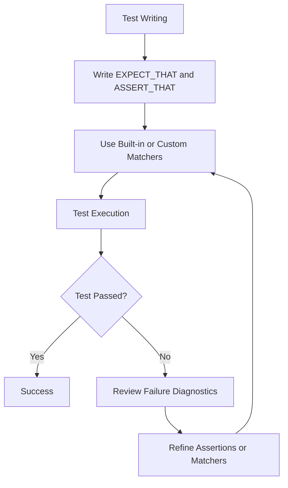

# Expressive Assertions and Custom Matchers

Harness the full spectrum of GoogleTest and GoogleMock assertions and matchers to write clear, intent-revealing tests. This guide offers practical recipes for using core and custom matchers effectively, with guidance on best practices to maximize readability and diagnostic quality.

---

## 1. Understanding Expressive Assertions and Matchers

### What This Guide Helps You Accomplish
This guide empowers you to write tests that clearly express intent by:

- Leveraging GoogleTest assertions and GoogleMock matchers to validate behavior precisely.
- Crafting custom matchers when built-in ones don’t fit your needs.
- Improving test diagnostics and readability through expressive assertions.

### Prerequisites
Ensure you have:

- A working GoogleTest and GoogleMock setup.
- Basic familiarity with writing tests using `EXPECT_CALL`, `ON_CALL`, and `EXPECT_THAT`.

### Expected Outcome
By the end of this guide, you will:

- Understand how to use a wide variety of assertion macros and matchers.
- Know how to create custom matchers to capture complex validation logic.
- Be able to write tests that are maintainable, clear, and offer rich failure reporting.

### Time Estimate
Approximately 30-45 minutes to read and practice.

### Difficulty Level
Intermediate to Advanced.

---

## 2. Using Built-In Assertions and Matchers Effectively

### The Basics of Assertions in GoogleTest
GoogleTest provides a range of assertions for checking test conditions. In particular, assertions like `EXPECT_THAT` allow you to combine the power of matchers with assertions to write readable and expressive tests.


### Using `EXPECT_THAT` with Matchers
The `EXPECT_THAT` macro verifies that a given value matches a matcher. It reads like an English sentence and generates clear failure messages.

```cpp
#include <gmock/gmock.h>
using ::testing::StartsWith;

EXPECT_THAT(name, StartsWith("John"));
```

If the assertion fails, the diagnostic will clearly show the actual string and what was expected (a prefix "John").

### Basic Built-in Matchers to Know
- `_` — matches any value (wildcard).
- `Eq(value)` — equals.
- `Ne(value)` — not equal.
- `Ge(value)`, `Gt(value)`, `Le(value)`, `Lt(value)` — relational.
- `Contains(e)` — container contains an element.
- `ElementsAre(...)` and `UnorderedElementsAre(...)` — container element matching.

### Combining Matchers
Matchers can be combined to express complex conditions:

```cpp
using ::testing::AllOf;
using ::testing::Not;

EXPECT_THAT(value, AllOf(Ge(5), Not(Eq(10))));
```

This asserts that `value` is greater or equal to 5 and not equal to 10.

---

## 3. Writing Custom Matchers

When standard matchers don't meet your needs, define custom matchers to clearly express your intent.

### Defining a Matcher with the `MATCHER` Macro
Simplest way to define a matcher that tests a property of a value.

```cpp
MATCHER(IsEven, "checks if a number is even") {
  return (arg % 2) == 0;
}
```

Usage:
```cpp
EXPECT_THAT(n, IsEven());
```

### Parameterized Custom Matchers
Use `MATCHER_P` to allow parameters. For example:

```cpp
MATCHER_P(IsDivisibleBy, divisor, "checks if divisible by divisor") {
  if (arg % divisor == 0) return true;
  *result_listener << "which has remainder " << (arg % divisor);
  return false;
}

EXPECT_THAT(14, IsDivisibleBy(7));
```

This matcher prints the remainder if the match fails, improving diagnostics.

### Advanced: Implementing Matcher Classes
For reusable or complex matchers, create a class implementing the matcher interface. This approach gives more control and better compile-time errors.

---

## 4. Best Practices for Expressive Assertions and Matchers

### Focus on Intent
Write assertions that state what you expect, not how.

### Minimize Over-Specification
Don't assert more than necessary to make your tests robust against unrelated changes.

### Use Custom Matchers Wisely
Write custom matchers only when needed to improve readability or failure diagnostics.

### Leverage Matchers for Containers and Complex Types
Use `ElementsAre`, `Contains`, `Field`, `Property`, and others to validate containers or object members instead of verbose loops or manual checks.

### Make Use of Diagnostic Explanations
Stream supplementary information in your custom matchers using `result_listener` to help debug failures.

---

## 5. Practical Examples

### Example 1: Asserting a Range Using Composite Matchers

```cpp
EXPECT_THAT(value, AllOf(Ge(0), Le(100)));
```

### Example 2: Validating a Member Variable of an Object

```cpp
// Suppose Foo has an int member 'count'.
EXPECT_THAT(foo_obj, Field(&Foo::count, Ge(5)));
```

### Example 3: Matching a Container with Elements in Any Order

```cpp
std::vector<int> v = {4, 3, 1};
EXPECT_THAT(v, UnorderedElementsAre(1, 3, 4));
```

### Example 4: Creating and Using a Parameterized Custom Matcher

```cpp
MATCHER_P(IsBetween, lower, upper, "checks if value in range") {
  return arg >= lower && arg <= upper;
}

EXPECT_THAT(value, IsBetween(10, 20));
```

---

## 6. Troubleshooting & Tips

### Common Pitfalls

- **Omitting matcher parameters accidentally:** A bare value in `EXPECT_CALL` or `EXPECT_THAT` is treated as `Eq(value)`; beware of unintended implicit conversions.
- **Overly Strict Expectations:** Using many specific expectations can cause brittle tests; prefer broad expectations and minimal verification.
- **Custom Matcher Side-effects:** Matchers must be pure and side-effect free.

### Tips

- Use `ON_CALL` to define default mock behaviors when you don’t want to enforce calls explicitly.
- Use `StrictMock` or `NiceMock` to control how uninteresting calls behave.
- In custom matchers, always provide informative failure messages by streaming to `result_listener`.

### Performance & Readability
Keep matchers simple for performance. Complex matchers can impact test runtime and obscure intent.

---

## 7. Next Steps & Additional Resources

- **Expand Your Matcher Knowledge:** Dive into the [Matchers Reference](../reference/matchers.md) for an exhaustive list of built-in matchers.
- **Explore Custom Matchers:** See [gMock Cookbook](../guides/gmock_cook_book.md#NewMatchers) for more on creating robust custom matchers.
- **Learn about Mocking:** For how assertions and matchers tie into mocking, refer to [Mocking Basics](../guides/getting_started/mocking_basics.md).
- **Advanced Assertions:** Explore other assertion macros in [Assertions Reference](../reference/assertions.md).

---

## Code & Configuration Examples

```cpp
// Example: Using composite matchers with EXPECT_THAT
using ::testing::AllOf;
using ::testing::Gt;
using ::testing::Lt;
EXPECT_THAT(x, AllOf(Gt(0), Lt(10)));  // x is between 1 and 9

// Custom matcher example
MATCHER(IsMultipleOfTen, "checks multiple of 10") {
  return (arg % 10) == 0;
}
EXPECT_THAT(value, IsMultipleOfTen());

// Matching container elements
std::vector<int> v = {1, 2, 3};
EXPECT_THAT(v, ElementsAre(1, 2, 3));

// Matching member variable
struct Foo { int count; };
Foo foo{42};
EXPECT_THAT(foo, Field(&Foo::count, Gt(40)));

// Using Actions within EXPECT_CALL
using ::testing::Return;
EXPECT_CALL(mock_obj, Method(_)).WillOnce(Return(42));
```

---

## Diagram: How Assertions & Matchers Fit in the Testing Workflow



---

<Tip>
Maximize your test clarity and maintainability by writing expressive assertions with appropriate matchers. Avoid over-specifying expectations to ensure tests are robust but precise.
</Tip>
<Note>
Matchers and assertions form the core language that expresses test intent; mastering them empowers precision and improved diagnostics.
</Note>
<Warning>
Matchers must be pure: avoid side effects in custom matcher implementations to prevent subtle bugs.
</Warning>

---

