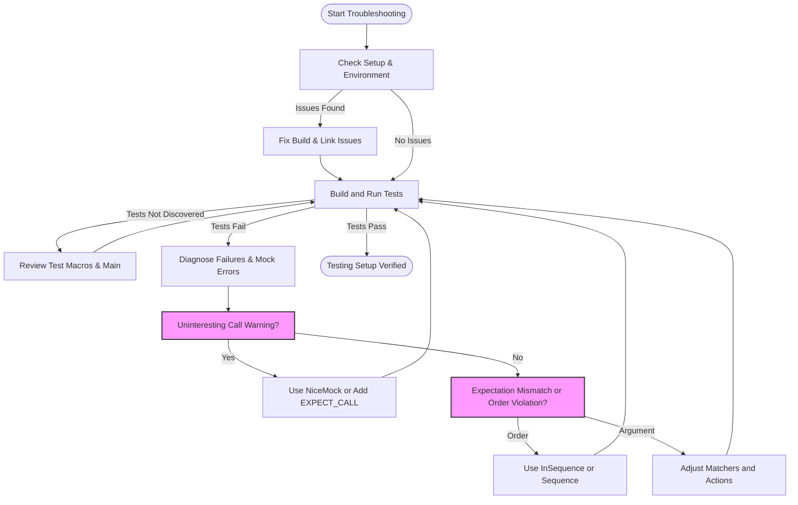

# Troubleshooting Common Issues

A practical guide to diagnosing and resolving frequent problems encountered when running or configuring tests with GoogleTest and GoogleMock. This guide helps you quickly get unstuck by addressing common pitfalls and errors, along with pointers to FAQ and community support.

---

## 1. Common Installation and Setup Problems

Before diving into test failures, ensure your environment and project configuration are correct.

### 1.1 Compiler and Linker Errors

- **Symptom:** Errors linking GoogleTest or GoogleMock symbols.
- **Cause:** Incorrect linkage or missing GoogleTest libraries.
- **Action:**
  1. Verify that your build system correctly links `gtest` and `gmock` libraries.
  2. For CMake projects, consult the [Configuring Your Project](https://google.github.io/googletest/getting-started/setup-prerequisites-installation/configuring-your-project) guide.
  3. Make sure you have included `<gmock/gmock.h>` and linked against the right binaries.
  
### 1.2 Test Discovery and Execution Issues

- **Symptom:** Test cases are not found or not executed.
- **Cause:** Improper macro use, missing `RUN_ALL_TESTS()`, or missing initialization.
- **Action:**
  1. Use `TEST()` or `TEST_F()` macros properly to define tests.
  2. Call `testing::InitGoogleTest()` before `RUN_ALL_TESTS()`.
  3. Confirm that your test executable is correctly built and run.
  4. See the guide on [Running Tests and Interpreting Results](https://google.github.io/googletest/getting-started/first-test-validation/running-tests-and-interpreting-results) for detailed steps.

---

## 2. gMock Specific Issues

GoogleMock extends GoogleTest with mock objects. Common issues revolve around expectations and mock method behavior.

### 2.1 Real Object Method Called Instead of Mock

- **Symptom:** Calling a mock method invokes the real implementation unexpectedly.
- **Cause:** The method must be `virtual` to be mocked unless using advanced techniques.
- **Solution:** 
  1. Confirm the base class methods you want to mock are declared `virtual`.
  2. See [Legacy gMock FAQ: When I call a method on my mock object...](https://google.github.io/googletest/gmock_faq.html) for details.

### 2.2 Mock Method Warnings and Unexpected Calls

- **Warning:** "Uninteresting function call encountered - default action taken..."
- **Explanation:** A mock method was called without an `EXPECT_CALL` defined.
- **Resolution:**
  1. Add an appropriate `EXPECT_CALL` if the call should be expected.
  2. Use `NiceMock` to suppress warnings if those calls are truly uninteresting.
  3. Use `StrictMock` if you want to treat uninteresting calls as failures.

### 2.3 Expectation Mismatches and Ordering

- **Common Issue:** Tests fail because expectations on mock calls are not met or called out-of-order.
- **Tips:**
  1. Set **expectations before** exercising the code.
  2. Use `InSequence` or `Sequence` objects to enforce order if needed.
  3. Avoid overlapping or conflicting expectations; remember expectations are sticky by default.
  4. Use `.RetiresOnSaturation()` to have temporary expectations retire after use.

### 2.4 Matchers and Argument Expectations

- **Symptom:** Test fails due to argument mismatches.
- **Tips:**
  1. Use built-in matchers like `_` (anything), `Eq()`, `Ge()`, etc., for flexible matching.
  2. Use `Truly()` for custom predicates when built-in matchers are insufficient.
  3. If your method is overloaded, help disambiguate by specifying argument types or using `Const()`.

### 2.5 Handling Actions and Return Behavior

- **Issue:** Unexpected or incorrect return values from mock methods.
- **Solutions:**
  1. Use `WillOnce(Return(value))` and `WillRepeatedly(Return(value))` to control return values.
  2. For successive calls, chain `WillOnce()` for each expected return, then optionally `WillRepeatedly()`.
  3. Use lambdas or `Invoke()` to implement complex behavior or side effects.
  4. When working with move-only types (e.g., `std::unique_ptr`), avoid `Return(std::move(...))` repeatedly; prefer lambdas.

---

## 3. Diagnosing Test Failures

When a test fails due to unmet expectations or mocked calls:

### 3.1 Verbosity and Diagnostics

- **Enable detailed logs:** Run with `--gmock_verbose=info` to trace exact calls, matching rules, and stack traces.
- **Inspect error messages:** They often include call counts, argument mismatches, and unsatisfied expectation details.

### 3.2 Common Failure Scenarios

- **Too many calls:** If a mock method is called more times than expected, it triggers an "excessive call" failure. Consider relaxing `Times()`, or use `.RetiresOnSaturation()`.
- **Unexpected calls:** Mock methods called with arguments not matching any `EXPECT_CALL` cause failure.
- **Order violations:** Calls happening outside expected sequences raise errors. Use sequences or `After()` clauses.

### 3.3 Heapcheck Failures

- **Symptom:** Using mocks triggers heap checker errors.
- **Cause:** Missing `virtual` destructors in base classes of mocks.
- **Fix:** Always declare destructors of base interfaces virtual to ensure proper cleanup.

---

## 4. Best Practices and Tips

### 4.1 Use ON_CALL for Defaults, EXPECT_CALL for Expectations

Set mock default behaviors using `ON_CALL()` in test fixtures or constructors. Use `EXPECT_CALL()` sparingly to verify specific interactions.

### 4.2 Control Mock Strictness

- Use `NiceMock` to reduce noisy warnings for unimportant calls.
- Use `StrictMock` to catch all unexpected calls as test failures.

### 4.3 Avoid Over-Specifying

Too strict expectations make tests brittle. Specify only what you need.

### 4.4 Sequence Expectations for Ordered Testing

Use `InSequence` blocks or `Sequence` objects to mandate call order when required.

### 4.5 Force Verification When Needed

If your mock is heap-allocated and owned externally, consider calling `Mock::VerifyAndClearExpectations(&mock_obj)` before losing scope to catch errors early.

---

## 5. Additional Resources

For deeper dives and related topics, consult:

- [GoogleTest Primer](https://google.github.io/googletest/primer.md) — Introduction to writing and running tests.
- [gMock for Dummies](https://google.github.io/googletest/gmock_for_dummies.html) — Beginner-friendly mocking tutorial.
- [gMock Cookbook](https://google.github.io/googletest/gmock_cook_book.html) — Recipes for complex mocking scenarios.
- [Mocking Reference](https://google.github.io/googletest/reference/mocking.html) — Comprehensive API details.
- [Legacy gMock FAQ](https://google.github.io/googletest/gmock_faq.html) — Frequently asked questions for advanced troubleshooting.
- [Troubleshooting Common Getting Started Issues](https://google.github.io/googletest/getting-started/first-test-validation/troubleshooting-common-issues) — Early setup issues and fixes.

---

<AccordionGroup title="FAQ and Community Resources">
<Accordion title="Official GoogleTest FAQ">
Explore official FAQ for common questions and best practices: [GoogleTest FAQ](https://google.github.io/googletest/faq.html)
</Accordion>
<Accordion title="GoogleTest GitHub Repository">
Access source code, report issues, and contribute: [GitHub - google/googletest](https://github.com/google/googletest)
</Accordion>
<Accordion title="Community Help and Discussions">
Join forums, mailing lists, and Stack Overflow for peer support and discussions.
</Accordion>
</AccordionGroup>

---

<Check>
When you finish these troubleshooting steps, your tests should run smoothly without unexpected mock failures.
If problems persist, increase logging verbosity and review test code for expectation correctness.
</Check>

---

## Summary
This guide equips you to identify and resolve prevalent GoogleTest and GoogleMock issues, from installation hiccups through test failures involving mocks and expectations. With clear symptom-action mappings, best practices, and direct links to detailed resources, users can confidently address blockers for a smooth testing experience.

---

## Troubleshooting Flow Diagram

