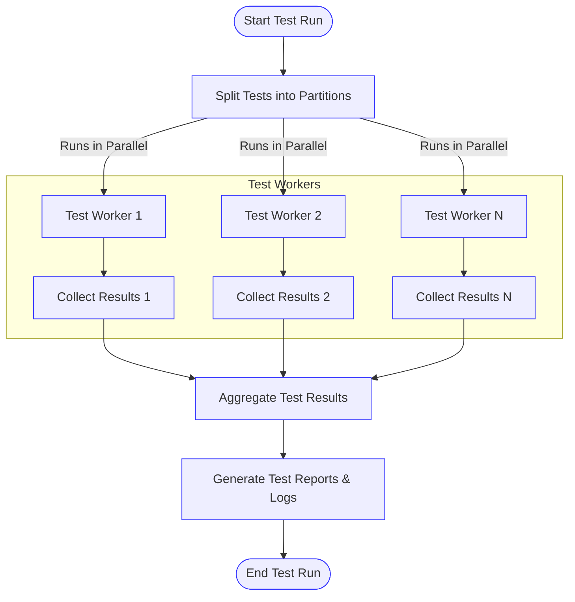

# Optimizing Test Performance

This guide provides practical techniques to speed up test execution, reduce flakiness, and integrate testing efficiently with build systems and continuous integration (CI) environments. It addresses parallel test execution, dependency management, and platform-specific best practices to maximize productivity and reliability.

---

## 1. Test Parallelization

Harnessing parallelism is one of the most effective ways to reduce overall test runtime. GoogleTest provides built-in support for running tests in parallel processes.

### Key Concepts

- **Test Sharding:** Split tests across multiple workers
- **Concurrent Test Execution:** Run multiple test processes simultaneously

### How to Run Tests in Parallel

1. Use the `--jobs=N` flag with your build system or test runner to run tests on *N* parallel workers.
2. GoogleTest can also run multiple test binaries concurrently when integrated with your build system.
3. Alternatively, use `--gtest_shuffle` to run tests in random order to detect test inter-dependencies and flakiness.

### Example: Running Tests in Parallel with Bazel
```sh
bazel test --test_sharding_strategy=disabled --jobs=8 //myproject:all_tests
```

### Verification Steps
- Ensure test results are consistent across repeated runs with and without parallel execution.
- Validate that tests pass independently when run isolated.

### Tips
- Tests must be written to be independent (no shared state or global dependencies) to avoid flakiness.
- Disable tests with known issues temporarily if they interfere with parallel runs.

---

## 2. Managing Test Dependencies

Reducing external dependencies and controlling resource usage in tests can significantly improve speed and robustness.

### Best Practices

- **Mock External Resources:** Use mocks or fakes to simulate databases, filesystems, network calls, and other expensive or flaky dependencies.
- **Use Scoped Setup/Teardown:** Minimize global setup to avoid costly operations before every test.
- **Selective Test Runs:** Use filtering options such as `--gtest_filter` to run only relevant subsets of tests during development.

### Example: Running a Specific Test Suite
```sh
test_binary --gtest_filter=MySuite.*
```

### Tips
- Avoid creating heavyweight mocks with large constructor overhead inside every test case.
- Reuse mock objects via fixtures to save setup time.

---

## 3. Platform-Specific Considerations

Accounting for your target platforms can help prevent flakiness and improve test speed.

### For Linux/macOS

- Use `make -j` or `ninja -j` parallel build to compile source and test faster.
- Leverage `ccache` for caching builds.
- Prefer out-of-source builds with CMake for clean environments.

### For Windows

- Utilize MSBuild parallel jobs with `/maxcpucount` flag.
- Ensure consistent environment setup to avoid flaky test failures.

### Cross-Platform

- Avoid tests depending on non-portable features or file system paths.
- Use test runners that support cross-platform parallelism.

---

## 4. Integration with Build Systems and CI

Efficient CI integration is critical to maintain fast feedback cycles.

### Recommendations

- **Test Partitioning:** Divide tests across CI agents to reduce wall time.
- **Caching:** Cache test artifacts and build outputs where possible.
- **Test Retries:** For flaky tests, configure limited retries in CI instead of disabling them.

### Best Practices

- Use GoogleTest's XML output via `--gtest_output=xml` to integrate with CI reporting tools.
- Use `Mock::VerifyAndClearExpectations()` in fixtures where destruction timing is uncertain to ensure timely verification.

---

## 5. Troubleshooting Common Performance Issues

| Issue                             | Cause                                    | Solution                                |
|----------------------------------|------------------------------------------|---------------------------------------|
| Slow test execution               | Heavy external dependencies or setup     | Use mocks, reduce setup, parallelize  |
| Flaky test failures during parallel runs | Shared or global state, race conditions | Isolate tests, avoid dependencies     |
| Test build times too long         | Recompilation of large mock classes      | Move mock implementations to .cc files|
| Excessive logging during tests    | High verbosity flags                      | Lower verbosity using `--gmock_verbose=warning`|

### Tips
- Enable `--gmock_verbose=info` during debugging to gain insights into mock calls and identify bottlenecks.
- Use test fixtures to isolate and share common setup/teardown.

---

## 6. Example: Parallel Test Execution in Practice

Suppose you have a test suite containing 200 tests. Running them sequentially takes 6 minutes.

To speed this up:

1. Set up your build tool or CI to run tests with 8 parallel threads.
2. If using Bazel:

```sh
bazel test --jobs=8 //myproject:all_tests
```

3. If tests depend on shared global state, modify them so they don't, or group dependent tests in exclusive suites.
4. Use `--gtest_shuffle` to detect if order dependencies exist.

Result: Test execution time should decrease close to 6 times faster (ideal case).

---

## 7. Summary

Optimizing test performance is a continuous process involving:

- Writing thread-safe and independent tests
- Using mocks to minimize external dependencies
- Leveraging parallelism in test execution and build
- Proper integration with build systems and CI
- Monitoring and addressing flaky tests

Following these practices will enable faster, more reliable test runs and more productive development cycles.

---

## Additional Resources

- [GoogleTest Quickstart & Next Steps](/overview/introduction-getting-started/quickstart-navigation)
- [Writing Clean, Maintainable Tests](/guides/best-practices-and-tuning/writing-clean-tests)
- [Mocking Basics: Using GoogleMock](/guides/mocking-and-advanced-techniques/mocking-basics)
- [Configuring Actions & Expectations](/guides/mocking-and-advanced-techniques/actions-and-expectations)
- [Organizing and Running Tests](/guides/everyday-workflows/organizing-test-structure)

---

## Troubleshooting & Tips

### Handling Flaky Tests
- Identify flaky tests by repeated runs or `--gtest_repeat=N`.
- For flaky tests, consider mocks or isolate their dependencies.
- Configure CI to retry flaky tests a limited number of times before failure.

### Avoiding Deadlocks in Parallel Tests
- Ensure no shared locks or conflicting global state.
- Use thread-safe constructs.

### Optimizing Mock Compilation Times
- Define mock class constructors and destructors out-of-line to reduce compile time.
- Limit the number of mocked methods in large mock classes.

### Diagnostic Flags
- Use `--gmock_verbose=info` to trace mock call matching.
- Use `--gtest_filter` to focus test runs.

<AccordionGroup title="Common Pitfalls & Recommendations">
<Accordion title="Tests fail or hang under parallel execution">

Check for:
- Shared state or globals without synchronization
- Tests with implicit dependencies on order
- Insufficient test isolation

Mitigation:
- Refactor tests to be stateless or use proper synchronization
- Use sequences or explicit mock ordering where necessary
</Accordion>

<Accordion title="Mock expectations not verified due to object leaking">

Use `Mock::VerifyAndClearExpectations(&mock_object)` when you need to force verification before destruction.
- Use heap checkers to detect leaks
- Avoid lazy deletion of mocks
</Accordion>

<Accordion title="Excessive warnings about uninteresting calls">

Solutions:
- Use `NiceMock<T>` to suppress warnings
- Add catch-all EXPECT_CALL with `Times(AnyNumber())`
- Adjust verbosity with `--gmock_verbose` flag
</Accordion>
</AccordionGroup>

---

## Diagram: Test Execution Flow with Parallelization




---

## Summary
This guide equips you with actionable strategies to improve test throughput and stability using GoogleTest and GoogleMock. You'll learn to leverage parallel execution, control dependencies with mocks, and integrate effectively with build and CI systems, along with practical troubleshooting advice.

---

## Practical Callouts
<Tip>
Prioritize writing independent tests to realize the full benefits of parallel execution.
</Tip>
<Note>
Use test suites and fixtures to organize and share common setup code effectively.
</Note>
<Warning>
Avoid introducing shared global state that can cause flakiness or deadlocks in parallel tests.
</Warning>
<Check>
Verify all mocks are properly destructed or explicitly verified before your test ends to prevent false positives.
</Check>

---