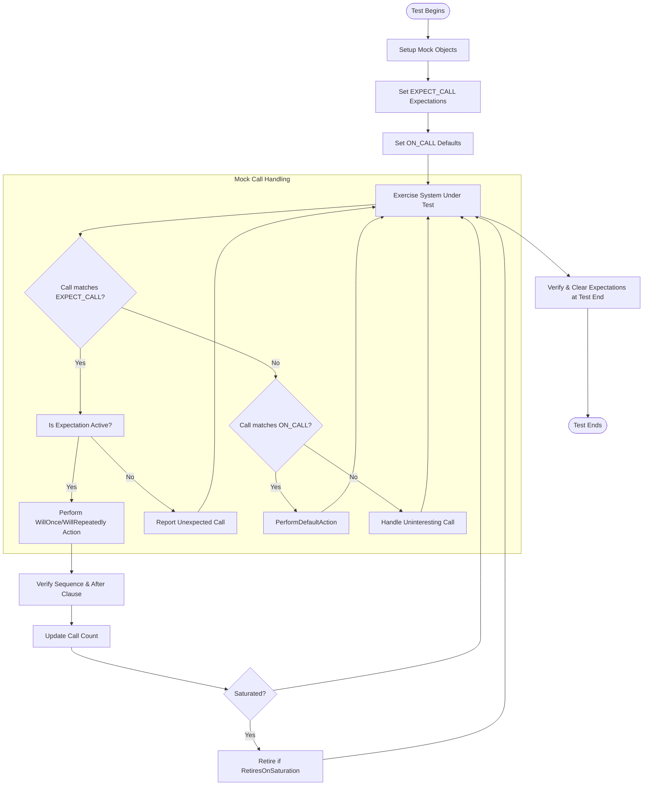

# Writing Clean, Maintainable Tests

Effective test code is as crucial as production code when it comes to software quality. This guide covers practical principles and checklists to help you write tests that are easy to read, robust against change, and scalable as projects grow. By focusing on clarity, simplicity, and maintainability, you ensure your tests remain valuable assets throughout the software lifecycle.

---

## 1. Test Design Principles

### Define Clear Test Intent

- **Purpose-Driven Tests:** Each test should verify a single behavior or contract, minimizing ambiguity.
- **Descriptive Names:** Use expressive test and fixture names that clearly communicate what is being tested.
- **Minimal Setup:** Keep the environment setup only as complex as necessary to avoid distractions.

### Keep Tests Focused and Atomic

- Write tests that verify **one logical behavior**.
- Avoid *multiple assertions* testing unrelated properties; split into separate tests where needed.
- Make tests fast enough to run frequently.

### Avoid Over-Specification

- Limit the use of mock expectations to behaviors you truly intend to verify.
- Use `ON_CALL` to set default behavior and reserve `EXPECT_CALL` for the interactions you want to validate strictly.
- Avoid unnecessary order or count constraints that could make tests brittle.

<Tip>
Use the principle: *Less is more.* A test verifying fewer things tends to be more robust and easier to understand.
</Tip>

---

## 2. Writing Readable Test Code

### Structure Your Test with the Arrange-Act-Assert (AAA) Pattern

```cpp
// Arrange
MockTurtle turtle;
EXPECT_CALL(turtle, PenDown()).Times(1);
Painter painter(&turtle);

// Act
bool success = painter.DrawCircle(0, 0, 10);

// Assert
EXPECT_TRUE(success);
```

- Group setup, execution, and verification phases clearly.
- Use blank lines or comments to separate these sections.

### Use Helper Functions and Fixtures

- Extract repetitive setup or verification code into reusable helper methods.
- Use test fixtures to share state and keep tests concise.

### Leverage Expressive Matchers and Assertions

- Replace manual argument checks with GoogleTest matchers like `_`, `Eq()`, `Ge()`, etc., for clarity.
- Prefer `EXPECT_THAT()` with matchers to clarify intent for complex conditions.

### Avoid Magic Values

- Use named constants or variables instead of raw literals.
- Document special values for context.

---

## 3. Managing Mock Expectations

### Set Expectations Judiciously

- Use `EXPECT_CALL` only when verifying interactions matters.
- Use `ON_CALL` for setting default mock behaviors without imposing call expectations.

Example:
```cpp
ON_CALL(foo, GetValue()).WillByDefault(Return(42));
EXPECT_CALL(foo, DoSomething()).Times(1);
```

### Order and Cardinality Controls

- Use sequences (`InSequence`) only when order matters.
- Avoid chaining multiple `EXPECT_CALL`s with `Times(1)` to enforce call order unless necessary; prefer `.WillOnce()` chaining or sequences.
- Use `RetiresOnSaturation()` to make expectations retire as soon as saturated, improving clarity.

### Beware Sticky Expectations

By default, expectations don’t retire unless specified. This can lead to confusing errors if later calls match older expectations.

---

## 4. Writing Future-Proof Tests

### Avoid Implementation Details

- Test the external behavior and contract, not internal states or implementation specifics.
- This reduces test breakage during refactoring.

### Prefer Loose Matchers

- Avoid matching on every argument unless relevant.
- Use wildcards (`_`) where argument values do not matter.

### Write Descriptive Failure Messages

- Use custom failure messages or expressive matchers to make diagnosis easy.

### Keep Tests Small and Independent

- Ensure tests do not depend on each other.
- Isolate tests to avoid cascading failures.

---

## 5. Diagnosing and Debugging Failures

### Use the Verbosity Flag

Run tests with `--gmock_verbose=info` to get detailed logs of mock function calls and matching expectation traces.

Example:
```shell
./my_test --gmock_verbose=info
```

### Analyze Call Traces Carefully

- Understand which expectation matched or failed.
- Check argument mismatches to spot typos or incorrect usage.

### Use Checkpoints

Insert dummy mock functions as checkpoints to verify phases of behavior:
```cpp
MockFunction<void(std::string)> checkpoint;
{
  InSequence seq;
  EXPECT_CALL(mock, Foo("start"));
  EXPECT_CALL(checkpoint, Call("mid"));
  EXPECT_CALL(mock, Foo("end"));
}
// Use checkpoint.Call("mid") at the program point where mid-phase ends.
```

---

## 6. Best Practices Checklist

- [x] Declare **virtual destructors** on interfaces and base classes.
- [x] Define mock methods **publicly** even if base class methods are protected/private.
- [x] Use **`MOCK_METHOD`** macro with proper argument wrapping for complex types.
- [x] Use **`NiceMock`** or **`StrictMock`** wrappers appropriately to control uninteresting call behavior.
- [x] Always set expectations **before** exercising the mock.
- [x] Use **`DefaultValue<T>::Set()`** to customize return defaults when needed.
- [x] Prefer **lambda or callable actions** over legacy macros for clarity and flexibility.
- [x] Verify mock expectations explicitly if objects are long-lived or created on the heap using `Mock::VerifyAndClearExpectations()`.
- [x] Avoid over-expecting calls; use generic expectations and argument matchers.
- [x] Limit strict ordering and use sequences only where it matches test intent.

---

## 7. Practical Example: Testing a Turtle Mock

```cpp
#include <gmock/gmock.h>
#include "my_turtle.h"  // Your Turtle interface

using ::testing::Return;
using ::testing::InSequence;
using ::testing::_;

class MockTurtle : public Turtle {
 public:
  MOCK_METHOD(void, PenUp, (), (override));
  MOCK_METHOD(void, PenDown, (), (override));
  MOCK_METHOD(void, Forward, (int distance), (override));
  MOCK_METHOD(void, Turn, (int degrees), (override));
  MOCK_METHOD(void, GoTo, (int x, int y), (override));
  MOCK_METHOD(int, GetX, (), (const, override));
  MOCK_METHOD(int, GetY, (), (const, override));
};

TEST(PainterTest, DrawsCircle) {
  MockTurtle turtle;
  {
    InSequence seq;
    EXPECT_CALL(turtle, PenDown());
    EXPECT_CALL(turtle, Forward(_));
    EXPECT_CALL(turtle, Turn(_));
  }

  Painter painter(&turtle);
  EXPECT_CALL(turtle, PenDown());

  bool result = painter.DrawCircle(0, 0, 10);

  EXPECT_TRUE(result);
}
```

Here we have:
- Clear expectation setup before exercising the subject.
- Use of sequence to enforce an expected order when relevant.
- Using `_` matcher to accept any argument when the exact value is not under test.

---

## 8. Troubleshooting Common Issues

<AccordionGroup title="Common Problems & Solutions">
<Accordion title="Uninteresting calls generate warnings or failures">
Uninteresting calls are calls to mock methods that lack any `EXPECT_CALL` expectations.
- Solution:
  - Use `NiceMock<YourMock>` to suppress warnings.
  - If these calls are expected, explicitly add `EXPECT_CALL(mock, Method(_)).Times(AnyNumber());`.
  - Use `StrictMock<YourMock>` cautiously to enforce stricter rules.
</Accordion>
<Accordion title="Mock method with const parameters triggers MSVC warnings">
This is a MSVC compiler subtlety related to `const` on primitive parameters.
- Solution:
  - Remove the `const` qualifier from parameters in method and mock declarations.
  - Note that top-level const on parameters is ignored by C++ function signature matching.
</Accordion>
<Accordion title="Mock method gets called more times than expected">
- This usually happens due to sticky expectations or unexpected call sequences.
- Solution:
  - Use `.RetiresOnSaturation()` on expectations you want to automatically retire.
  - Use sequences or `.After()` to strictly control call ordering.
  - Verify call counts and add `.Times()` explicitly, if needed.
</Accordion>
<Accordion title="Default return value missing for non-default-constructible types">
- If mock methods return types that don’t have default constructors, gMock cannot provide default values.
- Solution:
  - Specify explicit actions with `.WillOnce(Return(value))` or `.WillRepeatedly(Return(value))`.
  - Define a `DefaultValue<T>::Set()` factory if usage is widespread.
</Accordion>
<Accordion title="Overloading ambiguity when matching methods">
- Overloaded methods require disambiguation.
- Solution:
  - Use `Const(mock)` for const overloads.
  - Apply cast helpers or `TypedEq<T>(value)` for argument matching.
  - Alternatively, specify full method signature in `MOCK_METHOD`.
</Accordion>
</AccordionGroup>

---

## 9. Next Steps & Further Reading

- Explore the [Mocking Basics: Using GoogleMock](../guides/mocking-and-advanced-techniques/mocking-basics.md) guide for foundational knowledge.
- Dive into [Configuring Actions & Expectations](../guides/mocking-and-advanced-techniques/actions-and-expectations.md) for detailed usage of `EXPECT_CALL` and `ON_CALL`.
- Read [Advanced Mocking Patterns & Troubleshooting](../guides/mocking-and-advanced-techniques/advanced-mocking-patterns.md) to refine complex mock interactions.
- Study [Using Assertions and Matchers Effectively](../guides/everyday-workflows/assertions-matchers.md) for mastering test validation.
- Consult the [gMock Cookbook](https://google.github.io/googletest/gmock_cook_book.html) for practical recipes and tips.
- Leverage the `--gmock_verbose=info` flag to gain detailed insight into mock calls during test runs.

---

# Summary Diagram: Mock Call Flow with Expectations



---

This diagram illustrates the lifecycle of how mock calls are matched against expectations, default behaviors, and how unexpected or uninteresting calls are handled in the test's flow.
