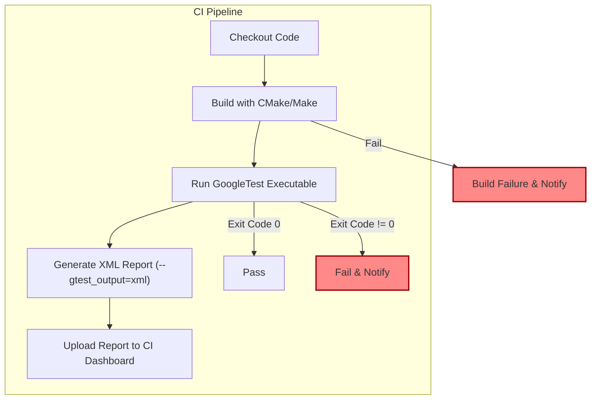

# Continuous Integration and Automation

Ensure your C++ testing workflow integrates seamlessly with popular Continuous Integration (CI) pipelines by leveraging GoogleTest and GoogleMock. This guide walks you through automating builds, running tests, generating reports, and maintaining rapid feedback loops within your CI environment.

---

## 1. Workflow Overview

### What You Will Achieve
You will learn how to incorporate GoogleTest and GoogleMock into your CI pipelines to automate the build and test process, capture structured reports, and keep validation fast and effective.

### Prerequisites
- A C++ project with GoogleTest and GoogleMock integrated.
- Basic familiarity with command-line builds (e.g., CMake, Makefiles).
- Access to a CI system that can execute shell scripts or similar automation (e.g., Jenkins, GitHub Actions, GitLab CI).

### Expected Outcome
By following this guide, your CI pipeline will:
- Automatically build your tests.
- Run all tests including mocks.
- Produce console output and machine-readable reports (XML/JUnit format).
- Provide feedback on test failures or regressions quickly.

### Time Estimate
About 30 to 60 minutes to set up a basic integration.

### Difficulty Level
Intermediate. Requires C++ build familiarity and moderate knowledge of CI systems.

---

## 2. Step-by-Step Instructions

### Step 1: Build Your Tests in CI

1. **Ensure Your Build System Supports GoogleTest**
   - If using CMake, verify your `CMakeLists.txt` includes GoogleTest and GoogleMock targets.
   - Example snippet:
   ```cmake
   # Add GoogleTest and GoogleMock
   find_package(GTest REQUIRED)
   include_directories(${GTEST_INCLUDE_DIRS})

   add_executable(runTests test_main.cpp my_test_cc.cpp)
   target_link_libraries(runTests gtest gmock gtest_main pthread)
   ```

2. **Invoke Build Command in CI Script**
   - Use commands like `cmake --build .` or `make`, depending on your environment.
   - Confirm build artifacts include test executables.

3. **Validate Build Success**
   - Ensure the build step returns success (exit code 0).

---

### Step 2: Run Tests Automatically

1. **Execute the Test Binary**
   - Run test executables as part of your CI script.
   - Example:
   ```bash
   ./runTests --gtest_output=xml:report.xml
   ```
   This command runs all tests and outputs an XML report for CI.

2. **Control Test Execution Using Flags**
   - Use GoogleTest flags such as:
     - `--gtest_filter=SuiteName.TestName` to select specific tests.
     - `--gtest_repeat=N` to repeat tests for reliability validation.
     - `--gtest_shuffle` to randomize test order.

3. **Check Execution Result**
   - The test application returns success (0) if all tests pass.
   - Non-zero exit code indicates test failures, triggering CI failure.

---

### Step 3: Integrate Test Reporting

1. **Enable XML Test Output**
   - The `--gtest_output=xml:<path>` option generates a JUnit-compatible XML file.
   - CI platforms can consume this for rich reporting.

2. **Publish or Archive XML Reports**
   - Configure your CI system to read and display the XML reports.
   - For GitHub Actions, use the `actions/upload-artifact` to store artifacts.
   - Jenkins can use `JUnit` plugin to parse XML reports.

3. **Ensure Visibility of Test Failures**
   - Fine-tune logging verbosity with flags such as `--gtest_brief=1` or use environment variables.

---

### Step 4: Maintain Fast Feedback Loops

1. **Run Tests as Early as Possible**
   - Trigger test execution on every commit or pull request.

2. **Run Only Affected Tests When Possible**
   - Use GoogleTest filtering options to restrict tests in faster validation.

3. **Parallelize Test Runs**
   - Use tools like `gtest-parallel` or CI parallel job features.

4. **Analyze Failures Quickly**
   - Enable verbose output when developing or debugging with `--gtest_verbose=info`.

---

### Step 5: Automate Mock Verification

- GoogleMock automatically verifies expectations on destruction of mock objects.
- Ensure your tests are designed to allow object lifetimes to end properly.
- If mocks live longer or are heap-allocated and owned elsewhere, consider calling:
  ```cpp
  ::testing::Mock::VerifyAndClearExpectations(&mock_object);
  ```
  explicitly before test completion in complex scenarios.

---

## 3. Practical Examples

### Example: Simple CI Test Script Using CMake

```bash
# Checkout code
cmake -S . -B build
cmake --build build

# Run tests and output XML report
./build/runTests --gtest_output=xml:build/test_results.xml

# Return exit code for CI failure detection
exit $?
```

### Example: Using Filtering and Repetition

```bash
./runTests --gtest_filter=MySuite.* --gtest_repeat=3 --gtest_break_on_failure
```

### Example: Verbose Mock Verification

Enable verbose mock call tracing during test runs to debug failed expectations:

```bash
./runTests --gmock_verbose=info
```

---

## 4. Troubleshooting & Best Practices

### Common Issues

- **Tests don't run or binary not found**
  - Verify build step success and correct executable path.

- **Tests pass locally but fail in CI**
  - Check environment differences such as compiler flags, OS, or dependencies.
  - Use `--gtest_repeat` to catch flaky tests.

- **XML report not found or incomplete**
  - Confirm your test process has write permissions for the report path.
  - Check for multiple test binaries and correct report aggregation.

- **Mock expectations silently ignored**
  - Ensure you set expectations before code exercising mocks.
  - Check that mocks are destructed to verify expectations.

### Tips & Best Practices

- Always link your tests with `gtest_main` or provide a proper `main()` that calls `InitGoogleTest()` and `RUN_ALL_TESTS()`.
- Write descriptive test names and suites for meaningful reporting.
- Use `ON_CALL` for default mock behaviors; use `EXPECT_CALL` only when call verification is needed to avoid brittle tests.
- Use test filtering strategically to speed up iterative testing during development.
- In flaky network or environment-dependent tests, consider using mock objects to minimize external dependencies.

---

## 5. Next Steps & Resources

- Explore [Writing Your First Test](https://github.com/google/googletest/blob/main/docs/guides/getting-started/writing-your-first-test.mdx) to build solid test cases.
- Consult [Building and Running Tests](https://github.com/google/googletest/blob/main/docs/guides/getting-started/first-test-workflow/building-and-running-tests.mdx) for in-depth run options.
- Learn advanced mocking techniques from the [gMock Cookbook](https://github.com/google/googletest/blob/main/docs/gmock_cook_book.md).
- Check your CI platform's documentation for native GoogleTest XML report support.

---

For further integration patterns and tooling, see [Ecosystem and Extensions](https://github.com/google/googletest/blob/main/overview/feature-landscape/project-ecosystem.mdx).

---

#### Summary Diagram


