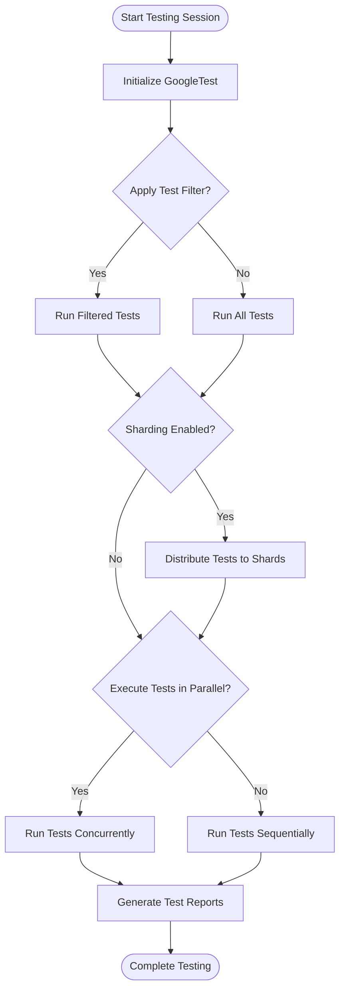

# Performance Optimization Tips

Optimize your GoogleTest test execution to run faster and more reliably, particularly for large test suites. This guide covers practical techniques including test filtering, test sharding, parallelism, and actionable advice to scale your tests efficiently without sacrificing quality.

---

## Workflow Overview

### What You'll Achieve
You will learn how to speed up test runs, focus test execution on relevant subsets, and distribute tests across multiple shards or threads effectively.

### Prerequisites
- A functional GoogleTest test suite.
- Understanding of basic GoogleTest execution (see [Getting Started with GoogleTest](https://example.com/guides/core-workflows/getting-started)).
- Command-line access to run tests.

### Expected Outcome
- Faster test runs through filtering and parallel execution.
- Ability to shard tests to distribute load across machines or cores.
- Improved reliability by avoiding flaky or slow tests where possible.

### Time Estimate
Approximately 15-30 minutes to apply basic optimizations and experiment.

### Difficulty Level
Intermediate

---

## Step-by-Step Instructions

### 1. Use Test Filtering to Run Targeted Tests
GoogleTest enables filtering which tests to run using the `--gtest_filter` flag or `GTEST_FILTER` environment variable.

- **How to filter:**
  - Run all tests matching a pattern.
  - Exclude certain tests.

#### Example:
Run all tests starting with `MySuite` but exclude `MySuite.FlakyTest`:
```bash
./my_tests --gtest_filter=MySuite.*-MySuite.FlakyTest
```

#### Verify filtering:
- Run `./my_tests --gtest_list_tests` to list all available tests and plan filters.

<Check>
Running filtered tests dramatically reduces total execution time by skipping irrelevant tests.
</Check>

---

### 2. Employ Test Sharding to Distribute Workloads
Sharding splits tests across multiple parallel jobs, often across machines, to run large suites faster.

- **Set environment variables:**
  - `GTEST_TOTAL_SHARDS`: total number of shards.
  - `GTEST_SHARD_INDEX`: zero-based shard number for current job.

#### Example:
On shard 0 of 4:
```bash
export GTEST_TOTAL_SHARDS=4
export GTEST_SHARD_INDEX=0
./my_tests
```

Each shard runs only its subset, splitting the tests uniquely among shards.

#### Confirm sharding enabled:
If the `GTEST_SHARD_STATUS_FILE` environment variable points to a writable path, GoogleTest creates this file to acknowledge sharding support.

<Warning>
Sharding must be set before running tests. Do not use in subprocesses like death tests.
</Warning>

---

### 3. Increase Parallelism to Utilize Multi-Core CPUs
GoogleTest can execute tests in parallel, using multiple threads or processes, accelerating overall test time.

- **Control parallelism using your test runner or CI infrastructure.**
- GoogleTest itself doesn't provide in-built parallel test execution, but sharding with multiple executors achieves this.

---

### 4. Optimize Test Design for Performance
- Avoid long-running setup/teardown in individual tests.
- Share expensive resources using test fixtures’ `SetUpTestSuite` and `TearDownTestSuite`.
- Regularly review and isolate flaky or slow tests.

---

## Practical Tips & Best Practices

- **Combine filtering and sharding:** Use filtering within shards to fast-track debugging.
- **Use test suite level fixtures** to minimize repeated initialization overhead.
- **Disable flaky tests temporarily with `DISABLED_` prefix** to prevent slowing overall runs.
- **Use `--gtest_repeat` flag** to catch flaky tests by repeating runs.
- Monitor test times and failures to identify bottlenecks.

<Note>
Test sharding relies on correct environment variable setup and consistent indexing.
</Note>

---

## Common Pitfalls & Troubleshooting

| Issue                            | Cause                              | Solution                                    |
|---------------------------------|----------------------------------|---------------------------------------------|
| Tests not running as expected    | Incorrect `--gtest_filter` syntax| Verify pattern, use `--gtest_list_tests` to check available test names.
| Sharding runs missing tests      | `GTEST_TOTAL_SHARDS` or `GTEST_SHARD_INDEX` misconfigured or overlapping | Correctly configure environment variables ensuring shard indices are unique and in range.
| Tests behave differently in shards| Shard isolation issues or shared state| Ensure tests are independent and isolate shared resources.
| Slow tests despite optimizations | Expensive setup per test or unoptimized tests | Use `SetUpTestSuite` for shared resources and profile test execution.

---

## Examples

### Combining Filtering and Sharding
To run only critical smoke tests on shard 1 of 3:
```bash
export GTEST_TOTAL_SHARDS=3
export GTEST_SHARD_INDEX=1
./my_tests --gtest_filter=SmokeTest.*
```

### Running Tests with Repeat and Fail-Fast
Repeat tests 10 times, aborting on first failure:
```bash
./my_tests --gtest_repeat=10 --gtest_fail_fast
```

### Disabling Flaky Tests
Prefix flaky tests with `DISABLED_`:
```cpp
TEST(MySuite, DISABLED_FlakyTest) {
  // flaky test code
}
```

This prevents them from running unless overridden with `--gtest_also_run_disabled_tests`.

---

## Next Steps & Related Content

- Explore [Test Suite Structure and Best Practices](https://example.com/guides/best-practices-integration/best-practices) for maintaining scalable tests.
- Review [Using Assertions Effectively](https://example.com/guides/core-workflows/using-assertions) to write reliable tests.
- Read about [Integrating GoogleTest with CI/CD](https://example.com/guides/best-practices-integration/ci-integration) to automate and parallelize test execution.

---

For complete reference on flags and environment variables used here, see the [Testing Reference](https://example.com/docs/reference/testing.md).


---

### Summary Diagram of Test Execution with Optimization Strategies


This diagram illustrates the flow from test session start through optimization configurations and execution modes to test completion reporting.
