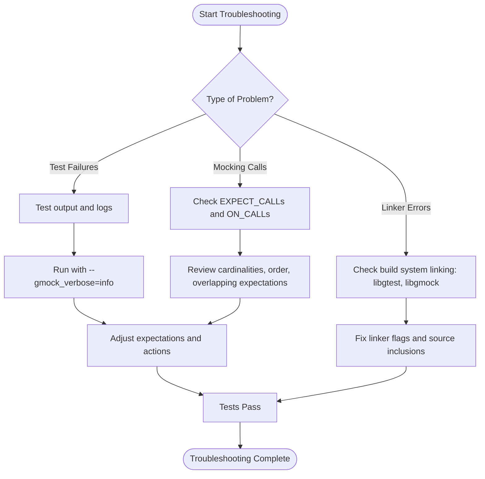

# FAQ and Troubleshooting Patterns

This page addresses frequent problems and intricate scenarios encountered when using GoogleTest and GoogleMock, from linker errors to flaky tests. It offers practical guidance for diagnosing, debugging, and eliminating common pitfalls. Real-world troubleshooting stories are incorporated to empower you in overcoming these challenges with confidence.

---

## 1. Understanding and Diagnosing Failure Scenarios

### Typical Errors and How to Identify Them

- **Linker Errors with GoogleTest/GoogleMock**
  - Ensure all required GoogleTest and GoogleMock source files or libraries are included in your build.
  - Check that mock methods are declared correctly using `MOCK_METHOD` in the `public` section.
  - Verify compiler flags and library search paths are correctly set.

- **Uninteresting or Unexpected Mock Calls**
  - *Uninteresting calls* occur when a mock method is called but no `EXPECT_CALL` is set. GoogleMock issues a warning by default.
  - *Unexpected calls* happen when a call does not match any active expectations, causing test failures.
  - Use `NiceMock<T>` to suppress uninteresting call warnings when they are intentional.
  - Use `StrictMock<T>` to treat uninteresting calls as failures.

### Using Verbose Logging to Diagnose Mock Expectations

Run tests with the command-line flag `--gmock_verbose=info` to:
- Trace every mock function call,
- Show which expectations each call matches,
- Display detailed argument values and stack traces.

This helps pinpoint mismatches in expectations, wrong argument values, or unexpected call order.

```shell
./your_test_binary --gmock_verbose=info
```

---

## 2. Common Troubleshooting Patterns

### Issue: Mock Method Calls Resemble Unexpected or Excessive Calls

**Symptoms**:
- Test fails with messages like "Unexpected mock function call" or "Mock function called more times than expected".

**Action Steps**:
1. Check your `EXPECT_CALL` cardinalities (`Times()` clause) match the expected number of calls.
2. Review if you have overlapping or shadowing expectations—remember that newer expectations override older ones.
3. Consider using `.RetiresOnSaturation()` for expectations that should become inactive after a fixed number of calls.
4. If calls can happen any number of times with specific arguments, add a catch-all expectation using `_` matcher and `Times(AnyNumber())`.

*Example:*
```cpp
EXPECT_CALL(mock, SetNumber(7)).Times(2).RetiresOnSaturation();
EXPECT_CALL(mock, SetNumber(_)).Times(AnyNumber());
```

### Issue: Fluent Interface Usage Errors in EXPECT_CALL and ON_CALL

**Symptoms**:
- Runtime error messages about invalid usage, such as multiple `.With()`, multiple `.Times()`, or misplaced `.After()`.

**Action Steps**:
- Follow the precise order of modifier clauses:
  - `.With()` must be first and appear at most once.
  - `.Times()` at most once and before `.InSequence()`, `.After()`, `.WillOnce()`, and `.WillRepeatedly()`.
  - `.WillOnce()` can appear multiple times but must precede `.WillRepeatedly()`.
  - `.RetiresOnSaturation()` is the last clause.

Correct syntax example:
```cpp
EXPECT_CALL(mock, Foo(_))
  .With(AllArgs(Lt()))
  .Times(2)
  .InSequence(seq)
  .After(prev_expectation)
  .WillOnce(Return(1))
  .WillRepeatedly(Return(2))
  .RetiresOnSaturation();
```

### Issue: Compiler Warnings on Mock Methods with `const` Parameters in MSVC

**Cause and Solution:**
- MSVC incorrectly warns on parameters declared `const` in mock methods.
- Remove redundant top-level `const` from parameters in both the base and mock classes.
- For pointer or reference parameters, keep the `const` qualifier as it is meaningful.

---

## 3. Troubleshooting Linker Errors and Setup Issues

- Ensure that your target links both `libgtest` and `libgmock` (or their static source files).
- Use the recommended macros and patterns for mock declarations to avoid undefined references.
- Confirm your build system correctly compiles and includes GoogleTest and GoogleMock.
- For manual setups, reference the [Manual and Advanced Installation](../getting-started/installation-initialization/installation-manual.md).

---

## 4. Handling Flaky and Timing-Related Test Failures

### Flaky Tests Due to States or Ordering

- Use `InSequence` blocks or `Sequence` objects to enforce call order.
- When only partial order matters, use `.After()` clauses or multiple sequences to express partial ordering.

### Flaky Tests Due to Asynchronous Code

- Synchronize test code using signals or notifications (e.g., `absl::Notification`) inside lambda actions.
- Example:
  ```cpp
  EXPECT_CALL(mock, SomeAsyncCall())
      .WillOnce([&done] { done.Notify(); });
  // Wait in test thread
  done.WaitForNotification();
  ```

---

## 5. Real-World Troubleshooting Stories

### Story 1: Unexpected Calls Caused by Overlapping Expectations

A user wrote two `EXPECT_CALL` statements on the same method but forgot order. Calls matched the first expectation, leaving the second unsatisfied. Switching to sequences or combining actions fixed the issue. Verbose mode helped reveal which expectation was actually hit.

### Story 2: WARNING for Uninteresting Calls Despite ON_CALL

User set up default behavior with `ON_CALL` but no `EXPECT_CALL`. Test produced warnings for uninteresting calls. Adding a catch-all `EXPECT_CALL` with `Times(AnyNumber())` to those methods suppressed warnings while keeping defaults.

---

## 6. Best Practices for Diagnosing and Fixing Common Issues

- **Use `--gmock_verbose=info`** to get detailed mock invocation traces.
- **Check call counts and order carefully** when using multiple expectations on the same mock method.
- **Use `RetiresOnSaturation()`** to prevent oversaturation errors.
- **Distinguish uninteresting calls (warnings) from unexpected calls (failures).** Adjust mock types (`NiceMock`, `StrictMock`) accordingly.
- **Ensure virtual destructors** in base classes for safe mock destruction.
- **Avoid over-specifying expectations** if you want flexible tests. Use `ON_CALL` for default actions and limit `EXPECT_CALL` to actual verifications.

---

## 7. Useful Commands and Flags for Troubleshooting

| Command/Flag                    | Purpose                                                     |
| ------------------------------ | -----------------------------------------------------------|
| `--gmock_verbose=info`          | Detailed trace of mock calls and matched expectations       |
| `--gmock_verbose=warning`       | Default: warnings on uninteresting calls                    |
| `--gmock_verbose=error`         | Only errors; suppresses warnings                             |
| `--gtest_repeat=N`              | Repeat tests N times to catch flakes                         |
| `--gtest_break_on_failure`      | Stop on first failure, useful with repeat                    |
| `--gtest_filter=FILTER`         | Run a subset of tests                                        |

---

## 8. Links to Related Documentation

- [GoogleMock FAQ](/faq/usage-troubleshooting/mocking-faq.md) - Common mocking pitfalls
- [Mocking Cookbook](../guides/mocking-patterns/gmock_cook_book.md) - Practical mocking recipes
- [GoogleTest Assertions Reference](../docs/reference/assertions.md) - Detailed assertions
- [Mocking Reference](../docs/reference/mocking.md) - Comprehensive mocking API
- [First Test Troubleshooting](../getting-started/first-test-validation/troubleshooting-setup.md) - Basic setup failures

---

## 9. Troubleshooting Summary Diagram



---

<Tip>
For complex test failures involving mocks, enabling `--gmock_verbose=info` often clarifies which expectation matches which call, making it easier to precisely fix the test.
</Tip>

<Warning>
Avoid over-specifying mock expectations, as this can lead to brittle tests that frequently fail after innocent code changes.
</Warning>

<Note>
Mock objects require virtual destructors to avoid memory leaks and ensure expected destruction behavior.
</Note>

---

## 10. Summary

This guide provides actionable patterns to diagnose and troubleshoot common issues with GoogleTest and GoogleMock, including linker errors, unexpected call failures, setup warnings, and flaky tests. Following these patterns will empower you to write robust, maintainable tests and quickly fix problems when they arise.

---

*Generated from GoogleTest and GoogleMock official documentation and test suite insights.*