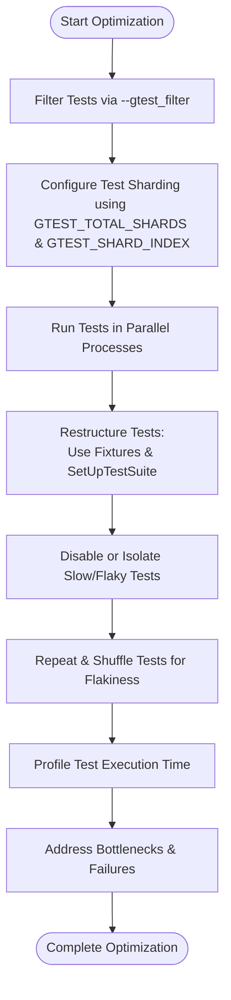

# Performance Optimization in Large Test Suites

GoogleTest provides powerful features out of the box to help you write and run tests efficiently. However, when you deal with large-scale test suites containing thousands of tests, it becomes crucial to optimize your testing workflow for speed and resource use. This guide offers concrete techniques and actionable advice to speed up large-scale test runs, minimize resource consumption, and accelerate feedback loops.

---

## Why Optimize Performance in Large Test Suites?

Running a large test suite can consume significant time and computing resources, slowing down development cycles and reducing productivity. Efficiently optimizing test execution helps:

- Deliver faster feedback to developers.
- Reduce resource consumption during continuous integration (CI).
- Avoid bottlenecks caused by long test runs.
- Improve reliability and maintainability of tests.

This guide focuses on practical strategies that you can apply immediately to your GoogleTest-based large test suites.

---

## Prerequisites

- You have a functioning test suite written using GoogleTest.
- Familiarity with defining and running tests, test fixtures, and test suites.
- Basic understanding of your build and test execution environment.

---

## Expected Outcome

By following the practices and techniques outlined in this guide, you will achieve:

- Noticeably faster execution of large test suites.
- Reduced CPU and memory usage during test runs.
- More manageable test feedback cycles enabling quicker iteration.

---

## Time Estimate

Implementing these optimizations can take from a few minutes (e.g., filtering tests) to a few hours (e.g., restructuring tests or integrating parallel execution).

---

# Step-by-Step Guide to Optimizing Large Test Suites

### 1. Filter Tests to Run Only Relevant Subsets

**Why**: Running the entire large suite may be unnecessary for every change.

**How**:

- Use the `--gtest_filter` flag or set the `GTEST_FILTER` environment variable to specify subsets of tests to run.
- The filter syntax supports wildcards `*` and `?`, and you can exclude patterns using `-`.

**Example**:

```shell
./mytests --gtest_filter=MySuite.* -MySuite.ExpensiveTest
```

This runs all tests in `MySuite` except `ExpensiveTest`.

**Verify**: Only filtered tests run, reducing runtime.

---

### 2. Enable Parallel Test Execution

**Why**: Leverage multiple CPU cores by running tests concurrently.

**How**:

- While GoogleTest itself does not natively parallelize tests, you can:
  - Use your test runner or build tool (e.g., Bazel, CTest, or custom scripts) to shard and run tests in parallel processes.
  - Use the built-in sharding environment variables: `GTEST_TOTAL_SHARDS` and `GTEST_SHARD_INDEX`.

**Example**:

Running tests split across two shards:

- On machine 1:

  ```shell
  GTEST_TOTAL_SHARDS=2 GTEST_SHARD_INDEX=0 ./mytests
  ```

- On machine 2:

  ```shell
  GTEST_TOTAL_SHARDS=2 GTEST_SHARD_INDEX=1 ./mytests
  ```

Each shard runs roughly half the tests, decreasing total time.

**Verify**: Check logs to confirm only part of tests run per shard.

---

### 3. Structure Tests for Fast Setup and Teardown

**Why**: Reduce costly repeated operations in test lifecycles.

**How**:

- Use **per-test-suite** setup and teardown (`SetUpTestSuite` and `TearDownTestSuite`) to initialize expensive resources *once* for all tests in the suite.
- Avoid performing heavyweight operations in per-test fixture setup and teardown if they can be shared.

**Example**:

```cpp
class MySuiteTest : public testing::Test {
 protected:
  static std::unique_ptr<ExpensiveResource> expensive_resource_;

  static void SetUpTestSuite() {
    expensive_resource_ = std::make_unique<ExpensiveResource>();
  }
  static void TearDownTestSuite() {
    expensive_resource_.reset();
  }
};
```

Verify that shared resources are being reused instead of recreated every test.

---

### 4. Use Test Fixtures Effectively

**Why**: Avoid redundant setup code and speed up individual tests.

**How**:

- Write meaningful test fixtures that prepare testing state reusable by multiple tests.
- Limit resource acquisition in the fixture constructor and prefer `SetUp()` to allow failure reporting.

**Tip**: Since a fresh fixture object is created per test, avoid global state in fixtures without careful synchronization.

---

### 5. Avoid Expensive Assertions in Hot Tests

**Why**: Some assertions are more computationally intensive.

**How**:

- Profile tests to identify slow assertions.
- Use simpler assertions or break complex checks into smaller assertions that run only when necessary.

---

### 6. Leverage Test Repetition and Shuffling Strategically

**Why**: To identify flaky tests efficiently and to uncover hidden dependencies.

**How**:

- Use the `--gtest_repeat=N` flag to repeat tests multiple times.
- Use the `--gtest_shuffle` flag to randomize test order, detecting order-dependent test failures.

**Example**:

```shell
./mytests --gtest_repeat=100 --gtest_shuffle
```

---

### 7. Disable or Isolate Slow Tests

**Why**: Maintain fast feedback by excluding slower tests from normal runs.

**How**:

- Prefix slow or flaky tests with `DISABLED_` to exclude them by default.
- Run them separately with `--gtest_also_run_disabled_tests` when needed.

**Note**: Track and minimize disabled tests over time to maintain test quality.

---

### 8. Filter Tests by Traits or Custom Labels

**Why**: Logical grouping allows running targeted tests by category.

**How**:

- Use test suite and test naming conventions to group tests (e.g., `FastTests`, `IntegrationTests`).
- Apply naming conventions in `--gtest_filter` to include/exclude groups.

---

# Common Pitfalls and Troubleshooting

### Tests Not Running as Expected

- Ensure your filter syntax is correct; remember `:` separates patterns and `-` excludes.
- Verify that disabled tests (with `DISABLED_` prefix) won't run unless explicitly specified.

### Parallel Execution Produces Failures or Deadlocks

- Confirm that tests are independent and do not share mutable global state without synchronization.
- Ensure your environment properly supports forking or multiple test processes.

### Tests Still Slow After Optimization

- Profile to find bottlenecks (e.g., expensive I/O operations in tests).
- Review any costly setup or initialization logic.

---

# Best Practices for Performance Optimization

- Regularly profile test execution times to identify slow tests early.
- Organize tests to group slow integration or system tests separately from fast unit tests.
- Automate selective test runs to fit various development workflows.
- Use test sharding with continuous integration systems for distributed execution.
- Keep your test fixtures lightweight and focused.
- Use `SCOPED_TRACE` and other GoogleTest tools to localize and debug slow or flaky tests.

---

# Next Steps & Related Documentation

- Explore [Writing and Organizing Test Suites](../core-workflows/writing-and-organizing-tests) to better structure tests.
- Learn how to [Shard Tests Across Machines](../best-practices-integrations/cross-platform-and-ci#test-sharding) for large scale parallelism.
- Consult the [FAQ on Improving Test Performance](../../faq/integration-performance-resources/performance-optimization) for detailed Q&A.
- Review the [GoogleTest Primer](../../primer) for foundational test writing concepts.

---

For a complete list of GoogleTest flags that affect test execution, run your test binary with `--help`.

<Tip>
Remember that the most effective optimization is designing your tests for isolation and fast execution from the start. Performance tweaks work best if your tests follow best structure and naming practices.
</Tip>

---

## Summary Diagram: Large Test Suite Optimization Workflow


