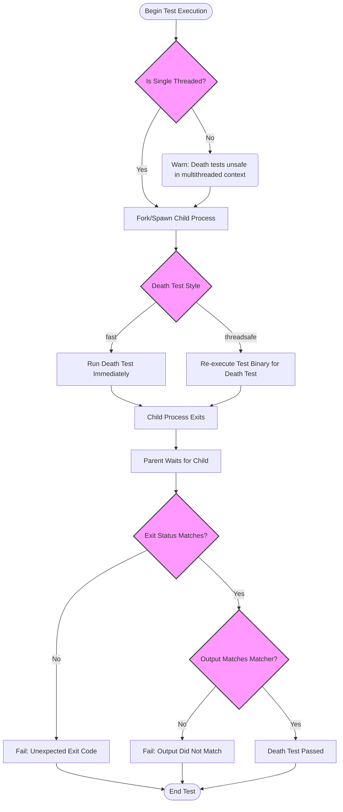

# Testing Error Handling and Death Tests

## Overview

Death tests are a vital part of testing in GoogleTest when you need to verify that your program terminates or fails under specific erroneous or exceptional conditions. This guide will walk you through how to write death tests, understand how they work, handle exceptions within death tests, and avoid common pitfalls. You'll learn practical techniques for writing robust death tests that confirm your error-handling code performs as intended.

---

## 1. Understanding Death Tests

### What Are Death Tests?
Death tests check that a particular piece of code causes the process to terminate, for example, by failing an assertion or calling `abort()`. Unlike usual unit tests, which expect your code to succeed, death tests confirm your program fails safely and predictably in error scenarios.

### When to Use Death Tests
- To validate that assertions or checks correctly abort execution when preconditions are violated.
- To ensure your program exits (or crashes) in a controlled and expected way when fatal errors occur.
- To verify that error messages or logs are generated as expected before termination.

### Key Characteristics
- Death tests spawn a subprocess to run the code expected to die, isolating the parent process from abnormal termination.
- Supported on POSIX systems (using `fork()` or `clone()`) and Windows (using `CreateProcess()`).
- The process running the death test child can run either in “fast” style (running test code immediately after fork) or “threadsafe” style (re-executing the test binary to run a single death test).

<Tip>
Death tests only consider process termination as "death"; thrown exceptions caught by the caller do not trigger death test success. For exceptions, use exception assertions (e.g., `EXPECT_THROW`).
</Tip>

---

## 2. Writing Death Tests

GoogleTest provides several macros to write death tests. The most common are:

- `ASSERT_DEATH(statement, matcher)`
- `EXPECT_DEATH(statement, matcher)`
- `ASSERT_EXIT(statement, predicate, matcher)`
- `EXPECT_EXIT(statement, predicate, matcher)`
- `EXPECT_DEBUG_DEATH(statement, matcher)` (active only in debug builds)

### Using `EXPECT_DEATH` and `ASSERT_DEATH`

These macros verify that the given statement causes the process to abort (non-zero exit) and emit an error message matching the specified regular expression or matcher.

```cpp
TEST(MyDeathTest, DiesOnInvalidInput) {
  EXPECT_DEATH({ ValidateInput(nullptr); }, "Invalid input");
}
```

#### Parameters
- **statement**: The code block or statement expected to cause the program to die.
- **matcher**: A regex or string matcher applied against the `stderr` output of the dying process.

#### Behavior
- `ASSERT_DEATH` generates a fatal failure if the death test fails and aborts the current test function immediately.
- `EXPECT_DEATH` generates a nonfatal failure and continues.

### Using `EXPECT_EXIT` and `ASSERT_EXIT`

These macros allow you to specify an exit status predicate in addition to matching stderr output.

```cpp
TEST(ExitTest, ExitsWithCode0) {
  EXPECT_EXIT(ExitCleanly(), testing::ExitedWithCode(0), "Success");
}
```

#### Parameters
- **statement**: The code block expected to exit.
- **predicate**: A function or functor that evaluates the exit status (e.g., `testing::ExitedWithCode(0)`).
- **matcher**: Regex or matcher matching process `stderr` output.

---

## 3. How Death Tests Work

### Test Process Flow

1. GoogleTest checks the current number of threads and warns if more than one is active to avoid unsafe `fork()` usage.
2. A child process is spawned:
   - In “fast” style, it immediately runs the code.
   - In “threadsafe” style, it re-executes the test binary filtering on that single death test.
3. The parent process waits for the child to terminate.
4. The parent evaluates:
   - Exit code or signal status matches expectation.
   - `stderr` output matches the matcher.
5. The test passes if both above conditions hold; otherwise, it fails with diagnostic messages.

### Death Test Styles

- **Fast**: Immediate execution after fork, faster but unsafe for multithreaded tests.
- **Threadsafe**: Re-executes the test binary so only one death test runs per process, safer but slower.

You can select a style globally by setting:

```cpp
GTEST_FLAG_SET(death_test_style, "threadsafe"); // or "fast"
```

---

## 4. Best Practices for Writing Death Tests

- **Name your death test suites ending with `DeathTest`** for better test ordering and thread safety.
- Use `EXPECT_DEATH` unless you want immediate abort; then use `ASSERT_DEATH`.
- Enclose multi-line statements inside braces `{ ... }` within death tests.
- Ensure your error message matcher is specific but remains stable across platforms.
- Avoid side effects inside death test statements as they won't be observed in the parent.
- Plan for possible multi-thread issues; prefer `threadsafe` style when threads are present.

<Tip>
If you use mocks in death tests with expected exit codes, use `Mock::AllowLeak` to avoid mock leak detection errors.
</Tip>

---

## 5. Handling Exceptions in Death Tests

- If your code may throw exceptions, death tests do **not** consider thrown exceptions as death unless the process exits.
- To assert exceptions, use exception assertions like `EXPECT_THROW`, `EXPECT_ANY_THROW`, or `EXPECT_NO_THROW`.
- GoogleTest catches exceptions escaping death tests and reports them as failures; exceptions do not propagate outside death test macros.

```cpp
EXPECT_NONFATAL_FAILURE(
  EXPECT_DEATH(throw 1, ""),
  "threw an exception"
);
```

- If exception support is enabled, exception messages appear in death test failure outputs.

---

## 6. Handling Windows Structured Exceptions (SEH)

- On Windows, structured exceptions like `RaiseException` are treated as death.
- Death tests can catch SEH exceptions without interfering with death reporting.

```cpp
EXPECT_DEATH(RaiseException(42, 0x0, 0, nullptr), "");
```

---

## 7. Advanced Usage and Caveats

- **Single Evaluation:** The death test statements and matchers are evaluated exactly once to avoid side effects.
- **No Multiple Death Tests on One Line:** Multiple death test assertions cannot be on the same source line.
- **Illegal Returns:** Returning from inside a death test statement causes the test to fail with an appropriate error.
- **Side Effects in Child:** Changes to global or heap state inside death tests are not seen by the parent.
- **Changing Directories:** Death tests work correctly even if the working directory changes before invocation.
- **Debug Mode:** Use `EXPECT_DEBUG_DEATH` to run death tests only in debug builds.

---

## 8. Step-by-Step Example

### Writing a Simple Death Test

```cpp
#include <gtest/gtest.h>

void DieIfNegative(int val) {
  if (val < 0) {
    fprintf(stderr, "Negative value: %d\n", val);
    abort();
  }
}

TEST(ErrorHandlingDeathTest, DiesOnNegativeInput) {
  EXPECT_DEATH(DieIfNegative(-1), "Negative value: -1");
  EXPECT_DEATH({ DieIfNegative(-42); }, "Negative value: -42");
}
```

### Running the Tests

- Build your test binary.
- Run it normally; passing tests confirm your death test triggers when expected.

If a death test fails because the process does not die or the error message does not match, GoogleTest will output detailed diagnostics showing the actual vs expected stderr.

---

## 9. Troubleshooting Common Issues

<AccordionGroup title="Common Death Test Issues">
<Accordion title="Death test does not fail when expected">
Check that the code under test truly terminates the process, not just throwing exceptions. Confirm the `matcher` regex sufficiently matches the error output.
</Accordion>
<Accordion title="Error message matching is flaky or inconsistent">
Ensure you use a stable, platform-independent regex syntax for your matcher. Keep death test output minimal and predictable.
</Accordion>
<Accordion title="Multiple threads cause flaky death tests">
Switch to "threadsafe" death test style by setting `GTEST_FLAG_SET(death_test_style, "threadsafe")` to avoid fork-related threading issues.
</Accordion>
<Accordion title="Death tests do not run on my platform">
Ensure your platform supports death tests or use `EXPECT_DEATH_IF_SUPPORTED` guards.
</Accordion>
</AccordionGroup>

---

## 10. Next Steps & Further Reading

- Review the [Death Assertions](../reference/assertions.md#death) section for details on available macros.
- Read [Advanced GoogleTest Topics](../advanced.md#death-tests) for deep insights on death tests implementation and style.
- Consult [Exception Assertions](../reference/assertions.md#exceptions) for exception-related test techniques.
- Explore the [GoogleTest Primer](../primer.md) to understand test writing basics.

---

## Summary Diagram



---

## Conclusion

Death tests in GoogleTest offer a powerful way to verify that your code properly shuts down or aborts under error conditions. By carefully structuring your death tests, managing threading considerations, and using matching assertions, you can ensure robust and predictable failure behavior. This guide empowers you to write, run, and interpret death tests confidently.

---