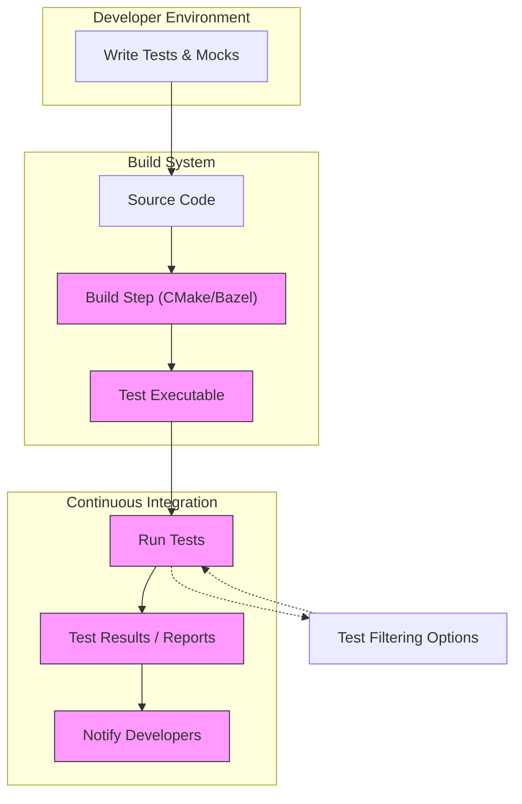

# Integrating with Build and CI Systems

This guide provides comprehensive instructions for integrating GoogleTest and GoogleMock within modern build pipelines and continuous integration (CI) systems. You will learn how to incorporate these testing frameworks into CMake and Bazel build environments, configure test filtering and reporting, and apply platform-agnostic best practices to maintain a robust test suite.

---

## 1. Overview

Continuous testing plays an essential role in maintaining software quality. Integrating GoogleTest and GoogleMock into your build and CI systems helps automate test execution, streamline feedback loops, and ensure code correctness across all supported platforms.

This guide focuses specifically on how to incorporate GoogleTest and GoogleMock into popular build systems like CMake and Bazel, configuring test filtering and reporting mechanisms to optimize your development workflow.

---

## 2. Prerequisites

- Installed and functional GoogleTest and GoogleMock libraries.
- Existing C++ project using either CMake or Bazel as the build system.
- Basic familiarity with writing tests and mocks in GoogleTest and GoogleMock.
- Access to your CI service configuration files (e.g., Jenkinsfile, GitHub Actions workflows).

---

## 3. Integrating GoogleTest and GoogleMock with CMake

CMake is widely used for C++ project builds. Follow these steps to add GoogleTest and GoogleMock testing support into your CMake pipeline.

### 3.1 Adding GoogleTest and GoogleMock as Dependencies

1. **Include GoogleTest in Your `CMakeLists.txt`:**

```cmake
# Enable testing
enable_testing()

# Add GoogleTest and GoogleMock - assume they are added as git submodules or via ExternalProject
add_subdirectory(external/googletest)  # Adjust path to your setup
```

2. **Link GoogleTest and GoogleMock Libraries:**

Include the `gtest` and `gmock` libraries when defining your test executable:

```cmake
add_executable(my_test test/my_test.cc)
target_link_libraries(my_test gtest gmock gtest_main)
```

### 3.2 Discovering and Registering Tests

1. Use GoogleTest's facilities to register your tests written with `TEST` or `TEST_F` macros.

2. Add these tests to CTest:

```cmake
add_test(NAME my_test COMMAND my_test)
```

3. Enable verbose output during test runs to get detailed test reporting:

```cmake
set(CTEST_OUTPUT_ON_FAILURE ON)
```

### 3.3 Filtering Tests

CMake supports test filtering through `ctest` as follows:

```bash
ctest -R <regex>
```

Use this to run only specific tests, e.g., tests whose names match a pattern.

### 3.4 Best Practices

- Use `target_include_directories()` to add `googletest/include` paths clearly.
- Build GoogleTest/GoogleMock as static libraries to simplify linking.
- Separate production and testing builds to avoid shipping testing code.

---

## 4. Integrating GoogleTest and GoogleMock with Bazel

Bazel provides a high-performance, scalable build system often used in larger C++ projects.

### 4.1 Adding GoogleTest and GoogleMock Dependencies

1. Define `cc_test` targets in Bazel `BUILD` files that depend on `@com_google_googletest//:gtest` and `@com_google_googletest//:gmock`.

Example:

```python
cc_test(
    name = "my_test",
    srcs = ["my_test.cc"],
    deps = ["@com_google_googletest//:gtest", "@com_google_googletest//:gmock"],
)
```

2. Ensure that your WORKSPACE file includes the GoogleTest repository either via `http_archive` or as per your dependency management setup.

### 4.2 Running Tests with Bazel

Run tests using:

```bash
bazel test //path/to:my_test
```

### 4.3 Filtering Tests

Use the `--test_filter` flag to run selected tests:

```bash
bazel test //path/to:my_test --test_filter="MyTestSuite.MyTestName"
```

The pattern supports exact names or wildcard matching.

### 4.4 Integration With CI

Bazel’s caching and sandboxing make it efficient in CI systems. Configure your CI to invoke Bazel test commands with options for verbosity and selective tests for faster feedback.

---

## 5. Continuous Integration (CI) System Integration

Integrating GoogleTest and GoogleMock tests into your CI environment makes running and reporting test results automated and systematic.

### 5.1 Common CI Systems

- Jenkins
- GitHub Actions
- GitLab CI
- CircleCI
- Travis CI

### 5.2 Configuring Test Execution

1. Include steps in your CI pipeline script to build and run tests via your build tool; for example:

```bash
mkdir build && cd build
cmake ..
cmake --build .
ctest --output-on-failure
```

or

```bash
bazel build //myproject:all
bazel test //myproject:all --test_output=errors
```

2. Use test filtering to limit test runs during iteration to speed up feedback.

3. Capture and archive test reports (e.g., in XML format). GoogleTest supports outputting results in JUnit XML format using

```bash
./my_test --gtest_output=xml:result.xml
```

which many CI systems can ingest to provide UI reports.

### 5.3 Reporting and Notifications

- Configure your CI to parse GoogleTest XML reports.
- Set alerts for test failures or regressions.

### 5.4 Platform-Agnostic Practices

- Use relative paths for executables to ensure compatibility.
- Avoid platform-specific configurations where possible.
- Use cross-platform shell scripting or scripts in language-agnostic tools.

---

## 6. Advanced Tips and Best Practices

- **Parallel Test Execution:** Utilize multi-threaded test execution flags (`--gtest_parallel`) if supported by your CI to speed up tests.
- **Test Timeouts:** Configure reasonable timeouts in CI to catch hanging tests.
- **Dependency Management:** Ensure GoogleTest and GoogleMock versions are consistent across local and CI environments.
- **Mock Coverage:** Write focused tests with mocks to reduce external dependencies, improving test reliability and speed.
- **Logging and Verbosity:** Use `--gmock_verbose` to control log output during CI runs for better diagnostics.

---

## 7. Troubleshooting Common Issues

### 7.1 Test Discovery Issues

- Verify that tests are correctly registered with your build system.
- Ensure the test binaries are executed in the expected working directory.

### 7.2 Linking Errors

- Make sure GoogleTest and GoogleMock libraries are linked properly.
- Verify include directories are set for headers.

### 7.3 Unexpected Test Failures

- Use `--gmock_verbose=info` to enable detailed mock call tracing.
- Confirm your expectations (`EXPECT_CALL`) are set before exercising mocks.

### 7.4 Platform-Specific Failures

- Validate that no platform-specific code or build flags cause differences.
- Use containerized or VM-based CI agents to minimize environment drift.

---

## 8. References & Further Reading

- [GoogleTest Primer](https://github.com/google/googletest/blob/main/docs/primer.md)
- [gMock for Dummies](https://google.github.io/googletest/gmock_for_dummies.html)
- [gMock Cookbook](https://google.github.io/googletest/gmock_cook_book.html)
- [gMock Cheat Sheet](https://google.github.io/googletest/gmock_cheat_sheet.html)
- [GoogleTest Assertions Reference](https://github.com/google/googletest/blob/main/docs/reference/assertions.md)
- [GoogleMock Mocking Reference](https://github.com/google/googletest/blob/main/docs/reference/mocking.md)
- Official GoogleTest and GoogleMock [GitHub Repository](https://github.com/google/googletest)

---

## 9. Diagram: Integration Workflow



---

# Practical Example: Adding a Mocked Method with EXPECT_CALL

Suppose you have a mock class `MockFoo` derived from interface `Foo`:

```cpp
class Foo {
 public:
  virtual ~Foo() {}
  virtual int Bar(int x) = 0;
};

#include <gmock/gmock.h>

class MockFoo : public Foo {
 public:
  MOCK_METHOD(int, Bar, (int x), (override));
};
```

In your test:

```cpp
using ::testing::Return;
using ::testing::AtLeast;

TEST(FooTest, CallsBarCorrectly) {
  MockFoo mock_foo;

  EXPECT_CALL(mock_foo, Bar(5))  // Expect Bar(5) to be called
      .Times(AtLeast(1))          // At least once
      .WillOnce(Return(42));     // Return 42 for that call

  int result = mock_foo.Bar(5);
  EXPECT_EQ(result, 42);
}
```

---

This completes the integration guide covering build pipelines and CI systems tailored to GoogleTest and GoogleMock.
