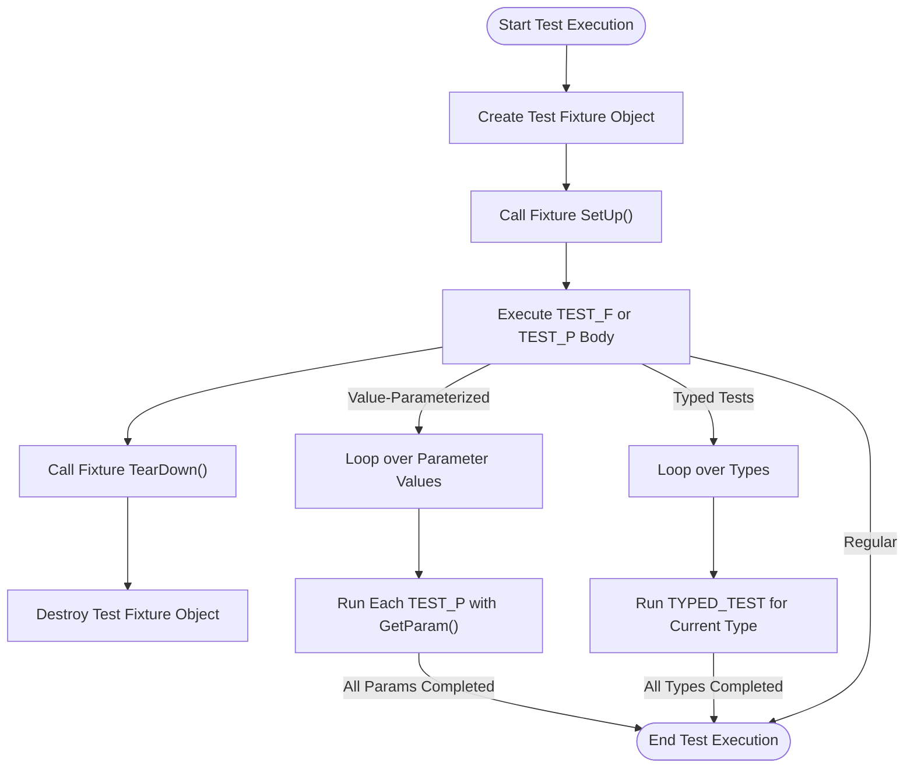

# Test Fixtures & Parameterized Testing

Master the power of reusable test setup and comprehensive test coverage with GoogleTest's fixtures and parameterized testing capabilities. This guide equips you to reduce code duplication, scale your test coverage efficiently, and share common configurations seamlessly.

---

## Workflow Overview

- **Task Description**: Learn how to define structured test fixtures to share setup and teardown logic across multiple tests, use value- and type-parameterized tests to run multiple data-driven test cases efficiently, and employ best practices to maintain scalable, maintainable test suites.
- **Prerequisites**: Familiarity with basic GoogleTest usage including writing simple `TEST()` and `TEST_F()` tests. An existing C++ project set up with GoogleTest.
- **Expected Outcome**: After this guide, you will confidently write tests with shared setup code, run tests with multiple input parameters automatically, and leverage typed tests to apply the same test logic across different data types.
- **Time Estimate**: 20-40 minutes.
- **Difficulty Level**: Intermediate.

---

## 1. Understanding Test Fixtures

### What are Test Fixtures?

A test fixture is a C++ class derived from `testing::Test` that groups multiple related tests by sharing common setup and teardown code. Instead of repeating identical initialization code in separate tests, you centralize it in the fixture class.

### Why Use Test Fixtures?

- **Code Reuse**: Write setup logic once for a group of tests.
- **Isolation**: GoogleTest creates a fresh fixture object for each test ensuring independence.
- **Maintainability**: Changes to shared setup propagate to all related tests.

### How to Create a Test Fixture

1. Derive a class from `testing::Test`.
2. Declare shared objects/data as protected members.
3. Override the `SetUp()` method to initialize resources before each test.
4. Optionally override `TearDown()` for cleanup after each test.
5. Use the fixture class name in `TEST_F()` macros to define tests that use the fixture.

### Example

```cpp
class QueueTest : public testing::Test {
 protected:
  QueueTest() {
    q0_ = Queue<int>();  // empty queue
    q1_.Enqueue(1);
    q2_.Enqueue(2);
    q2_.Enqueue(3);
  }

  Queue<int> q0_;
  Queue<int> q1_;
  Queue<int> q2_;
};

TEST_F(QueueTest, IsEmptyInitially) {
  EXPECT_EQ(q0_.size(), 0);
}

TEST_F(QueueTest, DequeueWorks) {
  int* n = q1_.Dequeue();
  ASSERT_NE(n, nullptr);
  EXPECT_EQ(*n, 1);
  delete n;
}
```

### Best Practices

- Use `ASSERT_*` when continuing the test after failure is dangerous (e.g., dereferencing nullptr).
- Keep fixtures minimal and focused on relevant test setup.
- Use `SetUpTestSuite()` and `TearDownTestSuite()` for expensive shared initialization/cleanup used by all tests in the suite.

### Per-Test-Suite Setup and Teardown

You can reduce overhead by sharing resources across tests in the same suite:

```cpp
class FooTest : public testing::Test {
protected:
  static void SetUpTestSuite() {
    shared_resource_ = new Resource();
  }

  static void TearDownTestSuite() {
    delete shared_resource_;
    shared_resource_ = nullptr;
  }

  static Resource* shared_resource_;
};

Resource* FooTest::shared_resource_ = nullptr;
```

GoogleTest calls `SetUpTestSuite()` once before the first test and `TearDownTestSuite()` after the last.

---

## 2. Value-Parameterized Tests (Data-Driven Testing)

### Why Use Value-Parameterized Tests?

To test the same logic over different input values without copying your test code.

### How to Write Value-Parameterized Tests

1. Derive a fixture from `testing::TestWithParam<T>` where `T` is the parameter type.

2. Write test bodies with the `TEST_P()` macro instead of `TEST_F()`. Inside, retrieve the parameter with `GetParam()`.

3. Instantiate the test suite with specific parameter values using `INSTANTIATE_TEST_SUITE_P()`.

### Example

```cpp
class FooTest : public testing::TestWithParam<int> {};

TEST_P(FooTest, HandlesPositiveInput) {
  int param = GetParam();
  EXPECT_GT(param, 0);
}

INSTANTIATE_TEST_SUITE_P(
    PositiveValues, FooTest,
    testing::Values(1, 2, 3));
```

This creates three tests running `HandlesPositiveInput` with parameters `1`, `2`, and `3`.

### Parameter Generators

GoogleTest offers built-in generators:

| Generator           | Description                                   |
|---------------------|-----------------------------------------------|
| `Values(...)`       | Enumerate specific values                     |
| `ValuesIn(container)`| Use values from containers or arrays          |
| `Range(start, end)`  | Generate values in `[start, end)`             |
| `Bool()`            | Generates `{false, true}`                      |
| `Combine(...)`      | Cartesian product of multiple generators      |

### Advanced Usage

- Callbacks: Specify custom test name suffixes with a lambda or functor (helps clarify which parameter triggered test failures).
- Multi-parameter tests: Use `testing::Combine()` with tuples for multiple parameters.

### Notes

- The first argument of `INSTANTIATE_TEST_SUITE_P` is a unique prefix to distinguish test suites—ensure uniqueness.
- `INSTANTIATE_TEST_SUITE_P` can be repeated to create multiple parameter sets.

---

## 3. Typed Tests

### Purpose

Typed tests allow you to run the same test logic on different types, verifying interface/behavior conformity broadly.

### How to Write Typed Tests

1. Define a **template fixture class** derived from `testing::Test` parameterized on a type `T`.

2. Declare a type list using `testing::Types<...>`.

3. Associate the type list with your fixture using `TYPED_TEST_SUITE()`.

4. Define typed tests using `TYPED_TEST()` referencing the special identifier `TypeParam` which is the current test's type.

### Example

```cpp
template <typename T>
class MyTypedTest : public testing::Test {
 public:
  T value_;
};

using MyTypes = testing::Types<int, double>;
TYPED_TEST_SUITE(MyTypedTest, MyTypes);

TYPED_TEST(MyTypedTest, CanDefaultConstruct) {
  TypeParam val{};  // Val has type int or double
  EXPECT_TRUE(true);  // Example assertion
}
```

This runs the `CanDefaultConstruct` test twice, once for each type.

---

## 4. Type-Parameterized Tests

### How Are They Different?

Unlike typed tests where the type list is fixed at compile time with the tests, type-parameterized tests let you define abstract test patterns and instantiate them with one or more type lists later, possibly in different translation units.

### Workflow

1. Define a template fixture class.
2. Use `TYPED_TEST_SUITE_P()` to define the suite.
3. Use `TYPED_TEST_P()` to define individual tests.
4. Register the test names using `REGISTER_TYPED_TEST_SUITE_P()`.
5. Instantiate the suite with a type list per `INSTANTIATE_TYPED_TEST_SUITE_P()`.

### Example

```cpp
template <typename T>
class MyTypeParamTest : public testing::Test {};

TYPED_TEST_SUITE_P(MyTypeParamTest);

TYPED_TEST_P(MyTypeParamTest, TestA) { /* Test logic using TypeParam */ }
TYPED_TEST_P(MyTypeParamTest, TestB) { /* ... */ }

REGISTER_TYPED_TEST_SUITE_P(MyTypeParamTest, TestA, TestB);

using TestTypes = testing::Types<int, float>;
INSTANTIATE_TYPED_TEST_SUITE_P(MyInstantiation, MyTypeParamTest, TestTypes);
```

---

## 5. Best Practices and Common Pitfalls

- **Unique Naming**: Choose unique prefixes for test instantiations to avoid confusion.
- **Public Access for Setup/TearDown**: For parameterized fixtures, declare `SetUpTestSuite()` and `TearDownTestSuite()` as `public`.
- **Avoid Underscores**: Test suite and test names should avoid underscores to maintain compatibility with filters and test runners.
- **Manage Resources Carefully**: When sharing resources in test suites, ensure proper cleanup and avoid dependencies on test order.
- **Custom Naming Functions**: Use custom name generators to improve test output clarity, especially for complex parameters or types.
- **Handling Non-Streamable Params**: Provide `PrintTo()` or `AbslStringify()` methods for your parameter types so GoogleTest can print clear failure messages.

---

## 6. Verifying and Managing Test Execution

- Use `GTEST_SKIP()` inside `SetUp()` or tests to skip tests conditionally.
- Use `HasFatalFailure()` inside tests or subroutines to detect fatal failures and stop execution safely.
- Use the testing framework's filtering and repetition flags (`--gtest_filter`, `--gtest_repeat`) to run targeted parameter subsets.

---

## Troubleshooting & Tips

### Common Issues

- **Tests Not Running**: Ensure you instantiated all parameterized test suites using `INSTANTIATE_TEST_SUITE_P`. Uninstantiated parameterized tests cause failure unless suppressed.
- **Duplicate Test Names**: Check instantiation prefixes and parameter name generators for uniqueness.
- **Compiler Errors with ASSERT_ in Non-void Functions**: Use non-fatal assertions or redesign helper functions to return void.
- **Long Type Names in Output**: Use custom name generators to shorten type names for readability.

### Tips

- Use `SCOPED_TRACE` to add context-aware information to failures in nested or looped test calls.
- When testing private code, consider friend declarations (`FRIEND_TEST`) or splitting internal logic into testable classes.
- Utilize `testing::PrintToString()` to display complex parameter values in custom failure messages.

---

## Next Steps & Related Content

- Explore [Advanced Assertions and Matchers](../core-test-workflows/advanced-assertions-matchers) to express more complex validation.
- Use [Basic Mocking with GoogleMock](../getting-started/basic-mocking) alongside parameterized tests for behavior-driven tests.
- See [Integrating with Build Systems & CI](../integration-best-practices/build-system-integration) to automate testing pipelines.
- Dive into [Scaling and Maintaining Large Test Suites](../integration-best-practices/scaling-maintaining-tests) for large projects.

---

For detailed API references, visit [Value and Type-Parameterized Tests](../../api-reference/advanced-testing/value-type-parameterized-tests) and [Test Macros and Fixtures](../../api-reference/core-test-api/test-macros-and-fixtures).


---

# Additional Resources

- [GoogleTest Primer](../primer.md)
- [Testing Reference](../reference/testing.md)
- [GoogleMock README](https://github.com/google/googletest/blob/main/googlemock/README.md)
- Sample code in `googletest/samples/sample7_unittest.cc` (Value-Parameterized Tests)
- Sample code in `googletest/samples/sample6_unittest.cc` (Typed Tests)

---

This completes your guide to mastering test fixtures and parameterized testing with GoogleTest.


---

### Mermaid Diagram: Test Fixture and Parameterized Test Workflow



