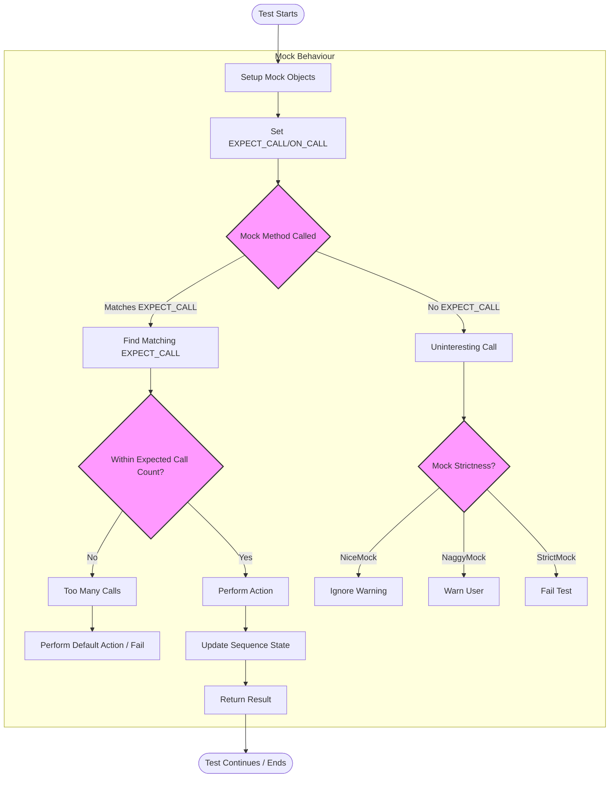

# Advanced Mocking Patterns

Explore effective and flexible techniques for defining mock behaviors in GoogleMock (gMock). This guide covers custom actions, mock method sequences, mock strictness levels (NiceMock, NaggyMock, StrictMock), cardinalities, and advanced matcher strategies to craft precise and maintainable test doubles.

---

## 1. Introduction

**What This Guide Covers:**
- How to define flexible mock method behaviors beyond the basics.
- Customizing mock responses using user-defined actions and lambdas.
- Controlling call order and partial ordering with sequences.
- Using strictness wrappers to handle uninteresting calls.
- Exploiting cardinalities to specify call counts with granularity.
- Applying sophisticated matcher strategies for argument validation.

**Prerequisites:**
- Familiarity with basic mocking concepts and GoogleMock syntax.
- Understanding of `MOCK_METHOD`, `EXPECT_CALL`, and `ON_CALL`.

**Outcome:**
After this guide, you'll confidently write mocks that are precise, resilient, and capturing complex interaction patterns.

**Estimated Time:** 15–25 minutes.

**Level:** Intermediate to Advanced.

---

## 2. Defining Flexible Mocks

When mocking functions, basic `EXPECT_CALL` with simple return actions is often insufficient. Advanced patterns help tailor mocks for richer testing scenarios.

### 2.1 Custom Actions and Lambdas

Instead of always returning fixed values, you can:

- Use lambdas or functors as mock actions.
- Delegate calls dynamically.

```cpp
using ::testing::Invoke;
using ::testing::Return;

class MockFoo {
 public:
   MOCK_METHOD(int, Compute, (int x), (override));
};

MockFoo mock;

// Return double the argument each time Compute is called
EXPECT_CALL(mock, Compute(::testing::_))
    .WillRepeatedly(Invoke([](int x) { return x * 2; }));

int val = mock.Compute(5);  // Returns 10
```

**Tip:** Lambdas provide concise and powerful ways to define custom mock logic.

### 2.2 Delegating to Real or Fake Objects

Sometimes you want mocks to use existing behavior:

- Delegate to a fake that implements complex logic.
- Delegate to a real object to preserve production behavior.

```cpp
class Foo { ... virtual int Do() = 0; ... };
class RealFoo : public Foo { ... int Do() override { ... } };
class FakeFoo : public Foo { ... /* handcrafted logic */ };

class MockFoo : public Foo {
 public:
   MOCK_METHOD(int, Do, (), (override));

   void DelegateToFake() {
     ON_CALL(*this, Do).WillByDefault(
         [this]() { return fake_.Do(); });
   }

 private:
   FakeFoo fake_;
};

// Usage:
MockFoo mock_foo;
mock_foo.DelegateToFake();
EXPECT_CALL(mock_foo, Do());
...
```

### 2.3 Working with Non-virtual Methods

GoogleMock also supports mocking non-virtual methods via templates by substituting the implementation class entirely, but this is an advanced use case documented elsewhere.

---

## 3. Managing Call Sequences & Partial Ordering

Sometimes your tests require that certain calls happen in a particular order or partial order.

### 3.1 Enforcing Strict Call Order with `InSequence`

Wrap expectations in an `InSequence` block to enforce the exact call order:

```cpp
using ::testing::InSequence;

{
  InSequence seq;

  EXPECT_CALL(mock, Open());
  EXPECT_CALL(mock, Process());
  EXPECT_CALL(mock, Close());
}
```

Calls must strictly follow `Open()` -> `Process()` -> `Close()`. Deviation results in test failure.

### 3.2 Partial Ordering

When only some order constraints are required, use `Sequence` objects and `.InSequence()` with multiple sequences.

```cpp
using ::testing::Sequence;
Sequence s1, s2;

EXPECT_CALL(mock, Init()).InSequence(s1, s2);
EXPECT_CALL(mock, Run()).InSequence(s1);
EXPECT_CALL(mock, Finish()).InSequence(s2);
```

This enforces `Init()` before both `Run()` and `Finish()`, but allows `Run()` and `Finish()` in any order.

### 3.3 Using `.After()` to Express Dependencies

You can also specify call dependencies explicitly:

```cpp
Expectation exp1 = EXPECT_CALL(mock, Start());
EXPECT_CALL(mock, Stop()).After(exp1);
```

---

## 4. Controlling Mock Strictness

GoogleMock provides wrappers to control how mocks react to unexpected or uninteresting calls.

### 4.1 Default Behavior - NaggyMock

By default, mocks are "naggy": warn on uninteresting calls.

### 4.2 Suppressing Warnings with NiceMock

Use `NiceMock` to *ignore* uninteresting call warnings:

```cpp
using ::testing::NiceMock;
NiceMock<MockFoo> nice_mock;
EXPECT_CALL(nice_mock, InterestingCall());
...
```

This is useful to keep test output clean when many mock methods are called without expectations.

### 4.3 Enforcing Strictness with StrictMock

Use `StrictMock` to turn uninteresting calls into test failures:

```cpp
using ::testing::StrictMock;
StrictMock<MockFoo> strict_mock;
EXPECT_CALL(strict_mock, ExpectedCall());
...
```

Unexpected calls cause immediate failures, strengthening test correctness but increasing fragility.

### 4.4 Important Considerations

- `NiceMock`/`StrictMock` only affect methods declared directly in the mock class.
- You cannot nest these wrappers (e.g., `NiceMock<StrictMock<X>>` is unsupported).
- Prefer `NiceMock` in everyday testing, use `NaggyMock` during development, and reserve `StrictMock` for critical path validation.

---

## 5. Cardinalities: Expressing Expected Call Counts

Controlling how many times you expect a method to be called avoids brittle or lax tests.

### 5.1 Built-in Cardinalities

| Cardinality          | Meaning                      |
|---------------------|------------------------------|
| `Times(0)`          | Never called                 |
| `Times(1)`          | Called exactly once          |
| `Times(AnyNumber())`| Called any number of times   |
| `AtLeast(n)`        | Called at least n times      |
| `AtMost(n)`         | Called at most n times       |
| `Between(m, n)`     | Called between m and n times |

### 5.2 Custom Cardinalities

Define your own cardinalities by implementing the `CardinalityInterface` with:

- `IsSatisfiedByCallCount(int)`
- `IsSaturatedByCallCount(int)`
- `DescribeTo(std::ostream*)`

Example: to expect even number of calls

```cpp
class EvenNumberCardinality : public testing::CardinalityInterface {
 public:
  bool IsSatisfiedByCallCount(int call_count) const override {
    return (call_count % 2) == 0;
  }
  bool IsSaturatedByCallCount(int /*call_count*/) const override {
    return false;
  }
  void DescribeTo(std::ostream* os) const override {
    *os << "called even number of times";
  }
};

Cardinality EvenNumber() {
  return Cardinality(new EvenNumberCardinality);
}

// Usage
EXPECT_CALL(mock, SomeMethod()).Times(EvenNumber());
```

### 5.3 Retiring Expectations with `.RetiresOnSaturation()`

This clause makes an expectation become inactive once it reaches the upper bound of calls, allowing subsequent expectations to match.

```cpp
EXPECT_CALL(mock, Foo(7))
    .Times(2)
    .RetiresOnSaturation();
EXPECT_CALL(mock, Foo(_)).Times(AnyNumber());

// First two calls to Foo(7) use the first expectation; subsequent calls match the second.
```

---

## 6. Advanced Matcher Strategies

Harness matchers to precisely validate call arguments.

### 6.1 Combining Matchers

Use combinators to build rich argument constraints:

```cpp
EXPECT_CALL(mock, Method(AllOf(Ge(10), Le(20), Ne(15))));
```

### 6.2 Matching Multiple Arguments Together with `.With()`

Enforce relations that span multiple parameters:

```cpp
EXPECT_CALL(mock, Compare(_,_))
    .With(Lt()); // first arg < second arg
```

### 6.3 Matching Members or Returned Properties

Use `Field()` and `Property()` to validate subparts of objects:

```cpp
EXPECT_CALL(mock, Process(Foo))
    .With(Field(&Foo::bar, Ge(3)));
```

### 6.4 Custom Matchers

Define expressive matchers with `MATCHER`, `MATCHER_P`, or full classes for reuse.

```cpp
MATCHER(IsDivisibleBy7, "Checks divisibility by 7") {
  return (arg % 7) == 0;
}
EXPECT_CALL(mock, Foo(IsDivisibleBy7()));
```

### 6.5 Matcher Casting

Use `SafeMatcherCast<T>(m)` to adapt matcher types safely when argument types vary.

### 6.6 Sharing Matchers

Reuse complex matchers by assigning them to variables and applying repeatedly.

---

## 7. Practical Tips & Common Pitfalls

- **ON_CALL vs EXPECT_CALL:** Use `ON_CALL` to define default actions without expectation, and `EXPECT_CALL` when verifying calls.
- **Ordering:** Avoid relying on `EXPECT_CALL` order without sequences as expectations match calls in reverse order of declaration, with newer ones overriding older.
- **Suppressing Warnings:** Use `NiceMock` to suppress warnings about uninteresting calls instead of coercing expectations.
- **Avoid Over-Specification:** Specify only necessary argument constraints and cardinalities for robust tests.
- **Mocking Overloads:** Mock all relevant overloads or bring base class overloads into scope with `using` to avoid hiding.
- **Delegating to Real or Fakes:** Use delegation judiciously to avoid mixing mock and complex logic inconsistently.

<Note>
You must declare `MOCK_METHOD` macros in the `public:` section of your mock class even for protected/private methods.
</Note>

---

## 8. Troubleshooting

- **Uninteresting Calls Warning:** Consider if the call should be expected or really ignored; suppress warnings with `NiceMock`.
- **Unexpected Calls Failures:** Verify argument matchers and call order; use `--gmock_verbose=info` to get detailed call traces.
- **Action List Exhaustion:** If `WillOnce()` actions run out, add a `WillRepeatedly()` action or adjust cardinalities.
- **Incorrect Overload Resolution:** Disambiguate overloads using matchers or `Const()` for const methods.

---

## 9. Next Steps

- Explore [gMock Cookbook](gmock_cook_book.md) for step-by-step recipes.
- Dive into [Matchers Reference](reference/matchers.md) for comprehensive matcher options.
- Learn about [Setting Expectations and Call Control](api-reference/gmock-mocking-apis/expectations-and-control) for mastering calls.
- Start building mocks with basic [Getting Started Guides](guides/getting-started/mock-basics.md).

---

# Diagrams: Mock Call Flow with Strictness and Sequences



---

# Summary

This page focused narrowly on advanced mocking patterns within GoogleMock to empower you to:
- Define flexible and dynamic mock actions using functions and lambdas.
- Specify complex call ordering with sequences and partial orders.
- Manage mock strictness levels with `NiceMock`, `NaggyMock`, and `StrictMock`.
- Use cardinalities precisely to control call counts and lifetimes of expectations.
- Master matcher strategies including composing, casting, and creating custom matchers.

Use this guide to write mocks that reflect your intent clearly, reduce brittle tests, and handle complex interaction verifications reliably.