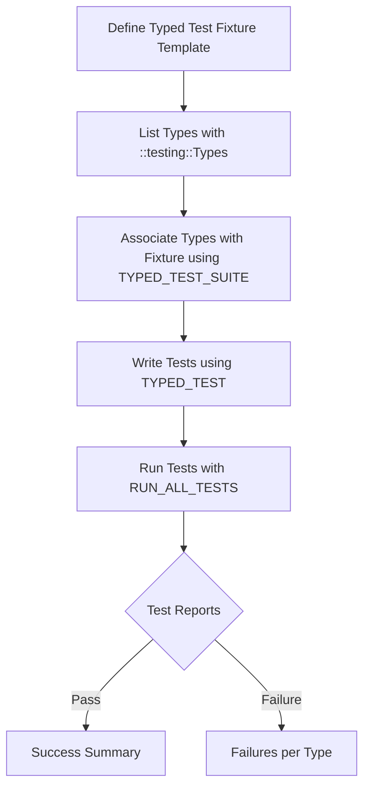

# Parameterized and Typed Tests

GoogleTest expands your testing toolkit with **parameterized** and **typed tests**, enabling you to run the same test logic over multiple inputs or types with minimal code duplication. This page demonstrates how to write these tests to improve coverage systematically and maintain readability.

---

## 1. Understanding Parameterized and Typed Tests

### What This Guide Helps You Achieve
- Create **value-parameterized tests** that execute with different input values automatically.
- Define **typed tests** to repeat a test fixture across a set of types.
- Reduce repetitive test code while increasing test coverage.
- Customize test instance naming for clarity in test outputs.

### Prerequisites
- Basic familiarity with GoogleTest, especially `TEST()`, `TEST_F()`, and fixture classes.
- A working GoogleTest environment set up in your C++ project.

### Expected Outcome
- Mastery of syntax and macros: `TEST_P()`, `INSTANTIATE_TEST_SUITE_P()`, `TYPED_TEST_SUITE()`, and `TYPED_TEST()`.
- Confidence in writing tests that cover multiple inputs and types efficiently.

### Time Estimate
- Approximately 15-30 minutes to grasp concepts and write initial parameterized or typed tests.

### Difficulty Level
- Intermediate: Understanding requires comfort with templates and test fixtures.

---

## 2. Writing Value-Parameterized Tests

Value-parameterized tests run the same test logic with different input values provided through parameter generators.

### 2.1 Create a Parameterized Test Fixture

Define a fixture class inherited from `::testing::TestWithParam<T>`, where `T` is the parameter type.

```cpp
class FooTest : public ::testing::TestWithParam<const char*> {
  // Additional fixture setup if needed
};
```

### 2.2 Define Parameterized Tests Using `TEST_P`

Write tests with access to the parameter via `GetParam()`.

```cpp
TEST_P(FooTest, DoesBlah) {
  EXPECT_TRUE(SomeFunction(GetParam()));
}
```

Multiple `TEST_P` functions can use the same fixture to test different aspects.

### 2.3 Instantiate the Test Suite With Values

Use `INSTANTIATE_TEST_SUITE_P` to supply the parameter values using built-in generators:

- `Values(...)` for enumerated values
- `ValuesIn(container)` for container elements
- `Range(start, end[, step])` for numeric ranges
- `Bool()` for `{false, true}`
- `Combine(...)` for Cartesian products
- `ConvertGenerator(...)` for converting generated types

Example instantiation:

```cpp
INSTANTIATE_TEST_SUITE_P(
    MyGroup, FooTest, testing::Values("meeny", "miny", "moe"));

// Or using container
const char* pets[] = {"cat", "dog"};
INSTANTIATE_TEST_SUITE_P(MyPets, FooTest, testing::ValuesIn(pets));
```

### 2.4 Custom Test Names

Use an optional fourth parameter in `INSTANTIATE_TEST_SUITE_P` to supply a name generator function to produce readable test suffixes.

```cpp
std::string CustomNameGenerator(
    const ::testing::TestParamInfo<const char*>& info) {
  std::string name = info.param;
  // Modify name string as needed
  return name;
}

INSTANTIATE_TEST_SUITE_P(
    CustomNames, FooTest, testing::Values("a", "b", "c"), CustomNameGenerator);
```

**Note:** The generated test names must only contain alphanumeric characters or underscores.

### 2.5 Accessing Parameters

Inside `TEST_P` body, use `GetParam()` to retrieve the parameter of type `T`.

### 2.6 Best Practices

- Ensure parameter types are copyable.
- Provide meaningful parameter values that exercise your code paths effectively.
- Keep test names unique and readable.

---

## 3. Writing Typed Tests

Typed tests run the same tests over different types, ideal for testing templated code.

### 3.1 Define a Typed Test Fixture Template

```cpp
template <typename T>
class MyTypedTest : public ::testing::Test {
 public:
  T value_{};
};
```

### 3.2 List the Types To Test

Create a type list using `::testing::Types`.

```cpp
using MyTypes = ::testing::Types<int, double, std::string>;
```

### 3.3 Associate The Typelist With The Fixture Using `TYPED_TEST_SUITE`

```cpp
TYPED_TEST_SUITE(MyTypedTest, MyTypes);
```

### 3.4 Write The Typed Tests Using `TYPED_TEST`

Within the test, `TypeParam` refers to the current type under test.

```cpp
TYPED_TEST(MyTypedTest, ValueIsDefaultConstructed) {
  TypeParam val = this->value_;
  // Test code using val
  EXPECT_TRUE(val == TypeParam());
}
```

Multiple `TYPED_TEST`s can be written under the suite.

### 3.5 Optional: Custom Type Name Generator

You can specify a name generator class with a templated static function `GetName(int)` for custom type names.

```cpp
class MyTypeName {
 public:
  template <typename T>
  static std::string GetName(int) {
    if constexpr (std::is_same_v<T, int>)
      return "Int";
    else if constexpr (std::is_same_v<T, double>)
      return "Double";
    else
      return "Other";
  }
};

TYPED_TEST_SUITE(MyTypedTest, MyTypes, MyTypeName);
```

---

## 4. Writing Type-Parameterized Tests (Advanced)

Type-parameterized tests allow defining test patterns without initial knowledge of the types.

### 4.1 Declare a Type-Parameterized Test Suite Using `TYPED_TEST_SUITE_P`

```cpp
template <typename T>
class MyTypeParamTest : public ::testing::Test {};

TYPED_TEST_SUITE_P(MyTypeParamTest);
```

### 4.2 Define Tests with `TYPED_TEST_P`

```cpp
TYPED_TEST_P(MyTypeParamTest, TestBehavior) {
  TypeParam value{};
  EXPECT_TRUE(value == TypeParam());
}
```

### 4.3 Register the Tests

List test names with `REGISTER_TYPED_TEST_SUITE_P`.

```cpp
REGISTER_TYPED_TEST_SUITE_P(MyTypeParamTest, TestBehavior);
```

### 4.4 Instantiate Tests with `INSTANTIATE_TYPED_TEST_SUITE_P`

Provide the list of types.

```cpp
using ImplTypes = ::testing::Types<int, double>;
INSTANTIATE_TYPED_TEST_SUITE_P(MyInstantiation, MyTypeParamTest, ImplTypes);
```

---

## 5. Practical Examples

### 5.1 Value-Parameterized Test Example

```cpp
#include <gtest/gtest.h>

class IsEvenTest : public ::testing::TestWithParam<int> {};

TEST_P(IsEvenTest, CheckEvenness) {
  int n = GetParam();
  EXPECT_EQ(n % 2, 0);
}

INSTANTIATE_TEST_SUITE_P(EvenNumbers, IsEvenTest, testing::Values(2, 4, 6, 8));
```

This will run the `CheckEvenness` test 4 times with parameter values 2, 4, 6, and 8.

### 5.2 Typed Test Example

```cpp
#include <gtest/gtest.h>

template <typename T>
class ZeroValueTest : public ::testing::Test {
 protected:
  T zero_ = T{};
};

using MyTypes = ::testing::Types<int, double, float>;
TYPED_TEST_SUITE(ZeroValueTest, MyTypes);

TYPED_TEST(ZeroValueTest, IsZeroByDefault) {
  EXPECT_EQ(this->zero_, TypeParam{});
}
```

This suite runs the `IsZeroByDefault` test for each type `int`, `double`, and `float`.

---

## 6. Troubleshooting & Tips

### Common Issues

- **Duplicate test names:** When using a custom name generator, ensure all names are unique and valid.
- **Parameter type not copyable or streamable:** GoogleTest requires parameters to be copyable; custom types should also support streaming if used with default name generators.
- **Tests not instantiated:** `TEST_P` tests must be paired with `INSTANTIATE_TEST_SUITE_P` or be allowed to remain uninstantiated using `GTEST_ALLOW_UNINSTANTIATED_PARAMETERIZED_TEST`.

### Best Practices

- Use descriptive instantiation names to differentiate multiple parameter sets.
- In typed tests, use meaningful type names via custom `GetName` for test clarity.
- Combine `Bool()`, `Values()`, and `Combine()` to generate comprehensive test parameter coverage.
- Avoid parameter lists with spaces or special characters in names.

### Performance Considerations

- Keep parameter lists focused to reduce test explosion when combining multiple parameter sets.

---

## 7. Next Steps & Related Topics

- Learn about [Value-Parameterized Tests](../advanced.md#value-parameterized-tests) and [Typed Tests](../advanced.md#typed-tests) for deeper understanding.
- Explore [Assertions and Custom Assertions](../core-testing-workflows/using-assertions) to write more expressive checks within tests.
- Dive into [Integration With Build & CI Systems](../audience-usecases-integration/integration-points) to automate running parameterized tests.

---

## References & Further Reading

- [GoogleTest Primer](../primer.md) — foundational concepts for test writing
- [GoogleTest Reference: Testing Macros](reference/testing.md#TEST_P) — details on parameterized macros
- [GoogleTest Core Testing Workflows: Parameterized Tests](../core-testing-workflows/advanced-parameterized-tests) — examples and patterns
- [GoogleTest API Reference: Parameterized and Typed Tests](../api-reference/core-testing-apis/parameterized-tests)

---

For hands-on examples and in-depth coverage, see the [googletest-param-test-test.cc](https://github.com/google/googletest/blob/main/googletest/test/googletest-param-test-test.cc).


---

# Mermaid Diagram: Parameterized Test Flow

```mermaid
flowchart TD
  A[Define Parameterized Fixture (TestWithParam<T>)] --> B[Write Parameterized Tests with TEST_P]
  B --> C[Create Parameter Generators (Values, Range, Bool, Combine, etc.)]
  C --> D[Instantiate Tests with INSTANTIATE_TEST_SUITE_P]
  D --> E[Run Tests with RUN_ALL_TESTS]
  E --> F{Test Reports}
  F -->|Pass| G[Success Summary]
  F -->|Failure| H[Failures with Parameter Context]
```

# Mermaid Diagram: Typed Test Flow


