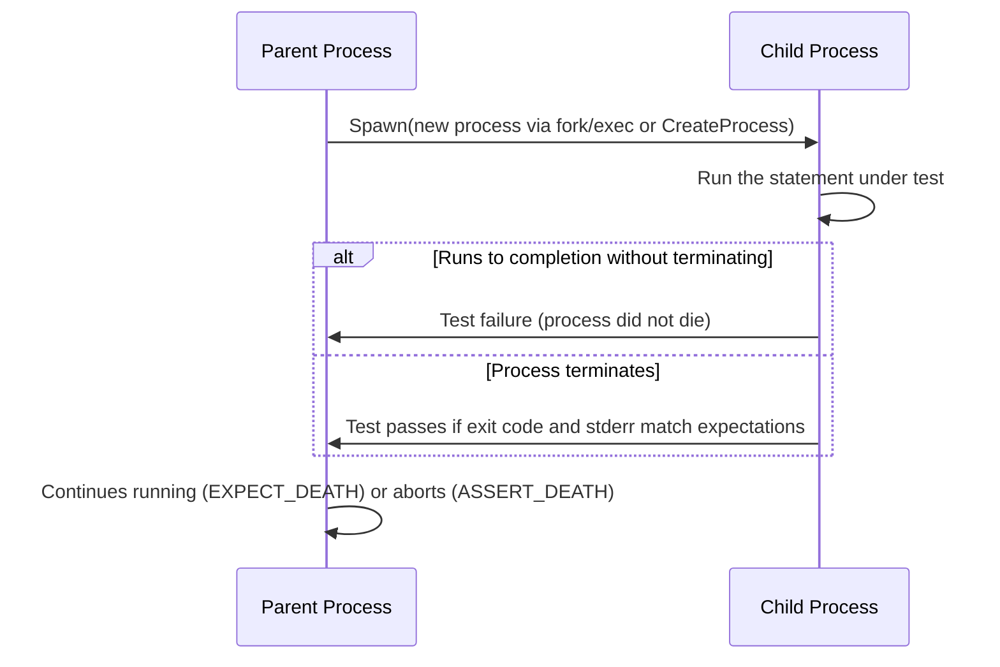

# Death Tests and Error-Handling Scenarios

GoogleTest provides robust tools to verify that your code terminates as expected, such as when assertions fail or fatal errors occur. This page guides you through writing, configuring, and interpreting **death tests** to ensure your error handling behaves correctly.

---

## Workflow Overview

**What you'll accomplish:**
- Understand how to write tests that expect your program to abort or exit
- Learn to verify error messages and exit statuses
- Gain insights on best practices for configuring death tests safely and effectively

**Prerequisites:**
- Basic familiarity with GoogleTest and writing standard tests
- Your test environment supports spawning new processes (required for death tests)
- Understanding of assertions and expectations in GoogleTest

**Expected outcome:**
- Confidently create tests that verify process termination
- Interpret test outcomes when death tests succeed or fail
- Navigate common pitfalls when testing fatal errors

**Time estimate:** 20-30 minutes to understand concepts and implement basic death tests

**Difficulty:** Intermediate due to need for parallel process thinking and error pattern matching

---

## Understanding Death Tests

Death tests confirm that certain code paths terminate the program, typically due to internal consistency checks like fatal assertions or unrecoverable errors.

> Death tests are distinct from exception tests; they verify process termination rather than exception throwing.

GoogleTest offers macros such as:

- `EXPECT_DEATH(statement, matcher)`
- `ASSERT_DEATH(statement, matcher)`
- `EXPECT_EXIT(statement, predicate, matcher)`
- `ASSERT_EXIT(statement, predicate, matcher)`

These spawn a child process, run the `statement` within it, and verify that the process terminates as expected, optionally checking output to `stderr` and the exit code.


---

## Step-by-Step Guide to Writing Death Tests

<Steps>
<Step title="Choose the Appropriate Death Test Macro">
Pick from the following based on your needs:
- `EXPECT_DEATH` / `ASSERT_DEATH`: 
  Verify code terminates with a nonzero exit status and matches an error message regex.
- `EXPECT_EXIT` / `ASSERT_EXIT`:
  Verify code exits with a specific exit status or signal, with error message matching.

`EXPECT_` macros continue test execution after failure; `ASSERT_` macros abort the test immediately.
</Step>

<Step title="Write the Code Block to Test">
Wrap the tested statements inside a compound statement `{ ... }` if multiple lines:
```cpp
EXPECT_DEATH({
  // code expected to cause termination
  int* p = nullptr;
  *p = 42;
}, "expected error message regex");
```
This approach also allows local variables and multiple operations within the death test.
</Step>

<Step title="Specify the Expected Error Message">
Provide a regular expression or matcher for the expected `stderr` output of the failing process.
- GoogleTest uses regex matching—not plain string equality.
- The message must be carefully chosen to reliably identify the failure reason without being overly strict.
- Use `""` to match any output.

Example:
```cpp
EXPECT_DEATH(FailFast(), "Check failed: value > 0");
```
</Step>

<Step title="Optionally Verify Exit Code or Signal">
To test specific exit conditions, use `EXPECT_EXIT` or `ASSERT_EXIT`: 
- Provide a predicate like `testing::ExitedWithCode(0)` or `testing::KilledBySignal(SIGABRT)`.

Example:
```cpp
EXPECT_EXIT(ExitWithError(), testing::ExitedWithCode(1), "Error message");
```
</Step>

<Step title="Configure Death Test Style If Needed">
GoogleTest supports two styles, selectable via the flag `--gtest_death_test_style`:
- `fast` (default): Uses `fork()` and runs child statement immediately.
- `threadsafe`: Re-executes the entire test binary for isolation, safer in multi-threaded environments.

Set programmatically or via flags:
```cpp
GTEST_FLAG_SET(death_test_style, "threadsafe");
```

Use `threadsafe` if your program creates threads before running death tests.
</Step>

<Step title="Handle Mocks Carefully in Death Tests">
If your death test involves mocks:
- You must allow mocks to be leaked, as destruction will not happen normally.
- Use `Mock::AllowLeak(mock_object);` inside the test before triggering death.

This prevents false leak detection failures.
</Step>

<Step title="Run Your Tests and Interpret Results">
Run the test executable normally:
- If the process under test dies as expected, with matching error output, the death test passes.
- If the process does not die, the death test fails.
- If the error message or exit status does not match, the death test fails.

Observe detailed error messages to diagnose mismatches.
</Step>
</Steps>

---

## Practical Examples

### Basic EXPECT_DEATH Usage
```cpp
TEST(MyDeathTest, NullPointerDereference) {
  EXPECT_DEATH({
    int* p = nullptr;
    *p = 42;
  }, ".*");  // Matches any error output
}
```

### EXPECT_DEATH with Specific Error Regex
```cpp
void FatalFunction(int value) {
  CHECK(value > 0) << "Value must be positive";
}

TEST(MyDeathTest, CVCheckFailure) {
  EXPECT_DEATH(FatalFunction(0), "Value must be positive");
}
```

### Using EXPECT_EXIT to Test Exit Status
```cpp
void ExitFunction() {
  std::cerr << "Exiting due to error" << std::endl;
  std::exit(1);
}

TEST(MyExitTest, ExitWithError) {
  EXPECT_EXIT(ExitFunction(), testing::ExitedWithCode(1), "error");
}
```

### Allowing Mocks to Leak in Death Tests
```cpp
TEST(MyDeathTest, DeathWithMock) {
  MockFoo* foo = new MockFoo;
  Mock::AllowLeak(foo);  // Prevent false leak error

  EXPECT_CALL(*foo, Bar()).Times(1);

  EXPECT_DEATH({
    foo->Bar();
    abort();  // triggers death
  }, ".*");
}
```

---

## Best Practices and Tips

- **Name your death test suites with suffix "DeathTest"** to run them early and reduce interference.
- Use `threadsafe` death test style when your code uses threads to avoid flaky tests.
- Carefully design the regex matcher to avoid brittle tests that fail on minor message changes.
- Keep death test code minimal to avoid complicating failures.
- Avoid test code side effects inside the death test block, since it runs in the child process.
- If your death test involves libc internal functions (like `abort()`), check that your environment supports it.
- Use `EXPECT_DEATH_IF_SUPPORTED` if compatibility is uncertain.

---

## Troubleshooting Common Issues

<AccordionGroup title="Common Death Test Failures">
<Accordion title="Death Test Does Not Fail When Expected">
- Verify that the code under test actually terminates.
- Ensure the death test statement is inside the macro's body—not outside.
- Check if the environment supports fork/exec (POSIX) or CreateProcess (Windows).
- Confirm the matcher regex matches the actual stderr output.
</Accordion>

<Accordion title="Regex Matcher Fails to Match Output">
- Use a more general regex (e.g., `".*"`) to confirm output is captured.
- Ensure special characters in expected messages are properly escaped.
- Consider matching substrings rather than full messages.
</Accordion>

<Accordion title="Flaky or Hanging Death Tests">
- Avoid sharing resources or threads across death tests.
- Prefer `threadsafe` death test style if multi-threading is involved.
- Use the `--gtest_print_time` flag to identify slow death tests.
</Accordion>

<Accordion title="Mock Leak Errors in Death Tests">
- Add `Mock::AllowLeak(mock_object)` for mocks used in death tests.
- Avoid destroying mocks in death test code.
</Accordion>
</AccordionGroup>

---

## Related Documentation

- [Death Assertions Reference](reference/assertions.md#death) — macros and usage of death tests
- [Advanced Guide: Death Tests](docs/advanced.md#DeathTests) — detailed explanation and style
- [Mocking Reference](docs/reference/mocking.md) — for handling mocks within death tests
- [gMock Cookbook](docs/gmock_cook_book.md) — practical examples addressing mocking patterns

---

## Summary

Death tests are critical for verifying that your program correctly handles fatal errors and consistency checks by terminating as intended. By mastering death test macros like `EXPECT_DEATH` and `EXPECT_EXIT`, understanding process spawning styles, and properly managing mocks within these tests, you ensure your code fails safely and predictably.


---

<Note>
 Death tests spawn child processes; side effects in the death test block are not visible afterward. Arrange your tests accordingly.
</Note>

<Warning>
 If using mocks in death tests, always permit leaked mocks to avoid interference with leak detectors.
</Warning>

---

## Diagram: Death Test Execution Flow



---

# Code Examples for Death Tests

```cpp
// Example: Death test verifying program aborts when condition fails.
#include "gtest/gtest.h"

void MaybeAbort(int value) {
  if (value <= 0) {
    fprintf(stderr, "Fatal error: value must be positive\n");
    abort();
  }
}

TEST(DeathTestExample, AbortsOnInvalidInput) {
  EXPECT_DEATH(MaybeAbort(0), "value must be positive");
}

// Example: EXPECT_EXIT verifying exit code and stderr match.
void ExitWithError() {
  std::cerr << "Exiting with error code 1" << std::endl;
  exit(1);
}

TEST(ExitTestExample, ExitsWithCorrectCodeAndMessage) {
  EXPECT_EXIT(ExitWithError(), testing::ExitedWithCode(1), "error code 1");
}

// Example: Allowing mocks to leak inside a death test
class MockFoo {
 public:
  MOCK_METHOD(void, Bar, (), ());
};

TEST(DeathTestWithMock, AllowsMockLeak) {
  MockFoo* foo = new MockFoo;
  testing::Mock::AllowLeak(foo);

  EXPECT_CALL(*foo, Bar()).Times(1);

  EXPECT_DEATH({
    foo->Bar();
    abort();
  }, ".*");
}

```
