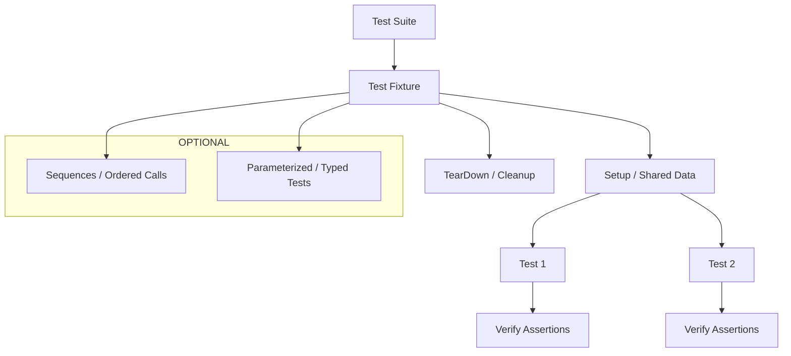

# Managing and Organizing Test Suites

GoogleTest offers powerful constructs to help you manage, organize, and scale your tests efficiently. This guide focuses on best practices for grouping tests into logical suites, leveraging test fixtures, and structuring reusable test cases. By following these guidelines, you’ll write maintainable tests that scale with your projects.

---

## Workflow Overview

**Task Description:**
Learn how to group tests into test suites, use test fixtures effectively to share setup code, and organize your tests in a way that maximizes reusability and maintainability.

**Prerequisites:**
- Basic familiarity with GoogleTest test syntax (`TEST()`, `TEST_F()`).
- GoogleTest installed and compiled in your environment.

**Expected Outcome:**
You will be able to organize your tests into suites, define and reuse fixtures that prepare shared resources, and apply naming and structuring best practices standardizing your test code.

**Time Estimate:**
15-30 minutes to understand concepts and apply with simple examples.

**Difficulty Level:**
Beginner to Intermediate

---

## Understanding Test Suites and Fixtures

### What Is a Test Suite?
Test suites are collections of related tests logically grouped together, often to mirror the structure of the production code being tested. In GoogleTest, test suites correspond to the first parameter of the `TEST` or `TEST_F` macros.

### Using Test Fixtures
A test fixture is a class derived from `testing::Test` that allows multiple tests in the same suite to share common setup and teardown code. This avoids duplication and keeps the test code clean.

---

## Step-by-Step Guide to Managing Test Suites

<Steps>
<Step title="Step 1: Define Test Suites Using `TEST`">
To group related tests, assign them the same test suite name using the `TEST` macro:

```cpp
TEST(QueueTest, IsEmptyInitially) {
  Queue<int> q;
  EXPECT_TRUE(q.IsEmpty());
}

TEST(QueueTest, EnqueueWorks) {
  Queue<int> q;
  q.Enqueue(42);
  EXPECT_FALSE(q.IsEmpty());
}
```

**Outcome:** Tests `IsEmptyInitially` and `EnqueueWorks` belong to `QueueTest` suite.
</Step>

<Step title="Step 2: Create Test Fixtures for Shared Setup">
Define a fixture class inheriting from `testing::Test`, then use `TEST_F` to access it:

```cpp
class QueueTest : public testing::Test {
 protected:
  QueueTest() {
    // Setup runs before each test
    q_.Enqueue(100);
  }

  Queue<int> q_;  // Shared test resource
};

TEST_F(QueueTest, NonEmptyAfterSetup) {
  EXPECT_FALSE(q_.IsEmpty());
}

TEST_F(QueueTest, DequeueReturnsCorrectValue) {
  int* result = q_.Dequeue();
  ASSERT_NE(result, nullptr);
  EXPECT_EQ(*result, 100);
  delete result;
}
```

**Outcome:** Both tests use the same setup, reducing code duplication.
</Step>

<Step title="Step 3: Naming and Structuring Test Suites and Tests">
Follow consistent, descriptive naming conventions:
- Use PascalCase without underscores for suite and test names.
- Test suite names should reflect the class or module under test.
- Test names should describe expected behavior clearly.

Example:

```cpp
TEST_F(FileSystemTest, ReadFileReturnsDataCorrectly);
TEST_F(FileSystemTest, ReadFileFailsOnMissingFile);
```

**Outcome:** Test output is clean and easy to navigate.
</Step>

<Step title="Step 4: Grouping Related Tests Using Sub-Suites and Namespaces">
For large projects, you can leverage C++ namespaces or prefixes in test suite names to group suites logically.

```cpp
namespace NetworkingTests {

class ConnectionTest : public testing::Test {
  /* ... */
};

TEST_F(ConnectionTest, ConnectSucceeds);
TEST_F(ConnectionTest, ConnectFailsOnTimeout);

}  // namespace NetworkingTests
```

Or use test suite name prefixes:
```cpp
TEST(Database_ConnectionTest, ConnectSucceeds);
TEST(Database_QueryTest, ReturnsCorrectResults);
```

**Outcome:** Easier scaling and discoverability of suites.
</Step>

<Step title="Step 5: Scaling Test Suites with Parameters and Typed Tests">
When your tests share structure but differ in data types or parameters, use parameterized or typed tests (covered in other guides). This approach reduces duplication and groups related tests logically.

See [Parameterized and Typed Tests](../advanced-features-and-patterns/parameterized-and-typed-tests).
</Step>

</Steps>

---

## Practical Examples

### Example: Basic Test Suite with Fixture

```cpp
class CalculatorTest : public testing::Test {
 protected:
  void SetUp() override {
    calc_.StoreInitialValue(0);
  }

  Calculator calc_;
};

TEST_F(CalculatorTest, AdditionWorks) {
  calc_.Add(3);
  EXPECT_EQ(calc_.GetValue(), 3);
}

TEST_F(CalculatorTest, SubtractionWorks) {
  calc_.Subtract(1);
  EXPECT_EQ(calc_.GetValue(), -1);
}
```

*Tests share initial setup avoiding duplication.*

### Example: Disallowing a Function Call

Sometimes you want to ensure a function is never called in a test. Use `.Times(0)`:

```cpp
EXPECT_CALL(mock_obj, SomeFunction(_)).Times(0);
```

If `SomeFunction` is called, the test will fail immediately.

### Example: Catch-All Expectation

Allow all calls to a method but still be able to specialize:

```cpp
EXPECT_CALL(mock_obj, ProcessData(_)).Times(testing::AnyNumber());
EXPECT_CALL(mock_obj, ProcessData(testing::Eq(42))).WillOnce(Return(true));
```

This states that any argument is allowed, but 42 returns `true` only once.

---

## Best Practices & Tips

- **Use test fixtures to share common resources:** Avoid code duplication and improve maintainability.
- **Give descriptive test suite and test names:** Enables quick understanding and debugging.
- **Leverage sequences (`InSequence`) to enforce call order:** When order is important for the tested logic.
- **Be judicious with `EXPECT_CALL`:** Use `ON_CALL` for default behaviors, use `EXPECT_CALL` for specifying calls you intend to verify.
- **Handle large suites by modular grouping:** Use namespaces or test suite name prefixes.
- **Retire expectations when saturated with `.RetiresOnSaturation()`:** Useful to avoid failures in repeated calls beyond expectation.
- **Avoid overly rigid expectations:** Write flexible matchers to prevent brittle tests.

---

## Troubleshooting

- **Test suite seems not to run or tests missing:** Verify test suite names and that your test files are included in the build.
- **Fixture setups not applying?** Ensure you inherit from `testing::Test` and use `TEST_F` for tests.
- **Test failing due to unexpected function calls:** Confirm if you need to add `.Times(0)` or catch-all expectations.
- **Too many warnings on uninteresting calls:** Consider using `NiceMock` or define `EXPECT_CALL(...).Times(AnyNumber())` to suppress noise.

---

## Next Steps & Related Content

- Explore [Writing Your First C++ Test](../core-testing-workflows/writing-basic-tests) to start writing simple tests.
- Learn about [Using Assertions Effectively](../core-testing-workflows/using-assertions-effectively) for robust validations.
- Master [Parameterized and Typed Tests](../advanced-features-and-patterns/parameterized-and-typed-tests) to handle test variations.
- Use [Effective Mocking with GoogleMock](../advanced-features-and-patterns/effective-mocking) to simulate dependencies.


---

## Summary Diagram: Test Suite Management Flow



---

<Tip>
To manage complex projects, break your tests into suites that reflect your application modules, and use fixtures to share setup code for faster, maintainable tests.
</Tip>

<Note>
Using `EXPECT_CALL` with `.Times(0)` explicitly forbids a call.
Avoid adding expectations after calls have been made on the mocks.
</Note>

<Warning>
Be cautious not to over-specify your test expectations, as this can make your tests brittle.
</Warning>
