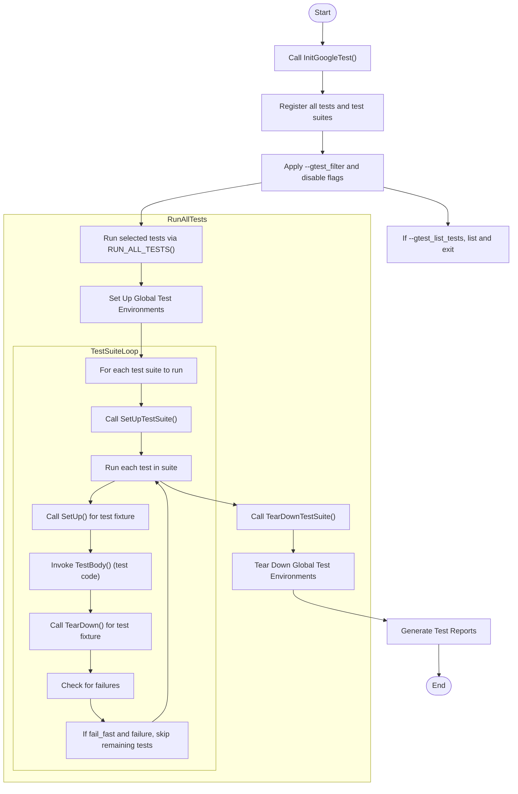

# Organizing and Running Test Suites

Efficiently organizing and managing your tests is key to a scalable and maintainable testing workflow. This guide walks you through grouping, discovering, naming, and executing your tests within GoogleTest, ensuring clarity and control as your test codebase grows.

---

## 1. Understanding Test Suites and Test Organization

### What is a Test Suite?
A **test suite** is a collection of related tests grouped under a common name. It reflects the logical organization of your tests and often corresponds to the class, module, or feature you are testing.

- Tests within the same test suite can share setup and teardown via *test fixtures*.
- Test suites help you run related tests together and selectively.

### Naming Conventions
- **Test suite names** and **test names** should be valid C++ identifiers without underscores (`_`).
- The full test name is formed by concatenating the test suite and test name with a `.` (dot), e.g., `MathTest.Addition`.
- Avoid mixing `TEST()` and `TEST_F()` within the same suite to maintain fixture consistency.

### Grouping for Scalability
- Break large test sets into multiple suites that mirror your code structure.
- Use fixtures (`TEST_F`) to share expensive setup/teardown.
- Use value-parameterized and typed tests to run tests against multiple inputs or types efficiently.

---

## 2. Test Discovery and Execution

GoogleTest automatically discovers and registers all tests defined with its macros. You do not have to manually enumerate or register test cases.

### Running All Tests
Simply call `RUN_ALL_TESTS()` in your `main()` function after initializing GoogleTest:

```cpp
int main(int argc, char** argv) {
  ::testing::InitGoogleTest(&argc, argv);
  return RUN_ALL_TESTS();
}
```

This runs every test registered in all test suites.

### Selectively Running Tests
You can select a subset of tests to run using the `--gtest_filter` flag or the `GTEST_FILTER` environment variable.

- Pattern format: `PositivePatterns[-NegativePatterns]`
- Patterns are colon-separated, and may include `*` (wildcard) and `?` (single char).

Examples:

- Run all tests in `FooTest` suite:
  ```
  --gtest_filter=FooTest.*
  ```

- Run tests containing "Null" or "Constructor":
  ```
  --gtest_filter=*Null*:*Constructor*
  ```

- Exclude a specific test:
  ```
  --gtest_filter=FooTest.*-FooTest.Bar
  ```

### Skipping Tests via Naming
Prefix test suite or test names with `DISABLED_` to skip running them without commenting out code.

### Listing Tests Without Running
Use the `--gtest_list_tests` flag to print all test suites and their tests without execution:

```sh
./my_test --gtest_list_tests
```

---

## 3. Organizing Your Test Code

### Using Test Fixtures (Shared Set-Up)
Fixtures let tests share common objects and setup logic:

```cpp
class MyTest : public ::testing::Test {
 protected:
  static void SetUpTestSuite() { /* global setup for all tests */ }
  static void TearDownTestSuite() { /* global cleanup */ }

  void SetUp() override { /* runs before each test */ }
  void TearDown() override { /* runs after each test */ }

  // Shared resources
  static std::unique_ptr<SomeResource> resource_;
};

std::unique_ptr<SomeResource> MyTest::resource_ = nullptr;

TEST_F(MyTest, Case1) {
  // access resource_ here
}
```

- `SetUpTestSuite()` and `TearDownTestSuite()` perform one-time setup and teardown for the entire suite.
- Each test gets a fresh fixture instance; tests remain independent.

### Value-Parameterized Tests
Run the same test logic with different inputs:

- Define a fixture derived from `TestWithParam<T>`.
- Use `TEST_P` to define the test logic.
- Instantiate with `INSTANTIATE_TEST_SUITE_P` providing parameter generators like `Values()`, `Range()`, `Combine()`, etc.

```cpp
class FooTest : public ::testing::TestWithParam<int> {};

TEST_P(FooTest, DoesBar) {
  EXPECT_TRUE(DoSomething(GetParam()));
}

INSTANTIATE_TEST_SUITE_P(MyParams, FooTest, ::testing::Values(1, 2, 3));
```

### Typed Tests
Apply the same tests to a set of types:

- Define a template fixture class.
- Associate a list of types with `TYPED_TEST_SUITE`.
- Write tests with `TYPED_TEST`.

```cpp
template <typename T>
class MyTypedTest : public ::testing::Test {
  // fixture
};

using MyTypes = ::testing::Types<int, double>;
TYPED_TEST_SUITE(MyTypedTest, MyTypes);

TYPED_TEST(MyTypedTest, DoesSomething) {
  TypeParam value{};
  EXPECT_TRUE(DoSomethingWithType(value));
}
```

### Type-Parameterized Tests
Similar to typed tests but test patterns and type lists are separated:

- Use `TYPED_TEST_SUITE_P` and `TYPED_TEST_P` to define the abstract test patterns.
- Register the tests with `REGISTER_TYPED_TEST_SUITE_P`.
- Instantiate the suite on concrete types with `INSTANTIATE_TYPED_TEST_SUITE_P`.

---

## 4. Controlling Test Execution

### Fail Fast
Use `--gtest_fail_fast` to stop running tests after the first failure.

### Repeat Tests
Use `--gtest_repeat=N` to run all tests `N` times (or negative for infinite).

### Shuffle Tests
Use `--gtest_shuffle` to randomize test order.
Use `--gtest_random_seed=SEED` to specify the seed for test shuffling.

### Running Disabled Tests
Use `--gtest_also_run_disabled_tests` to run tests whose names start with `DISABLED_`.

### Death Tests
Name death test suites with `*DeathTest`. They run before other tests.
Use `ASSERT_DEATH` and `EXPECT_DEATH` macros for tests that expect termination.

---

## 5. Best Practices for Scalable Test Organization

- Name suites and tests clearly and consistently—avoid underscores.
- Prefer small, focused test suites reflecting your code’s modular structure.
- Share expensive setup with fixtures using `SetUpTestSuite`.
- Use parameterized and typed tests to avoid test code duplication.
- Shuffle tests regularly to detect inter-test dependencies.
- Use filters to quickly run subsets during development.

---

## 6. Troubleshooting Common Issues

### Test Not Discovered or Run
- Verify correct use of `TEST`, `TEST_F`, `TEST_P`, and `INSTANTIATE_TEST_SUITE_P`.
- Ensure that parameterized tests have matching instantiations.
- Avoid mixing `TEST` and `TEST_F` in the same suite.
- Check `--gtest_filter` for unintended exclusions.

### Mixing Fixtures
GoogleTest requires all tests in a suite share the same fixture.
If you see errors about inconsistent fixtures, rename suites or separate tests.

### Skipped Tests
Make sure you are not accidentally disabling tests or using filters that exclude them.

### Output Diagnostics
Use the `--gtest_list_tests` flag to view all available tests and verify names.

---

## 7. References and Further Reading

- [GoogleTest Primer](primer.md) — Basic concepts and getting started.
- [Testing Reference](reference/testing.md) — Detailed API usage for test macros.
- [Advanced GoogleTest Topics](advanced.md) — In-depth on parameterized and typed tests, death tests, and test events.
- [Writing Effective Assertions](writing-effective-assertions.md) — Crafting clear test checks.

---

## 8. Example: Defining and Running a Parameterized Test Suite

```cpp
class FooTest : public ::testing::TestWithParam<int> {};

TEST_P(FooTest, IsEven) {
  int value = GetParam();
  EXPECT_EQ(value % 2, 0);
}

INSTANTIATE_TEST_SUITE_P(
    Example, FooTest, ::testing::Values(2, 4, 5, 6));

int main(int argc, char** argv) {
  ::testing::InitGoogleTest(&argc, argv);
  return RUN_ALL_TESTS();
}
```

Running this test suite will run 4 tests with parameters 2, 4, 5, and 6 respectively.

---

## 9. Summary Diagram: Test Execution Flow



This flow shows how tests articulate from initialization, filtering, and running through test suites and individual tests, with setup and teardown phases at both per-suite and per-test levels.

---

## 10. Tips

- Always call `::testing::InitGoogleTest()` before running tests.
- Keep test fixtures focused and avoid sharing mutable state unless carefully managed.
- Use `--gtest_list_tests` to quickly inspect registered test cases.
- Use parameterized and typed tests to reduce duplicate code.
- Use filters to speed up development and debugging.
- Name test suites ending in `DeathTest` for death tests.
- Avoid mixing `TEST()` and `TEST_F()` in the same test suite.
- Use `SetUpTestSuite()` and `TearDownTestSuite()` to share expensive setup across tests.

---

## 11. Troubleshooting

### Tests Not Running
Check for:
- Incorrect `TEST_P` without `INSTANTIATE_TEST_SUITE_P`.
- Filters excluding all tests unintentionally.
- Disabled tests not included (check `--gtest_also_run_disabled_tests`).

### Fixture Inconsistencies
Errors like "mixing TEST_F and TEST in the same test suite" indicate inconsistent fixture classes. Move conflicting tests to different suites or unify fixtures.

### Premature Test Exit
Set environment variable `TEST_PREMATURE_EXIT_FILE` and monitor its deletion to detect premature test exits.

---

## 12. Next Steps

- Explore [Writing Effective Assertions](writing-effective-assertions.md) to craft better test checks.
- Learn [Parameterized and Typed Tests](parameterized-and-type-parameterized-tests.md) for scalable test patterns.
- Read [Using Death Tests Effectively](using-death-tests.md) for termination testing best practices.
- Integrate tests into build systems with [Integrating into CMake and Bazel Builds](integrating-into-cmake-bazel-builds.md).

---